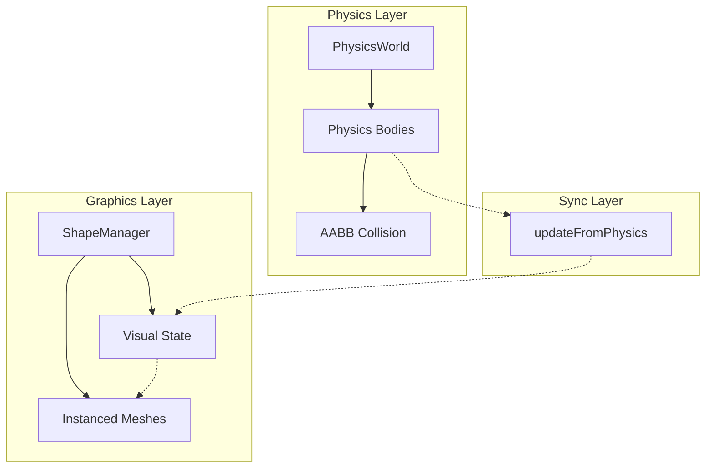
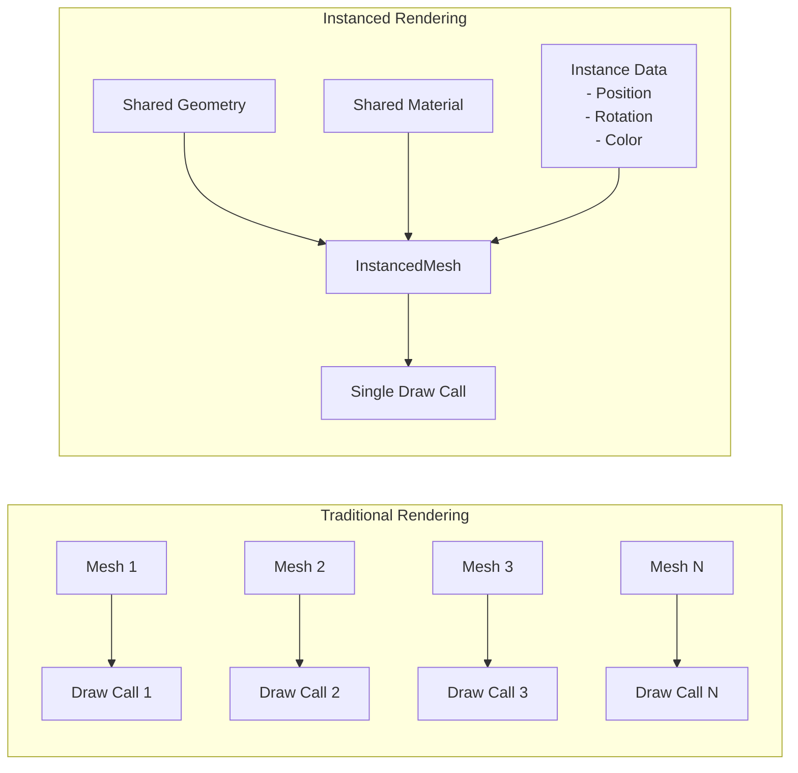
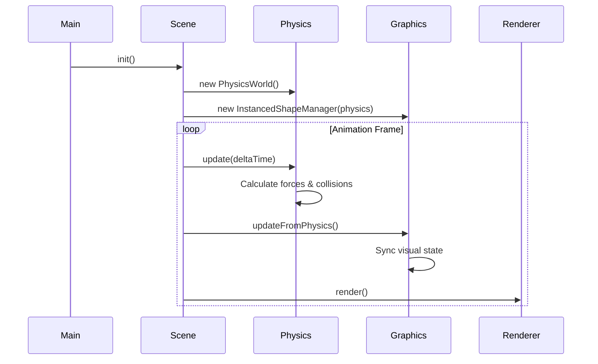
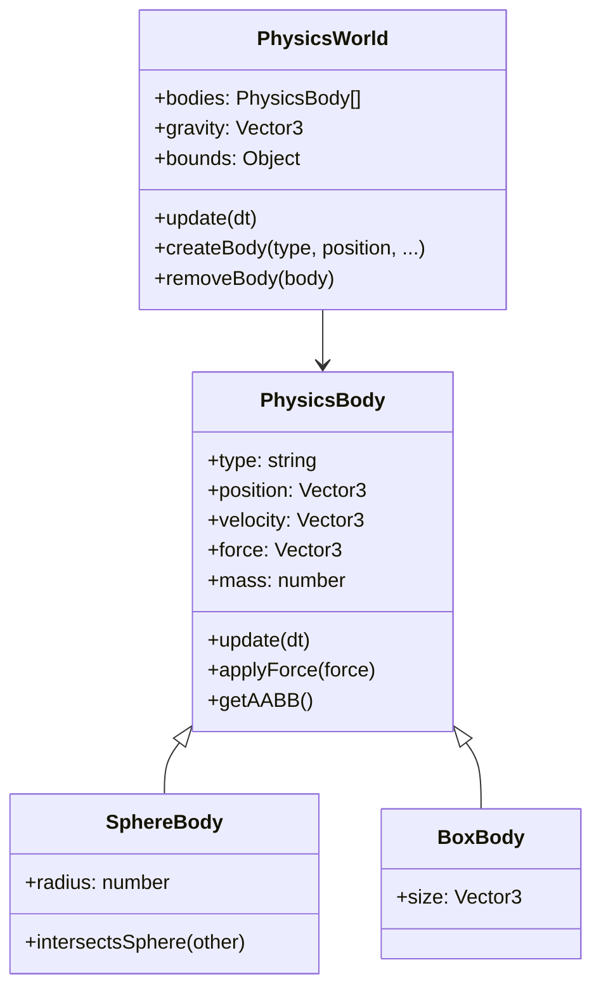
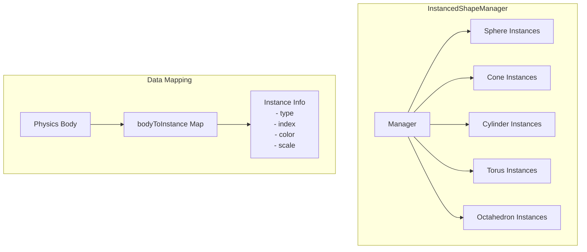
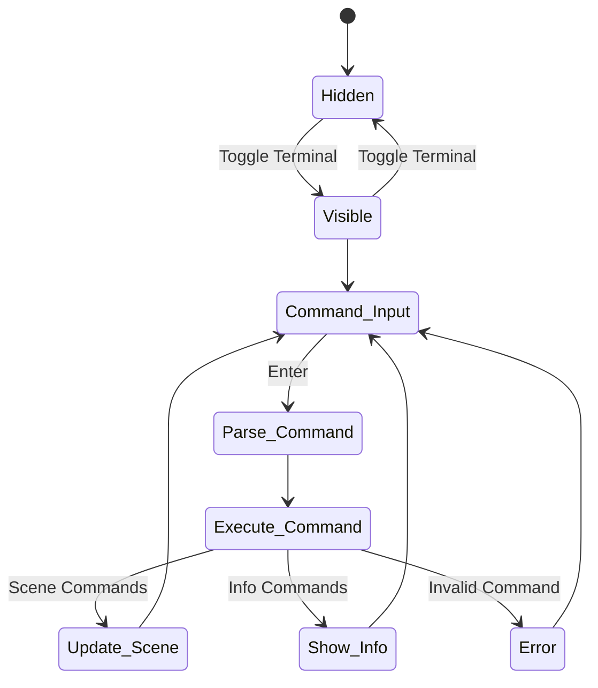
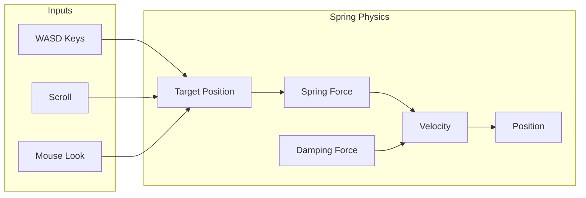
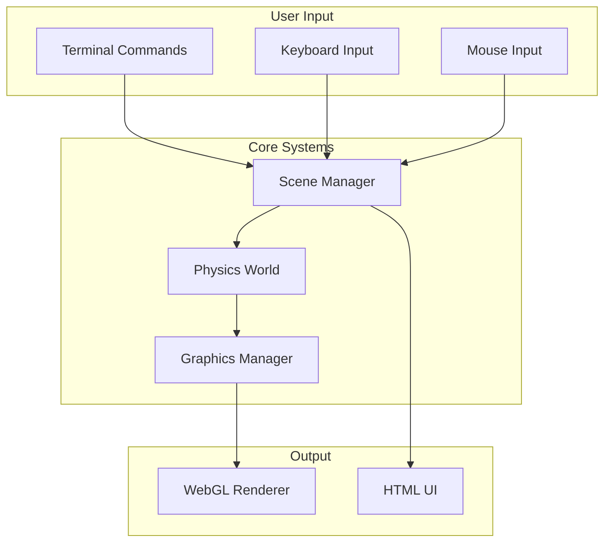
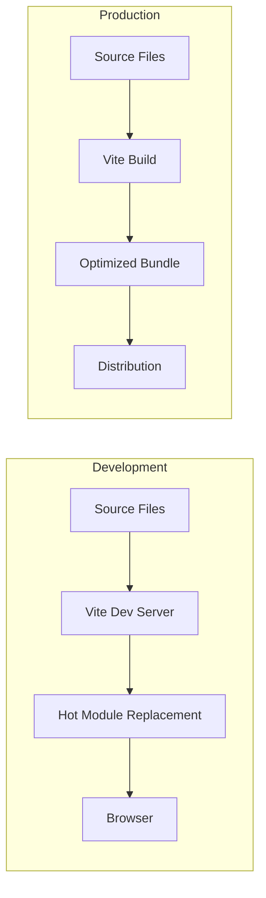

# Architecture Documentation - Flying Robots Portfolio

## Overview

This project is a cyberpunk-themed portfolio website featuring an interactive 3D scene with physics simulation, instanced rendering, and a command-line interface. The architecture emphasizes performance through instanced rendering and clean separation between physics simulation and visual representation.

## Core Architecture Principles

### 1. Physics-Graphics Decoupling

The physics simulation is completely separated from the graphics rendering:



**Benefits:**
- Physics can use simple shapes (spheres, boxes) for efficient collision detection
- Graphics can have complex geometries without affecting physics performance
- Easy to debug by visualizing physics bodies separately

### 2. Instanced Rendering

All shapes use Three.js InstancedMesh for optimal performance:



**Implementation:**
- One geometry per shape type (sphere, cone, cylinder, etc.)
- Shared materials with per-instance colors
- Can handle 1000+ instances efficiently

## System Components

### 1. Scene Management (`scene.js`)

The main scene orchestrator that handles:
- Three.js scene setup
- Camera with spring physics
- Animation loop
- Lighting system
- Scene manager API for terminal commands



### 2. Physics System (`PhysicsWorld.js`)

Mathematical physics simulation with:
- Body types: Sphere, Box (for cones, cylinders, etc.)
- Forces: Gravity, attraction, repulsion
- AABB collision detection
- Boundary constraints



### 3. Graphics System (`InstancedShapes.js`)

Manages visual representation using instanced rendering:



### 4. Terminal System (`Terminal.js`)

Interactive command-line interface with:



**Available Commands:**
- `help` - Show available commands
- `shapes` - Display shape count with breakdown
- `spawn [type]` - Spawn new shape
- `aabb` - Toggle AABB visualization
- `fps` - Toggle FPS counter
- `visuals` - Toggle visual meshes
- `physics` - Toggle physics wireframes
- `grid` - Toggle grid floor
- `ui` - Toggle HTML UI elements

## Camera System

The camera uses a critically damped spring system for smooth movement:



**Spring Parameters:**
- Stiffness: 4.0 (how quickly it responds)
- Damping: 8.0 (prevents oscillation)
- Mass: 1.0 (inertia)

## Performance Optimizations

### 1. Instanced Rendering
- Reduces draw calls from N to 1 per shape type
- Shared geometries and materials
- Per-instance data only for transforms and colors

### 2. Physics Optimizations
- Simple collision shapes (AABB)
- Spatial bounds to limit calculations
- No complex mesh collisions

### 3. Rendering Pipeline
- Frustum culling disabled for physics objects
- Optional post-processing effects
- On-demand UI updates

## Data Flow



## Build System

The project uses Vite for:
- ES Module support
- Hot Module Replacement (development)
- Optimized production builds
- Asset handling



## File Structure

```
src/
├── index.html              # Entry point
├── main.js                 # Application initialization
├── scene.js                # Three.js scene management
├── physics/
│   └── PhysicsWorld.js     # Decoupled physics engine
├── components/
│   ├── InstancedShapes.js  # Instanced mesh manager
│   ├── TronGrid.js         # Grid floor effect
│   ├── PostProcessing.js   # Visual effects
│   └── interactive/
│       └── Terminal.js     # Command-line interface
└── styles/
    ├── main.css            # Main styles
    └── terminal.css        # Terminal styles
```

## Future Enhancements

1. **Spatial Partitioning**
   - Implement octree/quadtree for physics
   - Further optimize collision detection

2. **Level of Detail (LOD)**
   - Reduce complexity for distant objects
   - Dynamic quality adjustments

3. **WebWorkers**
   - Move physics to separate thread
   - Parallel processing for large simulations

4. **Advanced Terminal**
   - Command history persistence
   - Scripting support
   - Batch operations

5. **Visual Enhancements**
   - Particle effects
   - Advanced shaders
   - Dynamic lighting effects