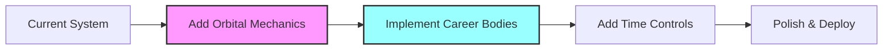
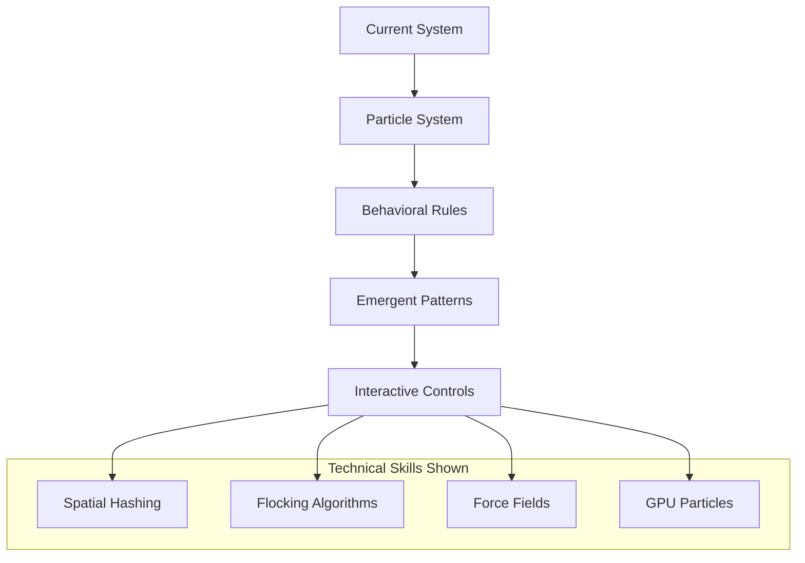

# Portfolio Physics Ideas - Summary & Implementation Guide

## Overview

This document summarizes four innovative concepts for transforming your portfolio into an impressive physics-based showcase. Each concept demonstrates different technical skills while maintaining the core purpose of presenting your professional experience in a memorable way.

## Concept Comparison

| Concept | Technical Showcase | Memorability | Implementation Complexity | Performance Impact |
|---------|-------------------|--------------|--------------------------|-------------------|
| **Orbital Career System** | Orbital mechanics, N-body physics | ⭐⭐⭐⭐⭐ | Medium | Low-Medium |
| **Code Constellation Navigator** | 3D navigation, Procedural generation | ⭐⭐⭐⭐ | Medium-High | Medium |
| **Skill Particle Ecosystem** | Emergent behavior, Particle physics | ⭐⭐⭐⭐⭐ | High | High |
| **Quantum Project Multiverse** | Advanced shaders, Timeline visualization | ⭐⭐⭐⭐ | High | Medium-High |

## Quick Implementation Paths

### Path 1: "The Impressive Demo" (2-3 weeks)
**Best for:** Quick impact, showing technical prowess



1. Start with **Orbital Career System**
2. Use existing physics engine
3. Map current shapes to career milestones
4. Add orbital trails and time dilation
5. Implement focus/navigation system

**Key Features:**
- Reuse existing instanced rendering
- Add Kepler's equations for realistic orbits
- Timeline scrubbing with career highlights
- Smooth camera transitions between jobs/projects

### Path 2: "The Technical Showcase" (3-4 weeks)
**Best for:** Demonstrating complex systems knowledge



1. Implement **Skill Particle Ecosystem**
2. Start with basic particle system
3. Add interaction rules progressively
4. Implement emergent behaviors
5. Add environmental controls

**Key Features:**
- Particle life simulation
- Skill bonding and compounds
- Real-time field visualization
- Performance optimizations

### Path 3: "The Unique Experience" (4-5 weeks)
**Best for:** Creating unforgettable impression

1. Combine **Code Constellation** + **Quantum Multiverse**
2. Navigate between projects in space
3. Show alternate realities at decision points
4. Create immersive spaceship experience

**Key Features:**
- First-person navigation
- Timeline branching visualization
- Shader-based effects
- Split-screen comparisons

## Technical Implementation Strategy

### Phase 1: Foundation (Week 1)
```javascript
// Extend current PhysicsWorld
class CareerPhysicsWorld extends PhysicsWorld {
    constructor() {
        super();
        this.careerBodies = new Map();
        this.timeScale = 1.0;
        this.currentDate = new Date();
    }
    
    addCareerBody(careerData) {
        const body = this.createBody(
            careerData.type,
            careerData.position,
            careerData.mass
        );
        
        body.careerData = careerData;
        this.careerBodies.set(careerData.id, body);
        
        return body;
    }
}
```

### Phase 2: Visualization (Week 2)
```javascript
// Extend InstancedShapeManager
class CareerVisualizationManager extends InstancedShapeManager {
    constructor(scene, physicsWorld) {
        super(scene, physicsWorld);
        this.trailRenderers = new Map();
        this.connectionLines = new Map();
    }
    
    addCareerShape(careerData) {
        const body = this.physicsWorld.addCareerBody(careerData);
        const visual = this.addShape(
            careerData.shapeType,
            body.position.x,
            body.position.y,
            body.position.z,
            careerData.importance // scale
        );
        
        // Add trail effect
        if (careerData.showTrail) {
            this.addTrailRenderer(body);
        }
        
        return { body, visual };
    }
}
```

### Phase 3: Interactivity (Week 3)
```javascript
// Enhanced terminal commands
const careerCommands = {
    'timeline': (args) => {
        // Show career timeline
    },
    'focus': (args) => {
        // Focus on specific career element
    },
    'compare': (args) => {
        // Compare different paths
    },
    'simulate': (args) => {
        // Run what-if scenarios
    }
};
```

## Performance Optimization Strategies

### 1. Level of Detail (LOD)
```javascript
class DynamicLOD {
    constructor() {
        this.levels = {
            near: { distance: 50, quality: 'high' },
            medium: { distance: 150, quality: 'medium' },
            far: { distance: 500, quality: 'low' }
        };
    }
    
    update(object, cameraDistance) {
        if (cameraDistance < this.levels.near.distance) {
            object.enableFullPhysics();
            object.showAllDetails();
        } else if (cameraDistance < this.levels.medium.distance) {
            object.simplifyPhysics();
            object.showMainDetails();
        } else {
            object.freezePhysics();
            object.showMinimalDetails();
        }
    }
}
```

### 2. Temporal Culling
```javascript
class TemporalCuller {
    constructor() {
        this.timeWindow = { start: -5, end: 5 }; // years
    }
    
    cullByTime(objects, currentTime) {
        return objects.filter(obj => {
            const timeDiff = obj.time - currentTime;
            return timeDiff >= this.timeWindow.start && 
                   timeDiff <= this.timeWindow.end;
        });
    }
}
```

### 3. GPU Compute
```javascript
// Use GPU for particle calculations
class GPUParticlePhysics {
    constructor(renderer) {
        this.gpuCompute = new GPUComputationRenderer(
            1024, // texture size
            1024,
            renderer
        );
        
        // Position texture
        this.positionTexture = this.gpuCompute.createTexture();
        // Velocity texture
        this.velocityTexture = this.gpuCompute.createTexture();
        
        // Physics shader
        this.physicsShader = `
            uniform sampler2D positions;
            uniform sampler2D velocities;
            uniform float deltaTime;
            
            void main() {
                vec2 uv = gl_FragCoord.xy / resolution.xy;
                vec3 pos = texture2D(positions, uv).xyz;
                vec3 vel = texture2D(velocities, uv).xyz;
                
                // Apply forces
                vec3 force = calculateForces(pos);
                vel += force * deltaTime;
                
                // Update position
                pos += vel * deltaTime;
                
                gl_FragColor = vec4(pos, 1.0);
            }
        `;
    }
}
```

## Data Integration Strategy

### 1. GitHub API Integration
```javascript
class GitHubPortfolioSync {
    async fetchProjects() {
        const repos = await fetch('https://api.github.com/users/YOU/repos');
        return repos.map(repo => ({
            id: repo.id,
            name: repo.name,
            stars: repo.stargazers_count,
            language: repo.language,
            lastUpdate: repo.updated_at,
            size: repo.size,
            topics: repo.topics
        }));
    }
    
    mapToPhysicsData(repos) {
        return repos.map(repo => ({
            type: 'project',
            mass: Math.log10(repo.size + 1) * 10,
            temperature: this.getActivityTemperature(repo.lastUpdate),
            luminosity: Math.log10(repo.stars + 1),
            position: this.calculatePosition(repo)
        }));
    }
}
```

### 2. LinkedIn Integration
```javascript
class LinkedInCareerMapper {
    mapExperience(profile) {
        return profile.positions.map((position, index) => ({
            type: 'career-body',
            id: `position-${index}`,
            title: position.title,
            company: position.company,
            duration: position.duration,
            orbitalRadius: 100 + index * 50,
            orbitalPeriod: position.duration * 30, // days
            mass: this.calculateImportance(position)
        }));
    }
}
```

## Deployment Considerations

### 1. Progressive Enhancement
```javascript
class ProgressivePortfolio {
    constructor() {
        this.features = {
            basic: ['static-view', 'simple-physics'],
            enhanced: ['orbital-mechanics', 'trails'],
            full: ['particles', 'quantum-effects', 'ai-predictions']
        };
    }
    
    async init() {
        // Start with basic
        await this.loadFeatures(this.features.basic);
        
        // Test performance
        const fps = await this.measurePerformance();
        
        if (fps > 30) {
            await this.loadFeatures(this.features.enhanced);
        }
        
        if (fps > 50) {
            await this.loadFeatures(this.features.full);
        }
    }
}
```

### 2. Mobile Optimization
```javascript
class MobilePortfolio {
    constructor() {
        this.isMobile = /Mobile|Android|iPhone/i.test(navigator.userAgent);
        
        if (this.isMobile) {
            this.settings = {
                particleCount: 100, // vs 1000 on desktop
                physicsSteps: 30,   // vs 60 on desktop
                renderScale: 0.5,   // Half resolution
                effects: 'minimal'
            };
        }
    }
}
```

## Recommended Implementation Order

### Week 1: Foundation
1. Choose core concept (recommend Orbital Career System)
2. Extend existing physics system
3. Create data structures for career/project mapping
4. Basic visualization with existing shapes

### Week 2: Core Features
1. Implement main mechanic (orbits/particles/navigation)
2. Add time controls or environmental controls
3. Create smooth camera transitions
4. Add basic interactivity

### Week 3: Polish & Effects
1. Add visual effects (trails, glows, shaders)
2. Implement advanced features (AI, predictions)
3. Optimize performance
4. Add terminal commands

### Week 4: Integration & Deploy
1. Connect to real data sources
2. Add loading states and fallbacks
3. Mobile optimization
4. Performance testing
5. Deploy and gather feedback

## Success Metrics

1. **Performance**: Maintain 60fps with 500+ objects
2. **Load Time**: Under 3 seconds on average connection
3. **Interaction**: Average session time > 2 minutes
4. **Memorability**: Social shares and comments
5. **Conversion**: Contact form submissions

## Final Recommendations

Based on your current system and goals:

1. **Start with Orbital Career System** - Most achievable with highest impact
2. **Add Particle Skills as Phase 2** - Builds on orbital system
3. **Save Quantum Multiverse for v2** - Most complex but very unique
4. **Use Progressive Enhancement** - Start simple, add features based on performance

The key is to create something that:
- Loads fast and runs smooth
- Immediately impresses visitors
- Invites exploration
- Tells your story effectively
- Shows technical competence

Remember: The goal is to get hired, not just to build cool tech. Balance impressive visuals with clear communication of your skills and experience.