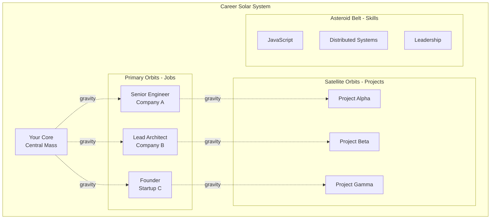
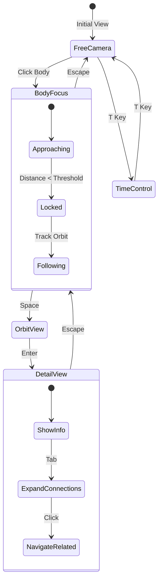
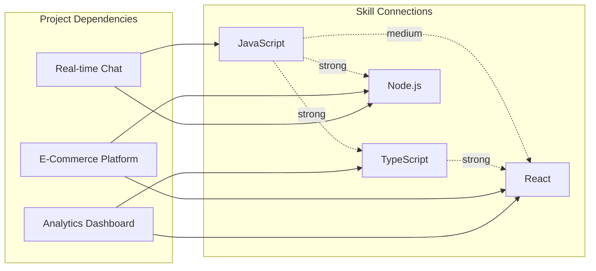

# Orbital Career System - Your Professional Journey in Space

## Concept Overview

Transform your career timeline into a living solar system where each job, project, and skill orbits around your core identity. Visitors can navigate through your professional space, discovering achievements and experiences through gravitational interactions.

## Core Mechanics

### 1. Celestial Bodies as Career Elements



### 2. Orbital Mechanics Implementation

```javascript
class OrbitalBody extends PhysicsBody {
    constructor(options) {
        super(options);
        this.parentBody = options.parentBody;
        this.orbitalRadius = options.radius;
        this.orbitalPeriod = options.period;
        this.eccentricity = options.eccentricity || 0;
        this.inclination = options.inclination || 0;
        
        // Career metadata
        this.careerData = {
            type: options.type, // 'job', 'project', 'skill'
            title: options.title,
            description: options.description,
            duration: options.duration,
            impact: options.impact, // affects size/mass
            connections: options.connections // related bodies
        };
    }
    
    calculateOrbitalPosition(time) {
        // Kepler's equations for realistic orbits
        const M = (2 * Math.PI * time) / this.orbitalPeriod; // Mean anomaly
        const E = this.solveKeplerEquation(M); // Eccentric anomaly
        
        // True anomaly
        const v = 2 * Math.atan(Math.sqrt((1 + this.eccentricity) / 
                                          (1 - this.eccentricity)) * 
                                Math.tan(E / 2));
        
        // Distance from parent
        const r = this.orbitalRadius * (1 - this.eccentricity * Math.cos(E));
        
        // 3D position with inclination
        return {
            x: r * Math.cos(v),
            y: r * Math.sin(v) * Math.sin(this.inclination),
            z: r * Math.sin(v) * Math.cos(this.inclination)
        };
    }
}
```

### 3. Interactive Navigation



### 4. Visual Representation

```javascript
class OrbitTrailEffect {
    constructor(body, scene) {
        this.body = body;
        this.maxPoints = 200;
        this.points = [];
        
        // Create gradient material for trail
        this.material = new THREE.ShaderMaterial({
            uniforms: {
                color: { value: body.color },
                opacity: { value: 0.6 }
            },
            vertexShader: `
                attribute float alpha;
                varying float vAlpha;
                void main() {
                    vAlpha = alpha;
                    gl_Position = projectionMatrix * modelViewMatrix * vec4(position, 1.0);
                }
            `,
            fragmentShader: `
                uniform vec3 color;
                uniform float opacity;
                varying float vAlpha;
                void main() {
                    gl_FragColor = vec4(color, opacity * vAlpha);
                }
            `,
            transparent: true
        });
        
        this.geometry = new THREE.BufferGeometry();
        this.line = new THREE.Line(this.geometry, this.material);
        scene.add(this.line);
    }
    
    update() {
        // Add current position
        this.points.push(this.body.position.clone());
        
        // Limit trail length
        if (this.points.length > this.maxPoints) {
            this.points.shift();
        }
        
        // Update geometry
        const positions = new Float32Array(this.points.length * 3);
        const alphas = new Float32Array(this.points.length);
        
        this.points.forEach((point, i) => {
            positions[i * 3] = point.x;
            positions[i * 3 + 1] = point.y;
            positions[i * 3 + 2] = point.z;
            alphas[i] = i / this.points.length; // Fade out
        });
        
        this.geometry.setAttribute('position', 
            new THREE.BufferAttribute(positions, 3));
        this.geometry.setAttribute('alpha', 
            new THREE.BufferAttribute(alphas, 1));
    }
}
```

## Interactive Features

### 1. Time Dilation Controls
- **Fast Forward**: See entire career trajectory
- **Rewind**: Go back to previous positions
- **Present Lock**: Sync to current date
- **Career Milestones**: Jump to specific events

### 2. Gravity Manipulation
```javascript
class GravityLens {
    constructor(scene, camera) {
        this.active = false;
        this.strength = 1.0;
        this.radius = 50;
        
        // Visual indicator
        this.createVisualizer();
    }
    
    applyToSystem(bodies, mousePosition) {
        if (!this.active) return;
        
        const lensPosition = this.screenToWorld(mousePosition);
        
        bodies.forEach(body => {
            const distance = body.position.distanceTo(lensPosition);
            if (distance < this.radius) {
                const force = this.strength * (1 - distance / this.radius);
                const direction = lensPosition.sub(body.position).normalize();
                body.applyForce(direction.multiplyScalar(force));
            }
        });
    }
}
```

### 3. Connection Visualization



## Performance Optimizations

### 1. Level of Detail (LOD) System
```javascript
class CareerLOD {
    constructor(body) {
        this.body = body;
        this.levels = {
            far: { 
                geometry: new THREE.SphereGeometry(1, 8, 6),
                showOrbit: false,
                showLabel: false
            },
            medium: {
                geometry: new THREE.SphereGeometry(1, 16, 12),
                showOrbit: true,
                showLabel: true
            },
            near: {
                geometry: new THREE.SphereGeometry(1, 32, 24),
                showOrbit: true,
                showLabel: true,
                showDetails: true
            }
        };
    }
    
    update(distanceToCamera) {
        if (distanceToCamera > 1000) {
            this.setLevel('far');
        } else if (distanceToCamera > 500) {
            this.setLevel('medium');
        } else {
            this.setLevel('near');
        }
    }
}
```

### 2. Orbital Clustering
Group related items to reduce calculations:
- Skills cluster around relevant jobs
- Projects orbit their parent companies
- Technologies form constellations

## Terminal Integration

New commands for the orbital system:
```bash
career timeline     # Show chronological view
career focus <item> # Focus camera on specific item
career connections  # Highlight all connections
career stats       # Show career statistics
warp <year>        # Jump to specific year
gravity <strength> # Adjust gravitational constant
trails on/off      # Toggle orbital trails
```

## Data Structure

```javascript
const careerData = {
    core: {
        name: "James Ross",
        title: "Distributed Systems Architect",
        mass: 1000, // Affects gravitational pull
        radius: 10
    },
    
    positions: [
        {
            id: "job-1",
            type: "position",
            company: "Gala Games",
            title: "Senior System Architect",
            startDate: "2022-02",
            endDate: "2024-04",
            orbitalRadius: 100,
            orbitalPeriod: 365, // days
            mass: 500,
            
            projects: [
                {
                    id: "proj-1-1",
                    name: "MMO Backend",
                    impact: 0.8, // 0-1 scale
                    technologies: ["node", "redis", "kubernetes"]
                }
            ],
            
            achievements: [
                "Scaled to 5000+ concurrent users",
                "Sub-100ms global latency"
            ]
        }
    ],
    
    skills: [
        {
            id: "skill-1",
            name: "Distributed Systems",
            level: 0.9,
            category: "architecture",
            relatedTo: ["job-1", "proj-1-1"]
        }
    ]
};
```

## Visual Enhancements

### 1. Shader Effects
```glsl
// Vertex shader for pulsing career bodies
varying float vDistance;
uniform float time;
uniform float importance;

void main() {
    vDistance = length(position);
    vec3 newPosition = position;
    
    // Pulse based on importance
    float pulse = sin(time * 2.0) * 0.1 * importance;
    newPosition *= 1.0 + pulse;
    
    gl_Position = projectionMatrix * modelViewMatrix * vec4(newPosition, 1.0);
}

// Fragment shader with rim lighting
varying float vDistance;
uniform vec3 coreColor;
uniform float glowIntensity;

void main() {
    float rim = 1.0 - dot(normalize(vNormal), normalize(cameraPosition));
    rim = pow(rim, 2.0);
    
    vec3 finalColor = coreColor + (vec3(1.0) * rim * glowIntensity);
    gl_FragColor = vec4(finalColor, 1.0);
}
```

### 2. Particle Effects for Achievements
- Burst effects when hovering over milestones
- Particle streams between connected items
- Comet-like trails for fast-moving career changes

## Unique Selling Points

1. **Memorable**: Who else has their resume as a solar system?
2. **Interactive**: Explore career depth through navigation
3. **Scalable**: Easy to add new positions/projects
4. **Performant**: LOD and instancing handle complexity
5. **Insightful**: Visual patterns reveal career trajectory
6. **Shareable**: Direct links to specific career moments

## Implementation Priority

1. **Phase 1**: Basic orbital mechanics with positions
2. **Phase 2**: Interactive navigation and focus system
3. **Phase 3**: Connection visualization
4. **Phase 4**: Time controls and animations
5. **Phase 5**: Advanced shaders and effects