# Code Constellation Navigator - Navigate Your Technical Universe

## Concept Overview

Transform your codebase, projects, and skills into an explorable 3D constellation. Each star represents a project, with brightness indicating activity/importance. Constellations form around technology stacks, and visitors can "fly" between projects in a spaceship to explore your work.

## Core Mechanics

### 1. Star System Architecture

```mermaid
graph TD
    subgraph "Project Galaxy"
        subgraph "Frontend Constellation"
            REACT[React Projects ⭐]
            VUE[Vue Projects ⭐]
            THREE[Three.js Projects ⭐]
        end
        
        subgraph "Backend Constellation"
            NODE[Node.js Systems ⭐]
            PYTHON[Python Services ⭐]
            GO[Go Microservices ⭐]
        end
        
        subgraph "Data Constellation"
            POSTGRES[PostgreSQL ⭐]
            REDIS[Redis Systems ⭐]
            MONGO[MongoDB ⭐]
        end
        
        subgraph "Nebula Clouds"
            LEARNING[Learning Zone 🌫️]
            EXPERIMENTAL[Experiments 🌫️]
        end
    end
```



### 2. Spaceship Navigation System

```javascript
class SpaceshipController {
    constructor(scene, camera) {
        this.position = new THREE.Vector3(0, 0, 100);
        this.velocity = new THREE.Vector3(0, 0, 0);
        this.rotation = new THREE.Quaternion();
        
        // Navigation modes
        this.modes = {
            CRUISE: { speed: 5, turnRate: 0.02 },
            WARP: { speed: 50, turnRate: 0.001 },
            PRECISION: { speed: 1, turnRate: 0.05 }
        };
        
        this.currentMode = 'CRUISE';
        this.destination = null;
        this.autopilot = false;
        
        // Ship visuals
        this.createShipModel();
        this.createEngineEffects();
    }
    
    createShipModel() {
        // Procedural spaceship geometry
        const shipGeometry = new THREE.ConeGeometry(2, 8, 8);
        const shipMaterial = new THREE.ShaderMaterial({
            uniforms: {
                time: { value: 0 },
                speed: { value: 0 },
                warpMode: { value: 0 }
            },
            vertexShader: `
                varying vec2 vUv;
                varying vec3 vPosition;
                
                void main() {
                    vUv = uv;
                    vPosition = position;
                    gl_Position = projectionMatrix * modelViewMatrix * vec4(position, 1.0);
                }
            `,
            fragmentShader: `
                uniform float time;
                uniform float speed;
                uniform float warpMode;
                varying vec2 vUv;
                varying vec3 vPosition;
                
                void main() {
                    vec3 color = vec3(0.2, 0.5, 1.0);
                    
                    // Energy field effect
                    float energy = sin(vPosition.y * 10.0 + time * 5.0) * 0.5 + 0.5;
                    color += vec3(0, energy * speed * 0.1, energy * speed * 0.2);
                    
                    // Warp effect
                    if (warpMode > 0.0) {
                        color = mix(color, vec3(1.0, 0.5, 0.0), warpMode);
                    }
                    
                    gl_FragColor = vec4(color, 1.0);
                }
            `
        });
        
        this.shipMesh = new THREE.Mesh(shipGeometry, shipMaterial);
    }
    
    navigateToStar(star) {
        this.destination = star;
        this.autopilot = true;
        
        // Calculate route
        const route = this.calculateOptimalRoute(this.position, star.position);
        this.currentRoute = route;
        
        // Engage appropriate drive
        const distance = this.position.distanceTo(star.position);
        if (distance > 1000) {
            this.engageWarpDrive();
        }
    }
    
    calculateOptimalRoute(start, end) {
        // A* pathfinding through star fields
        // Avoid nebulas (they slow movement)
        // Use gravity assists from large stars
        // Return array of waypoints
    }
}
```

### 3. Project Star Properties

```javascript
class ProjectStar {
    constructor(projectData) {
        this.data = projectData;
        
        // Visual properties based on project metrics
        this.radius = this.calculateRadius();
        this.temperature = this.calculateTemperature();
        this.luminosity = this.calculateLuminosity();
        
        // Create star mesh with custom shader
        this.createStarMesh();
        
        // Orbiting elements
        this.satellites = []; // Smaller features/components
        this.asteroidBelt = []; // Dependencies
        this.planets = []; // Major features
    }
    
    calculateRadius() {
        // Based on codebase size
        const loc = this.data.linesOfCode || 1000;
        return Math.log10(loc) * 2;
    }
    
    calculateTemperature() {
        // Based on activity (recent commits)
        const daysSinceLastCommit = this.data.daysSinceLastCommit || 30;
        const activityScore = Math.max(0, 1 - daysSinceLastCommit / 365);
        
        // Temperature in Kelvin (visual color)
        return 2000 + activityScore * 8000; // 2000K (red) to 10000K (blue)
    }
    
    calculateLuminosity() {
        // Based on impact/stars/usage
        const stars = this.data.githubStars || 0;
        const users = this.data.activeUsers || 0;
        return Math.log10(stars + users + 1);
    }
    
    createStarMesh() {
        const geometry = new THREE.SphereGeometry(this.radius, 32, 32);
        
        const material = new THREE.ShaderMaterial({
            uniforms: {
                time: { value: 0 },
                temperature: { value: this.temperature },
                luminosity: { value: this.luminosity },
                viewVector: { value: new THREE.Vector3() }
            },
            vertexShader: `
                varying vec3 vNormal;
                varying vec3 vViewPosition;
                
                void main() {
                    vNormal = normalize(normalMatrix * normal);
                    vec4 mvPosition = modelViewMatrix * vec4(position, 1.0);
                    vViewPosition = -mvPosition.xyz;
                    gl_Position = projectionMatrix * mvPosition;
                }
            `,
            fragmentShader: `
                uniform float time;
                uniform float temperature;
                uniform float luminosity;
                varying vec3 vNormal;
                varying vec3 vViewPosition;
                
                vec3 temperatureToColor(float temp) {
                    // Planckian locus approximation
                    vec3 color;
                    if (temp < 3500.0) {
                        color = vec3(1.0, 0.0, 0.0); // Red
                    } else if (temp < 5000.0) {
                        color = vec3(1.0, 0.5, 0.0); // Orange
                    } else if (temp < 6500.0) {
                        color = vec3(1.0, 1.0, 0.8); // Yellow-white
                    } else if (temp < 8000.0) {
                        color = vec3(0.8, 0.9, 1.0); // White-blue
                    } else {
                        color = vec3(0.5, 0.7, 1.0); // Blue
                    }
                    return color;
                }
                
                void main() {
                    vec3 baseColor = temperatureToColor(temperature);
                    
                    // Corona effect
                    float intensity = pow(0.65 / length(vViewPosition), 2.0);
                    vec3 corona = baseColor * intensity * luminosity;
                    
                    // Surface detail
                    float noise = sin(vNormal.x * 10.0 + time) * 
                                  cos(vNormal.y * 10.0 + time * 0.5) * 0.1;
                    
                    vec3 finalColor = baseColor + corona + noise;
                    
                    gl_FragColor = vec4(finalColor, 1.0);
                }
            `,
            side: THREE.FrontSide,
            blending: THREE.AdditiveBlending,
            transparent: true
        });
        
        this.mesh = new THREE.Mesh(geometry, material);
    }
}
```

### 4. Constellation Connections


### 5. Interactive Project Explorer

```javascript
class ProjectInfoOverlay {
    constructor() {
        this.container = document.createElement('div');
        this.container.className = 'project-explorer';
        this.container.innerHTML = `
            <div class="star-info">
                <h2 class="project-name"></h2>
                <div class="star-classification"></div>
                <div class="project-stats">
                    <div class="stat">
                        <span class="label">Luminosity</span>
                        <span class="value"></span>
                    </div>
                    <div class="stat">
                        <span class="label">Temperature</span>
                        <span class="value"></span>
                    </div>
                    <div class="stat">
                        <span class="label">Age</span>
                        <span class="value"></span>
                    </div>
                </div>
                <div class="project-description"></div>
                <div class="tech-stack"></div>
                <div class="actions">
                    <button class="visit-repo">Visit Repository</button>
                    <button class="view-demo">View Demo</button>
                    <button class="explore-code">Explore Code</button>
                </div>
            </div>
            <div class="navigation-panel">
                <div class="minimap"></div>
                <div class="waypoints"></div>
            </div>
        `;
    }
    
    showProjectDetails(star) {
        const data = star.data;
        
        // Update display with real project data
        this.container.querySelector('.project-name').textContent = data.name;
        this.container.querySelector('.star-classification').textContent = 
            this.classifyStar(star);
        
        // Animated stats
        this.animateStats(star);
        
        // Tech stack visualization
        this.createTechStackVisualization(data.technologies);
        
        // Show overlay with animation
        this.show();
    }
    
    classifyStar(star) {
        // Harvard spectral classification based on project type
        const types = {
            'web-app': 'Type G - Main Sequence Application',
            'library': 'Type M - Red Dwarf Library',
            'framework': 'Type O - Blue Giant Framework',
            'tool': 'Type K - Orange Dwarf Tool',
            'experiment': 'Type W - Wolf-Rayet Prototype'
        };
        
        return types[star.data.type] || 'Type X - Exotic Matter';
    }
}
```

## Navigation Features

### 1. Warp Drive System
```javascript
class WarpDrive {
    constructor(ship) {
        this.ship = ship;
        this.charging = false;
        this.chargeLevel = 0;
        
        // Visual effects
        this.createWarpTunnel();
    }
    
    createWarpTunnel() {
        // Shader for warp tunnel effect
        const geometry = new THREE.CylinderGeometry(50, 50, 200, 32, 1, true);
        const material = new THREE.ShaderMaterial({
            uniforms: {
                time: { value: 0 },
                warpFactor: { value: 0 }
            },
            vertexShader: `
                varying vec2 vUv;
                uniform float time;
                uniform float warpFactor;
                
                void main() {
                    vUv = uv;
                    vec3 pos = position;
                    
                    // Distort space
                    float distortion = sin(pos.z * 0.1 + time * 10.0) * warpFactor;
                    pos.x += distortion;
                    pos.y += distortion;
                    
                    gl_Position = projectionMatrix * modelViewMatrix * vec4(pos, 1.0);
                }
            `,
            fragmentShader: `
                varying vec2 vUv;
                uniform float time;
                uniform float warpFactor;
                
                void main() {
                    vec2 uv = vUv;
                    
                    // Warp field lines
                    float lines = sin(uv.y * 100.0 - time * 50.0) * 0.5 + 0.5;
                    lines = pow(lines, 3.0);
                    
                    vec3 color = vec3(0.0, 0.5, 1.0) * lines * warpFactor;
                    
                    gl_FragColor = vec4(color, warpFactor * 0.8);
                }
            `,
            transparent: true,
            side: THREE.BackSide
        });
        
        this.tunnel = new THREE.Mesh(geometry, material);
        this.tunnel.visible = false;
    }
    
    engage(destination) {
        this.charging = true;
        
        // Charge animation
        const chargeDuration = 2000; // 2 seconds
        const startTime = Date.now();
        
        const chargeAnimation = () => {
            const elapsed = Date.now() - startTime;
            this.chargeLevel = Math.min(elapsed / chargeDuration, 1);
            
            if (this.chargeLevel >= 1) {
                this.initiateJump(destination);
            } else {
                requestAnimationFrame(chargeAnimation);
            }
        };
        
        chargeAnimation();
    }
}
```

### 2. Constellation Map System

```javascript
class ConstellationMap {
    constructor(projects) {
        this.constellations = this.groupProjectsByTech(projects);
        this.createConstellationLines();
    }
    
    groupProjectsByTech(projects) {
        const groups = {};
        
        projects.forEach(project => {
            project.technologies.forEach(tech => {
                if (!groups[tech]) {
                    groups[tech] = [];
                }
                groups[tech].push(project);
            });
        });
        
        return groups;
    }
    
    createConstellationLines() {
        Object.entries(this.constellations).forEach(([tech, projects]) => {
            if (projects.length < 2) return;
            
            // Create constellation pattern
            const mst = this.calculateMinimumSpanningTree(projects);
            
            mst.forEach(edge => {
                this.createLine(edge.from, edge.to, tech);
            });
        });
    }
    
    createLine(star1, star2, tech) {
        const geometry = new THREE.BufferGeometry();
        const points = [star1.position, star2.position];
        geometry.setFromPoints(points);
        
        const material = new THREE.LineBasicMaterial({
            color: this.getTechColor(tech),
            opacity: 0.3,
            transparent: true
        });
        
        const line = new THREE.Line(geometry, material);
        line.userData = { tech, stars: [star1, star2] };
        
        return line;
    }
}
```

## Terminal Commands

```bash
nav <project>      # Navigate to specific project
warp <project>     # Instant travel to project
scan               # Scan nearby projects
classify           # Show star classification
route <from> <to>  # Show route between projects
constellation      # Toggle constellation view
fuel               # Check warp fuel status
catalog            # List all projects by type
nearby <tech>      # Find nearest project using tech
history            # Show navigation history
bookmark <name>    # Bookmark current location
jump <bookmark>    # Jump to bookmarked location
```

## Performance Features

### 1. Dynamic LOD for Star Systems
- Far: Simple point lights
- Medium: Basic sphere with glow
- Near: Full shader effects with corona
- Active: Orbiting elements visible

### 2. Occlusion Culling
- Hide stars behind nebulas
- Cull distant constellations
- Progressive loading of project details

### 3. Instanced Rendering for Distant Stars
```javascript
class StarField {
    constructor(farStars) {
        const count = farStars.length;
        const geometry = new THREE.SphereGeometry(0.5, 4, 4);
        const material = new THREE.MeshBasicMaterial();
        
        this.instancedMesh = new THREE.InstancedMesh(geometry, material, count);
        
        farStars.forEach((star, i) => {
            const matrix = new THREE.Matrix4();
            matrix.setPosition(star.position);
            this.instancedMesh.setMatrixAt(i, matrix);
            this.instancedMesh.setColorAt(i, star.color);
        });
    }
}
```

## Unique Features

1. **GitHub Integration**: Live data from repositories
2. **Commit Comets**: Recent commits fly between stars
3. **Pull Request Wormholes**: Jump between related projects
4. **Issue Asteroids**: Floating around projects needing attention
5. **Fork Dimensions**: See parallel universes of forked projects

## Data Structure

```javascript
const projectUniverse = {
    stars: [
        {
            id: "project-1",
            name: "Neural Network Visualizer",
            type: "web-app",
            position: { x: 100, y: 50, z: -200 },
            
            metrics: {
                linesOfCode: 15000,
                commits: 342,
                contributors: 12,
                stars: 1337,
                lastCommit: "2024-12-01"
            },
            
            technologies: ["javascript", "tensorflow", "three.js"],
            
            satellites: [
                { name: "Documentation", type: "moon" },
                { name: "Test Suite", type: "moon" },
                { name: "CI/CD Pipeline", type: "station" }
            ],
            
            connections: ["project-2", "project-5"]
        }
    ],
    
    nebulas: [
        {
            name: "Machine Learning Cloud",
            position: { x: 0, y: 0, z: -150 },
            radius: 200,
            projects: ["project-1", "project-3"]
        }
    ],
    
    wormholes: [
        {
            from: "project-1",
            to: "project-7",
            type: "fork"
        }
    ]
};
```

## Visual Polish

1. **Parallax Star Background**: Multiple layers of distant stars
2. **Nebula Shaders**: Volumetric clouds with internal lighting
3. **Black Holes**: For deprecated/archived projects
4. **Supernovas**: Highlighting major achievements
5. **Space Dust**: Particle effects for atmosphere