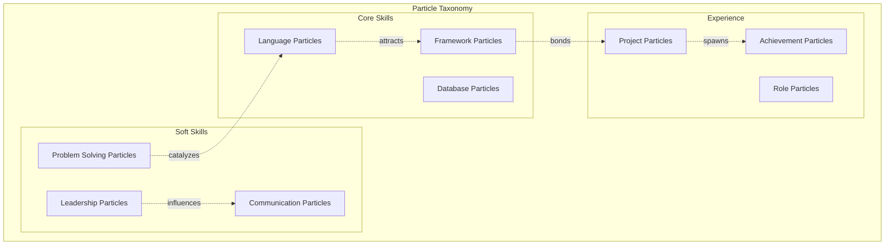
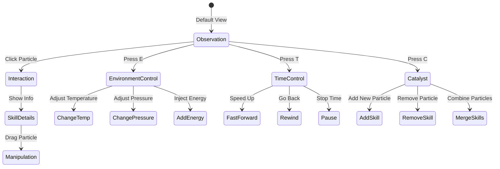

# Skill Particle Ecosystem - Living Resume Through Emergent Behavior

## Concept Overview

Transform your skills and experiences into a living ecosystem where particles represent individual competencies that interact, combine, and evolve. Watch as your technical skills form complex patterns, create emergent behaviors, and demonstrate the interconnected nature of your expertise.

## Core Mechanics

### 1. Particle Types and Behaviors



### 2. Particle Life Rules System

```javascript
class SkillParticle {
    constructor(type, subtype, strength) {
        this.type = type; // 'language', 'framework', 'soft-skill', etc.
        this.subtype = subtype; // 'javascript', 'react', 'leadership', etc.
        this.strength = strength; // 0.0 - 1.0, affects size and influence
        
        // Physics properties
        this.position = new THREE.Vector3();
        this.velocity = new THREE.Vector3();
        this.acceleration = new THREE.Vector3();
        
        // Behavior properties
        this.energy = 100;
        this.age = 0;
        this.bonds = []; // Connected particles
        this.state = 'free'; // free, bonded, crystallized
        
        // Visual properties
        this.color = this.getTypeColor();
        this.size = strength * 2 + 0.5;
        this.glow = 0;
        
        // Interaction rules
        this.rules = this.defineInteractionRules();
    }
    
    defineInteractionRules() {
        // Define how this particle interacts with others
        const rules = {
            // Attraction/repulsion matrix
            attraction: {
                'javascript': {
                    'react': 0.8,
                    'node': 0.9,
                    'typescript': 0.95,
                    'python': 0.2,
                    'leadership': 0.4
                },
                'react': {
                    'redux': 0.7,
                    'next.js': 0.8,
                    'three.js': 0.6,
                    'vue': -0.3 // Slight repulsion
                }
                // ... more rules
            },
            
            // Bonding thresholds
            bondingDistance: 5,
            bondingEnergy: 20,
            maxBonds: this.type === 'framework' ? 6 : 4,
            
            // Special behaviors
            behaviors: {
                'catalyst': this.subtype === 'problem-solving',
                'aggregator': this.subtype === 'architecture',
                'amplifier': this.subtype === 'leadership'
            }
        };
        
        return rules;
    }
    
    interact(other, deltaTime) {
        const distance = this.position.distanceTo(other.position);
        const attraction = this.getAttraction(other);
        
        if (distance < this.rules.bondingDistance && this.canBond(other)) {
            this.formBond(other);
        } else if (distance < 50) {
            // Apply attraction/repulsion forces
            const force = attraction / (distance * distance);
            const direction = new THREE.Vector3()
                .subVectors(other.position, this.position)
                .normalize();
            
            this.acceleration.add(direction.multiplyScalar(force));
        }
        
        // Special behaviors
        if (this.rules.behaviors.catalyst && distance < 10) {
            other.energy += 0.5 * deltaTime;
        }
        
        if (this.rules.behaviors.amplifier && this.bonds.includes(other)) {
            other.strength = Math.min(1.0, other.strength + 0.001 * deltaTime);
        }
    }
    
    formBond(other) {
        if (this.bonds.length >= this.rules.maxBonds) return;
        if (other.bonds.length >= other.rules.maxBonds) return;
        
        this.bonds.push(other);
        other.bonds.push(this);
        
        // Create visual bond
        this.createBondVisual(other);
        
        // Bond effects
        this.energy -= this.rules.bondingEnergy;
        other.energy -= other.rules.bondingEnergy;
        
        // Possible compound creation
        this.checkCompoundFormation();
    }
    
    checkCompoundFormation() {
        // Check if current bonds form a known compound
        const bondTypes = this.bonds.map(p => p.subtype).sort().join('+');
        
        const compounds = {
            'javascript+react+node': 'FullStackDeveloper',
            'python+tensorflow+numpy': 'MLEngineer',
            'leadership+communication+architecture': 'TechLead',
            'redis+postgresql+mongodb': 'DataArchitect'
        };
        
        if (compounds[bondTypes]) {
            this.evolveIntoCompound(compounds[bondTypes]);
        }
    }
}
```

### 3. Ecosystem Dynamics

```javascript
class SkillEcosystem {
    constructor(resumeData) {
        this.particles = [];
        this.compounds = [];
        this.environment = {
            temperature: 0.5, // Activity level
            pressure: 0.5, // Deadline pressure
            resources: 100, // Available energy
            time: 0
        };
        
        // Initialize particles from resume data
        this.initializeFromResume(resumeData);
        
        // Spatial organization
        this.regions = this.createRegions();
        
        // Evolution tracking
        this.history = [];
        this.achievements = [];
    }
    
    createRegions() {
        return {
            technical: {
                center: new THREE.Vector3(-50, 0, 0),
                radius: 50,
                attractionType: ['language', 'framework', 'database']
            },
            creative: {
                center: new THREE.Vector3(50, 0, 0),
                radius: 50,
                attractionType: ['design', 'ux', 'visualization']
            },
            leadership: {
                center: new THREE.Vector3(0, 50, 0),
                radius: 50,
                attractionType: ['leadership', 'communication', 'mentoring']
            }
        };
    }
    
    update(deltaTime) {
        // Environmental effects
        this.updateEnvironment(deltaTime);
        
        // Particle interactions
        for (let i = 0; i < this.particles.length; i++) {
            for (let j = i + 1; j < this.particles.length; j++) {
                this.particles[i].interact(this.particles[j], deltaTime);
            }
        }
        
        // Update particles
        this.particles.forEach(particle => {
            // Regional attractions
            this.applyRegionalForces(particle);
            
            // Update physics
            particle.velocity.add(particle.acceleration.multiplyScalar(deltaTime));
            particle.velocity.multiplyScalar(0.98); // Damping
            particle.position.add(particle.velocity.clone().multiplyScalar(deltaTime));
            particle.acceleration.set(0, 0, 0);
            
            // Update properties
            particle.age += deltaTime;
            particle.energy = Math.max(0, particle.energy - 0.1 * deltaTime);
            
            // Visual updates
            this.updateParticleVisuals(particle);
        });
        
        // Check for emergent patterns
        this.detectEmergentBehaviors();
    }
    
    detectEmergentBehaviors() {
        // Flocking behavior for similar skills
        const flocks = this.detectFlocking();
        
        // Crystallization of stable skill compounds
        const crystals = this.detectCrystallization();
        
        // Skill chains and pathways
        const pathways = this.detectPathways();
        
        // Trigger achievements
        if (flocks.length > 3) {
            this.unlockAchievement('Polyglot', 'Multiple language mastery detected');
        }
        
        if (crystals.length > 0) {
            this.unlockAchievement('Stable Architecture', 'Crystallized skill formation');
        }
    }
}
```

### 4. Visual Representation System

```javascript
class ParticleVisualizer {
    constructor(ecosystem) {
        this.ecosystem = ecosystem;
        
        // Particle rendering
        this.particleSystem = this.createParticleSystem();
        
        // Bond rendering
        this.bondSystem = this.createBondSystem();
        
        // Field visualization
        this.fieldVisualizer = this.createFieldVisualizer();
        
        // Compound structures
        this.compoundMeshes = new Map();
    }
    
    createParticleSystem() {
        const geometry = new THREE.BufferGeometry();
        const material = new THREE.ShaderMaterial({
            uniforms: {
                time: { value: 0 },
                particleTexture: { value: this.createParticleTexture() }
            },
            vertexShader: `
                attribute float size;
                attribute vec3 customColor;
                attribute float energy;
                attribute float glow;
                
                varying vec3 vColor;
                varying float vEnergy;
                varying float vGlow;
                
                void main() {
                    vColor = customColor;
                    vEnergy = energy;
                    vGlow = glow;
                    
                    vec4 mvPosition = modelViewMatrix * vec4(position, 1.0);
                    gl_PointSize = size * (300.0 / -mvPosition.z);
                    gl_Position = projectionMatrix * mvPosition;
                }
            `,
            fragmentShader: `
                uniform sampler2D particleTexture;
                uniform float time;
                
                varying vec3 vColor;
                varying float vEnergy;
                varying float vGlow;
                
                void main() {
                    vec2 uv = gl_PointCoord;
                    vec4 tex = texture2D(particleTexture, uv);
                    
                    // Energy pulse
                    float pulse = sin(time * 3.0 + vGlow * 10.0) * 0.2 + 0.8;
                    
                    // Core glow
                    float dist = length(uv - 0.5);
                    float glow = 1.0 / (dist * 10.0 + 1.0);
                    
                    vec3 finalColor = vColor * vEnergy * pulse;
                    finalColor += vColor * glow * vGlow;
                    
                    gl_FragColor = vec4(finalColor, tex.a * vEnergy);
                }
            `,
            transparent: true,
            blending: THREE.AdditiveBlending,
            depthWrite: false
        });
        
        return new THREE.Points(geometry, material);
    }
    
    createFieldVisualizer() {
        // Visualize skill fields and influence areas
        const fieldGeometry = new THREE.PlaneGeometry(200, 200, 50, 50);
        const fieldMaterial = new THREE.ShaderMaterial({
            uniforms: {
                time: { value: 0 },
                particles: { value: [] }, // Particle positions and influences
            },
            vertexShader: `
                varying vec2 vUv;
                varying float vFieldStrength;
                uniform vec3 particles[100];
                
                void main() {
                    vUv = uv;
                    
                    // Calculate field strength at this vertex
                    float fieldStrength = 0.0;
                    for (int i = 0; i < 100; i++) {
                        if (particles[i].z > 0.0) { // z stores influence
                            float dist = distance(position.xy, particles[i].xy);
                            fieldStrength += particles[i].z / (dist + 1.0);
                        }
                    }
                    vFieldStrength = fieldStrength;
                    
                    // Displace vertex based on field
                    vec3 pos = position;
                    pos.z += fieldStrength * 5.0;
                    
                    gl_Position = projectionMatrix * modelViewMatrix * vec4(pos, 1.0);
                }
            `,
            fragmentShader: `
                varying vec2 vUv;
                varying float vFieldStrength;
                uniform float time;
                
                vec3 heatmapColor(float value) {
                    vec3 blue = vec3(0.0, 0.0, 1.0);
                    vec3 cyan = vec3(0.0, 1.0, 1.0);
                    vec3 green = vec3(0.0, 1.0, 0.0);
                    vec3 yellow = vec3(1.0, 1.0, 0.0);
                    vec3 red = vec3(1.0, 0.0, 0.0);
                    
                    float t = value * 4.0;
                    if (t < 1.0) return mix(blue, cyan, t);
                    else if (t < 2.0) return mix(cyan, green, t - 1.0);
                    else if (t < 3.0) return mix(green, yellow, t - 2.0);
                    else return mix(yellow, red, t - 3.0);
                }
                
                void main() {
                    vec3 color = heatmapColor(vFieldStrength * 0.1);
                    
                    // Grid overlay
                    float grid = step(0.98, max(
                        sin(vUv.x * 50.0),
                        sin(vUv.y * 50.0)
                    ));
                    
                    color = mix(color, vec3(0.2), grid * 0.5);
                    
                    gl_FragColor = vec4(color, 0.3 + vFieldStrength * 0.2);
                }
            `,
            transparent: true,
            side: THREE.DoubleSide
        });
        
        return new THREE.Mesh(fieldGeometry, fieldMaterial);
    }
}
```

### 5. Interactive Features



## Terminal Commands

```bash
# Particle Management
spawn <skill> <strength>  # Add new skill particle
remove <skill>           # Remove skill particle
boost <skill>           # Increase skill strength
link <skill1> <skill2>  # Force bond between skills

# Ecosystem Control
temp <value>            # Set ecosystem temperature (0-1)
pressure <value>        # Set ecosystem pressure (0-1)
energy <amount>         # Add energy to system
evolve                  # Fast-forward evolution

# Visualization
field on/off            # Toggle field visualization
bonds on/off            # Toggle bond rendering
trails on/off           # Toggle particle trails
stats                   # Show ecosystem statistics

# Analysis
compounds               # List formed compounds
pathways               # Show skill pathways
clusters               # Identify skill clusters
strengths              # Show skill strengths

# Scenarios
simulate interview      # High pressure scenario
simulate learning      # New particle introduction
simulate project       # Collaborative bonding
simulate growth        # Long-term evolution
```

## Data Integration

```javascript
const resumeToEcosystem = {
    skills: {
        languages: [
            { name: 'JavaScript', level: 0.95, years: 15 },
            { name: 'Python', level: 0.8, years: 8 },
            { name: 'TypeScript', level: 0.9, years: 5 }
        ],
        frameworks: [
            { name: 'React', level: 0.9, years: 7 },
            { name: 'Node.js', level: 0.95, years: 10 },
            { name: 'Three.js', level: 0.7, years: 3 }
        ],
        soft: [
            { name: 'Leadership', level: 0.8, years: 6 },
            { name: 'Architecture', level: 0.9, years: 10 },
            { name: 'Communication', level: 0.85, years: 15 }
        ]
    },
    
    experience: [
        {
            role: 'Senior Architect',
            company: 'TechCorp',
            skills: ['JavaScript', 'Architecture', 'Leadership'],
            impact: 0.9
        }
    ],
    
    projects: [
        {
            name: 'Distributed System',
            skills: ['Node.js', 'Redis', 'Architecture'],
            outcome: 'success',
            impact: 0.95
        }
    ]
};
```

## Emergent Behaviors

### 1. Skill Crystallization
When particles form stable, geometric patterns:
- Triangle: Fundamental skill trio (e.g., HTML+CSS+JS)
- Square: Stable platform (e.g., MEAN stack)
- Pentagon: Complete solution (e.g., Full stack + DevOps)

### 2. Skill Cascades
Chain reactions when learning new skills:
- Learning TypeScript triggers JavaScript particle evolution
- Mastering React causes related framework particles to orbit

### 3. Career Phase Transitions
Major state changes in the ecosystem:
- Junior → Senior: Particle density increases
- IC → Manager: Leadership particles become attractors
- Specialist → Generalist: Uniform particle distribution

## Visual Effects

### 1. Particle Shaders
```glsl
// Skill particle glow based on usage recency
float recencyGlow = exp(-daysSinceUsed * 0.1);
color += glowColor * recencyGlow;

// Connection strength visualization
float bondStrength = dot(particle1.velocity, particle2.velocity);
bondColor = mix(coldColor, hotColor, bondStrength);
```

### 2. Environmental Effects
- **Learning Mode**: New particles enter with comet trails
- **Pressure Mode**: Particles vibrate and move faster
- **Growth Mode**: Particles slowly increase in size
- **Decay Mode**: Unused skills fade and shrink

### 3. Achievement Visualization
- Particle fireworks when forming new compounds
- Energy waves when reaching skill milestones
- Constellation formation for related skill mastery

## Performance Optimizations

### 1. Spatial Hashing
```javascript
class SpatialHash {
    constructor(cellSize) {
        this.cellSize = cellSize;
        this.hash = new Map();
    }
    
    insert(particle) {
        const key = this.getKey(particle.position);
        if (!this.hash.has(key)) {
            this.hash.set(key, []);
        }
        this.hash.get(key).push(particle);
    }
    
    getNearby(position, radius) {
        const nearby = [];
        const cells = this.getCellsInRadius(position, radius);
        
        cells.forEach(key => {
            if (this.hash.has(key)) {
                nearby.push(...this.hash.get(key));
            }
        });
        
        return nearby;
    }
}
```

### 2. Level of Detail
- Close particles: Full interaction simulation
- Medium distance: Simplified force calculation
- Far particles: Statistical approximation
- Invisible particles: Frozen state

## Unique Selling Points

1. **Living Resume**: Skills literally come alive and interact
2. **Honest Representation**: Unused skills naturally decay
3. **Growth Visualization**: See career evolution over time
4. **Interactive Learning**: Add skills and watch integration
5. **Pattern Recognition**: Emergent behaviors reveal strengths
6. **Memorable**: Who forgets a living skill ecosystem?