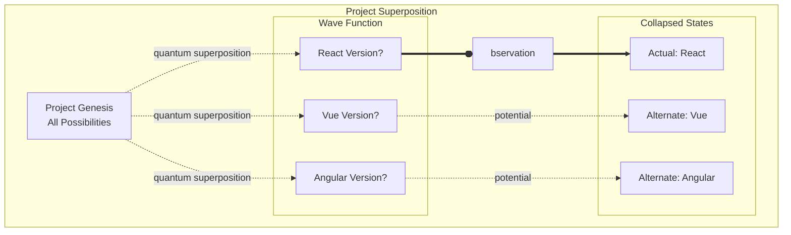
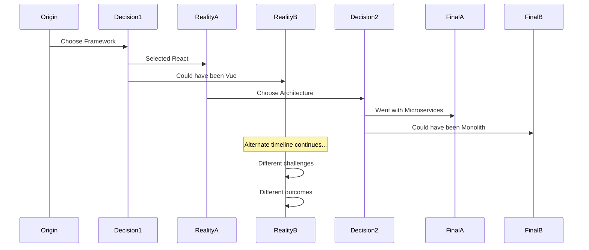

# Quantum Project Multiverse - Parallel Realities of Your Work

## Concept Overview

Present your projects and career decisions as a quantum multiverse where each choice spawns parallel realities. Visitors can explore different timeline branches, see how projects evolved, and even peek into alternate realities where different technical decisions were made.

## Core Mechanics

### 1. Quantum State Representation



### 2. Timeline Branch Physics

```javascript
class QuantumTimeline {
    constructor(origin) {
        this.origin = origin; // Starting point
        this.branches = [];
        this.currentReality = null;
        this.alternateRealities = [];
        
        // Quantum properties
        this.coherence = 1.0; // How "real" this timeline is
        this.entanglement = new Map(); // Connected timelines
        this.probability = 1.0; // Likelihood of this reality
        
        // Visual representation
        this.worldLine = new THREE.CatmullRomCurve3();
        this.branchPoints = [];
        
        this.initializeQuantumState();
    }
    
    initializeQuantumState() {
        // Create quantum superposition of possible states
        this.superposition = {
            position: new THREE.Vector3(),
            momentum: new THREE.Vector3(),
            spin: new THREE.Quaternion(),
            
            // Career-specific quantum states
            techStack: new QuantumState(['react', 'vue', 'angular']),
            role: new QuantumState(['frontend', 'backend', 'fullstack']),
            company: new QuantumState(['startup', 'enterprise', 'freelance'])
        };
    }
    
    branch(decision, time) {
        // Create timeline branch at decision point
        const branchPoint = {
            time: time,
            position: this.getPositionAtTime(time),
            decision: decision,
            branches: []
        };
        
        // For each possible choice, create alternate timeline
        decision.choices.forEach((choice, index) => {
            const newTimeline = new QuantumTimeline(this);
            newTimeline.probability = choice.probability;
            newTimeline.coherence = index === 0 ? 1.0 : 0.3; // Actual vs alternate
            
            // Quantum entanglement with parent
            this.entangle(newTimeline, choice.entanglementStrength);
            
            branchPoint.branches.push({
                choice: choice,
                timeline: newTimeline
            });
        });
        
        this.branchPoints.push(branchPoint);
        return branchPoint;
    }
    
    collapse(observerPosition) {
        // Wave function collapse based on observation
        const distance = this.worldLine.getClosestPointToPoint(observerPosition);
        
        if (distance < this.observationThreshold) {
            // Collapse superposition to definite state
            this.superposition.techStack.collapse();
            this.coherence = 1.0;
            
            // Affect entangled timelines
            this.entanglement.forEach((strength, timeline) => {
                timeline.partialCollapse(strength);
            });
        }
    }
}

class QuantumState {
    constructor(possibleStates) {
        this.states = possibleStates.map(state => ({
            value: state,
            amplitude: new Complex(1 / Math.sqrt(possibleStates.length), 0)
        }));
        
        this.collapsed = false;
        this.measuredValue = null;
    }
    
    collapse() {
        if (this.collapsed) return this.measuredValue;
        
        // Calculate probabilities from amplitudes
        const probabilities = this.states.map(s => 
            s.amplitude.multiply(s.amplitude.conjugate()).real
        );
        
        // Weighted random selection
        const random = Math.random();
        let cumulative = 0;
        
        for (let i = 0; i < probabilities.length; i++) {
            cumulative += probabilities[i];
            if (random <= cumulative) {
                this.measuredValue = this.states[i].value;
                this.collapsed = true;
                break;
            }
        }
        
        return this.measuredValue;
    }
}
```

### 3. Multiverse Navigation

```javascript
class MultiverseNavigator {
    constructor(scene, camera) {
        this.scene = scene;
        this.camera = camera;
        this.currentTimeline = null;
        this.visibleTimelines = new Set();
        
        // Navigation modes
        this.modes = {
            OBSERVE: 'observe', // Free camera
            FOLLOW: 'follow', // Follow specific timeline
            QUANTUM: 'quantum', // See superposition
            COMPARE: 'compare' // Side-by-side realities
        };
        
        this.currentMode = this.modes.OBSERVE;
        
        // Visual helpers
        this.timelineRenderer = new TimelineRenderer();
        this.quantumFieldRenderer = new QuantumFieldRenderer();
    }
    
    navigateToDecision(branchPoint) {
        // Smooth camera transition to decision point
        const targetPosition = branchPoint.position;
        
        // Show all possible branches
        this.visualizeBranches(branchPoint);
        
        // Create UI for exploring alternates
        this.showDecisionUI(branchPoint);
    }
    
    visualizeBranches(branchPoint) {
        branchPoint.branches.forEach((branch, index) => {
            const timeline = branch.timeline;
            
            // Create visual representation
            const geometry = new THREE.TubeGeometry(
                timeline.worldLine,
                100,
                2 * timeline.probability,
                8,
                false
            );
            
            const material = new THREE.ShaderMaterial({
                uniforms: {
                    coherence: { value: timeline.coherence },
                    isActual: { value: index === 0 },
                    time: { value: 0 }
                },
                vertexShader: `
                    varying vec3 vPosition;
                    varying float vDistance;
                    
                    void main() {
                        vPosition = position;
                        vDistance = length(position - cameraPosition);
                        gl_Position = projectionMatrix * modelViewMatrix * vec4(position, 1.0);
                    }
                `,
                fragmentShader: `
                    uniform float coherence;
                    uniform bool isActual;
                    uniform float time;
                    varying vec3 vPosition;
                    varying float vDistance;
                    
                    void main() {
                        vec3 baseColor = isActual ? 
                            vec3(0.0, 1.0, 1.0) : // Cyan for actual
                            vec3(1.0, 0.5, 0.0);  // Orange for alternate
                        
                        // Quantum uncertainty visualization
                        float uncertainty = 1.0 - coherence;
                        float noise = sin(vPosition.x * 10.0 + time) * 
                                     cos(vPosition.y * 10.0 - time) * uncertainty;
                        
                        // Fade with distance
                        float alpha = coherence * (1.0 - vDistance / 100.0);
                        
                        // Pulse for current timeline
                        if (isActual) {
                            alpha += sin(time * 2.0) * 0.1;
                        }
                        
                        gl_FragColor = vec4(baseColor + noise * 0.2, alpha);
                    }
                `,
                transparent: true,
                blending: THREE.AdditiveBlending
            });
            
            const mesh = new THREE.Mesh(geometry, material);
            this.scene.add(mesh);
        });
    }
    
    compareRealities(timeline1, timeline2) {
        // Split screen comparison mode
        this.currentMode = this.modes.COMPARE;
        
        // Create split viewport
        const viewport1 = { x: 0, y: 0, width: 0.5, height: 1 };
        const viewport2 = { x: 0.5, y: 0, width: 0.5, height: 1 };
        
        // Render both timelines
        this.renderTimeline(timeline1, viewport1);
        this.renderTimeline(timeline2, viewport2);
        
        // Show differences
        this.highlightDifferences(timeline1, timeline2);
    }
}
```

### 4. Project Evolution Visualization



### 5. Quantum Interference Patterns

```javascript
class QuantumInterference {
    constructor() {
        this.interferenceField = new THREE.Group();
        this.waveTexture = this.createWaveTexture();
    }
    
    visualizeInterference(timeline1, timeline2) {
        // Create interference pattern between timelines
        const geometry = new THREE.PlaneGeometry(100, 100, 200, 200);
        const material = new THREE.ShaderMaterial({
            uniforms: {
                wave1: { value: timeline1.waveFunction },
                wave2: { value: timeline2.waveFunction },
                time: { value: 0 },
                coherence1: { value: timeline1.coherence },
                coherence2: { value: timeline2.coherence }
            },
            vertexShader: `
                varying vec2 vUv;
                varying vec3 vPosition;
                uniform float time;
                
                void main() {
                    vUv = uv;
                    vPosition = position;
                    
                    // Displacement based on interference
                    vec3 pos = position;
                    float wave1 = sin(position.x * 0.1 + time);
                    float wave2 = sin(position.x * 0.1 + time + 3.14);
                    float interference = wave1 + wave2;
                    
                    pos.z += interference * 5.0;
                    
                    gl_Position = projectionMatrix * modelViewMatrix * vec4(pos, 1.0);
                }
            `,
            fragmentShader: `
                uniform float time;
                uniform float coherence1;
                uniform float coherence2;
                varying vec2 vUv;
                varying vec3 vPosition;
                
                vec3 quantumColor(float phase) {
                    // Quantum phase to color mapping
                    float r = sin(phase) * 0.5 + 0.5;
                    float g = sin(phase + 2.094) * 0.5 + 0.5;
                    float b = sin(phase + 4.189) * 0.5 + 0.5;
                    return vec3(r, g, b);
                }
                
                void main() {
                    // Calculate interference pattern
                    float wave1 = sin(vPosition.x * 0.1 + time) * coherence1;
                    float wave2 = sin(vPosition.x * 0.1 + time + 3.14) * coherence2;
                    float interference = wave1 + wave2;
                    
                    // Quantum probability density
                    float probability = interference * interference;
                    
                    vec3 color = quantumColor(interference * 3.14);
                    
                    gl_FragColor = vec4(color, probability);
                }
            `,
            transparent: true,
            side: THREE.DoubleSide
        });
        
        const mesh = new THREE.Mesh(geometry, material);
        this.interferenceField.add(mesh);
    }
}
```

## Interactive Features

### 1. Decision Point Explorer

```javascript
class DecisionExplorer {
    constructor(multiverse) {
        this.multiverse = multiverse;
        this.currentDecision = null;
        
        this.ui = this.createUI();
    }
    
    createUI() {
        const container = document.createElement('div');
        container.className = 'decision-explorer';
        container.innerHTML = `
            <div class="decision-panel">
                <h3 class="decision-title"></h3>
                <div class="decision-date"></div>
                
                <div class="choices-container">
                    <div class="actual-choice">
                        <h4>What Actually Happened</h4>
                        <div class="choice-details"></div>
                        <div class="outcome"></div>
                    </div>
                    
                    <div class="alternate-choices">
                        <h4>What Could Have Been</h4>
                        <div class="alternates-list"></div>
                    </div>
                </div>
                
                <div class="quantum-probability">
                    <canvas class="probability-chart"></canvas>
                </div>
                
                <div class="actions">
                    <button class="explore-alternate">Explore Alternate Reality</button>
                    <button class="compare-timelines">Compare Timelines</button>
                    <button class="merge-realities">Quantum Merge</button>
                </div>
            </div>
        `;
        
        return container;
    }
    
    showDecision(branchPoint) {
        this.currentDecision = branchPoint;
        
        // Update UI with decision details
        this.ui.querySelector('.decision-title').textContent = 
            branchPoint.decision.title;
        this.ui.querySelector('.decision-date').textContent = 
            this.formatQuantumDate(branchPoint.time);
        
        // Show probability distribution
        this.renderProbabilityChart(branchPoint);
        
        // List all possible choices
        this.showChoices(branchPoint);
    }
    
    renderProbabilityChart(branchPoint) {
        const canvas = this.ui.querySelector('.probability-chart');
        const ctx = canvas.getContext('2d');
        
        // Quantum probability visualization
        const probabilities = branchPoint.branches.map(b => b.timeline.probability);
        
        // Draw wave functions
        ctx.clearRect(0, 0, canvas.width, canvas.height);
        
        probabilities.forEach((prob, index) => {
            ctx.beginPath();
            ctx.strokeStyle = index === 0 ? '#00ffff' : '#ff6600';
            ctx.lineWidth = prob * 5;
            
            // Draw probability wave
            for (let x = 0; x < canvas.width; x++) {
                const phase = (x / canvas.width) * Math.PI * 2;
                const y = canvas.height/2 + Math.sin(phase + index) * prob * 50;
                
                if (x === 0) ctx.moveTo(x, y);
                else ctx.lineTo(x, y);
            }
            
            ctx.stroke();
        });
    }
}
```

### 2. Timeline Merge Mechanics

```javascript
class QuantumMerge {
    constructor() {
        this.mergeThreshold = 0.8; // Coherence needed to merge
    }
    
    attemptMerge(timeline1, timeline2) {
        // Check if timelines can merge
        const compatibility = this.calculateCompatibility(timeline1, timeline2);
        
        if (compatibility < this.mergeThreshold) {
            return { success: false, reason: 'Incompatible quantum states' };
        }
        
        // Create merged timeline
        const mergedTimeline = new QuantumTimeline();
        
        // Combine best aspects of both timelines
        mergedTimeline.projects = this.mergePros(
            timeline1.projects,
            timeline2.projects
        );
        
        // Quantum superposition of skills
        mergedTimeline.skills = this.superpositionMerge(
            timeline1.skills,
            timeline2.skills
        );
        
        // Visual effect
        this.createMergeEffect(timeline1, timeline2, mergedTimeline);
        
        return { success: true, timeline: mergedTimeline };
    }
    
    createMergeEffect(t1, t2, merged) {
        // Particle system for timeline merger
        const particles = new THREE.BufferGeometry();
        const material = new THREE.PointsMaterial({
            size: 2,
            map: this.createQuantumTexture(),
            blending: THREE.AdditiveBlending,
            transparent: true
        });
        
        // Particles flow from both timelines to merged
        const particleCount = 1000;
        const positions = new Float32Array(particleCount * 3);
        const velocities = new Float32Array(particleCount * 3);
        
        for (let i = 0; i < particleCount; i++) {
            const source = i < particleCount/2 ? t1 : t2;
            const pos = source.getRandomPoint();
            
            positions[i * 3] = pos.x;
            positions[i * 3 + 1] = pos.y;
            positions[i * 3 + 2] = pos.z;
        }
        
        particles.setAttribute('position', 
            new THREE.BufferAttribute(positions, 3));
        
        return new THREE.Points(particles, material);
    }
}
```

## Terminal Commands

```bash
# Timeline Navigation
jump <year>             # Jump to specific year
branch <decision>       # Show decision branches
alternate <index>       # Switch to alternate timeline
merge <timeline>        # Attempt timeline merge
reality                 # Show current reality

# Quantum Operations
collapse                # Collapse current superposition
entangle <timeline>     # Create quantum entanglement
interfere               # Show interference patterns
probability             # Display probability waves
observe <point>         # Observe specific point

# Analysis
divergence              # Show timeline divergence points
butterfly               # Trace butterfly effects
whatif <decision>       # Explore hypothetical
compare <t1> <t2>      # Compare two timelines
paradox                 # Check for paradoxes

# Visualization
quantum on/off          # Toggle quantum view
trails on/off           # Show timeline trails
field on/off            # Show probability fields
split                   # Split-screen timelines
```

## Data Structure

```javascript
const careerMultiverse = {
    origin: {
        date: "2010-01-01",
        state: {
            role: "Junior Developer",
            location: "Seattle",
            skills: ["HTML", "CSS", "JavaScript"]
        }
    },
    
    decisions: [
        {
            id: "framework-choice-2015",
            date: "2015-06-15",
            title: "Choose Primary Framework",
            context: "Need to specialize for career growth",
            
            choices: [
                {
                    id: "chose-react",
                    description: "Invested heavily in React ecosystem",
                    probability: 0.7,
                    actual: true,
                    outcome: {
                        pros: ["Large community", "Job opportunities"],
                        cons: ["Frequent breaking changes"],
                        impact: "Led to senior positions"
                    }
                },
                {
                    id: "chose-angular",
                    description: "Could have mastered Angular",
                    probability: 0.2,
                    actual: false,
                    outcome: {
                        pros: ["Enterprise adoption", "Full framework"],
                        cons: ["Steeper learning curve"],
                        impact: "Different job trajectory"
                    }
                },
                {
                    id: "chose-vue",
                    description: "Might have picked Vue",
                    probability: 0.1,
                    actual: false,
                    outcome: {
                        pros: ["Simpler API", "Growing community"],
                        cons: ["Smaller job market at the time"],
                        impact: "Startup opportunities"
                    }
                }
            ]
        },
        
        {
            id: "company-change-2018",
            date: "2018-03-01",
            title: "Career Move Decision",
            
            choices: [
                {
                    id: "joined-startup",
                    description: "Joined early-stage startup",
                    probability: 0.6,
                    actual: true,
                    timeline: {
                        events: [
                            { date: "2018-06", description: "Became tech lead" },
                            { date: "2019-01", description: "Built core platform" },
                            { date: "2020-03", description: "Company acquired" }
                        ]
                    }
                },
                {
                    id: "stayed-corporate",
                    description: "Stayed at enterprise company",
                    probability: 0.3,
                    actual: false,
                    timeline: {
                        events: [
                            { date: "2018-12", description: "Promoted to senior" },
                            { date: "2019-06", description: "Led big project" },
                            { date: "2020-01", description: "Became architect" }
                        ]
                    }
                }
            ]
        }
    ]
};
```

## Visual Effects

### 1. Quantum Shaders

```glsl
// Vertex shader for timeline uncertainty
attribute float uncertainty;
varying float vUncertainty;

void main() {
    vUncertainty = uncertainty;
    
    // Add quantum jitter
    vec3 pos = position;
    pos += (random3(position) - 0.5) * uncertainty * 5.0;
    
    gl_Position = projectionMatrix * modelViewMatrix * vec4(pos, 1.0);
}

// Fragment shader for probability clouds
varying float vUncertainty;
uniform float coherence;

void main() {
    // Quantum probability density
    float density = 1.0 - vUncertainty;
    
    // Color based on timeline coherence
    vec3 color = mix(
        vec3(1.0, 0.5, 0.0), // Orange for uncertain
        vec3(0.0, 1.0, 1.0), // Cyan for certain
        coherence
    );
    
    // Probability cloud effect
    float alpha = density * coherence * 0.5;
    
    gl_FragColor = vec4(color, alpha);
}
```

### 2. Timeline Interactions
- **Quantum Tunneling**: Jump between parallel timelines
- **Entanglement**: Changes in one timeline affect others
- **Decoherence**: Unused timelines fade away
- **Interference**: Timeline crossings create patterns

## Performance Considerations

### 1. Timeline Pruning
- Only render timelines within view distance
- Merge similar timelines at far distances
- Use imposters for distant decision points

### 2. Quantum State Optimization
```javascript
class QuantumStatePool {
    constructor(maxStates) {
        this.pool = [];
        this.active = new Set();
        
        // Pre-allocate quantum states
        for (let i = 0; i < maxStates; i++) {
            this.pool.push(new QuantumState());
        }
    }
    
    acquire() {
        if (this.pool.length > 0) {
            const state = this.pool.pop();
            this.active.add(state);
            return state;
        }
        return null;
    }
    
    release(state) {
        state.reset();
        this.active.delete(state);
        this.pool.push(state);
    }
}
```

## Unique Aspects

1. **Honest Career Reflection**: See paths not taken
2. **Decision Accountability**: Understand impact of choices
3. **Learning from Alternates**: What worked in other timelines
4. **Quantum Resume**: Superposition of all possible careers
5. **Time-based Navigation**: Scrub through career history
6. **Butterfly Effects**: Trace how small decisions led to big changes