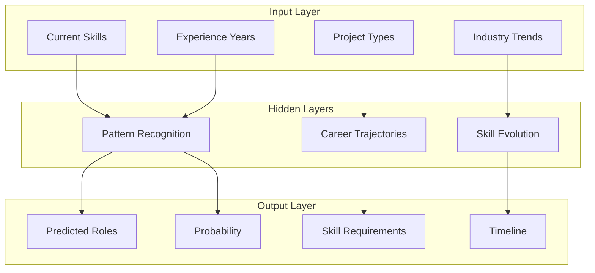

# Experimental & Cutting-Edge Portfolio Concepts

## Beyond Traditional - Pushing the Boundaries

These concepts explore the bleeding edge of web technology and creative presentation. They're ambitious, technically challenging, and guaranteed to make an impression.

## 1. Neural Network Career Predictor

### Concept
Train a neural network on your career data and let visitors explore predicted future paths based on different decisions.



### Implementation
```javascript
class CareerNeuralNetwork {
    constructor() {
        // Use TensorFlow.js for in-browser ML
        this.model = tf.sequential({
            layers: [
                tf.layers.dense({ inputShape: [20], units: 64, activation: 'relu' }),
                tf.layers.dropout({ rate: 0.2 }),
                tf.layers.dense({ units: 32, activation: 'relu' }),
                tf.layers.dense({ units: 16, activation: 'relu' }),
                tf.layers.dense({ units: 4, activation: 'softmax' }) // 4 career paths
            ]
        });
        
        this.trainOnCareerData();
    }
    
    async predictFuture(currentState, decisions) {
        const input = this.encodeState(currentState, decisions);
        const prediction = await this.model.predict(input).data();
        
        return {
            paths: this.decodePrediction(prediction),
            confidence: Math.max(...prediction),
            visualization: this.generateVisualization(prediction)
        };
    }
    
    generateVisualization(prediction) {
        // Create 3D probability field
        const geometry = new THREE.BufferGeometry();
        const particles = 10000;
        const positions = new Float32Array(particles * 3);
        const colors = new Float32Array(particles * 3);
        
        for (let i = 0; i < particles; i++) {
            // Position particles based on prediction probability
            const pathIndex = this.sampleFromDistribution(prediction);
            const path = this.careerPaths[pathIndex];
            
            // Create probability cloud around predicted path
            positions[i * 3] = path.x + (Math.random() - 0.5) * 20;
            positions[i * 3 + 1] = path.y + (Math.random() - 0.5) * 20;
            positions[i * 3 + 2] = path.z + (Math.random() - 0.5) * 20;
            
            // Color based on confidence
            const confidence = prediction[pathIndex];
            colors[i * 3] = confidence;
            colors[i * 3 + 1] = 1 - confidence;
            colors[i * 3 + 2] = 0.5;
        }
        
        geometry.setAttribute('position', new THREE.BufferAttribute(positions, 3));
        geometry.setAttribute('color', new THREE.BufferAttribute(colors, 3));
        
        return new THREE.Points(geometry, this.predictionMaterial);
    }
}
```

## 2. Blockchain Career Verification

### Concept
Each achievement and position is a verified block in your personal career blockchain, creating an immutable, verifiable history.

```javascript
class CareerBlockchain {
    constructor() {
        this.chain = [this.createGenesisBlock()];
        this.difficulty = 4;
        this.pendingAchievements = [];
        this.miningReward = 100;
    }
    
    createBlock(achievement) {
        return {
            index: this.chain.length,
            timestamp: Date.now(),
            achievement: achievement,
            previousHash: this.getLatestBlock().hash,
            hash: '',
            nonce: 0,
            
            // Career-specific data
            skills: achievement.skills,
            impact: achievement.impact,
            verification: achievement.verification, // LinkedIn, GitHub, etc.
            
            // Visual representation
            visualData: {
                position: this.calculateBlockPosition(),
                size: achievement.impact * 10,
                connections: this.findRelatedBlocks(achievement)
            }
        };
    }
    
    visualizeBlockchain() {
        const chainMesh = new THREE.Group();
        
        this.chain.forEach((block, index) => {
            // Create block mesh
            const geometry = new THREE.BoxGeometry(
                block.visualData.size,
                block.visualData.size,
                block.visualData.size
            );
            
            const material = new THREE.ShaderMaterial({
                uniforms: {
                    blockData: { value: this.encodeBlockData(block) },
                    time: { value: 0 },
                    verified: { value: block.verified ? 1.0 : 0.0 }
                },
                vertexShader: `
                    varying vec3 vPosition;
                    void main() {
                        vPosition = position;
                        gl_Position = projectionMatrix * modelViewMatrix * vec4(position, 1.0);
                    }
                `,
                fragmentShader: `
                    uniform float time;
                    uniform float verified;
                    varying vec3 vPosition;
                    
                    void main() {
                        // Hash visualization
                        float hash = fract(sin(dot(vPosition, vec3(12.9898, 78.233, 54.321))) * 43758.5453);
                        
                        vec3 color = mix(
                            vec3(1.0, 0.0, 0.0), // Unverified
                            vec3(0.0, 1.0, 0.0), // Verified
                            verified
                        );
                        
                        // Data flow effect
                        float flow = sin(vPosition.y * 10.0 - time * 5.0) * 0.5 + 0.5;
                        color += vec3(0.0, flow * 0.2, flow * 0.5);
                        
                        gl_FragColor = vec4(color, 0.8);
                    }
                `,
                transparent: true
            });
            
            const blockMesh = new THREE.Mesh(geometry, material);
            blockMesh.position.copy(block.visualData.position);
            
            // Add connections to previous blocks
            if (index > 0) {
                const prevBlock = this.chain[index - 1];
                const connection = this.createConnection(
                    prevBlock.visualData.position,
                    block.visualData.position
                );
                chainMesh.add(connection);
            }
            
            chainMesh.add(blockMesh);
        });
        
        return chainMesh;
    }
}
```

## 3. AR Portfolio Integration

### Concept
Use WebXR to create an augmented reality experience where visitors can place your projects in their physical space.

```javascript
class ARPortfolio {
    constructor() {
        this.xr = null;
        this.session = null;
        this.projects = new Map();
    }
    
    async initAR() {
        if (!navigator.xr) {
            console.warn('WebXR not supported');
            return;
        }
        
        // Check for AR support
        const supported = await navigator.xr.isSessionSupported('immersive-ar');
        if (!supported) return;
        
        // Create AR session
        this.session = await navigator.xr.requestSession('immersive-ar', {
            requiredFeatures: ['hit-test', 'dom-overlay'],
            domOverlay: { root: document.getElementById('ar-overlay') }
        });
        
        // Setup AR scene
        this.setupARScene();
    }
    
    createProjectHologram(projectData) {
        const hologram = new THREE.Group();
        
        // Base platform
        const platform = new THREE.Mesh(
            new THREE.CylinderGeometry(2, 2, 0.1, 32),
            new THREE.MeshBasicMaterial({ 
                color: 0x00ffff,
                transparent: true,
                opacity: 0.5
            })
        );
        
        // Holographic display
        const displayGeometry = new THREE.PlaneGeometry(3, 2);
        const displayMaterial = new THREE.ShaderMaterial({
            uniforms: {
                time: { value: 0 },
                projectData: { value: this.encodeProjectData(projectData) }
            },
            vertexShader: `
                varying vec2 vUv;
                void main() {
                    vUv = uv;
                    gl_Position = projectionMatrix * modelViewMatrix * vec4(position, 1.0);
                }
            `,
            fragmentShader: `
                uniform float time;
                varying vec2 vUv;
                
                void main() {
                    // Holographic scanlines
                    float scanline = sin(vUv.y * 100.0 + time * 10.0) * 0.04;
                    
                    // Glitch effect
                    float glitch = step(0.99, sin(time * 20.0)) * 0.2;
                    
                    vec3 color = vec3(0.0, 1.0, 1.0);
                    color.r += glitch;
                    
                    // Transparency with scanlines
                    float alpha = 0.8 + scanline;
                    
                    gl_FragColor = vec4(color, alpha);
                }
            `,
            transparent: true,
            side: THREE.DoubleSide
        });
        
        const display = new THREE.Mesh(displayGeometry, displayMaterial);
        display.position.y = 2;
        
        // Particle effects around hologram
        const particles = this.createHologramParticles(projectData);
        
        hologram.add(platform);
        hologram.add(display);
        hologram.add(particles);
        
        // Add interactivity
        hologram.userData = {
            project: projectData,
            interactive: true,
            onTap: () => this.showProjectDetails(projectData)
        };
        
        return hologram;
    }
}
```

## 4. Procedural Career Dungeon

### Concept
Generate a dungeon where each room represents a job/project, with challenges and treasures representing skills gained.

```javascript
class CareerDungeon {
    constructor(careerData) {
        this.rooms = new Map();
        this.connections = [];
        this.currentRoom = null;
        
        this.generateDungeon(careerData);
    }
    
    generateDungeon(careerData) {
        // Create rooms for each position
        careerData.positions.forEach((position, index) => {
            const room = this.generateRoom(position);
            this.rooms.set(position.id, room);
            
            // Connect to previous position
            if (index > 0) {
                const prevPosition = careerData.positions[index - 1];
                this.createCorridor(prevPosition.id, position.id);
            }
        });
        
        // Add skill chambers
        careerData.skills.forEach(skill => {
            const chamber = this.generateSkillChamber(skill);
            // Connect to relevant positions
            skill.usedIn.forEach(positionId => {
                this.createSecretPassage(positionId, chamber.id);
            });
        });
    }
    
    generateRoom(position) {
        const room = {
            id: position.id,
            type: 'career',
            size: position.impact * 20,
            
            // Procedural room layout
            layout: this.generateLayout(position),
            
            // Challenges (problems solved)
            challenges: position.achievements.map(a => ({
                type: 'puzzle',
                difficulty: a.complexity,
                reward: a.skillsGained
            })),
            
            // Treasures (skills/experience gained)
            treasures: position.skillsGained.map(s => ({
                type: 'skill',
                name: s.name,
                level: s.level
            })),
            
            // Boss (major project/challenge)
            boss: position.majorProject ? {
                name: position.majorProject.name,
                health: position.majorProject.complexity * 100,
                attacks: position.majorProject.challenges,
                defeat: position.majorProject.outcome
            } : null
        };
        
        // Generate 3D room
        room.mesh = this.create3DRoom(room);
        
        return room;
    }
    
    create3DRoom(roomData) {
        const roomGroup = new THREE.Group();
        
        // Procedural room generation
        const wallMaterial = new THREE.ShaderMaterial({
            uniforms: {
                time: { value: 0 },
                roomType: { value: this.getRoomTypeId(roomData.type) }
            },
            vertexShader: `
                varying vec2 vUv;
                varying vec3 vPosition;
                
                void main() {
                    vUv = uv;
                    vPosition = position;
                    gl_Position = projectionMatrix * modelViewMatrix * vec4(position, 1.0);
                }
            `,
            fragmentShader: `
                uniform float time;
                uniform float roomType;
                varying vec2 vUv;
                varying vec3 vPosition;
                
                void main() {
                    // Procedural wall texture
                    float pattern = sin(vPosition.x * 10.0) * sin(vPosition.y * 10.0);
                    
                    // Room type determines color scheme
                    vec3 color = mix(
                        vec3(0.2, 0.2, 0.3), // Default
                        vec3(0.3, 0.2, 0.1), // Boss room
                        step(0.5, roomType)
                    );
                    
                    // Glowing runes
                    float rune = step(0.9, sin(vUv.x * 50.0) * sin(vUv.y * 50.0 + time));
                    color += vec3(0.0, rune, rune * 0.5);
                    
                    gl_FragColor = vec4(color, 1.0);
                }
            `
        });
        
        // Create walls, floor, ceiling
        const roomSize = roomData.size;
        const walls = this.createWalls(roomSize, wallMaterial);
        roomGroup.add(walls);
        
        // Add interactive elements
        roomData.challenges.forEach(challenge => {
            const puzzleElement = this.createPuzzle(challenge);
            roomGroup.add(puzzleElement);
        });
        
        roomData.treasures.forEach(treasure => {
            const chest = this.createTreasureChest(treasure);
            roomGroup.add(chest);
        });
        
        if (roomData.boss) {
            const bossModel = this.createBoss(roomData.boss);
            roomGroup.add(bossModel);
        }
        
        return roomGroup;
    }
}
```

## 5. Generative Music Resume

### Concept
Your career data generates a unique musical composition. Each skill, project, and achievement adds to the symphony.

```javascript
class CareerSymphony {
    constructor(careerData) {
        this.audioContext = new (window.AudioContext || window.webkitAudioContext)();
        this.instruments = new Map();
        this.timeline = [];
        
        this.generateComposition(careerData);
    }
    
    generateComposition(careerData) {
        // Map career elements to musical elements
        const composition = {
            tempo: 60 + careerData.years * 5, // Experience increases tempo
            key: this.determineKey(careerData.primarySkill),
            
            tracks: [
                this.generateBassline(careerData.positions), // Career progression
                this.generateMelody(careerData.projects),    // Project achievements
                this.generateHarmony(careerData.skills),     // Skill harmony
                this.generatePercussion(careerData.pace)      // Work pace/intensity
            ]
        };
        
        return composition;
    }
    
    createSkillSynthesizer(skill) {
        const synth = {
            oscillator: this.audioContext.createOscillator(),
            filter: this.audioContext.createBiquadFilter(),
            envelope: this.audioContext.createGain(),
            
            // Skill properties affect sound
            frequency: this.mapSkillToFrequency(skill),
            waveform: this.mapSkillToWaveform(skill),
            filterFreq: skill.level * 2000 + 500
        };
        
        // Configure synthesizer
        synth.oscillator.type = synth.waveform;
        synth.oscillator.frequency.value = synth.frequency;
        synth.filter.frequency.value = synth.filterFreq;
        synth.filter.Q.value = skill.depth * 10;
        
        // Connect audio graph
        synth.oscillator.connect(synth.filter);
        synth.filter.connect(synth.envelope);
        synth.envelope.connect(this.audioContext.destination);
        
        return synth;
    }
    
    visualizeSymphony() {
        const visualizer = new THREE.Group();
        
        // Create frequency analyzer
        const analyser = this.audioContext.createAnalyser();
        analyser.fftSize = 256;
        const bufferLength = analyser.frequencyBinCount;
        const dataArray = new Uint8Array(bufferLength);
        
        // 3D visualization geometry
        const geometry = new THREE.BufferGeometry();
        const material = new THREE.ShaderMaterial({
            uniforms: {
                audioData: { value: dataArray },
                time: { value: 0 }
            },
            vertexShader: `
                attribute float frequency;
                varying float vFrequency;
                uniform float audioData[128];
                
                void main() {
                    vFrequency = frequency;
                    vec3 pos = position;
                    
                    // Displace based on audio
                    int index = int(frequency * 128.0);
                    float amplitude = audioData[index] / 255.0;
                    pos.y += amplitude * 10.0;
                    
                    gl_Position = projectionMatrix * modelViewMatrix * vec4(pos, 1.0);
                    gl_PointSize = amplitude * 10.0 + 2.0;
                }
            `,
            fragmentShader: `
                varying float vFrequency;
                
                void main() {
                    vec3 color = vec3(vFrequency, 1.0 - vFrequency, 0.5);
                    
                    // Circular point
                    vec2 coord = gl_PointCoord - vec2(0.5);
                    if (length(coord) > 0.5) discard;
                    
                    gl_FragColor = vec4(color, 1.0);
                }
            `,
            blending: THREE.AdditiveBlending
        });
        
        const points = new THREE.Points(geometry, material);
        visualizer.add(points);
        
        // Update loop
        const updateVisualization = () => {
            analyser.getByteFrequencyData(dataArray);
            material.uniforms.audioData.value = dataArray;
            material.uniforms.time.value = this.audioContext.currentTime;
            
            requestAnimationFrame(updateVisualization);
        };
        
        updateVisualization();
        
        return visualizer;
    }
}
```

## 6. Quantum Resume Superposition

### Concept
Your resume exists in quantum superposition until observed. Different observation methods collapse it into different states.

```javascript
class QuantumResume {
    constructor(resumeData) {
        this.superposition = this.createSuperposition(resumeData);
        this.observationMethods = new Map();
        this.collapsed = false;
        
        this.initializeObservationMethods();
    }
    
    createSuperposition(data) {
        // All possible states of the resume
        return {
            formats: ['traditional', 'creative', 'technical', 'executive'],
            languages: ['english', 'japanese', 'spanish', 'emoji'],
            perspectives: ['achievements', 'growth', 'impact', 'potential'],
            timelines: ['chronological', 'reverse', 'grouped', 'quantum'],
            
            // Quantum state vector
            stateVector: new ComplexVector(16), // 4x4 possibilities
            
            // Measurement operators
            operators: {
                technical: this.createTechnicalOperator(),
                creative: this.createCreativeOperator(),
                leadership: this.createLeadershipOperator()
            }
        };
    }
    
    observe(method = 'default') {
        if (this.collapsed) {
            // Already collapsed, show uncertainty principle
            this.showUncertainty();
            return;
        }
        
        // Collapse wave function
        const result = this.collapse(method);
        
        // Visualize collapse
        this.visualizeCollapse(result);
        
        // Generate appropriate resume view
        return this.generateResumeView(result);
    }
    
    visualizeCollapse(result) {
        // Particle system showing wave function collapse
        const particles = 10000;
        const geometry = new THREE.BufferGeometry();
        
        const positions = new Float32Array(particles * 3);
        const colors = new Float32Array(particles * 3);
        const phases = new Float32Array(particles);
        
        // Initial superposition state
        for (let i = 0; i < particles; i++) {
            // Distributed across all possible states
            const stateIndex = Math.floor(Math.random() * 16);
            const state = this.getStatePosition(stateIndex);
            
            positions[i * 3] = state.x + (Math.random() - 0.5) * 10;
            positions[i * 3 + 1] = state.y + (Math.random() - 0.5) * 10;
            positions[i * 3 + 2] = state.z + (Math.random() - 0.5) * 10;
            
            phases[i] = Math.random() * Math.PI * 2;
        }
        
        geometry.setAttribute('position', new THREE.BufferAttribute(positions, 3));
        geometry.setAttribute('color', new THREE.BufferAttribute(colors, 3));
        geometry.setAttribute('phase', new THREE.BufferAttribute(phases, 1));
        
        const material = new THREE.ShaderMaterial({
            uniforms: {
                time: { value: 0 },
                collapseTarget: { value: result.position },
                collapseProgress: { value: 0 }
            },
            vertexShader: `
                attribute float phase;
                uniform vec3 collapseTarget;
                uniform float collapseProgress;
                uniform float time;
                
                varying vec3 vColor;
                
                void main() {
                    vec3 pos = position;
                    
                    // Wave function oscillation
                    pos += sin(phase + time) * (1.0 - collapseProgress) * 2.0;
                    
                    // Collapse to target
                    pos = mix(pos, collapseTarget, collapseProgress);
                    
                    // Color based on probability amplitude
                    float amplitude = 1.0 - length(pos - collapseTarget) / 100.0;
                    vColor = vec3(amplitude, 1.0 - amplitude, 0.5);
                    
                    gl_Position = projectionMatrix * modelViewMatrix * vec4(pos, 1.0);
                    gl_PointSize = (1.0 - collapseProgress) * 5.0 + 2.0;
                }
            `,
            fragmentShader: `
                varying vec3 vColor;
                
                void main() {
                    vec2 coord = gl_PointCoord - vec2(0.5);
                    if (length(coord) > 0.5) discard;
                    
                    gl_FragColor = vec4(vColor, 1.0);
                }
            `,
            blending: THREE.AdditiveBlending,
            transparent: true
        });
        
        const points = new THREE.Points(geometry, material);
        
        // Animate collapse
        const animateCollapse = () => {
            material.uniforms.collapseProgress.value = 
                Math.min(1, material.uniforms.collapseProgress.value + 0.02);
            material.uniforms.time.value += 0.016;
            
            if (material.uniforms.collapseProgress.value < 1) {
                requestAnimationFrame(animateCollapse);
            }
        };
        
        animateCollapse();
        
        return points;
    }
}
```

## Performance & Implementation Notes

### WebGPU Compute Shaders
For maximum performance, use WebGPU when available:

```javascript
class WebGPUPhysics {
    async init() {
        if (!navigator.gpu) {
            console.warn('WebGPU not supported');
            return false;
        }
        
        const adapter = await navigator.gpu.requestAdapter();
        this.device = await adapter.requestDevice();
        
        // Create compute pipeline for physics
        this.computePipeline = this.device.createComputePipeline({
            compute: {
                module: this.device.createShaderModule({
                    code: `
                        @group(0) @binding(0) var<storage, read_write> positions : array<vec3<f32>>;
                        @group(0) @binding(1) var<storage, read_write> velocities : array<vec3<f32>>;
                        
                        @compute @workgroup_size(64)
                        fn main(@builtin(global_invocation_id) id : vec3<u32>) {
                            let i = id.x;
                            
                            // Physics computation
                            var force = vec3<f32>(0.0, -9.8, 0.0); // Gravity
                            
                            // Update velocity
                            velocities[i] += force * 0.016;
                            
                            // Update position
                            positions[i] += velocities[i] * 0.016;
                        }
                    `
                }),
                entryPoint: 'main'
            }
        });
        
        return true;
    }
}
```

### Progressive Web App Features
Make it installable and offline-capable:

```javascript
// Service Worker for offline portfolio
self.addEventListener('install', event => {
    event.waitUntil(
        caches.open('portfolio-v1').then(cache => {
            return cache.addAll([
                '/',
                '/main.js',
                '/physics-worker.js',
                '/assets/models/',
                '/assets/textures/'
            ]);
        })
    );
});

self.addEventListener('fetch', event => {
    event.respondWith(
        caches.match(event.request).then(response => {
            return response || fetch(event.request);
        })
    );
});
```

## The Ultimate Portfolio

Combine all concepts into a meta-experience:
1. Start with quantum superposition splash screen
2. Collapse into orbital career system
3. Navigate between star systems with spaceship
4. Dive into particle ecosystems for skill details
5. Explore alternate timelines at decision points
6. Generate music from career data
7. Place projects in AR space
8. Verify achievements on blockchain
9. Predict future with neural networks
10. Leave legacy in the multiverse

The only limit is imagination (and browser performance)!