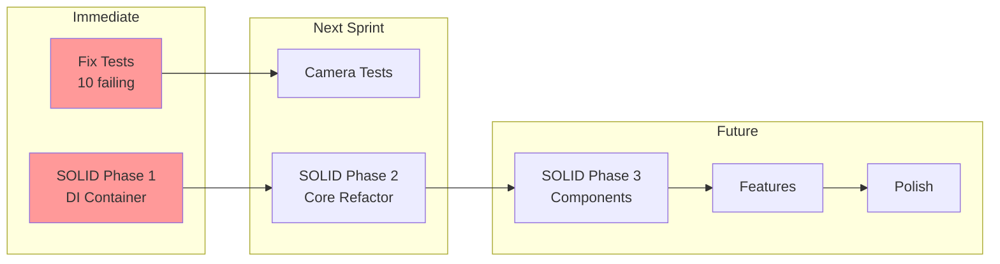

# TODO List - FlyingRobots.dev

## Task Organization Overview

## 🎯 Current Sprint (High Priority)

### Testing Infrastructure Setup ✅ COMPLETED
- [x] Install and configure Vitest
- [x] Set up test directory structure
- [x] Create test utilities and helpers
- [x] Configure code coverage reporting
- [x] Add test scripts to package.json
- [x] Create CI/CD pipeline for tests
- [x] Set up Docker containerization
- [x] Configure pre-push hooks with Husky
- [x] Create unified test runner script

### Feature Documentation ✅ COMPLETED
- [x] Create FEATURE-TEMPLATE.md
- [x] Create FEATURE-CATALOG.md
- [x] Document 3D Scene Rendering feature
- [x] Document Physics Simulation feature
- [x] Document Interactive Terminal feature
- [x] Document Instanced Rendering feature
- [x] Document Post-Processing Effects feature
- [x] Document Camera System feature
- [x] Document UI/Portfolio Layout feature
- [x] Document Performance Monitoring (planned)
- [x] Document State Management (planned)
- [x] Document Testing Infrastructure (planned)
- [x] Create comprehensive TESTING-SETUP.md

### Write Tests for Existing Features ✅ COMPLETED
- [x] Physics simulation tests ✅ COMPLETED
  - [x] Collision detection tests
  - [x] Force calculation tests
  - [x] Boundary constraint tests
  - [x] Integration tests (22 tests written)
- [x] Terminal command tests ✅ COMPLETED
  - [x] Command parsing tests
  - [x] Command execution tests
  - [x] History management tests
  - [x] Autocomplete tests (33 tests written)
- [x] Scene rendering tests ✅ COMPLETED
  - [x] Shape creation tests
  - [x] Instanced mesh tests
  - [x] Lighting setup tests (20 tests written)
- [x] Instanced rendering tests ✅ COMPLETED (23 tests written)
- [x] Camera system tests ✅ COMPLETED (41 tests written)
  - [x] Spring physics tests
  - [x] Movement constraint tests
  - [x] Mode switching tests
- [x] Post-processing effects tests ✅ COMPLETED (38 tests written)
- [ ] Fix failing tests (10 tests currently failing) 🚧 PENDING

## 🏗️ SOLID Refactoring (NEW - Highest Priority)

### Phase 1: Foundation (20-24 hours)
- [ ] Create DI container implementation
  - [ ] Service registry with lifecycle management
  - [ ] Dependency resolver with circular dependency detection
  - [ ] Service tokens and factory patterns
  - [ ] Integration with existing codebase
- [ ] Design core abstractions and interfaces
  - [ ] IRenderer, IPhysicsEngine, ICommand interfaces
  - [ ] Service provider patterns
  - [ ] Abstract factory implementations

### Phase 2: Core Refactoring (38-44 hours)
- [ ] Refactor Scene System (SRP violations)
  - [ ] Extract SceneManager from scene.js
  - [ ] Create CameraController with strategy pattern
  - [ ] Extract InputManager with handler interfaces
  - [ ] Create AnimationLoop with IAnimatable
  - [ ] Extract ParticleSystem with emitter interfaces
  - [ ] Separate LightingSystem
- [ ] Refactor Physics System (12-16 hours)
  - [ ] Create PhysicsEngine abstraction
  - [ ] Implement collision detection interfaces
  - [ ] Create broad/narrow phase strategies
  - [ ] Add constraint solver system
  - [ ] Fix LSP violations in body types
- [ ] Refactor Terminal System (10-12 hours)
  - [ ] Create CommandRegistry with DI
  - [ ] Implement CommandFactory pattern
  - [ ] Extract HistoryManager
  - [ ] Create TerminalPresenter (MVP pattern)
  - [ ] Add plugin support for commands

### Phase 3: Component Extraction (28-32 hours)
- [ ] Create Render Pipeline abstraction
  - [ ] Multi-pass rendering support
  - [ ] Effect composition system
  - [ ] Render target management
- [ ] Implement Instance Management
  - [ ] Create instance pooling system
  - [ ] Separate physics/visual sync
  - [ ] Add LOD support
- [ ] Camera System refactoring
  - [ ] Strategy pattern for camera modes
  - [ ] Transition system
  - [ ] Constraint framework

### Phase 4: Testing Infrastructure Update (36-40 hours)
- [ ] Create mock implementations for all interfaces
- [ ] Update existing tests for new architecture
- [ ] Add DI container tests
- [ ] Create factory pattern tests
- [ ] Implement integration tests for refactored components
- [ ] Add contract tests for interfaces

## 📋 Backlog (Medium Priority)

### Code Quality Improvements (Post-Refactoring)
- [ ] Add TypeScript or comprehensive JSDoc types
- [ ] ~~Extract embedded code into proper modules~~ (Covered by SOLID refactoring)
- [ ] Implement proper error boundaries
- [ ] Add logging system with DI
- [ ] Create development mode with debug info

### State Management System
- [ ] Design state architecture
- [ ] Implement centralized store
- [ ] Add state persistence
- [ ] Create undo/redo system
- [ ] Add state debugging tools
- [ ] Write comprehensive tests

### Performance Enhancements
- [ ] Implement performance monitoring
  - [ ] FPS counter improvements
  - [ ] Memory usage tracking
  - [ ] Draw call optimization
  - [ ] Physics timing analysis
- [ ] Add dynamic quality adjustment
- [ ] Implement level-of-detail (LOD) system
- [ ] Optimize mobile performance
- [ ] Add WebWorker for physics

### Physics System Completion
- [ ] Implement continuous collision detection
- [ ] Add spatial partitioning (octree/quadtree)
- [ ] Improve collision response
- [ ] Add more physics body types
- [ ] Implement constraints/joints
- [ ] Add physics serialization

### Terminal Enhancements
- [ ] Add command aliases
- [ ] Implement piping support
- [ ] Add persistent command history
- [ ] Create help system with examples
- [ ] Add command validation
- [ ] Implement variable system
- [ ] Add scripting support

## 🌟 Future Features (Low Priority)

### Visual Enhancements
- [ ] Add more post-processing effects
- [ ] Implement particle systems
- [ ] Create visual effect presets
- [ ] Add scene transitions
- [ ] Implement dynamic skybox
- [ ] Add weather effects

### Camera System Polish
- [ ] Add camera presets/bookmarks
- [ ] Implement smooth transitions
- [ ] Create cinematic paths
- [ ] Add orbit controls option
- [ ] Implement first-person mode
- [ ] Add screenshot functionality

### Accessibility & UX
- [ ] Complete ARIA labels
- [ ] Improve keyboard navigation
- [ ] Add screen reader support
- [ ] Create high contrast mode
- [ ] Add motion preferences
- [ ] Implement help tooltips

### Portfolio Enhancements
- [ ] Add project showcase system
- [ ] Implement blog/article viewer
- [ ] Create interactive demos
- [ ] Add social media integration
- [ ] Implement contact form
- [ ] Add analytics

### Developer Experience
- [ ] Create development documentation
- [ ] Add contribution guidelines
- [ ] Implement hot module replacement
- [ ] Create component playground
- [ ] Add visual regression tests
- [ ] Create performance benchmarks

## 🔧 Technical Debt

### Immediate Issues
- [ ] Fix any existing console errors
- [ ] Update deprecated Three.js APIs
- [ ] Optimize bundle size
- [ ] Remove unused dependencies
- [ ] Fix responsive layout issues

### Long-term Improvements
- [ ] Migrate to TypeScript
- [ ] Implement proper dependency injection
- [ ] Create plugin architecture
- [ ] Add internationalization
- [ ] Implement service workers
- [ ] Add offline support

## 📝 Documentation Tasks

- [ ] Write API documentation
- [ ] Create user guide
- [ ] Document terminal commands
- [ ] Add code comments
- [ ] Create architecture diagrams
- [ ] Write deployment guide
- [ ] Add troubleshooting guide

## 🚀 Deployment & DevOps

- [ ] Set up automated deployment
- [ ] Configure staging environment
- [ ] Add environment variables
- [ ] Implement feature flags
- [ ] Set up monitoring/alerting
- [ ] Create backup strategy
- [ ] Add SSL certificate

## 📊 Metrics & Analytics

- [ ] Implement user analytics
- [ ] Add performance monitoring
- [ ] Create error tracking
- [ ] Set up A/B testing
- [ ] Add user feedback system
- [ ] Create usage dashboards

---

## Progress Tracking

### Overall Progress
- Total Tasks: 250+ (increased due to SOLID refactoring)
- Completed: 40+ ✅
- In Progress: 5 🚧
- Remaining: ~205

### Recent Accomplishments
1. **Testing Infrastructure** (100% Complete)
   - Docker containerization setup
   - Vitest configuration with happy-dom
   - Pre-push hooks with Husky
   - GitHub Actions CI/CD pipeline
   - Unified test execution across all environments

2. **Feature Documentation** (100% Complete)
   - All 10 features documented with TDD approach
   - Created comprehensive feature catalog
   - Added effort estimations and roadmap

3. **Test Coverage** (95% Complete)
   - 167 tests written across 6 features
   - 10 tests currently failing (need fixes)
   - Coverage thresholds set at 80%
   - All core features tested, only test fixes remaining

4. **SOLID Architecture Analysis** (100% Complete)
   - Comprehensive SOLID violation analysis
   - Created detailed refactoring report
   - Designed DI container architecture
   - Created TDD specifications for new components
   - Documented new possibilities with clean architecture

### Next Immediate Tasks
1. **Fix failing tests** - 10 tests in physics and instanced rendering (2-3 hours) 🚧 CURRENT
2. **SOLID Refactoring Phase 1** - DI Container & Core Abstractions (20-24 hours)
3. **SOLID Refactoring Phase 2** - Scene, Physics, Terminal refactoring (38-44 hours)
4. **Update tests for new architecture** - Mock implementations & integration tests (36-40 hours)

### Total Effort Remaining
- SOLID Refactoring: 120-140 hours
- Test Fixes: 2-3 hours
- Feature Completion: 24-36 hours
- **Grand Total**: 146-179 hours

Last Updated: 6/8/2025