# ADR-001: Hybrid SOLID+ECS Architecture

## Status
Proposed

## Context

FlyingRobots.dev currently has a monolithic architecture with significant SOLID principle violations:
- `scene.js` handles 15+ responsibilities (749 lines)
- Direct instantiation creates tight coupling
- No dependency injection or abstractions
- Difficult to test and extend

We need to refactor the architecture to demonstrate professional software engineering skills while keeping the project maintainable and focused as a portfolio piece.

## Decision Drivers

1. **Portfolio Value**: Must showcase advanced architectural skills
2. **Maintainability**: Code should be easy to understand and modify
3. **Performance**: Must maintain 60 FPS with hundreds of shapes
4. **Scope**: This is a portfolio site, not a game engine
5. **Time**: Limited development time available
6. **Learning Curve**: Others should be able to understand the code

## Considered Options

### Option 1: Pure SOLID Refactoring

```mermaid
graph TD
    subgraph "Pure SOLID"
        A[DI Container] --> B[Services]
        B --> C[Interfaces]
        C --> D[Implementations]
    end
    
    Pros[✓ Familiar patterns<br/>✓ Incremental refactoring<br/>✓ Easy to understand]
    Cons[✗ Manual entity management<br/>✗ Less scalable<br/>✗ Performance ceiling]
```


### Option 2: Pure ECS (Like Caverns)

```mermaid
graph TD
    subgraph "Pure ECS"
        A[World] --> B[Entities]
        A --> C[Components]
        A --> D[Systems]
        D --> E[Node Lists]
    end
    
    Pros[✓ Highly scalable<br/>✓ Great performance<br/>✓ Maximum flexibility]
    Cons[✗ Complete rewrite<br/>✗ Steep learning curve<br/>✗ Overkill for scope]
```


### Option 3: Hybrid SOLID+ECS

```mermaid
graph TD
    subgraph "Hybrid Architecture"
        A[DI Container<br/>SOLID] --> B[Core Services]
        A --> C[Entity Manager<br/>ECS-lite]
        C --> D[Components]
        C --> E[Systems]
        B --> E
    end
    
    Pros[✓ Best of both<br/>✓ Incremental migration<br/>✓ Scalable where needed]
    Cons[✗ More complex<br/>✗ Two patterns to learn]
    
    style A fill:#99f
    style C fill:#9f9
```


## Decision

**We will implement Option 3: Hybrid SOLID+ECS Architecture**

### Rationale

1. **Demonstrates Advanced Skills**: Shows understanding of both OOP and data-oriented design
2. **Pragmatic Engineering**: Right tool for the right job, not dogmatic
3. **Incremental Path**: Can refactor gradually without breaking everything
4. **Future-Proof**: Can evolve to full ECS if needed
5. **Performance**: ECS for shapes provides efficient batch processing
6. **Maintainability**: SOLID for high-level architecture keeps it understandable

## Implementation Strategy

### Phase 1: SOLID Foundation
```typescript
// High-level architecture uses SOLID principles
const container = new DIContainer();
container.register(ISceneManager, SceneManager);
container.register(IPhysicsEngine, PhysicsEngine);
container.register(ITerminal, Terminal);
```

### Phase 2: ECS for Entities
```typescript
// Shapes use lightweight ECS
const entity = entityManager.createEntity([
    new TransformComponent(),
    new PhysicsComponent(),
    new RenderComponent()
]);

// Systems process entities efficiently
class PhysicsSystem extends System {
    processEntities(entities: IEntity[], dt: number) {
        // Batch process all physics entities
    }
}
```

### Phase 3: Integration
```typescript
// Services and systems work together
class SceneManager {
    constructor(
        private entityManager: EntityManager,
        private systems: System[]
    ) {}
    
    update(dt: number) {
        this.systems.forEach(s => s.update(dt));
    }
}
```

## Consequences

### Positive
- ✅ Showcases both architectural paradigms
- ✅ Allows incremental refactoring
- ✅ Optimizes performance where needed
- ✅ Maintains code clarity
- ✅ Enables plugin architecture
- ✅ Demonstrates architectural maturity

### Negative
- ❌ More complex than pure approaches
- ❌ Requires understanding both patterns
- ❌ Potential for confusion about when to use which
- ❌ Slightly longer initial development

### Neutral
- 🔄 Creates unique portfolio piece
- 🔄 Shows real-world decision making
- 🔄 Educational for other developers

## Migration Plan


## Validation

We will know this decision was correct when:
1. Code is easier to test (95%+ coverage)
2. New features can be added without modifying core
3. Performance remains at 60 FPS with 1000+ shapes
4. Other developers find the architecture impressive but understandable
5. The portfolio generates interview opportunities

## References

- [Caverns ECS Implementation](https://github.com/flyingrobots/caverns)
- [SOLID Principles](https://en.wikipedia.org/wiki/SOLID)
- [Entity Component System](https://en.wikipedia.org/wiki/Entity_component_system)
- [Dependency Injection](https://martinfowler.com/articles/injection.html)

## Notes

This decision represents a key architectural choice that will differentiate this portfolio from typical projects. By combining SOLID and ECS principles, we demonstrate sophisticated architectural thinking while maintaining pragmatic engineering practices.

---

*Decision made: 6/8/2025*  
*Author: AI Assistant (with human guidance)*  
*Status: Proposed - awaiting implementation*