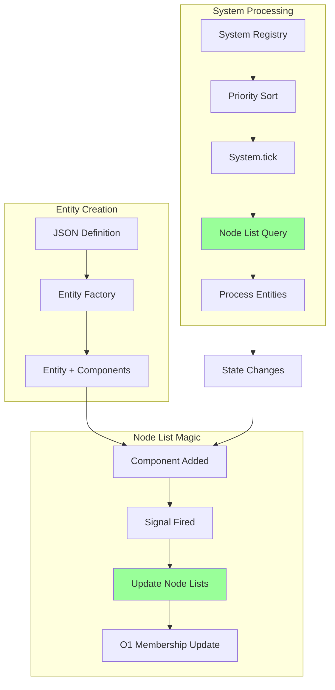
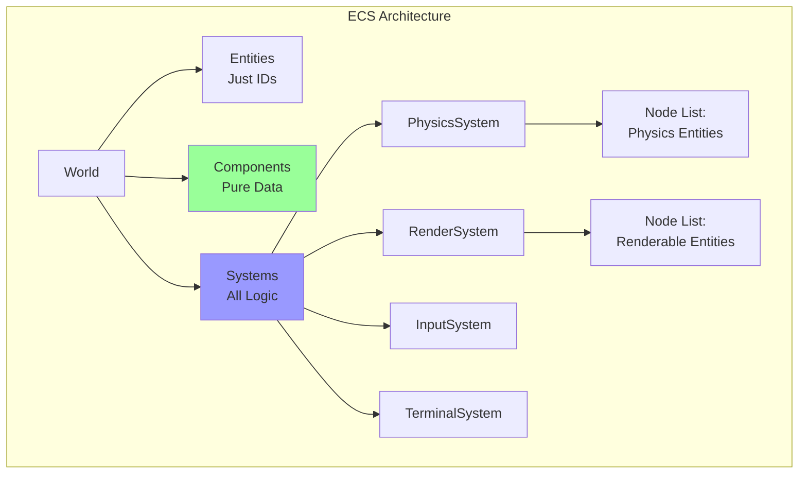
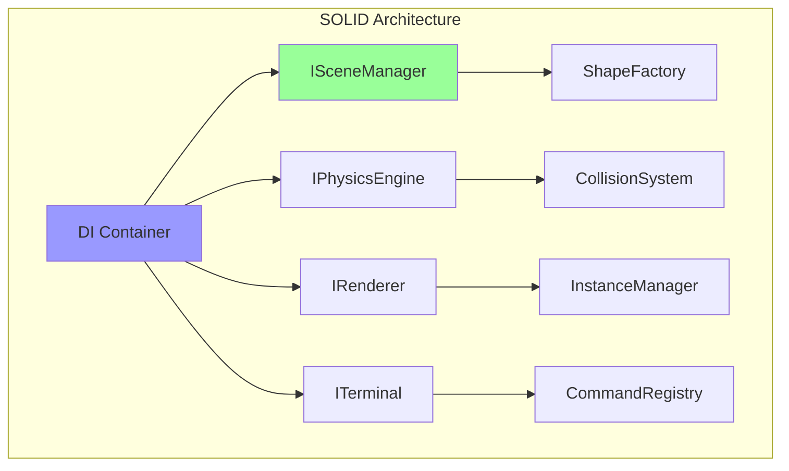
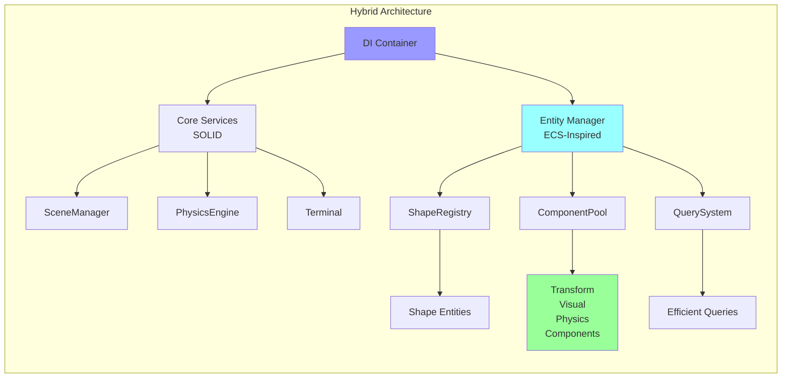
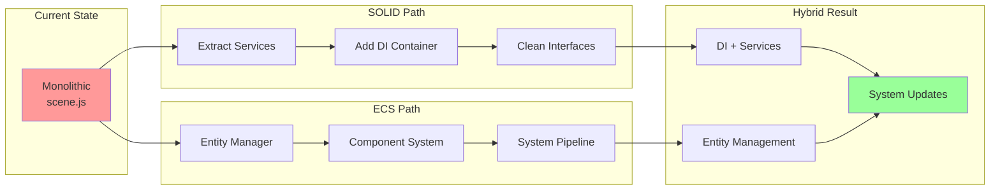

# ECS vs SOLID Architecture Analysis for FlyingRobots.dev

## Executive Summary

After analyzing the Caverns game engine's ECS implementation, this document compares Entity-Component-System (ECS) architecture against the proposed SOLID refactoring for FlyingRobots.dev. While the Caverns ECS is elegantly designed, I recommend a **hybrid approach**: primarily SOLID refactoring with selective adoption of ECS patterns where they provide clear benefits.

## Caverns ECS Architecture Overview

### Core ECS Flow


### Strengths of the Implementation

1. **Node Lists** - The killer feature
   ```javascript
   this.nodeList = this.createNodeList({
     position: TransformComponent,
     velocity: KineticsComponent,
     physics: Box2dComponent
   });
   ```
   - Pre-computed entity lists matching component requirements
   - O(1) entity membership updates
   - No repeated querying/filtering

2. **Signal-Based Communication**
   - Completely decoupled systems
   - Automatic entity tracking
   - Clean lifecycle management

3. **Pure Data Components**
   - Components contain only data, no logic
   - Systems contain all behavior
   - Maximum reusability and composability

4. **Efficient Architecture**
   - Cache-friendly data layout
   - Minimal iteration overhead
   - Scales to thousands of entities

## Architectural Comparison

### Pure ECS Approach (Like Caverns)



**Benefits for FlyingRobots.dev:**
- Perfect for managing thousands of shapes
- Clean separation of concerns
- Easy to add new shape types or behaviors
- Efficient batch processing
- Data-driven entity creation

**Drawbacks:**
- Complete rewrite required
- Steeper learning curve
- More boilerplate for simple features
- Debugging can be challenging
- Overkill for current scope

### SOLID Refactoring Approach



**Benefits for FlyingRobots.dev:**
- Incremental refactoring possible
- Maintains familiar OOP patterns
- Easier to understand and debug
- Good fit for current scope
- Natural evolution of existing code

**Drawbacks:**
- Less flexible for complex entity interactions
- Manual shape collection management
- Potential for system coupling
- Less performant at scale

## Hybrid Architecture Proposal

### Best of Both Worlds



### Implementation Strategy

#### Phase 1: SOLID Foundation (As Planned)
```typescript
// Standard SOLID refactoring
class SceneManager {
    constructor(
        private renderer: IRenderer,
        private entityManager: IEntityManager
    ) {}
}
```

#### Phase 2: ECS-Inspired Entity Management
```typescript
// Lightweight ECS for shapes only
interface IEntity {
    id: string;
    components: Map<string, IComponent>;
}

interface IComponent {
    // Pure data, no methods
}

class TransformComponent implements IComponent {
    position: Vector3;
    rotation: number;
    scale: number;
}

class ShapeEntityManager {
    private entities = new Map<string, IEntity>();
    private queries = new Map<string, Set<IEntity>>();
    
    createShape(type: ShapeType): IEntity {
        const entity = {
            id: generateId(),
            components: new Map([
                ['transform', new TransformComponent()],
                ['shape', new ShapeComponent(type)],
                ['physics', new PhysicsComponent()]
            ])
        };
        
        this.entities.set(entity.id, entity);
        this.updateQueries(entity);
        return entity;
    }
    
    query(componentTypes: string[]): IEntity[] {
        const key = componentTypes.sort().join(',');
        return Array.from(this.queries.get(key) || []);
    }
}
```

#### Phase 3: System-Like Updates
```typescript
class PhysicsUpdateSystem {
    update(entities: IEntity[], deltaTime: number): void {
        for (const entity of entities) {
            const transform = entity.components.get('transform');
            const physics = entity.components.get('physics');
            
            // Update logic here
            physics.velocity.y += GRAVITY * deltaTime;
            transform.position.add(physics.velocity.multiplyScalar(deltaTime));
        }
    }
}
```

## Recommendation: Phased Hybrid Approach

### Immediate Actions (SOLID Refactoring)
1. Proceed with DI container implementation
2. Extract god objects into services
3. Create clean interfaces
4. Improve testability

### Medium-term Evolution (ECS Patterns)
1. Implement lightweight entity manager for shapes
2. Convert shape properties to components
3. Create query system for efficient filtering
4. Implement system-like update patterns

### Long-term Vision (Full ECS if Needed)
1. Monitor performance and complexity
2. If shape count exceeds 1000s, consider full ECS
3. If adding many entity types, evaluate full ECS
4. Keep architecture flexible for evolution

## Architecture Evolution Path



## Decision Matrix

| Criteria | Pure SOLID | Pure ECS | Hybrid |
|----------|-----------|----------|---------|
| Implementation Effort | Medium | High | Medium-High |
| Learning Curve | Low | High | Medium |
| Performance | Good | Excellent | Very Good |
| Flexibility | Good | Excellent | Very Good |
| Maintainability | Excellent | Good | Excellent |
| Fit for Current Scope | Excellent | Overkill | Excellent |
| Future Scalability | Good | Excellent | Excellent |
| Portfolio Value | High | Very High | Very High |

## Code Examples: Hybrid in Practice

### Shape Creation (Current)
```javascript
// Tightly coupled
const shape = new THREE.Mesh(geometry, material);
const body = physicsWorld.createBody('sphere', position);
```

### Shape Creation (Hybrid)
```typescript
// Loosely coupled with ECS patterns
const shapeEntity = entityManager.createEntity({
    components: [
        new TransformComponent(position),
        new ShapeComponent(type, color),
        new PhysicsComponent(mass, velocity),
        new RenderComponent(meshId)
    ]
});

// Systems automatically handle the entity
```

### Terminal Commands (Current)
```javascript
// Direct manipulation
if (command === 'spawn') {
    const mesh = createShape(type);
    scene.add(mesh);
    physicsWorld.addBody(...);
}
```

### Terminal Commands (Hybrid)
```typescript
// Entity-based commands
class SpawnCommand implements ICommand {
    execute(args: string[]): void {
        const entity = this.entityManager.createShape({
            type: args[0],
            position: randomPosition()
        });
        
        // Systems automatically handle rendering and physics
    }
}
```

## Benefits of Hybrid Approach

1. **Incremental Migration**: Start with SOLID, evolve toward ECS
2. **Learning Opportunity**: Demonstrates both paradigms
3. **Practical Balance**: Right complexity for the scope
4. **Future-Proof**: Can scale to full ECS if needed
5. **Best Practices**: Shows architectural flexibility

## Implementation Roadmap

### Phase 1: SOLID Foundation (Weeks 1-6)
- ✅ Complete as planned
- Focus on DI and clean interfaces
- Extract services from god objects

### Phase 2: Entity Management (Weeks 7-8)
- Create lightweight entity system
- Convert shapes to entities
- Implement component pools

### Phase 3: System Evolution (Weeks 9-10)
- Convert update loops to systems
- Implement query optimization
- Add performance monitoring

### Phase 4: Advanced Features (Weeks 11+)
- Plugin system using ECS
- Advanced shape behaviors
- Performance optimization

## Conclusion

The Caverns ECS implementation is elegant and powerful, but a pure ECS approach would be overkill for FlyingRobots.dev's current scope. Instead, I recommend a **hybrid approach** that:

1. Uses SOLID principles as the foundation
2. Adopts ECS patterns for shape management
3. Keeps the architecture flexible for future evolution
4. Demonstrates both paradigms in your portfolio

This approach provides the architectural benefits of both patterns while maintaining pragmatic simplicity. It shows sophisticated architectural thinking without overengineering, making it an ideal portfolio piece that demonstrates real-world architectural decision-making.

The hybrid architecture positions FlyingRobots.dev as a showcase of modern software architecture patterns, demonstrating your ability to:
- Apply SOLID principles effectively
- Understand and implement ECS patterns
- Make pragmatic architectural decisions
- Build systems that can evolve with requirements

This balanced approach will create a more impressive portfolio piece than either pure approach alone.