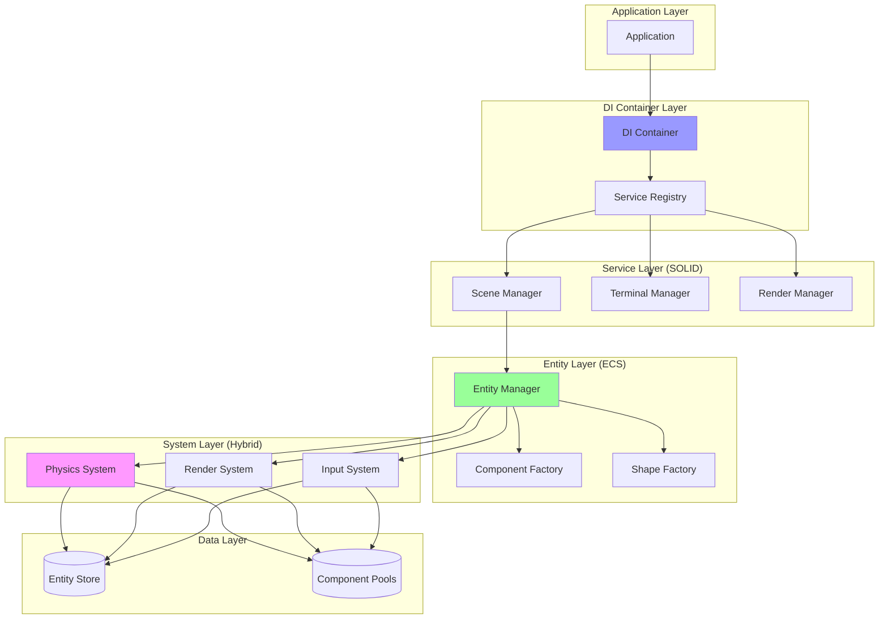
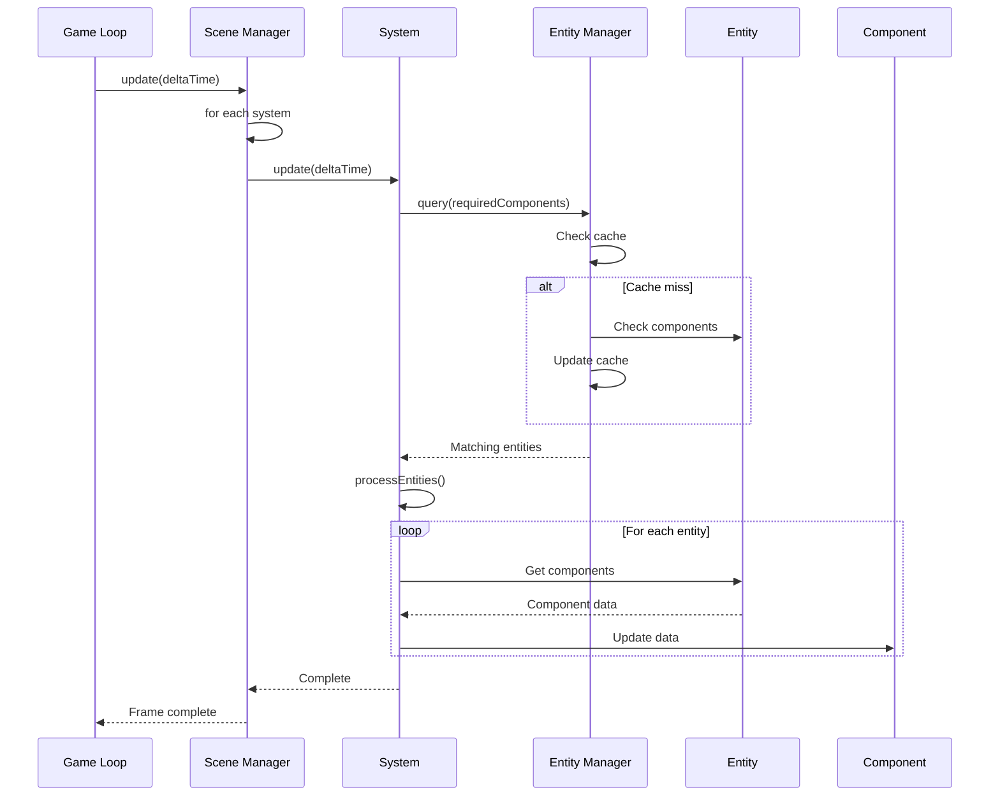

# Hybrid Architecture Implementation Guide

## Overview

This document provides concrete implementation details for the hybrid SOLID+ECS architecture, showing exactly how to transform FlyingRobots.dev's current code into a modern, flexible architecture that combines the best of both paradigms.

## Architecture Overview



## Core Architecture Components

### 1. Dependency Injection Container (SOLID)

```typescript
// src/core/DIContainer.ts
export class DIContainer {
    private services = new Map<symbol, ServiceDefinition>();
    private singletons = new Map<symbol, any>();
    
    register<T>(token: symbol, factory: Factory<T>, options?: ServiceOptions): void {
        this.services.set(token, { factory, options });
    }
    
    get<T>(token: symbol): T {
        const definition = this.services.get(token);
        if (!definition) throw new Error(`Service not registered: ${token.toString()}`);
        
        if (definition.options?.lifecycle === 'singleton') {
            if (!this.singletons.has(token)) {
                this.singletons.set(token, definition.factory(this));
            }
            return this.singletons.get(token);
        }
        
        return definition.factory(this);
    }
}

// Service tokens
export const Services = {
    SceneManager: Symbol('SceneManager'),
    EntityManager: Symbol('EntityManager'),
    PhysicsEngine: Symbol('PhysicsEngine'),
    RenderSystem: Symbol('RenderSystem'),
    Terminal: Symbol('Terminal')
};
```

### 2. Entity Manager (ECS-Inspired)

```typescript
// src/core/entities/EntityManager.ts
export interface IComponent {
    readonly type: string;
}

export interface IEntity {
    readonly id: string;
    readonly components: Map<string, IComponent>;
    active: boolean;
}

export class EntityManager {
    private entities = new Map<string, IEntity>();
    private componentPools = new Map<string, IComponent[]>();
    private queries = new Map<string, Set<IEntity>>();
    private nextId = 0;
    
    // Entity creation with component pooling
    createEntity(components: IComponent[] = []): IEntity {
        const entity: IEntity = {
            id: `entity_${this.nextId++}`,
            components: new Map(),
            active: true
        };
        
        for (const component of components) {
            this.addComponent(entity, component);
        }
        
        this.entities.set(entity.id, entity);
        this.updateQueries(entity);
        return entity;
    }
    
    // Efficient querying with caching
    query(...componentTypes: string[]): IEntity[] {
        const key = componentTypes.sort().join(',');
        
        if (!this.queries.has(key)) {
            const matchingEntities = new Set<IEntity>();
            
            for (const entity of this.entities.values()) {
                if (this.hasComponents(entity, componentTypes)) {
                    matchingEntities.add(entity);
                }
            }
            
            this.queries.set(key, matchingEntities);
        }
        
        return Array.from(this.queries.get(key)!).filter(e => e.active);
    }
    
    // Component management
    addComponent(entity: IEntity, component: IComponent): void {
        entity.components.set(component.type, component);
        this.invalidateQueries();
    }
    
    removeComponent(entity: IEntity, componentType: string): void {
        const component = entity.components.get(componentType);
        if (component) {
            entity.components.delete(componentType);
            this.returnToPool(component);
            this.invalidateQueries();
        }
    }
    
    // Component pooling for performance
    private getFromPool<T extends IComponent>(type: string, initializer: () => T): T {
        const pool = this.componentPools.get(type) || [];
        return (pool.pop() as T) || initializer();
    }
    
    private returnToPool(component: IComponent): void {
        const pool = this.componentPools.get(component.type) || [];
        pool.push(component);
        this.componentPools.set(component.type, pool);
    }
}
```

### 3. Component Definitions

```typescript
// src/core/components/Components.ts
import { Vector3, Color } from 'three';

export class TransformComponent implements IComponent {
    readonly type = 'transform';
    position = new Vector3();
    rotation = 0;
    scale = 1;
    
    reset(): void {
        this.position.set(0, 0, 0);
        this.rotation = 0;
        this.scale = 1;
    }
}

export class PhysicsComponent implements IComponent {
    readonly type = 'physics';
    velocity = new Vector3();
    mass = 1;
    restitution = 0.5;
    
    reset(): void {
        this.velocity.set(0, 0, 0);
        this.mass = 1;
        this.restitution = 0.5;
    }
}

export class ShapeComponent implements IComponent {
    readonly type = 'shape';
    shapeType: ShapeType = 'sphere';
    color = new Color(0xffffff);
    emissive = 0;
    
    reset(): void {
        this.shapeType = 'sphere';
        this.color.set(0xffffff);
        this.emissive = 0;
    }
}

export class RenderComponent implements IComponent {
    readonly type = 'render';
    instanceId = -1;
    meshType = '';
    visible = true;
    
    reset(): void {
        this.instanceId = -1;
        this.meshType = '';
        this.visible = true;
    }
}
```

### 4. System Base Class (Hybrid Approach)

```typescript
// src/core/systems/System.ts
export abstract class System {
    protected entityManager: EntityManager;
    protected requiredComponents: string[] = [];
    
    constructor(entityManager: EntityManager) {
        this.entityManager = entityManager;
    }
    
    update(deltaTime: number): void {
        const entities = this.entityManager.query(...this.requiredComponents);
        this.processEntities(entities, deltaTime);
    }
    
    protected abstract processEntities(entities: IEntity[], deltaTime: number): void;
}
```

### 5. Concrete Systems

#### System Execution Flow



```typescript
// src/systems/PhysicsSystem.ts
export class PhysicsSystem extends System {
    protected requiredComponents = ['transform', 'physics'];
    private gravity = new Vector3(0, -9.81, 0);
    private bounds = { min: -50, max: 50 };
    
    protected processEntities(entities: IEntity[], deltaTime: number): void {
        // Apply forces
        for (const entity of entities) {
            const physics = entity.components.get('physics') as PhysicsComponent;
            const transform = entity.components.get('transform') as TransformComponent;
            
            // Apply gravity
            physics.velocity.add(
                this.gravity.clone().multiplyScalar(deltaTime * physics.mass)
            );
            
            // Update position
            transform.position.add(
                physics.velocity.clone().multiplyScalar(deltaTime)
            );
            
            // Boundary collision
            this.checkBoundaryCollision(transform, physics);
        }
        
        // Check entity-entity collisions
        this.checkCollisions(entities);
    }
    
    private checkBoundaryCollision(transform: TransformComponent, physics: PhysicsComponent): void {
        ['x', 'y', 'z'].forEach(axis => {
            if (transform.position[axis] < this.bounds.min || 
                transform.position[axis] > this.bounds.max) {
                transform.position[axis] = Math.max(this.bounds.min, 
                    Math.min(this.bounds.max, transform.position[axis]));
                physics.velocity[axis] *= -physics.restitution;
            }
        });
    }
    
    private checkCollisions(entities: IEntity[]): void {
        // Simplified collision detection
        for (let i = 0; i < entities.length; i++) {
            for (let j = i + 1; j < entities.length; j++) {
                this.checkPairCollision(entities[i], entities[j]);
            }
        }
    }
}

// src/systems/RenderSystem.ts
export class RenderSystem extends System {
    protected requiredComponents = ['transform', 'shape', 'render'];
    
    constructor(
        entityManager: EntityManager,
        private instanceManager: IInstanceManager
    ) {
        super(entityManager);
    }
    
    protected processEntities(entities: IEntity[], deltaTime: number): void {
        for (const entity of entities) {
            const transform = entity.components.get('transform') as TransformComponent;
            const shape = entity.components.get('shape') as ShapeComponent;
            const render = entity.components.get('render') as RenderComponent;
            
            if (render.instanceId === -1) {
                // Allocate instance on first render
                render.instanceId = this.instanceManager.allocate(shape.shapeType);
                render.meshType = shape.shapeType;
            }
            
            // Update instance transform and color
            this.instanceManager.updateInstance(
                render.meshType,
                render.instanceId,
                {
                    position: transform.position,
                    rotation: transform.rotation,
                    scale: transform.scale,
                    color: shape.color,
                    emissive: shape.emissive
                }
            );
        }
    }
}
```

### 6. Shape Factory (Bridging OOP and ECS)

```typescript
// src/factories/ShapeFactory.ts
export class ShapeFactory {
    constructor(
        private entityManager: EntityManager,
        private componentFactory: ComponentFactory
    ) {}
    
    createShape(options: ShapeOptions): IEntity {
        const components = [
            this.componentFactory.create(TransformComponent, {
                position: options.position || randomPosition(),
                scale: options.scale || 1
            }),
            this.componentFactory.create(PhysicsComponent, {
                mass: options.mass || 1,
                velocity: options.velocity || new Vector3()
            }),
            this.componentFactory.create(ShapeComponent, {
                shapeType: options.type,
                color: options.color || randomColor()
            }),
            this.componentFactory.create(RenderComponent)
        ];
        
        return this.entityManager.createEntity(components);
    }
    
    createExplosion(position: Vector3, count: number = 20): IEntity[] {
        const shapes: IEntity[] = [];
        
        for (let i = 0; i < count; i++) {
            const angle = (i / count) * Math.PI * 2;
            const velocity = new Vector3(
                Math.cos(angle) * 10,
                Math.random() * 20,
                Math.sin(angle) * 10
            );
            
            shapes.push(this.createShape({
                type: randomShapeType(),
                position: position.clone(),
                velocity,
                scale: Math.random() * 0.5 + 0.5
            }));
        }
        
        return shapes;
    }
}
```

### 7. Refactored Scene Manager (SOLID with ECS Integration)

```typescript
// src/managers/SceneManager.ts
export class SceneManager implements ISceneManager {
    private systems: System[] = [];
    
    constructor(
        private container: DIContainer,
        private entityManager: EntityManager,
        private renderer: IRenderer
    ) {
        this.initializeSystems();
    }
    
    private initializeSystems(): void {
        // Order matters for system execution
        this.systems.push(
            new InputSystem(this.entityManager, this.container.get(Services.InputManager)),
            new PhysicsSystem(this.entityManager),
            new RenderSystem(this.entityManager, this.container.get(Services.InstanceManager)),
            new ParticleSystem(this.entityManager),
            new AudioSystem(this.entityManager, this.container.get(Services.AudioEngine))
        );
    }
    
    update(deltaTime: number): void {
        // Update all systems
        for (const system of this.systems) {
            system.update(deltaTime);
        }
        
        // Render
        this.renderer.render();
    }
    
    // Bridge method for backward compatibility
    addShape(type: ShapeType, position?: Vector3): void {
        const shapeFactory = this.container.get<ShapeFactory>(Services.ShapeFactory);
        shapeFactory.createShape({ type, position });
    }
}
```

### 8. Terminal Integration (SOLID Commands with ECS Queries)

```typescript
// src/terminal/commands/ShapeCommands.ts
export class SpawnCommand implements ICommand {
    name = 'spawn';
    description = 'Spawn a new shape';
    
    constructor(
        private shapeFactory: ShapeFactory,
        private entityManager: EntityManager
    ) {}
    
    async execute(args: string[]): Promise<CommandResult> {
        const type = args[0] as ShapeType || 'sphere';
        const count = parseInt(args[1]) || 1;
        
        for (let i = 0; i < count; i++) {
            this.shapeFactory.createShape({ type });
        }
        
        return {
            success: true,
            output: `Spawned ${count} ${type}(s)`
        };
    }
}

export class QueryCommand implements ICommand {
    name = 'query';
    description = 'Query entities by components';
    
    constructor(private entityManager: EntityManager) {}
    
    async execute(args: string[]): Promise<CommandResult> {
        const entities = this.entityManager.query(...args);
        
        const summary = entities.reduce((acc, entity) => {
            const shape = entity.components.get('shape') as ShapeComponent;
            acc[shape.shapeType] = (acc[shape.shapeType] || 0) + 1;
            return acc;
        }, {} as Record<string, number>);
        
        return {
            success: true,
            output: `Found ${entities.length} entities:\n` +
                Object.entries(summary)
                    .map(([type, count]) => `  ${type}: ${count}`)
                    .join('\n')
        };
    }
}

export class ModifyCommand implements ICommand {
    name = 'modify';
    description = 'Modify entities matching query';
    
    constructor(private entityManager: EntityManager) {}
    
    async execute(args: string[]): Promise<CommandResult> {
        const [query, property, value] = args;
        const entities = this.entityManager.query(query);
        
        let modified = 0;
        for (const entity of entities) {
            if (property.includes('.')) {
                // Handle nested properties like physics.velocity.y
                const [component, ...path] = property.split('.');
                const comp = entity.components.get(component);
                if (comp) {
                    this.setNestedProperty(comp, path, value);
                    modified++;
                }
            }
        }
        
        return {
            success: true,
            output: `Modified ${modified} entities`
        };
    }
}
```

## Migration Examples

### Before (Current Implementation)

```javascript
// In scene.js - Tightly coupled shape creation
function spawnShape(type) {
    const geometry = getGeometry(type);
    const material = getMaterial();
    const mesh = new THREE.Mesh(geometry, material);
    
    mesh.position.set(
        Math.random() * 100 - 50,
        Math.random() * 50 + 10,
        Math.random() * 100 - 50
    );
    
    scene.add(mesh);
    
    const body = physicsWorld.createBody(type, mesh.position);
    shapes.push({ mesh, body });
}
```

### After (Hybrid Architecture)

```typescript
// Clean separation with ECS patterns
class SpawnShapeUseCase {
    constructor(
        private shapeFactory: ShapeFactory,
        private eventBus: IEventBus
    ) {}
    
    execute(type: ShapeType): IEntity {
        const entity = this.shapeFactory.createShape({ type });
        
        // Systems automatically handle rendering and physics
        // Other systems can react to the spawn event
        this.eventBus.emit('shape.spawned', { entity, type });
        
        return entity;
    }
}
```

## Performance Optimizations

### 1. Component Pooling

```typescript
class ComponentPool<T extends IComponent> {
    private available: T[] = [];
    private inUse = new Set<T>();
    
    constructor(
        private factory: () => T,
        private initialSize = 100
    ) {
        // Pre-allocate components
        for (let i = 0; i < initialSize; i++) {
            this.available.push(factory());
        }
    }
    
    acquire(): T {
        const component = this.available.pop() || this.factory();
        this.inUse.add(component);
        return component;
    }
    
    release(component: T): void {
        if (this.inUse.delete(component)) {
            component.reset();
            this.available.push(component);
        }
    }
}
```

### 2. Spatial Indexing for Physics

```typescript
class SpatialIndex {
    private grid = new Map<string, Set<IEntity>>();
    private cellSize = 10;
    
    add(entity: IEntity): void {
        const transform = entity.components.get('transform') as TransformComponent;
        const key = this.getKey(transform.position);
        
        if (!this.grid.has(key)) {
            this.grid.set(key, new Set());
        }
        this.grid.get(key)!.add(entity);
    }
    
    getNearby(position: Vector3, radius: number): IEntity[] {
        const nearby: IEntity[] = [];
        const cells = this.getCellsInRadius(position, radius);
        
        for (const cell of cells) {
            const entities = this.grid.get(cell) || [];
            nearby.push(...entities);
        }
        
        return nearby;
    }
}
```

## Testing the Hybrid Architecture

```typescript
describe('Hybrid Architecture', () => {
    let container: DIContainer;
    let entityManager: EntityManager;
    let sceneManager: SceneManager;
    
    beforeEach(() => {
        container = createTestContainer();
        entityManager = container.get(Services.EntityManager);
        sceneManager = container.get(Services.SceneManager);
    });
    
    it('should handle shape lifecycle through systems', () => {
        // Create shape entity
        const shapeFactory = container.get<ShapeFactory>(Services.ShapeFactory);
        const entity = shapeFactory.createShape({ type: 'sphere' });
        
        // Verify components
        expect(entity.components.has('transform')).toBe(true);
        expect(entity.components.has('physics')).toBe(true);
        expect(entity.components.has('render')).toBe(true);
        
        // Update systems
        sceneManager.update(0.016);
        
        // Verify physics applied
        const transform = entity.components.get('transform') as TransformComponent;
        expect(transform.position.y).toBeLessThan(0); // Gravity applied
    });
    
    it('should support efficient queries', () => {
        // Create mixed entities
        const factory = container.get<ShapeFactory>(Services.ShapeFactory);
        
        for (let i = 0; i < 100; i++) {
            factory.createShape({ type: 'sphere' });
        }
        
        for (let i = 0; i < 50; i++) {
            const entity = factory.createShape({ type: 'cube' });
            // Remove physics from some cubes
            if (i % 2 === 0) {
                entityManager.removeComponent(entity, 'physics');
            }
        }
        
        // Query physics entities
        const physicsEntities = entityManager.query('physics');
        expect(physicsEntities.length).toBe(125); // 100 spheres + 25 cubes
        
        // Query renderable entities
        const renderableEntities = entityManager.query('render');
        expect(renderableEntities.length).toBe(150); // All entities
    });
});
```

## Benefits of This Hybrid Approach

1. **Incremental Migration**: Can refactor one system at a time
2. **Type Safety**: Full TypeScript support with interfaces
3. **Performance**: Component pooling and efficient queries
4. **Flexibility**: Easy to add new components and systems
5. **Testing**: Each system can be tested in isolation
6. **Debugging**: Clear data flow and system boundaries

## Migration Roadmap

### Week 1-2: Foundation
- Implement DI container
- Create entity manager
- Define core components

### Week 3-4: System Migration
- Convert physics to PhysicsSystem
- Convert rendering to RenderSystem
- Create InputSystem

### Week 5-6: Integration
- Refactor shape creation
- Update terminal commands
- Integrate with existing Three.js code

### Week 7-8: Optimization
- Implement component pooling
- Add spatial indexing
- Performance profiling

## Conclusion

This hybrid architecture provides the best of both worlds:
- SOLID principles for high-level architecture
- ECS patterns for entity management
- Gradual migration path
- Excellent performance characteristics
- Clear separation of concerns

The implementation is pragmatic, maintainable, and showcases advanced architectural patterns without overengineering.