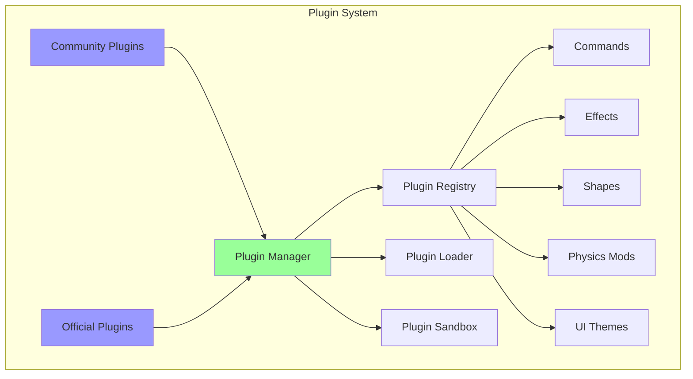
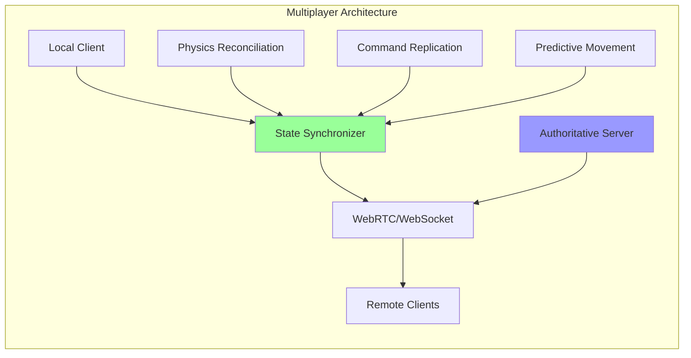
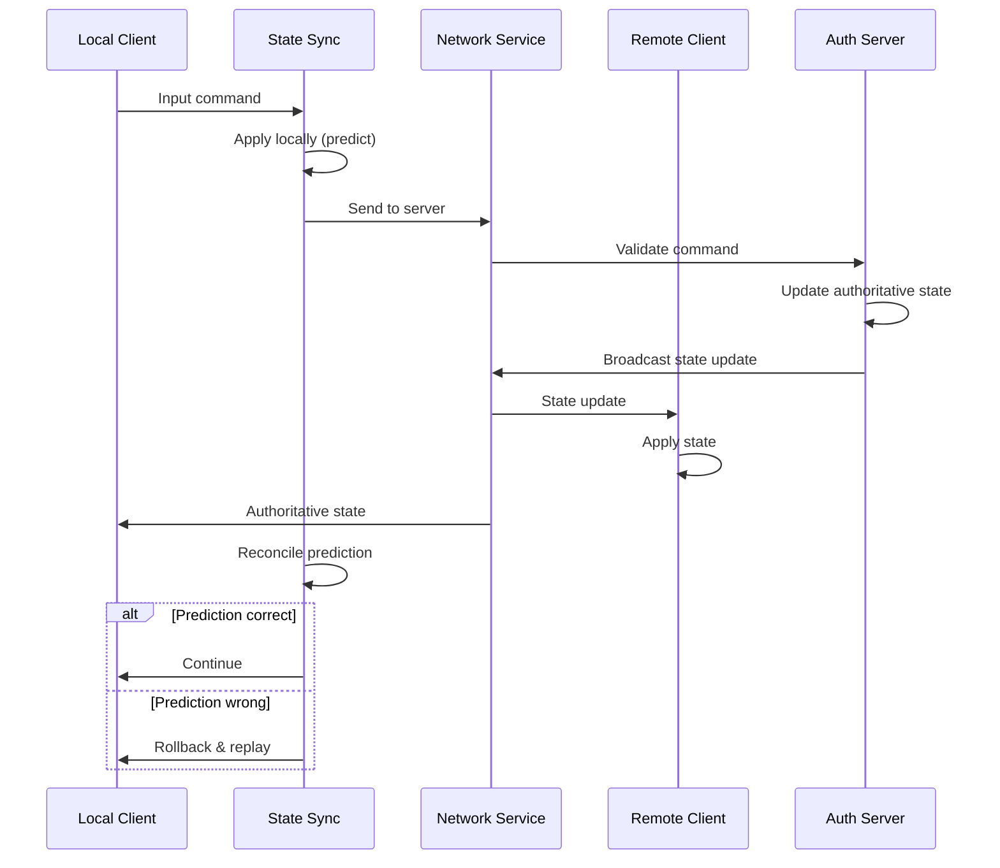
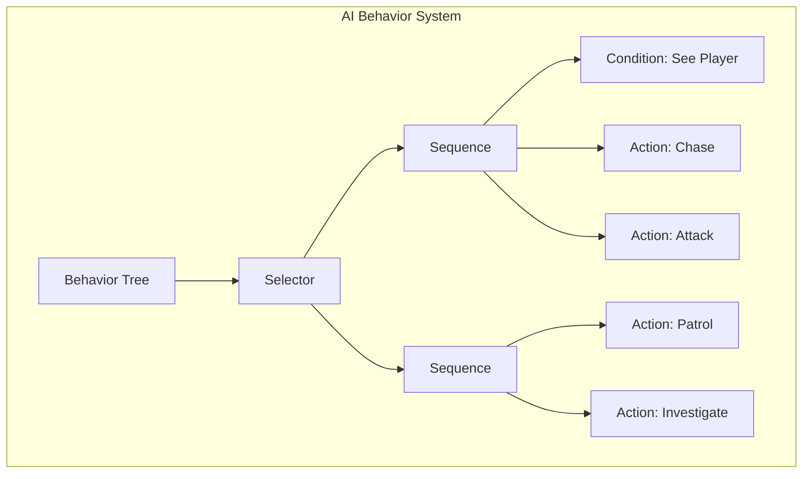
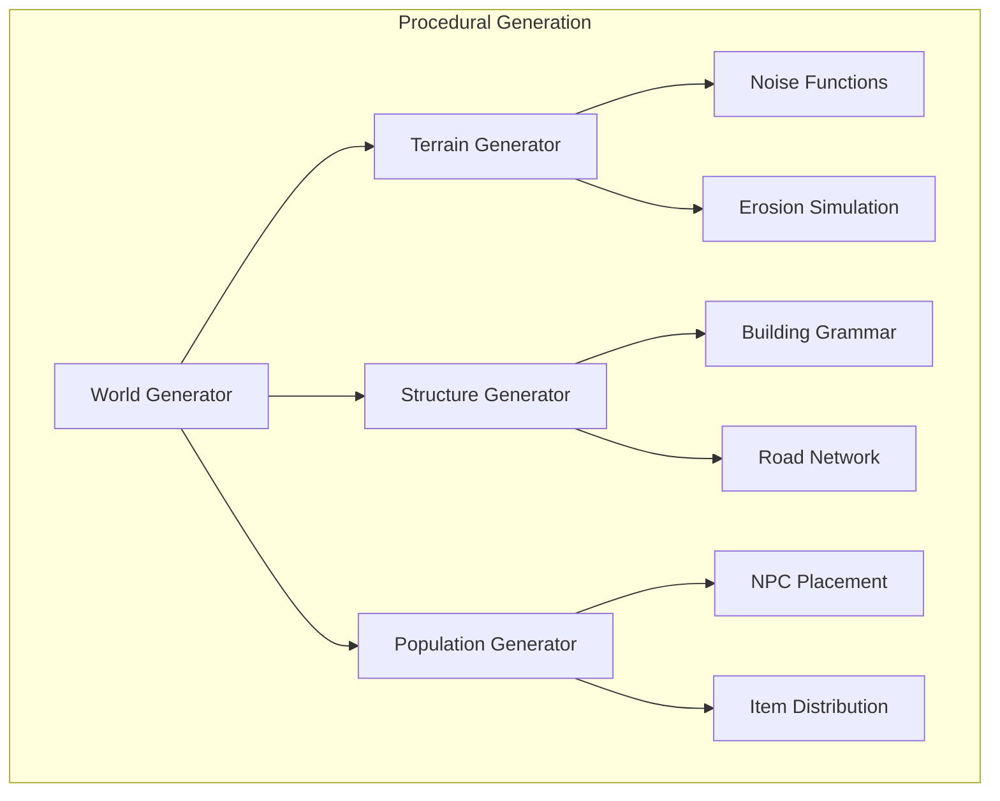
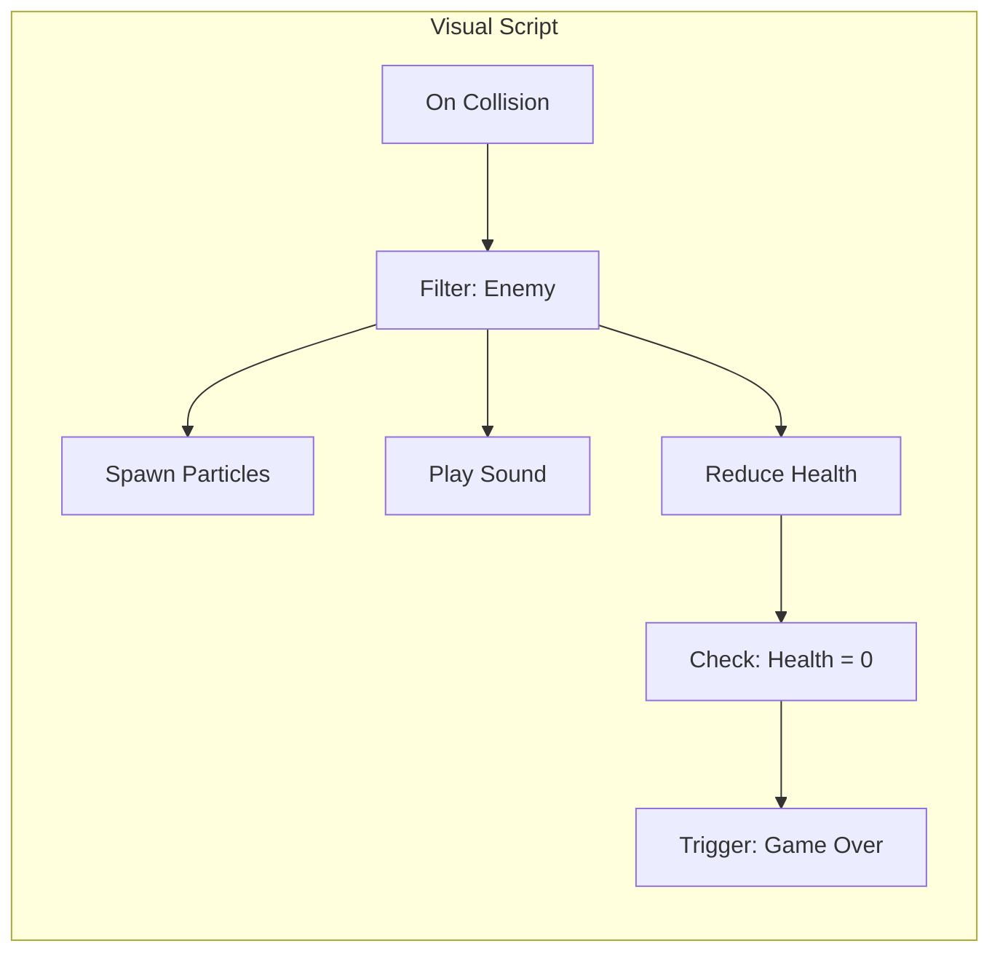

# New Possibilities with Clean Architecture

## Overview

The SOLID refactoring unlocks numerous advanced features and capabilities that were previously impossible or extremely difficult to implement. This document explores the exciting new possibilities enabled by the clean, modular architecture.

## 1. Advanced Plugin Ecosystem

### Plugin Architecture


### Example Plugins

#### Weather System Plugin
```typescript
class WeatherPlugin implements IPlugin {
    name = 'cyber-weather';
    version = '1.0.0';
    
    initialize(container: IServiceProvider): void {
        const weatherSystem = new WeatherSystem(
            container.get(IParticleSystem),
            container.get(ILightingSystem),
            container.get(IAudioSystem)
        );
        
        container.register(IWeatherSystem, () => weatherSystem);
    }
    
    commands = [
        new WeatherCommand(),
        new ThunderCommand(),
        new RainCommand()
    ];
    
    effects = [
        new RainEffect(),
        new FogEffect(),
        new LightningEffect()
    ];
}
```

#### Music Visualizer Plugin
```typescript
class MusicVisualizerPlugin implements IPlugin {
    name = 'audio-reactive';
    version = '1.0.0';
    
    initialize(container: IServiceProvider): void {
        const audioAnalyzer = new AudioAnalyzer();
        const visualizer = new MusicVisualizer(
            container.get(IShapeManager),
            container.get(IEffectComposer),
            audioAnalyzer
        );
        
        container.register(IMusicVisualizer, () => visualizer);
    }
    
    commands = [
        new PlayCommand(),
        new VisualizerModeCommand(),
        new BeatDetectionCommand()
    ];
}
```

## 2. Multiplayer & Networking

### Real-time Collaboration


### Network State Synchronization



### Implementation
```typescript
class MultiplayerSystem {
    constructor(
        private physics: IPhysicsEngine,
        private scene: ISceneManager,
        private network: INetworkManager
    ) {}
    
    enableMultiplayer(): void {
        // Wrap physics engine with network sync
        this.physics = new NetworkedPhysicsEngine(
            this.physics,
            this.network
        );
        
        // Enable command replication
        this.commandRegistry.addInterceptor(
            new CommandReplicationInterceptor(this.network)
        );
        
        // Start state synchronization
        this.startStateSync();
    }
    
    private startStateSync(): void {
        this.network.onStateUpdate((state) => {
            this.reconcileState(state);
        });
        
        setInterval(() => {
            this.network.broadcastState(this.getLocalState());
        }, 1000 / 30); // 30Hz update rate
    }
}
```

## 3. Advanced AI & Behavior Systems

### AI Director
```typescript
interface IAIDirector {
    analyzeDifficulty(): DifficultyMetrics;
    adjustChallenge(metrics: DifficultyMetrics): void;
    spawnEnemies(count: number, difficulty: number): void;
}

class DynamicAIDirector implements IAIDirector {
    constructor(
        private scene: ISceneManager,
        private physics: IPhysicsEngine,
        private player: IPlayerController
    ) {}
    
    analyzeDifficulty(): DifficultyMetrics {
        return {
            playerSkill: this.calculatePlayerSkill(),
            currentStress: this.measureStress(),
            recentDeaths: this.player.getRecentDeaths()
        };
    }
    
    adjustChallenge(metrics: DifficultyMetrics): void {
        if (metrics.currentStress > 0.8) {
            this.reduceEnemyCount();
            this.increaseHealthDrops();
        } else if (metrics.currentStress < 0.3) {
            this.increaseEnemyDifficulty();
            this.addEnvironmentalHazards();
        }
    }
}
```

### Behavior Trees


## 4. Advanced Rendering Features

### Multi-Pass Rendering Pipeline
```typescript
class AdvancedRenderPipeline implements IRenderPipeline {
    private passes: IRenderPass[] = [];
    
    constructor(private container: IServiceProvider) {
        this.setupDefaultPasses();
    }
    
    private setupDefaultPasses(): void {
        this.addPass(new GeometryPass());
        this.addPass(new ShadowPass());
        this.addPass(new LightingPass());
        this.addPass(new SSAOPass());
        this.addPass(new ReflectionPass());
        this.addPass(new VolumetricPass());
        this.addPass(new PostProcessPass());
        this.addPass(new UIPass());
    }
    
    addPass(pass: IRenderPass): void {
        this.passes.push(pass);
        this.sortPassesByPriority();
    }
}
```

### Portal Rendering
```typescript
class PortalRenderingSystem {
    renderPortal(portal: IPortal): void {
        // Render to texture
        const portalTexture = this.renderToTexture(
            portal.targetScene,
            portal.targetCamera
        );
        
        // Apply to portal mesh
        portal.mesh.material.map = portalTexture;
        
        // Handle recursive portals
        if (portal.recursive) {
            this.renderRecursivePortal(portal, 3);
        }
    }
}
```

## 5. Time Manipulation System

### Time Control Features
```typescript
interface ITimeController {
    setTimeScale(scale: number): void;
    rewind(seconds: number): void;
    pause(): void;
    createSnapshot(): TimeSnapshot;
    restoreSnapshot(snapshot: TimeSnapshot): void;
}

class TimeManipulationSystem implements ITimeController {
    private snapshots: TimeSnapshot[] = [];
    private currentTimeScale = 1.0;
    
    setTimeScale(scale: number): void {
        this.currentTimeScale = scale;
        this.physics.setTimeScale(scale);
        this.animation.setTimeScale(scale);
        this.particles.setTimeScale(scale);
    }
    
    rewind(seconds: number): void {
        const targetTime = this.currentTime - seconds;
        const snapshot = this.findNearestSnapshot(targetTime);
        this.restoreSnapshot(snapshot);
        this.fastForward(targetTime - snapshot.timestamp);
    }
}
```

## 6. Procedural Generation System

### Dynamic World Generation


### Implementation
```typescript
class ProceduralWorldGenerator {
    generateChunk(x: number, z: number): IWorldChunk {
        const terrain = this.terrainGen.generate(x, z);
        const structures = this.structureGen.generate(terrain);
        const population = this.populationGen.populate(structures);
        
        return new WorldChunk({
            terrain,
            structures,
            population,
            metadata: this.generateMetadata(x, z)
        });
    }
    
    generateInfiniteWorld(): IInfiniteWorld {
        return new InfiniteWorld({
            chunkSize: 256,
            generator: this,
            loadDistance: 3,
            unloadDistance: 5
        });
    }
}
```

## 7. Advanced Analytics & Telemetry

### Player Behavior Analytics
```typescript
class AnalyticsSystem {
    private events: IAnalyticsEvent[] = [];
    
    trackEvent(event: IAnalyticsEvent): void {
        this.events.push({
            ...event,
            timestamp: Date.now(),
            sessionId: this.sessionId,
            userId: this.userId
        });
        
        this.processEvent(event);
    }
    
    generateHeatmap(): HeatmapData {
        const positions = this.events
            .filter(e => e.type === 'player_position')
            .map(e => e.data.position);
            
        return this.heatmapGenerator.generate(positions);
    }
    
    predictPlayerAction(): PredictedAction {
        const recentEvents = this.getRecentEvents(100);
        return this.mlModel.predict(recentEvents);
    }
}
```

## 8. Visual Scripting System

### Node-Based Programming


### Script Execution Engine
```typescript
class VisualScriptEngine {
    executeScript(script: IVisualScript, context: IExecutionContext): void {
        const nodes = this.topologicalSort(script.nodes);
        
        for (const node of nodes) {
            const inputs = this.gatherInputs(node, context);
            const output = node.execute(inputs);
            context.setNodeOutput(node.id, output);
        }
    }
    
    compileToJavaScript(script: IVisualScript): string {
        const compiler = new VisualScriptCompiler();
        return compiler.compile(script);
    }
}
```

## 9. Advanced Debugging Tools

### Time-Travel Debugger
```typescript
class TimeTravelDebugger {
    private history: IDebugSnapshot[] = [];
    private currentIndex = -1;
    
    captureSnapshot(): void {
        this.history.push({
            timestamp: Date.now(),
            sceneState: this.scene.serialize(),
            physicsState: this.physics.serialize(),
            uiState: this.ui.serialize()
        });
    }
    
    stepBack(): void {
        if (this.currentIndex > 0) {
            this.currentIndex--;
            this.restoreSnapshot(this.history[this.currentIndex]);
        }
    }
    
    inspectVariable(path: string): any {
        const snapshot = this.history[this.currentIndex];
        return this.traverse(snapshot, path);
    }
}
```

## 10. Modding Support

### Mod Loading System
```typescript
class ModManager {
    async loadMod(modPath: string): Promise<IMod> {
        const manifest = await this.loadManifest(modPath);
        const mod = await this.validateAndLoad(manifest);
        
        // Sandbox the mod
        const sandbox = new ModSandbox({
            permissions: manifest.permissions,
            resourceLimits: this.getResourceLimits(manifest)
        });
        
        sandbox.execute(mod);
        return mod;
    }
    
    createModAPI(): IModAPI {
        return {
            scene: this.createSceneAPI(),
            physics: this.createPhysicsAPI(),
            ui: this.createUIAPI(),
            commands: this.createCommandAPI(),
            events: this.createEventAPI()
        };
    }
}
```

## 11. Performance Optimization Systems

### Adaptive Quality System
```typescript
class AdaptiveQualitySystem {
    private metrics: PerformanceMetrics;
    private qualityLevels: IQualityLevel[];
    
    update(): void {
        this.metrics = this.measurePerformance();
        
        if (this.metrics.fps < 30) {
            this.decreaseQuality();
        } else if (this.metrics.fps > 55 && this.metrics.gpuUsage < 70) {
            this.increaseQuality();
        }
    }
    
    private decreaseQuality(): void {
        this.renderer.setShadowQuality('low');
        this.effects.disableExpensiveEffects();
        this.physics.setSimulationRate(30);
        this.particles.setMaxParticles(1000);
    }
}
```

## 12. Cross-Platform Support

### Platform Abstraction
```typescript
interface IPlatformAdapter {
    input: IInputAdapter;
    storage: IStorageAdapter;
    network: INetworkAdapter;
    graphics: IGraphicsAdapter;
}

class CrossPlatformManager {
    private adapter: IPlatformAdapter;
    
    initialize(): void {
        this.adapter = this.detectPlatform();
        this.configureForPlatform();
    }
    
    private detectPlatform(): IPlatformAdapter {
        if (this.isElectron()) return new ElectronAdapter();
        if (this.isMobile()) return new MobileAdapter();
        if (this.isVR()) return new VRAdapter();
        return new WebAdapter();
    }
}
```

## Conclusion

The clean architecture transformation enables:

1. **Community Ecosystem**: Plugin marketplace and mod support
2. **Advanced Features**: Multiplayer, AI, procedural generation
3. **Professional Tools**: Analytics, debugging, performance optimization
4. **Platform Flexibility**: Deploy anywhere from web to VR
5. **Future-Proofing**: Easy adoption of new technologies

These possibilities transform FlyingRobots.dev from a portfolio demo into a professional-grade platform capable of supporting advanced features and community contributions. The modular architecture ensures that each new feature can be developed, tested, and deployed independently, maintaining system stability while enabling rapid innovation.