# Project Vision: FlyingRobots.dev

## Executive Summary

FlyingRobots.dev is envisioned as a **living portfolio** that demonstrates not just coding ability, but architectural thinking, engineering discipline, and creative problem-solving. It should be a project that makes viewers say "I want this person on my team" - not because it's a complex game, but because it showcases professional software engineering at its finest.

## Core Vision Statement

> "An interactive portfolio that evolves from a beautiful demo into a showcase of modern software architecture, demonstrating the journey from prototype to production-ready system while remaining focused, maintainable, and impressive."

## Vision Evolution

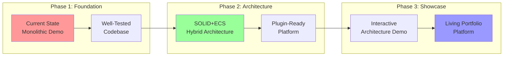

## What This Project IS

### 1. **A Portfolio Centerpiece**
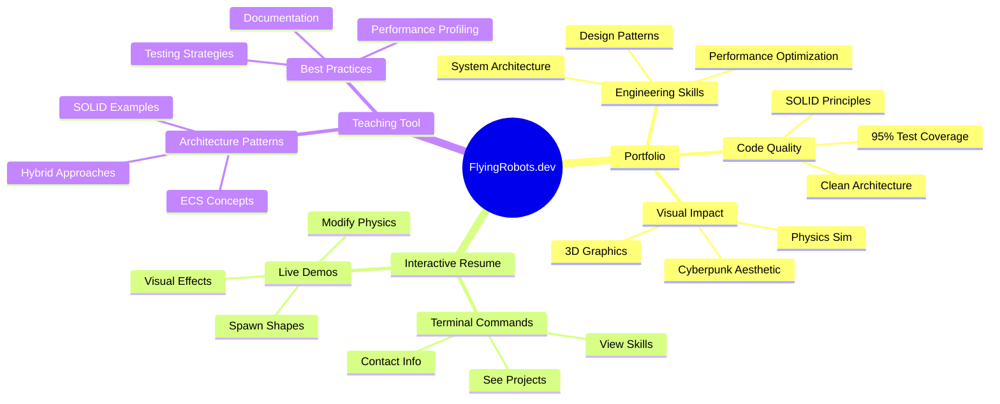

### 2. **An Architecture Showcase**

The project demonstrates progression through architectural maturity levels:

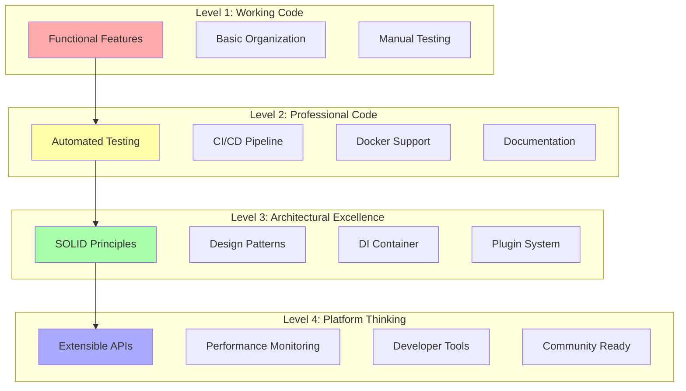

### 3. **A Skills Demonstration**

Each feature demonstrates specific skills valued in senior engineering roles:

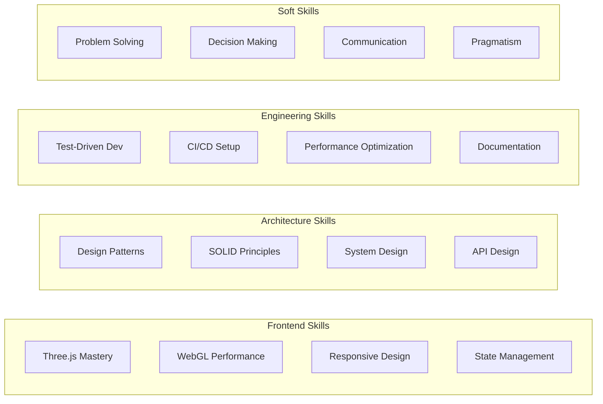

## What This Project IS NOT

### 1. **Not a Game Engine**
- No level editor needed
- No asset pipeline
- No save/load system (unless demonstrating serialization)
- No complex gameplay mechanics

### 2. **Not a Tech Demo**
- Every feature should serve the portfolio purpose
- No features just because they're cool
- Focus on demonstrating employable skills

### 3. **Not a Research Project**
- Use proven patterns and technologies
- Avoid experimental approaches
- Maintain production-ready quality

## Development Philosophy

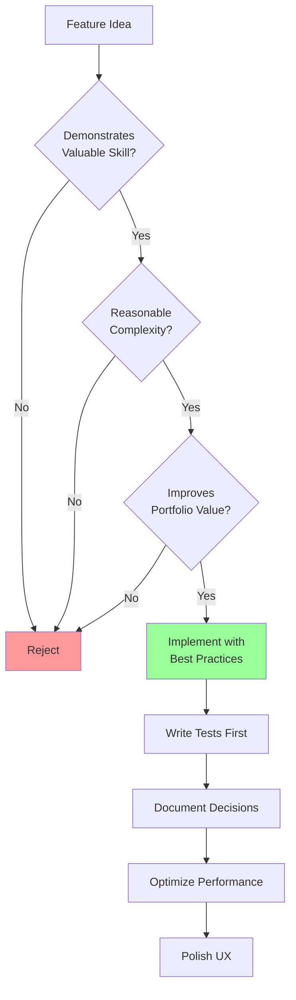

## Technical Vision

### Current Architecture (Problematic)
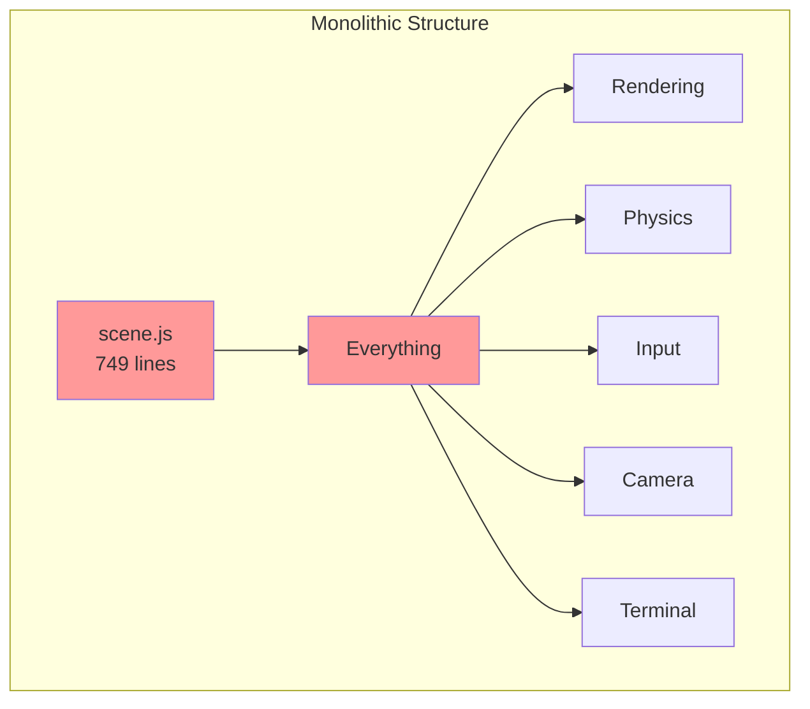

### Target Architecture (Clean)
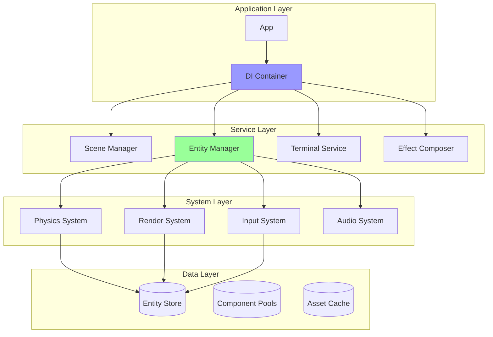

### Plugin Architecture Vision
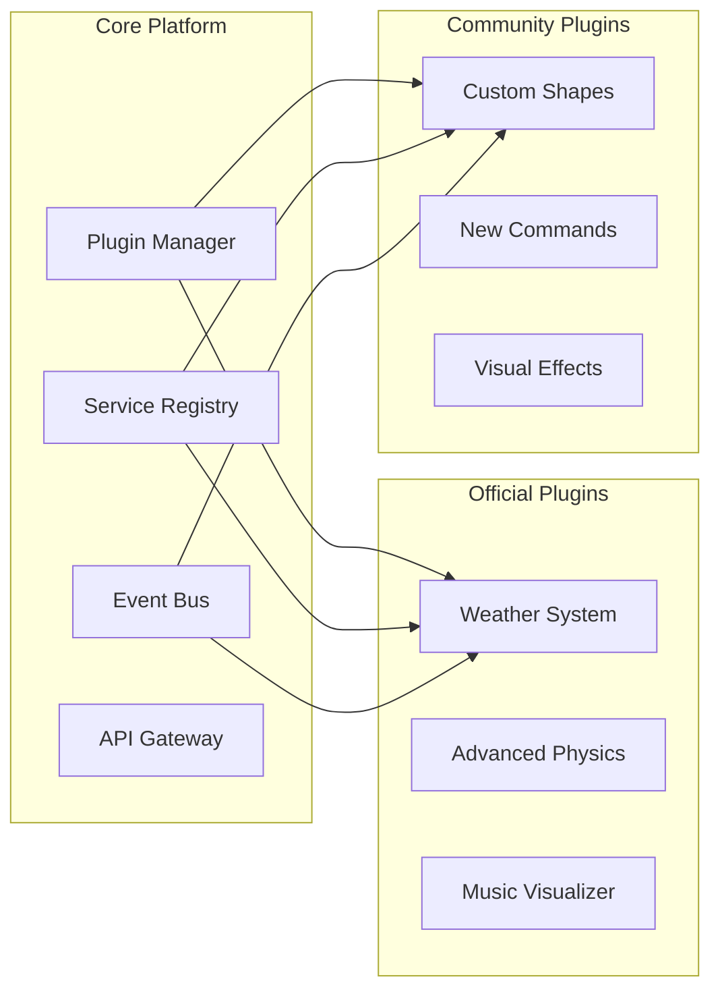

## Feature Progression

### Phase 1: Foundation (Current - Week 4)
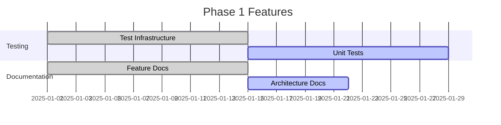

**Goal**: Establish professional engineering standards

### Phase 2: Architecture (Week 5-10)
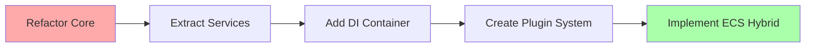

**Goal**: Transform into architectural showcase

### Phase 3: Polish (Week 11-16)
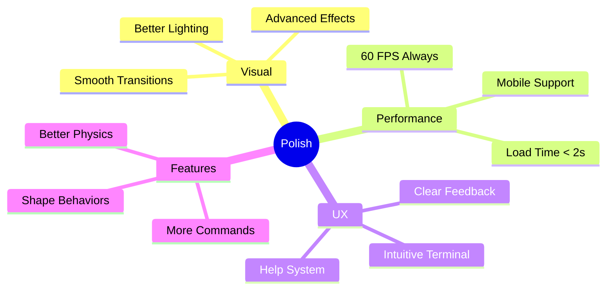

**Goal**: Create memorable user experience

### Phase 4: Platform (Week 17-26)
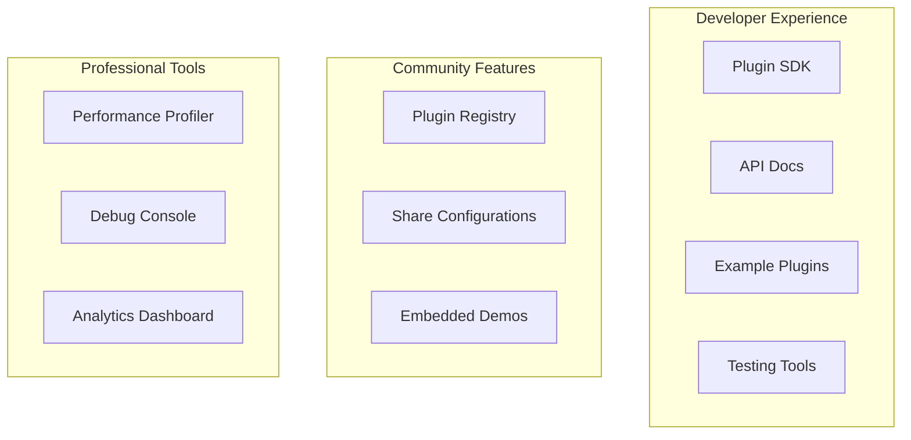

**Goal**: Demonstrate platform thinking

## Success Metrics

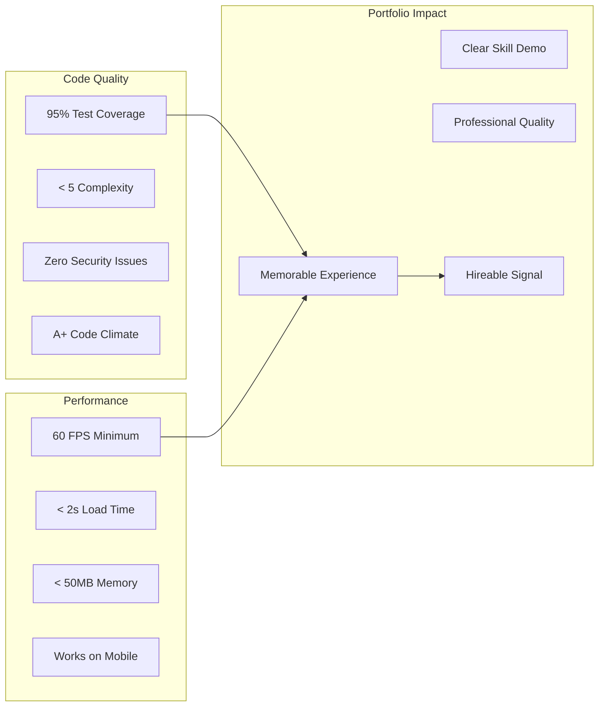

## Key Differentiators

### 1. **It Tells a Story**
The codebase tells the story of architectural evolution - from prototype to platform. Commit history shows professional development practices.

### 2. **It's Interactive**
Not just code to read, but a living system to explore. The terminal allows real-time experimentation.

### 3. **It's Educational**
Code comments explain not just what, but why. Architecture decisions are documented. It serves as a teaching tool.

### 4. **It's Pragmatic**
Shows real-world decision making - not overengineered, not underengineered. Right tool for the right job.

## What Success Looks Like

```mermaid
graph TD
    A[Visitor Arrives] --> B[Impressed by Visuals]
    B --> C[Explores Terminal]
    C --> D[Checks GitHub]
    D --> E[Reads Clean Code]
    E --> F[Sees Test Coverage]
    F --> G[Reviews Architecture]
    G --> H[Thinks: "This person<br/>writes production code"]
    H --> I[Contact for Interview]
    
    style B fill:#f9f
    style H fill:#9f9
    style I fill:#9f9
```

## Guiding Principles

### 1. **Quality Over Quantity**
- 5 well-implemented features > 20 hacky features
- Every line of code should be production-ready
- Polish matters

### 2. **Demonstrate Depth**
- Show mastery of chosen technologies
- Implement patterns correctly
- Document architectural decisions

### 3. **Stay Focused**
- Portfolio showcase is the primary goal
- Every feature must serve this goal
- Resist scope creep

### 4. **Think Long-term**
- Code should be maintainable for years
- Architecture should support evolution
- Documentation should be timeless

## Future Possibilities (Post-MVP)

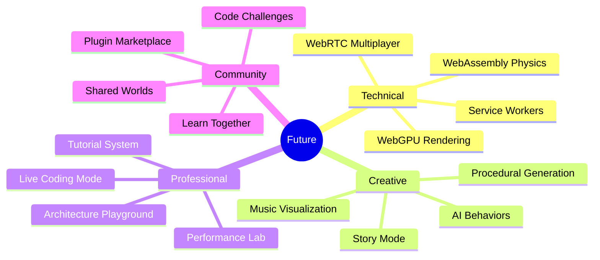

## Potential Concerns & Mitigations

### "Is it overengineered?"
**Mitigation**: Each architectural decision solves a real problem. Documentation explains the why. The progression shows pragmatic evolution.

### "Is it just another Three.js demo?"
**Mitigation**: The focus is on software architecture, not graphics. Three.js is just the medium to demonstrate engineering excellence.

### "Will it take too long?"
**Mitigation**: Phased approach delivers value incrementally. Each phase stands alone as portfolio-worthy.

### "Will anyone understand it?"
**Mitigation**: Comprehensive documentation, inline comments, and architectural diagrams make it accessible to other engineers.

## Final Vision

FlyingRobots.dev should be the project that:
- **Recruiters** remember and share
- **Engineers** respect and learn from  
- **Managers** see as evidence of senior-level thinking
- **You** are proud to show for years to come

It's not about building a game or a tech demo. It's about creating a living demonstration of what excellent software engineering looks like in practice - from the first commit to the final deployment.

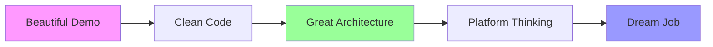

## Implementation Philosophy

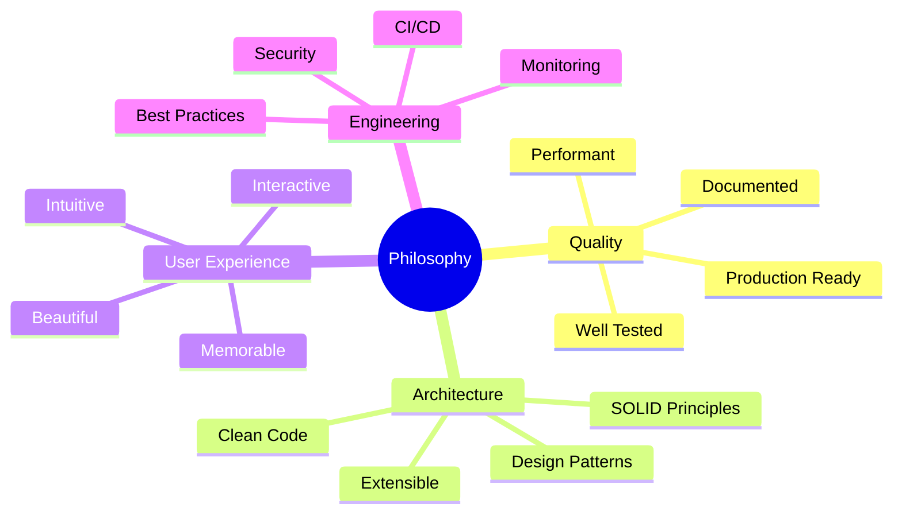

## Success Story

When someone visits FlyingRobots.dev, they should experience:

1. **First 10 seconds**: "Wow, this is visually impressive!"
2. **First minute**: "Oh cool, I can interact with it through the terminal"
3. **First 5 minutes**: "This is really well thought out"
4. **Looking at code**: "This is production-quality engineering"
5. **Reading docs**: "This person really knows architecture"
6. **Final thought**: "I want to work with this developer"

## Conclusion

My vision for FlyingRobots.dev is a **portfolio masterpiece** that demonstrates the full spectrum of senior engineering skills through a focused, polished, and memorable interactive experience. It should show not just that you can code, but that you can architect, lead, and deliver production-quality systems.

The hybrid architecture approach, phased development, and focus on demonstrable skills creates a project that is both ambitious and achievable - exactly what a senior engineer would build.

### Key Differentiators from Other Portfolios

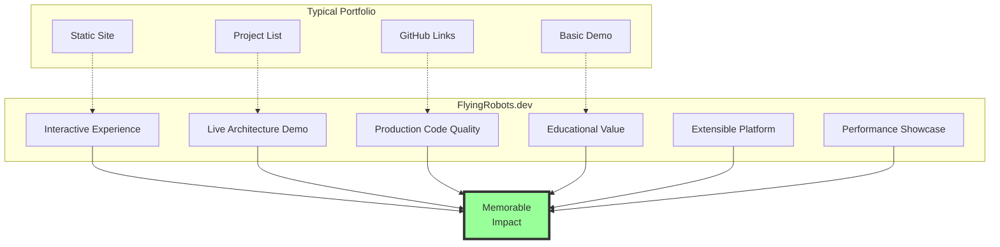

---

*This vision prioritizes portfolio value while maintaining technical excellence. Every decision should be evaluated against this vision: "Does this make me more hireable by demonstrating valuable skills?"*