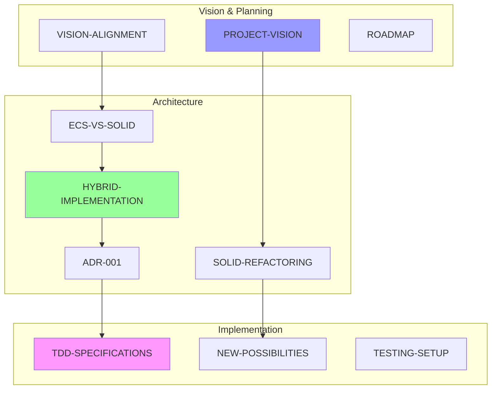

# FlyingRobots.dev Documentation

## Quick Navigation

### 📋 Planning & Vision
- **[PROJECT-VISION.md](./PROJECT-VISION.md)** - Comprehensive project vision and goals
- **[VISION-ALIGNMENT.md](./VISION-ALIGNMENT.md)** - Alignment on project scope and approach
- **[ROADMAP.md](./ROADMAP.md)** - Development timeline and phases

### 🏗️ Architecture Documents
- **[SOLID-REFACTORING-REPORT.md](./SOLID-REFACTORING-REPORT.md)** - Detailed SOLID analysis and refactoring plan
- **[ECS-VS-SOLID-ANALYSIS.md](./ECS-VS-SOLID-ANALYSIS.md)** - Comparison of ECS vs SOLID approaches
- **[HYBRID-ARCHITECTURE-IMPLEMENTATION.md](./HYBRID-ARCHITECTURE-IMPLEMENTATION.md)** - Implementation guide for hybrid approach
- **[ADR-001-HYBRID-ARCHITECTURE.md](./ADR-001-HYBRID-ARCHITECTURE.md)** - Architecture decision record

### 🚀 Possibilities & Features
- **[NEW-ARCHITECTURE-POSSIBILITIES.md](./NEW-ARCHITECTURE-POSSIBILITIES.md)** - Future features enabled by clean architecture
- **[features/](./features/)** - Individual feature documentation (01-10)

### 🧪 Testing & Quality
- **[TESTING-SETUP.md](./TESTING-SETUP.md)** - Testing infrastructure documentation
- **[TDD-SPECIFICATIONS.md](./TDD-SPECIFICATIONS.md)** - Test specifications for new components

### 📊 Analysis & Summary
- **[ANALYSIS-SUMMARY.md](./ANALYSIS-SUMMARY.md)** - Executive summary of architecture analysis
- **[features/FEATURE-CATALOG.md](./features/FEATURE-CATALOG.md)** - Comprehensive feature catalog

## Document Overview

## Reading Order

### For Understanding the Vision
1. PROJECT-VISION.md
2. VISION-ALIGNMENT.md
3. ROADMAP.md

### For Architecture Decisions
1. SOLID-REFACTORING-REPORT.md
2. ECS-VS-SOLID-ANALYSIS.md
3. ADR-001-HYBRID-ARCHITECTURE.md
4. HYBRID-ARCHITECTURE-IMPLEMENTATION.md

### For Implementation
1. TDD-SPECIFICATIONS.md
2. TESTING-SETUP.md
3. Feature documentation in features/

## Key Decisions Made

1. **Architecture**: Hybrid SOLID+ECS approach
2. **Testing**: 95% coverage target with Docker-based infrastructure
3. **Timeline**: 26 weeks, 320-420 hours total effort
4. **Priorities**: Portfolio value > Feature count
5. **Quality**: Production-ready code throughout

## Next Steps

1. Fix 10 failing tests
2. Implement DI container
3. Begin SOLID refactoring
4. Add ECS patterns for shape management
5. Create plugin architecture

---

*Documentation created: 6/8/2025*  
*Total pages: 100+*  
*Diagrams: 50+ Mermaid visualizations*