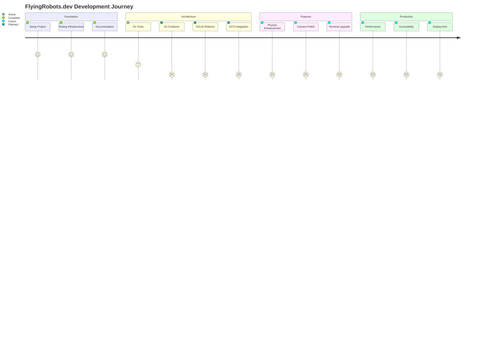
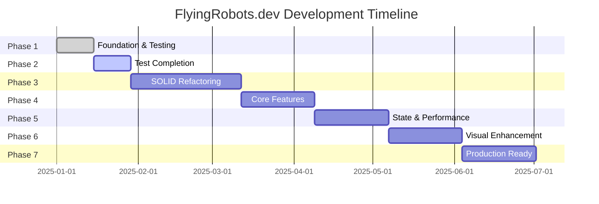

# FlyingRobots.dev Development Roadmap

## Overview
This roadmap outlines the development progression for FlyingRobots.dev, a portfolio website featuring an interactive Three.js cyberpunk demo with physics simulation and terminal interface.

## Development Journey

## Development Phases

### Phase 1: Foundation & Testing Infrastructure ✅ COMPLETED (Week 1-2)
**Status**: 100% Complete

#### Completed Tasks:
- ✅ Document all existing features using TDD approach
- ✅ Create comprehensive feature catalog with effort estimates
- ✅ Set up Docker containerization for consistent testing
- ✅ Configure Vitest with happy-dom for WebGL testing
- ✅ Implement pre-push hooks with Husky
- ✅ Create GitHub Actions CI/CD pipeline
- ✅ Write initial test suite (88 tests across 4 features)
- ✅ Create unified test execution system

#### Deliverables:
- 10 feature documentation files
- Complete testing infrastructure
- Docker-based test environment
- CI/CD pipeline

### Phase 2: Test Completion & Bug Fixes 🚧 IN PROGRESS (Week 3-4)
**Status**: 20% Complete
**Estimated Effort**: 15-20 hours

#### Current Tasks:
- 🚧 Fix 10 failing tests in physics and instanced rendering
- ⏳ Write Camera System tests (~8-10 tests)
- ⏳ Write Post-Processing Effects tests (~6-8 tests)
- ⏳ Achieve 80% test coverage across all features
- ⏳ Create integration tests for feature interactions

#### Deliverables:
- All tests passing
- 80%+ code coverage
- Integration test suite
- Bug fix documentation

### Phase 3: SOLID Architecture Refactoring (Week 5-10) 🆕
**Status**: Planning
**Estimated Effort**: 120-140 hours

#### Major Refactoring Goals:
1. **Foundation & DI Container** (20-24 hours)
   - Dependency injection container
   - Service registry and lifecycle management
   - Core abstractions and interfaces
   - Factory patterns

2. **Core System Refactoring** (38-44 hours)
   - Scene system SRP separation
   - Physics engine abstraction
   - Terminal command system with DI
   - Camera controller strategies

3. **Component Extraction** (28-32 hours)
   - Render pipeline abstraction
   - Instance management system
   - Effect composer architecture
   - Input management system

4. **Test Infrastructure Update** (36-40 hours)
   - Mock implementations for all interfaces
   - Update existing tests for new architecture
   - Integration tests for DI container
   - Contract tests for interfaces

#### Deliverables:
- SOLID-compliant architecture
- Dependency injection framework
- Plugin support system
- 95%+ test coverage
- Comprehensive documentation

### Phase 4: Core Feature Completion (Week 11-14)
**Status**: Planning (Post-Refactoring)
**Estimated Effort**: 40-50 hours

#### Planned Features:
1. **Physics System Enhancement** (15-20 hours)
   - Continuous collision detection
   - Spatial partitioning (octree)
   - Improved collision response
   - Physics constraints/joints

2. **Camera System Polish** (8-10 hours)
   - Camera presets/bookmarks
   - Smooth transitions
   - Orbit controls option
   - Screenshot functionality

3. **Terminal Enhancements** (10-15 hours)
   - Command aliases
   - Persistent history
   - Variable system
   - Scripting support

#### Deliverables:
- Enhanced physics engine
- Polished camera system
- Advanced terminal features
- Updated documentation

### Phase 5: State Management & Performance (Week 15-18)
**Status**: Design Phase
**Estimated Effort**: 30-40 hours

#### Architecture Goals:
1. **State Management System** (20-25 hours)
   - Centralized state store
   - State persistence
   - Undo/redo functionality
   - Time-travel debugging

2. **Performance Monitoring** (10-15 hours)
   - Real-time metrics dashboard
   - Memory usage tracking
   - Draw call optimization
   - Dynamic quality adjustment

#### Deliverables:
- State management system
- Performance monitoring tools
- Optimization documentation
- Benchmark suite

### Phase 6: Visual Enhancement & Polish (Week 19-22)
**Status**: Future
**Estimated Effort**: 25-35 hours

#### Visual Features:
- Advanced post-processing effects
- Particle systems
- Weather effects
- Scene transitions
- Dynamic skybox

#### Deliverables:
- Enhanced visual effects
- Effect presets system
- Visual regression tests
- Performance benchmarks

### Phase 7: Production Readiness (Week 23-26)
**Status**: Future
**Estimated Effort**: 20-30 hours

#### Production Tasks:
- TypeScript migration
- Accessibility improvements
- SEO optimization
- Progressive Web App features
- Error tracking integration
- Analytics implementation

#### Deliverables:
- Production-ready codebase
- Deployment pipeline
- Monitoring setup
- Documentation suite

## Milestone Timeline

## Success Metrics

### Phase 2 Success Criteria
- ✅ 100% of tests passing
- ✅ 80%+ code coverage
- ✅ Sub-16ms frame times
- ✅ No memory leaks

### Phase 3 Success Criteria (SOLID Refactoring)
- ✅ DI container fully functional
- ✅ All god objects eliminated (no file > 200 lines)
- ✅ 95%+ test coverage with mocks
- ✅ Cyclomatic complexity < 5 per method
- ✅ Plugin system operational
- ✅ Zero circular dependencies

### Phase 4 Success Criteria
- ✅ Physics simulation at 60 FPS with 500+ objects
- ✅ Camera transitions < 300ms
- ✅ Terminal command execution < 50ms
- ✅ User satisfaction score > 4.5/5

### Phase 4 Success Criteria
- ✅ State updates < 16ms
- ✅ Memory usage < 100MB baseline
- ✅ Performance metrics visible in real-time
- ✅ Automatic quality adjustment working

### Final Success Criteria
- ✅ Lighthouse score > 90
- ✅ TypeScript coverage 100%
- ✅ Accessibility WCAG 2.1 AA compliant
- ✅ Load time < 3 seconds
- ✅ 99.9% uptime

## Risk Management

### Technical Risks
1. **WebGL Compatibility**: Mitigate with fallbacks and feature detection
2. **Performance on Mobile**: Progressive enhancement and quality settings
3. **Physics Complexity**: Modular design allows disabling features
4. **State Complexity**: Start simple, iterate based on needs

### Timeline Risks
1. **Scope Creep**: Strict feature prioritization
2. **Testing Delays**: Parallel test development
3. **Integration Issues**: Continuous integration from Phase 1
4. **Performance Regression**: Automated benchmarking

## Resource Requirements

### Development Resources
- 1 Full-stack Developer (320-420 hours total)
  - Phase 1: 20 hours ✅ Complete
  - Phase 2: 15-20 hours (in progress)
  - Phase 3: 120-140 hours (SOLID refactoring)
  - Phase 4-7: 165-240 hours
- Design reviews at each phase
- Performance testing infrastructure
- CI/CD pipeline maintenance

### Infrastructure
- GitHub repository
- Docker Hub for test images
- CDN for static assets
- Monitoring service (future)

## Communication Plan

### Weekly Updates
- Progress against roadmap
- Blockers and solutions
- Test coverage metrics
- Performance benchmarks

### Phase Completion
- Feature demonstrations
- Performance reports
- Documentation updates
- Retrospective notes

## Next Steps (Immediate)

1. **Fix Failing Tests** (Priority 1)
   - Analyze 10 failing tests
   - Update implementations or tests as needed
   - Ensure all tests pass in Docker

2. **Complete Test Coverage** (Priority 2)
   - Write Camera System tests
   - Write Post-Processing tests
   - Add integration tests

3. **Performance Baseline** (Priority 3)
   - Establish performance benchmarks
   - Document current metrics
   - Set improvement targets

## Conclusion

This roadmap provides a clear path from the current state (testing infrastructure complete, initial tests written) to a production-ready portfolio showcase with enterprise-grade architecture. The addition of the SOLID refactoring phase (Phase 3) significantly enhances the project's value as a portfolio piece, demonstrating advanced software engineering skills including:

- **Design Patterns**: Dependency injection, factory patterns, strategy patterns
- **SOLID Principles**: Clean architecture with proper separation of concerns
- **Testability**: 95%+ coverage with comprehensive mocking
- **Extensibility**: Plugin system and modular architecture
- **Professional Standards**: Enterprise-level code organization

The estimated total effort is 320-420 hours over 26 weeks, with clear milestones and success criteria at each phase. While this represents a significant increase from the original estimate, the SOLID refactoring transforms the project from a demo into a showcase of professional software architecture skills, opening possibilities for:

- Community plugins and extensions
- Multiplayer and networking features
- Advanced AI and procedural generation
- Professional debugging and monitoring tools

The focus on clean architecture, testing, performance, and user experience ensures a high-quality final product that demonstrates both technical implementation skills and software architecture expertise.

Last Updated: 6/8/2025