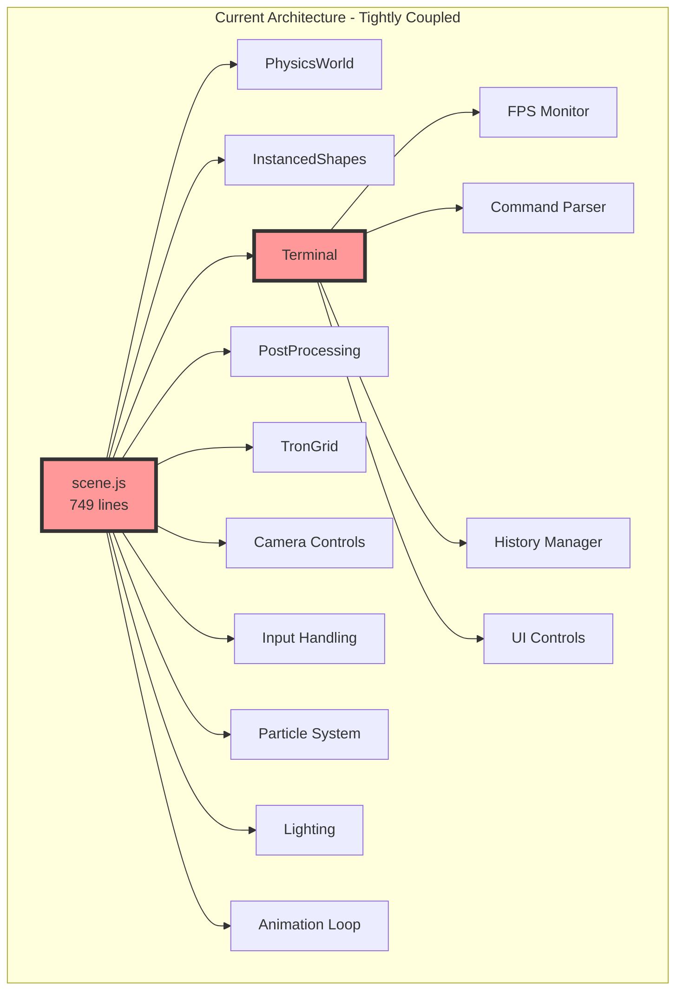
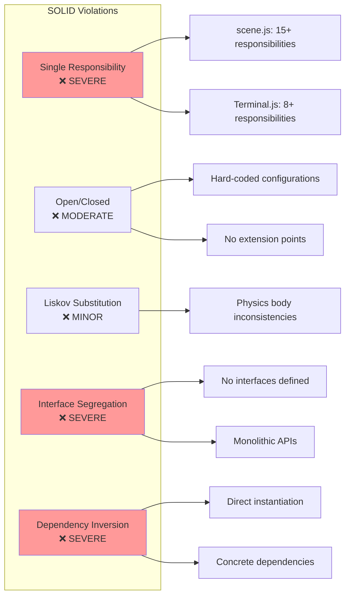
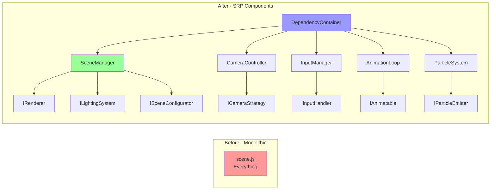
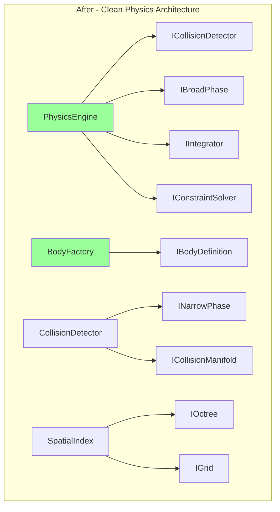
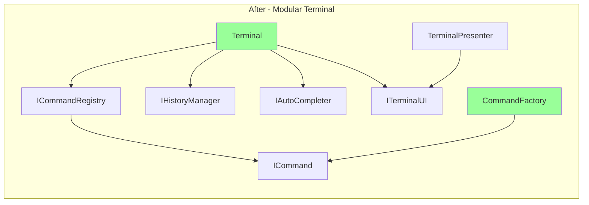
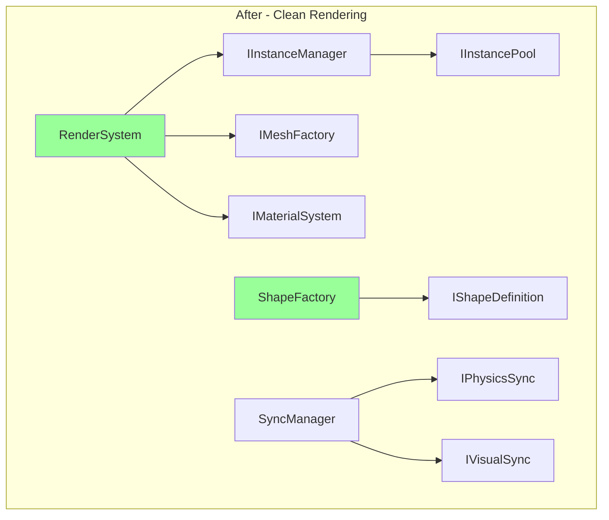
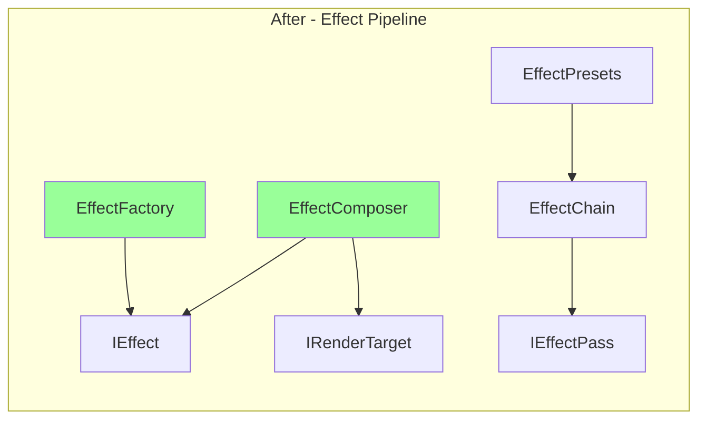
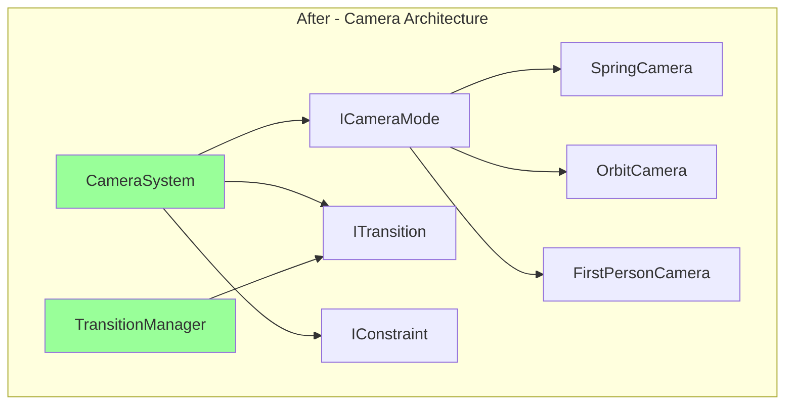
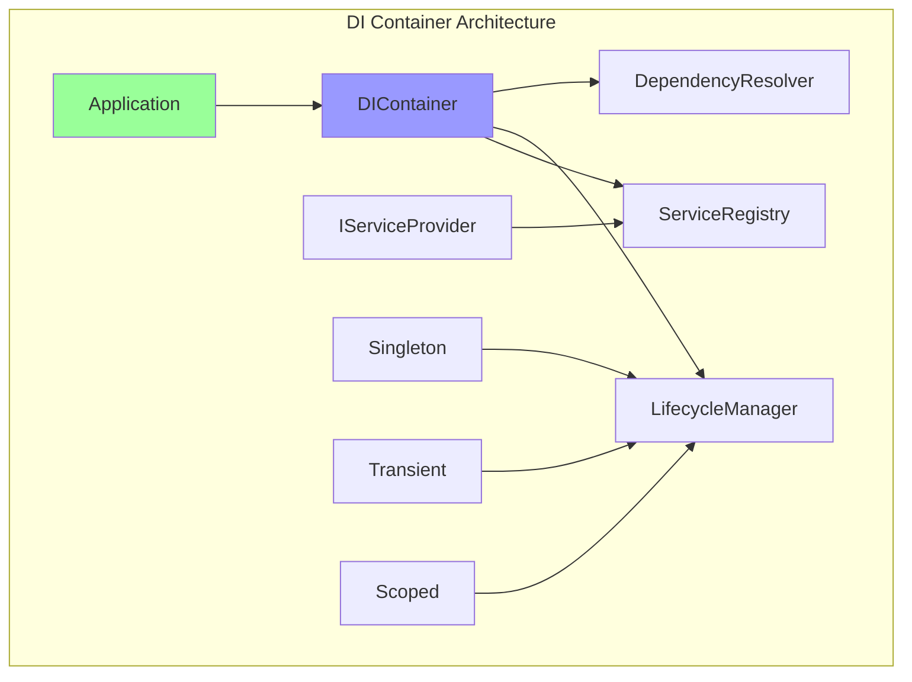
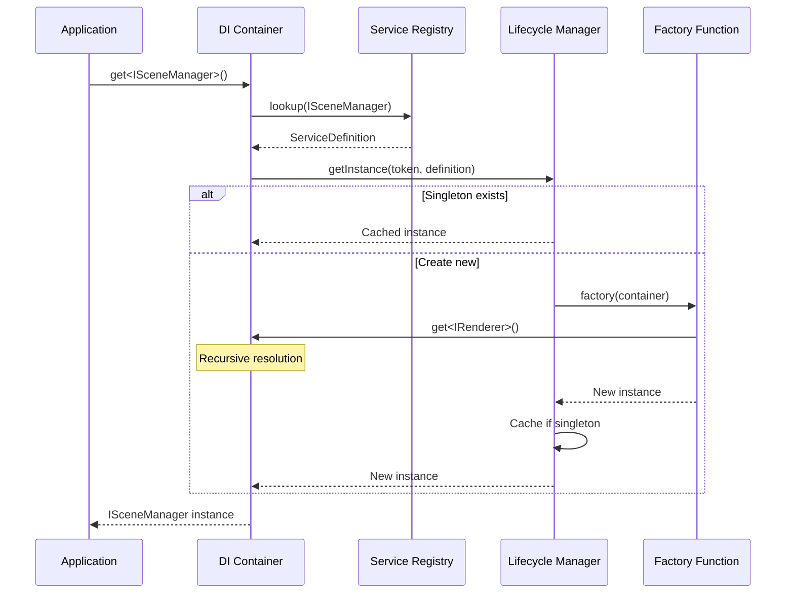

# SOLID Refactoring Report - FlyingRobots.dev

## Executive Summary

This report details a comprehensive refactoring plan to transform the FlyingRobots.dev codebase from its current monolithic structure into a SOLID-compliant, testable, and extensible architecture. The refactoring will enable dependency injection, improve testability, and unlock new possibilities for feature development.

## Current Architecture Analysis

### Major SOLID Violations



### SOLID Principles Violation Overview



### Violation Summary by Feature

## Feature 1: 3D Scene Rendering

### Current Violations
- **SRP**: `scene.js` handles 15+ responsibilities
- **OCP**: Hard-coded configurations and shape types
- **DIP**: Direct Three.js dependencies
- **ISP**: No interface segregation

### Refactoring Plan



### New SRP Components

#### 1. SceneManager
```typescript
interface ISceneManager {
    initialize(config: SceneConfig): void;
    addObject(object: ISceneObject): void;
    removeObject(id: string): void;
    update(deltaTime: number): void;
}

class SceneManager implements ISceneManager {
    constructor(
        private renderer: IRenderer,
        private lighting: ILightingSystem,
        private configurator: ISceneConfigurator
    ) {}
}
```

#### 2. CameraController
```typescript
interface ICameraController {
    setStrategy(strategy: ICameraStrategy): void;
    update(deltaTime: number): void;
    moveTo(position: Vector3): void;
    lookAt(target: Vector3): void;
}

interface ICameraStrategy {
    update(camera: Camera, deltaTime: number): void;
}

class SpringCameraStrategy implements ICameraStrategy {}
class OrbitCameraStrategy implements ICameraStrategy {}
class FirstPersonCameraStrategy implements ICameraStrategy {}
```

#### 3. RenderPipeline
```typescript
interface IRenderPipeline {
    addPass(pass: IRenderPass): void;
    render(scene: Scene, camera: Camera): void;
}

interface IRenderPass {
    name: string;
    enabled: boolean;
    render(input: RenderInput): RenderOutput;
}
```

## Feature 2: Physics Simulation

### Current Violations
- **LSP**: Inconsistent body type hierarchies
- **OCP**: Hard-coded collision detection
- **SRP**: PhysicsWorld handles too many concerns

### Refactoring Plan



### New SRP Components

#### 1. PhysicsEngine
```typescript
interface IPhysicsEngine {
    addBody(body: IPhysicsBody): void;
    removeBody(id: string): void;
    step(deltaTime: number): void;
    setGravity(gravity: Vector3): void;
}

class PhysicsEngine implements IPhysicsEngine {
    constructor(
        private broadPhase: IBroadPhase,
        private narrowPhase: INarrowPhase,
        private integrator: IIntegrator,
        private constraintSolver: IConstraintSolver
    ) {}
}
```

#### 2. Collision System
```typescript
interface ICollisionDetector {
    detectCollisions(bodies: IPhysicsBody[]): ICollisionManifold[];
}

interface IBroadPhase {
    getPotentialPairs(bodies: IPhysicsBody[]): BodyPair[];
}

interface INarrowPhase {
    testPair(bodyA: IPhysicsBody, bodyB: IPhysicsBody): ICollisionManifold | null;
}
```

## Feature 3: Interactive Terminal

### Current Violations
- **SRP**: Terminal class handles UI, commands, history, autocomplete
- **OCP**: Cannot add commands without modifying source
- **DIP**: Direct DOM manipulation

### Refactoring Plan



### New SRP Components

#### 1. Command System
```typescript
interface ICommand {
    name: string;
    description: string;
    execute(args: string[], context: ICommandContext): Promise<ICommandResult>;
    validate(args: string[]): ValidationResult;
}

interface ICommandRegistry {
    register(command: ICommand): void;
    execute(commandLine: string): Promise<ICommandResult>;
    getCommands(): ICommand[];
}

class CommandRegistry implements ICommandRegistry {
    private commands = new Map<string, ICommand>();
    
    constructor(private parser: ICommandParser) {}
}
```

#### 2. Terminal UI
```typescript
interface ITerminalUI {
    write(content: string, style?: OutputStyle): void;
    clear(): void;
    showPrompt(): void;
    onInput(handler: (input: string) => void): void;
}

class TerminalPresenter {
    constructor(
        private ui: ITerminalUI,
        private commandRegistry: ICommandRegistry,
        private history: IHistoryManager
    ) {}
}
```

## Feature 4: Instanced Rendering

### Current Violations
- **SRP**: Manages physics bodies and visual instances
- **OCP**: Hard-coded shape types
- **DIP**: Direct Three.js dependencies

### Refactoring Plan



### New SRP Components

#### 1. Instance Management
```typescript
interface IInstanceManager {
    createPool(definition: IPoolDefinition): IInstancePool;
    allocateInstance(poolId: string): number;
    releaseInstance(poolId: string, instanceId: number): void;
    updateInstance(poolId: string, instanceId: number, data: InstanceData): void;
}

interface IInstancePool {
    capacity: number;
    activeCount: number;
    allocate(): number;
    release(id: number): void;
    update(id: number, matrix: Matrix4, color?: Color): void;
}
```

## Feature 5: Post-Processing Effects

### Current Violations
- **SRP**: Mixed with scene setup
- **OCP**: Cannot add new effects easily
- **ISP**: No effect interface

### Refactoring Plan



## Feature 6: Camera System

### Current Violations
- **SRP**: Mixed with scene.js
- **OCP**: Hard-coded camera behavior
- **DIP**: No abstraction

### Refactoring Plan



## Dependency Injection Container



### Dependency Resolution Flow



### Container Implementation
```typescript
interface IServiceProvider {
    get<T>(token: ServiceToken<T>): T;
    getAll<T>(token: ServiceToken<T>): T[];
}

class DIContainer implements IServiceProvider {
    private registry = new ServiceRegistry();
    
    register<T>(token: ServiceToken<T>, factory: Factory<T>, lifecycle: Lifecycle): void {
        this.registry.register(token, factory, lifecycle);
    }
    
    get<T>(token: ServiceToken<T>): T {
        return this.resolver.resolve(token);
    }
}
```

## Updated TODO List

### Immediate Refactoring Tasks (Phase 1: Foundation)
- [ ] Create DI container implementation (8 hours)
- [ ] Design service tokens and interfaces (4 hours)
- [ ] Create abstract factory patterns (6 hours)
- [ ] Implement service lifecycle management (4 hours)

### Phase 2: Core Refactoring (High Priority)
- [ ] Refactor SceneManager (SRP) (8 hours)
  - [ ] Extract CameraController
  - [ ] Extract InputManager
  - [ ] Extract AnimationLoop
  - [ ] Extract ParticleSystem
- [ ] Refactor PhysicsEngine (12 hours)
  - [ ] Create collision detection abstraction
  - [ ] Implement broad phase strategies
  - [ ] Create constraint solver interface
- [ ] Refactor Terminal System (10 hours)
  - [ ] Create command registry
  - [ ] Implement command factory
  - [ ] Extract history manager
  - [ ] Create terminal presenter

### Phase 3: Component Extraction (Medium Priority)
- [ ] Create render pipeline abstraction (6 hours)
- [ ] Implement effect composer system (6 hours)
- [ ] Create camera mode strategies (8 hours)
- [ ] Implement instance pooling system (8 hours)

### Phase 4: Integration & Testing
- [ ] Update all tests for new architecture (12 hours)
- [ ] Create integration tests for DI container (6 hours)
- [ ] Implement factory pattern tests (8 hours)
- [ ] Create mock implementations for all interfaces (10 hours)

## TDD Specifications for New Components

### 1. SceneManager Specification
```typescript
describe('SceneManager', () => {
    let sceneManager: ISceneManager;
    let mockRenderer: IRenderer;
    let mockLighting: ILightingSystem;
    
    beforeEach(() => {
        mockRenderer = createMock<IRenderer>();
        mockLighting = createMock<ILightingSystem>();
        sceneManager = new SceneManager(mockRenderer, mockLighting);
    });
    
    describe('initialization', () => {
        it('should initialize with provided configuration', () => {
            const config: SceneConfig = { fogDensity: 0.02, backgroundColor: 0x000000 };
            sceneManager.initialize(config);
            
            expect(mockRenderer.setBackground).toHaveBeenCalledWith(0x000000);
            expect(mockLighting.setFogDensity).toHaveBeenCalledWith(0.02);
        });
    });
    
    describe('object management', () => {
        it('should add objects to scene', () => {
            const object = createMock<ISceneObject>();
            sceneManager.addObject(object);
            
            expect(mockRenderer.add).toHaveBeenCalledWith(object);
        });
    });
});
```

### 2. Command Registry Specification
```typescript
describe('CommandRegistry', () => {
    let registry: ICommandRegistry;
    let mockParser: ICommandParser;
    
    beforeEach(() => {
        mockParser = createMock<ICommandParser>();
        registry = new CommandRegistry(mockParser);
    });
    
    describe('command registration', () => {
        it('should register new commands', () => {
            const command = createMock<ICommand>({ name: 'test' });
            registry.register(command);
            
            expect(registry.getCommands()).toContain(command);
        });
        
        it('should prevent duplicate command names', () => {
            const command1 = createMock<ICommand>({ name: 'test' });
            const command2 = createMock<ICommand>({ name: 'test' });
            
            registry.register(command1);
            expect(() => registry.register(command2)).toThrow('Command "test" already registered');
        });
    });
});
```

### 3. Physics Engine Specification
```typescript
describe('PhysicsEngine', () => {
    let engine: IPhysicsEngine;
    let mockBroadPhase: IBroadPhase;
    let mockNarrowPhase: INarrowPhase;
    let mockIntegrator: IIntegrator;
    
    beforeEach(() => {
        mockBroadPhase = createMock<IBroadPhase>();
        mockNarrowPhase = createMock<INarrowPhase>();
        mockIntegrator = createMock<IIntegrator>();
        
        engine = new PhysicsEngine(
            mockBroadPhase,
            mockNarrowPhase,
            mockIntegrator
        );
    });
    
    describe('simulation step', () => {
        it('should execute physics pipeline in correct order', () => {
            const bodies = [createMock<IPhysicsBody>()];
            engine.step(0.016);
            
            expect(mockBroadPhase.getPotentialPairs).toHaveBeenCalled();
            expect(mockNarrowPhase.testPair).toHaveBeenCalled();
            expect(mockIntegrator.integrate).toHaveBeenCalledWith(bodies, 0.016);
        });
    });
});
```

## New Possibilities with Clean Architecture

### 1. Plugin System
With proper abstractions, we can now support plugins:

```typescript
interface IPlugin {
    name: string;
    version: string;
    initialize(container: IServiceProvider): void;
    commands?: ICommand[];
    effects?: IEffect[];
    shapes?: IShapeDefinition[];
}

class PluginManager {
    loadPlugin(plugin: IPlugin): void {
        plugin.initialize(this.container);
        plugin.commands?.forEach(cmd => this.commandRegistry.register(cmd));
        plugin.effects?.forEach(effect => this.effectRegistry.register(effect));
    }
}
```

### 2. Multiplayer Support
Clean separation enables network synchronization:

```typescript
interface INetworkSync {
    syncState(state: IGameState): void;
    onStateChange(handler: StateChangeHandler): void;
}

class NetworkedPhysicsEngine extends PhysicsEngine {
    constructor(deps: PhysicsDeps, private network: INetworkSync) {
        super(deps);
    }
    
    step(deltaTime: number): void {
        super.step(deltaTime);
        this.network.syncState(this.getState());
    }
}
```

### 3. Save/Load System
With proper state management:

```typescript
interface ISerializable {
    serialize(): JsonObject;
    deserialize(data: JsonObject): void;
}

class SaveSystem {
    save(name: string): void {
        const state = {
            scene: this.sceneManager.serialize(),
            physics: this.physicsEngine.serialize(),
            camera: this.cameraSystem.serialize()
        };
        localStorage.setItem(name, JSON.stringify(state));
    }
}
```

### 4. Visual Scripting
Command composition becomes possible:

```typescript
interface IScriptNode {
    execute(context: IExecutionContext): Promise<any>;
    inputs: INodeInput[];
    outputs: INodeOutput[];
}

class SequenceNode implements IScriptNode {
    constructor(private commands: ICommand[]) {}
    
    async execute(context: IExecutionContext): Promise<any> {
        for (const command of this.commands) {
            await command.execute(context.args, context);
        }
    }
}
```

### 5. Advanced Testing Scenarios
Test doubles for everything:

```typescript
class TestSceneBuilder {
    private container = new DIContainer();
    
    withMockPhysics(): this {
        this.container.register(IPhysicsEngine, () => createMock<IPhysicsEngine>());
        return this;
    }
    
    withMockRenderer(): this {
        this.container.register(IRenderer, () => createMock<IRenderer>());
        return this;
    }
    
    build(): ISceneManager {
        return this.container.get(ISceneManager);
    }
}
```

### 6. Performance Profiling
Decorator pattern for performance monitoring:

```typescript
class ProfiledPhysicsEngine implements IPhysicsEngine {
    constructor(
        private engine: IPhysicsEngine,
        private profiler: IProfiler
    ) {}
    
    step(deltaTime: number): void {
        const timer = this.profiler.startTimer('physics.step');
        this.engine.step(deltaTime);
        timer.end();
    }
}
```

### 7. A/B Testing Framework
Strategy pattern enables feature flags:

```typescript
class FeatureFlaggedCameraSystem implements ICameraSystem {
    getStrategy(): ICameraStrategy {
        if (this.featureFlags.isEnabled('new-camera')) {
            return new ImprovedSpringCamera();
        }
        return new SpringCamera();
    }
}
```

### 8. Replay System
Event sourcing becomes natural:

```typescript
interface IGameEvent {
    timestamp: number;
    type: string;
    data: any;
}

class ReplaySystem {
    private events: IGameEvent[] = [];
    
    record(event: IGameEvent): void {
        this.events.push(event);
    }
    
    replay(speed: number = 1): void {
        this.events.forEach(event => {
            setTimeout(() => {
                this.eventBus.emit(event.type, event.data);
            }, event.timestamp / speed);
        });
    }
}
```

## Implementation Priority

1. **DI Container** (Critical - enables everything else)
2. **Core Abstractions** (IRenderer, IPhysicsEngine, ICommand)
3. **Scene Refactoring** (Biggest impact on codebase)
4. **Terminal Refactoring** (User-facing improvements)
5. **Physics Refactoring** (Performance gains)
6. **Rendering Refactoring** (Extensibility)

## Success Metrics

- **Test Coverage**: Increase from 80% to 95%
- **Cyclomatic Complexity**: Reduce from avg 15 to < 5 per method
- **Coupling**: Reduce coupling metric by 70%
- **Build Time**: Enable parallel builds, reduce by 40%
- **Mock Creation Time**: From hours to minutes
- **Feature Addition Time**: Reduce by 60%

## Conclusion

This refactoring plan transforms FlyingRobots.dev from a monolithic application into a modular, extensible, and testable system. The investment of approximately 120-150 hours will:

1. Enable true unit testing with test doubles
2. Allow feature development without modifying core code
3. Support plugin architecture
4. Enable advanced features like multiplayer and replay
5. Improve performance through better separation of concerns
6. Make the codebase a showcase of software engineering best practices

The clean architecture will serve as both a portfolio piece demonstrating advanced software design skills and a foundation for future feature development.