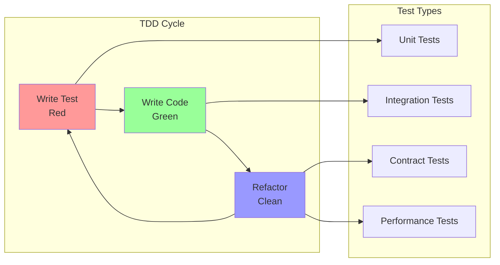

# TDD Specifications for SOLID Components

## Overview

This document provides Test-Driven Development (TDD) specifications for all new components created during the SOLID refactoring. Each specification includes test scenarios, expected behaviors, and interface contracts.

## TDD Workflow



## Core Infrastructure Components

### 1. Dependency Injection Container

```typescript
describe('DIContainer', () => {
    let container: DIContainer;
    
    beforeEach(() => {
        container = new DIContainer();
    });
    
    describe('Service Registration', () => {
        it('should register singleton services', () => {
            const token = createToken<ILogger>('ILogger');
            let instanceCount = 0;
            
            container.register(token, () => {
                instanceCount++;
                return new ConsoleLogger();
            }, Lifecycle.Singleton);
            
            const instance1 = container.get(token);
            const instance2 = container.get(token);
            
            expect(instance1).toBe(instance2);
            expect(instanceCount).toBe(1);
        });
        
        it('should register transient services', () => {
            const token = createToken<ICommand>('ICommand');
            let instanceCount = 0;
            
            container.register(token, () => {
                instanceCount++;
                return new TestCommand();
            }, Lifecycle.Transient);
            
            const instance1 = container.get(token);
            const instance2 = container.get(token);
            
            expect(instance1).not.toBe(instance2);
            expect(instanceCount).toBe(2);
        });
        
        it('should detect circular dependencies', () => {
            const tokenA = createToken<ServiceA>('ServiceA');
            const tokenB = createToken<ServiceB>('ServiceB');
            
            container.register(tokenA, (c) => new ServiceA(c.get(tokenB)));
            container.register(tokenB, (c) => new ServiceB(c.get(tokenA)));
            
            expect(() => container.get(tokenA)).toThrow('Circular dependency detected');
        });
        
        it('should support factory functions with dependencies', () => {
            const loggerToken = createToken<ILogger>('ILogger');
            const serviceToken = createToken<IService>('IService');
            
            container.register(loggerToken, () => new ConsoleLogger());
            container.register(serviceToken, (c) => new Service(c.get(loggerToken)));
            
            const service = container.get(serviceToken);
            expect(service.logger).toBeInstanceOf(ConsoleLogger);
        });
    });
    
    describe('Scope Management', () => {
        it('should create child containers with isolated scopes', () => {
            const token = createToken<IConfig>('IConfig');
            
            container.register(token, () => ({ env: 'production' }));
            const childContainer = container.createScope();
            childContainer.register(token, () => ({ env: 'development' }));
            
            expect(container.get(token).env).toBe('production');
            expect(childContainer.get(token).env).toBe('development');
        });
    });
});
```

### 2. Service Registry

```typescript
describe('ServiceRegistry', () => {
    let registry: ServiceRegistry;
    
    beforeEach(() => {
        registry = new ServiceRegistry();
    });
    
    describe('Registration', () => {
        it('should store service definitions', () => {
            const token = createToken<IService>('IService');
            const factory = () => new Service();
            
            registry.register(token, factory, Lifecycle.Singleton);
            
            const definition = registry.get(token);
            expect(definition.factory).toBe(factory);
            expect(definition.lifecycle).toBe(Lifecycle.Singleton);
        });
        
        it('should prevent duplicate registrations', () => {
            const token = createToken<IService>('IService');
            
            registry.register(token, () => new Service());
            
            expect(() => {
                registry.register(token, () => new Service());
            }).toThrow('Service already registered');
        });
        
        it('should support multiple registrations for array resolution', () => {
            const token = createToken<IPlugin>('IPlugin');
            
            registry.registerMultiple(token, () => new PluginA());
            registry.registerMultiple(token, () => new PluginB());
            
            const definitions = registry.getAll(token);
            expect(definitions).toHaveLength(2);
        });
    });
});
```

## Scene System Components

### 3. Scene Manager

```typescript
describe('SceneManager', () => {
    let sceneManager: SceneManager;
    let mockRenderer: MockRenderer;
    let mockLighting: MockLightingSystem;
    let mockConfigurator: MockSceneConfigurator;
    
    beforeEach(() => {
        mockRenderer = createMock<IRenderer>();
        mockLighting = createMock<ILightingSystem>();
        mockConfigurator = createMock<ISceneConfigurator>();
        
        sceneManager = new SceneManager(mockRenderer, mockLighting, mockConfigurator);
    });
    
    describe('Initialization', () => {
        it('should configure scene with provided options', () => {
            const config: SceneConfig = {
                backgroundColor: 0x000000,
                fogDensity: 0.02,
                ambientIntensity: 0.5
            };
            
            sceneManager.initialize(config);
            
            expect(mockConfigurator.configure).toHaveBeenCalledWith(config);
            expect(mockRenderer.setClearColor).toHaveBeenCalledWith(0x000000);
            expect(mockLighting.setAmbientIntensity).toHaveBeenCalledWith(0.5);
        });
        
        it('should use default configuration when not provided', () => {
            sceneManager.initialize();
            
            expect(mockConfigurator.configure).toHaveBeenCalledWith(
                expect.objectContaining({
                    backgroundColor: expect.any(Number),
                    fogDensity: expect.any(Number)
                })
            );
        });
    });
    
    describe('Object Management', () => {
        it('should add objects to scene and track them', () => {
            const object = createMock<ISceneObject>({ id: 'obj1' });
            
            sceneManager.addObject(object);
            
            expect(mockRenderer.add).toHaveBeenCalledWith(object);
            expect(sceneManager.getObject('obj1')).toBe(object);
        });
        
        it('should remove objects from scene', () => {
            const object = createMock<ISceneObject>({ id: 'obj1' });
            
            sceneManager.addObject(object);
            sceneManager.removeObject('obj1');
            
            expect(mockRenderer.remove).toHaveBeenCalledWith(object);
            expect(sceneManager.getObject('obj1')).toBeUndefined();
        });
        
        it('should handle removal of non-existent objects gracefully', () => {
            expect(() => sceneManager.removeObject('non-existent')).not.toThrow();
        });
        
        it('should update all updateable objects', () => {
            const updateable1 = createMock<ISceneObject & IUpdateable>();
            const updateable2 = createMock<ISceneObject & IUpdateable>();
            const static1 = createMock<ISceneObject>();
            
            sceneManager.addObject(updateable1);
            sceneManager.addObject(updateable2);
            sceneManager.addObject(static1);
            
            sceneManager.update(0.016);
            
            expect(updateable1.update).toHaveBeenCalledWith(0.016);
            expect(updateable2.update).toHaveBeenCalledWith(0.016);
        });
    });
    
    describe('Serialization', () => {
        it('should serialize scene state', () => {
            const object1 = createMock<ISceneObject & ISerializable>({
                id: 'obj1',
                serialize: () => ({ type: 'cube', position: [0, 0, 0] })
            });
            
            sceneManager.addObject(object1);
            
            const state = sceneManager.serialize();
            
            expect(state.objects).toHaveLength(1);
            expect(state.objects[0]).toEqual({
                id: 'obj1',
                data: { type: 'cube', position: [0, 0, 0] }
            });
        });
        
        it('should deserialize scene state', () => {
            const state = {
                objects: [
                    { id: 'obj1', data: { type: 'cube', position: [1, 2, 3] } }
                ],
                config: { backgroundColor: 0xff0000 }
            };
            
            sceneManager.deserialize(state);
            
            expect(mockConfigurator.configure).toHaveBeenCalledWith(state.config);
            // Object creation would be handled by registered factories
        });
    });
});
```

### 4. Camera Controller

```typescript
describe('CameraController', () => {
    let cameraController: CameraController;
    let mockCamera: MockCamera;
    let mockConstraints: MockConstraintSystem;
    
    beforeEach(() => {
        mockCamera = createMock<ICamera>();
        mockConstraints = createMock<IConstraintSystem>();
        cameraController = new CameraController(mockCamera, mockConstraints);
    });
    
    describe('Camera Strategies', () => {
        it('should switch between camera strategies', () => {
            const springStrategy = new SpringCameraStrategy();
            const orbitStrategy = new OrbitCameraStrategy();
            
            cameraController.setStrategy(springStrategy);
            cameraController.update(0.016);
            
            expect(springStrategy.update).toHaveBeenCalled();
            
            cameraController.setStrategy(orbitStrategy);
            cameraController.update(0.016);
            
            expect(orbitStrategy.update).toHaveBeenCalled();
        });
        
        it('should apply constraints after strategy update', () => {
            const strategy = createMock<ICameraStrategy>();
            cameraController.setStrategy(strategy);
            
            cameraController.update(0.016);
            
            expect(mockConstraints.apply).toHaveBeenCalledWith(mockCamera);
        });
    });
    
    describe('Camera Movement', () => {
        it('should animate movement to target position', async () => {
            const targetPosition = new Vector3(10, 5, 10);
            
            await cameraController.moveTo(targetPosition, 1000);
            
            expect(mockCamera.position).toEqual(targetPosition);
        });
        
        it('should support easing functions', async () => {
            const targetPosition = new Vector3(10, 5, 10);
            const easingSpy = vi.fn((t) => t * t); // Quadratic easing
            
            await cameraController.moveTo(targetPosition, 1000, easingSpy);
            
            expect(easingSpy).toHaveBeenCalled();
        });
    });
});
```

### 5. Input Manager

```typescript
describe('InputManager', () => {
    let inputManager: InputManager;
    let mockEventBus: MockEventBus;
    
    beforeEach(() => {
        mockEventBus = createMock<IEventBus>();
        inputManager = new InputManager(mockEventBus);
    });
    
    describe('Input Handler Registration', () => {
        it('should register input handlers by priority', () => {
            const highPriorityHandler = createMock<IInputHandler>({ priority: 10 });
            const lowPriorityHandler = createMock<IInputHandler>({ priority: 1 });
            
            inputManager.addHandler(lowPriorityHandler);
            inputManager.addHandler(highPriorityHandler);
            
            const event = new KeyboardEvent('keydown', { key: 'Enter' });
            inputManager.handleInput(event);
            
            // High priority handler should be called first
            expect(highPriorityHandler.handleInput).toHaveBeenCalledBefore(
                lowPriorityHandler.handleInput
            );
        });
        
        it('should stop propagation when handler returns true', () => {
            const handler1 = createMock<IInputHandler>({
                handleInput: () => true // Consumes event
            });
            const handler2 = createMock<IInputHandler>();
            
            inputManager.addHandler(handler1);
            inputManager.addHandler(handler2);
            
            const event = new KeyboardEvent('keydown');
            inputManager.handleInput(event);
            
            expect(handler1.handleInput).toHaveBeenCalled();
            expect(handler2.handleInput).not.toHaveBeenCalled();
        });
    });
    
    describe('Input Mapping', () => {
        it('should map inputs to actions', () => {
            inputManager.mapKey('w', 'move-forward');
            inputManager.mapKey('space', 'jump');
            inputManager.mapMouse('left', 'fire');
            
            const keyEvent = new KeyboardEvent('keydown', { key: 'w' });
            inputManager.handleInput(keyEvent);
            
            expect(mockEventBus.emit).toHaveBeenCalledWith('action:move-forward', 
                expect.any(Object)
            );
        });
        
        it('should support key combinations', () => {
            inputManager.mapKey('ctrl+s', 'save');
            
            const event = new KeyboardEvent('keydown', { 
                key: 's', 
                ctrlKey: true 
            });
            inputManager.handleInput(event);
            
            expect(mockEventBus.emit).toHaveBeenCalledWith('action:save',
                expect.any(Object)
            );
        });
    });
});
```

## Physics System Components

### 6. Physics Engine

```typescript
describe('PhysicsEngine', () => {
    let engine: PhysicsEngine;
    let mockBroadPhase: MockBroadPhase;
    let mockNarrowPhase: MockNarrowPhase;
    let mockIntegrator: MockIntegrator;
    let mockConstraintSolver: MockConstraintSolver;
    
    beforeEach(() => {
        mockBroadPhase = createMock<IBroadPhase>();
        mockNarrowPhase = createMock<INarrowPhase>();
        mockIntegrator = createMock<IIntegrator>();
        mockConstraintSolver = createMock<IConstraintSolver>();
        
        engine = new PhysicsEngine({
            broadPhase: mockBroadPhase,
            narrowPhase: mockNarrowPhase,
            integrator: mockIntegrator,
            constraintSolver: mockConstraintSolver
        });
    });
    
    describe('Simulation Step', () => {
        it('should execute physics pipeline in correct order', () => {
            const bodies = [
                createMock<IPhysicsBody>(),
                createMock<IPhysicsBody>()
            ];
            
            engine.addBody(bodies[0]);
            engine.addBody(bodies[1]);
            
            mockBroadPhase.getPotentialPairs.mockReturnValue([
                { bodyA: bodies[0], bodyB: bodies[1] }
            ]);
            
            mockNarrowPhase.testPair.mockReturnValue({
                bodyA: bodies[0],
                bodyB: bodies[1],
                contacts: [{ point: [0, 0, 0], normal: [0, 1, 0], depth: 0.1 }]
            });
            
            engine.step(0.016);
            
            // Verify execution order
            expect(mockBroadPhase.getPotentialPairs).toHaveBeenCalledWith(bodies);
            expect(mockNarrowPhase.testPair).toHaveBeenCalledWith(bodies[0], bodies[1]);
            expect(mockConstraintSolver.solve).toHaveBeenCalled();
            expect(mockIntegrator.integrate).toHaveBeenCalledWith(bodies, 0.016);
        });
        
        it('should respect fixed timestep with accumulator', () => {
            const fixedTimestep = 1/60;
            engine.setFixedTimestep(fixedTimestep);
            
            // Large delta time should result in multiple physics steps
            engine.step(0.05); // 50ms
            
            expect(mockIntegrator.integrate).toHaveBeenCalledTimes(3);
            expect(mockIntegrator.integrate).toHaveBeenCalledWith(
                expect.anything(), 
                fixedTimestep
            );
        });
    });
    
    describe('Body Management', () => {
        it('should add and remove bodies', () => {
            const body = createMock<IPhysicsBody>({ id: 'body1' });
            
            engine.addBody(body);
            expect(engine.getBody('body1')).toBe(body);
            
            engine.removeBody('body1');
            expect(engine.getBody('body1')).toBeUndefined();
        });
        
        it('should clear all bodies', () => {
            engine.addBody(createMock<IPhysicsBody>());
            engine.addBody(createMock<IPhysicsBody>());
            
            engine.clear();
            
            expect(engine.getBodies()).toHaveLength(0);
        });
    });
    
    describe('Collision Events', () => {
        it('should emit collision events', () => {
            const listener = vi.fn();
            engine.onCollision(listener);
            
            const bodies = [
                createMock<IPhysicsBody>({ id: 'a' }),
                createMock<IPhysicsBody>({ id: 'b' })
            ];
            
            engine.addBody(bodies[0]);
            engine.addBody(bodies[1]);
            
            mockBroadPhase.getPotentialPairs.mockReturnValue([
                { bodyA: bodies[0], bodyB: bodies[1] }
            ]);
            
            mockNarrowPhase.testPair.mockReturnValue({
                bodyA: bodies[0],
                bodyB: bodies[1],
                contacts: []
            });
            
            engine.step(0.016);
            
            expect(listener).toHaveBeenCalledWith({
                bodyA: bodies[0],
                bodyB: bodies[1],
                contacts: []
            });
        });
    });
});
```

### 7. Collision Detection

```typescript
describe('CollisionDetection', () => {
    describe('BroadPhase', () => {
        it('should use spatial hashing for efficiency', () => {
            const broadPhase = new SpatialHashBroadPhase({
                cellSize: 10,
                worldBounds: { min: [-100, -100, -100], max: [100, 100, 100] }
            });
            
            const bodies = [
                createMock<IPhysicsBody>({ 
                    position: [0, 0, 0], 
                    boundingRadius: 1 
                }),
                createMock<IPhysicsBody>({ 
                    position: [50, 50, 50], 
                    boundingRadius: 1 
                }),
                createMock<IPhysicsBody>({ 
                    position: [1, 1, 1], 
                    boundingRadius: 1 
                })
            ];
            
            const pairs = broadPhase.getPotentialPairs(bodies);
            
            // Only nearby bodies should be paired
            expect(pairs).toHaveLength(1);
            expect(pairs[0]).toEqual({
                bodyA: bodies[0],
                bodyB: bodies[2]
            });
        });
    });
    
    describe('NarrowPhase', () => {
        it('should detect sphere-sphere collisions', () => {
            const narrowPhase = new NarrowPhase();
            
            const sphereA = createMock<ISphereBody>({
                type: 'sphere',
                position: [0, 0, 0],
                radius: 1
            });
            
            const sphereB = createMock<ISphereBody>({
                type: 'sphere',
                position: [1.5, 0, 0],
                radius: 1
            });
            
            const manifold = narrowPhase.testPair(sphereA, sphereB);
            
            expect(manifold).toBeTruthy();
            expect(manifold.contacts).toHaveLength(1);
            expect(manifold.contacts[0].depth).toBeCloseTo(0.5);
            expect(manifold.contacts[0].normal).toEqual([1, 0, 0]);
        });
        
        it('should detect box-box collisions', () => {
            const narrowPhase = new NarrowPhase();
            
            const boxA = createMock<IBoxBody>({
                type: 'box',
                position: [0, 0, 0],
                halfExtents: [1, 1, 1]
            });
            
            const boxB = createMock<IBoxBody>({
                type: 'box',
                position: [1.5, 0, 0],
                halfExtents: [1, 1, 1]
            });
            
            const manifold = narrowPhase.testPair(boxA, boxB);
            
            expect(manifold).toBeTruthy();
            expect(manifold.contacts.length).toBeGreaterThan(0);
        });
    });
});
```

## Terminal System Components

### 8. Command System

```typescript
describe('CommandSystem', () => {
    describe('CommandRegistry', () => {
        let registry: CommandRegistry;
        let mockParser: MockCommandParser;
        
        beforeEach(() => {
            mockParser = createMock<ICommandParser>();
            registry = new CommandRegistry(mockParser);
        });
        
        it('should register and execute commands', async () => {
            const testCommand = createMock<ICommand>({
                name: 'test',
                execute: vi.fn().mockResolvedValue({ success: true, output: 'Test output' })
            });
            
            registry.register(testCommand);
            
            mockParser.parse.mockReturnValue({
                command: 'test',
                args: ['arg1', 'arg2'],
                options: { verbose: true }
            });
            
            const result = await registry.execute('test arg1 arg2 --verbose');
            
            expect(testCommand.execute).toHaveBeenCalledWith(
                ['arg1', 'arg2'],
                expect.objectContaining({ options: { verbose: true } })
            );
            expect(result.output).toBe('Test output');
        });
        
        it('should validate command arguments', async () => {
            const command = createMock<ICommand>({
                name: 'spawn',
                validate: (args) => {
                    if (args.length === 0) {
                        return { valid: false, error: 'Shape type required' };
                    }
                    return { valid: true };
                }
            });
            
            registry.register(command);
            mockParser.parse.mockReturnValue({ command: 'spawn', args: [] });
            
            const result = await registry.execute('spawn');
            
            expect(result.success).toBe(false);
            expect(result.error).toBe('Shape type required');
        });
        
        it('should support command aliases', () => {
            const command = createMock<ICommand>({ 
                name: 'clear',
                aliases: ['cls', 'clr'] 
            });
            
            registry.register(command);
            
            expect(registry.hasCommand('clear')).toBe(true);
            expect(registry.hasCommand('cls')).toBe(true);
            expect(registry.hasCommand('clr')).toBe(true);
        });
    });
    
    describe('Command Parser', () => {
        it('should parse command with arguments and options', () => {
            const parser = new CommandParser();
            
            const result = parser.parse('deploy app --env production --force');
            
            expect(result).toEqual({
                command: 'deploy',
                args: ['app'],
                options: {
                    env: 'production',
                    force: true
                }
            });
        });
        
        it('should handle quoted arguments', () => {
            const parser = new CommandParser();
            
            const result = parser.parse('echo "hello world" --color red');
            
            expect(result).toEqual({
                command: 'echo',
                args: ['hello world'],
                options: { color: 'red' }
            });
        });
    });
});
```

### 9. Terminal UI

```typescript
describe('TerminalUI', () => {
    let terminalUI: TerminalUI;
    let container: HTMLElement;
    
    beforeEach(() => {
        container = document.createElement('div');
        document.body.appendChild(container);
        terminalUI = new TerminalUI(container);
    });
    
    afterEach(() => {
        document.body.removeChild(container);
    });
    
    describe('Output Rendering', () => {
        it('should render text output', () => {
            terminalUI.write('Hello, World!');
            
            expect(container.textContent).toContain('Hello, World!');
        });
        
        it('should support styled output', () => {
            terminalUI.write('Error!', { color: 'red', bold: true });
            
            const output = container.querySelector('.terminal-output-line');
            expect(output.style.color).toBe('red');
            expect(output.style.fontWeight).toBe('bold');
        });
        
        it('should support ANSI color codes', () => {
            terminalUI.write('\x1b[31mRed Text\x1b[0m');
            
            const output = container.querySelector('.terminal-output-line');
            expect(output.innerHTML).toContain('<span style="color: #ff0000">Red Text</span>');
        });
        
        it('should auto-scroll to bottom on new output', () => {
            for (let i = 0; i < 100; i++) {
                terminalUI.write(`Line ${i}`);
            }
            
            const scrollContainer = container.querySelector('.terminal-scroll');
            expect(scrollContainer.scrollTop).toBe(scrollContainer.scrollHeight - scrollContainer.clientHeight);
        });
    });
    
    describe('Input Handling', () => {
        it('should capture input and emit events', () => {
            const inputHandler = vi.fn();
            terminalUI.onInput(inputHandler);
            
            const input = container.querySelector('.terminal-input') as HTMLInputElement;
            input.value = 'test command';
            input.dispatchEvent(new KeyboardEvent('keydown', { key: 'Enter' }));
            
            expect(inputHandler).toHaveBeenCalledWith('test command');
            expect(input.value).toBe('');
        });
    });
});
```

## Rendering System Components

### 10. Instance Manager

```typescript
describe('InstanceManager', () => {
    let instanceManager: InstanceManager;
    
    beforeEach(() => {
        instanceManager = new InstanceManager();
    });
    
    describe('Pool Management', () => {
        it('should create instance pools', () => {
            const poolDef: IPoolDefinition = {
                id: 'spheres',
                geometry: new SphereGeometry(1),
                material: new MeshStandardMaterial(),
                capacity: 100
            };
            
            const pool = instanceManager.createPool(poolDef);
            
            expect(pool.capacity).toBe(100);
            expect(pool.activeCount).toBe(0);
        });
        
        it('should allocate and release instances', () => {
            const pool = instanceManager.createPool({
                id: 'cubes',
                geometry: new BoxGeometry(1, 1, 1),
                material: new MeshStandardMaterial(),
                capacity: 10
            });
            
            const instance1 = instanceManager.allocateInstance('cubes');
            const instance2 = instanceManager.allocateInstance('cubes');
            
            expect(instance1).toBe(0);
            expect(instance2).toBe(1);
            expect(pool.activeCount).toBe(2);
            
            instanceManager.releaseInstance('cubes', instance1);
            expect(pool.activeCount).toBe(1);
            
            // Released instance should be reused
            const instance3 = instanceManager.allocateInstance('cubes');
            expect(instance3).toBe(0);
        });
        
        it('should handle pool capacity limits', () => {
            instanceManager.createPool({
                id: 'limited',
                geometry: new BoxGeometry(),
                material: new MeshBasicMaterial(),
                capacity: 2
            });
            
            instanceManager.allocateInstance('limited');
            instanceManager.allocateInstance('limited');
            
            expect(() => instanceManager.allocateInstance('limited'))
                .toThrow('Pool capacity exceeded');
        });
    });
    
    describe('Instance Updates', () => {
        it('should update instance transforms', () => {
            const pool = instanceManager.createPool({
                id: 'transforms',
                geometry: new BoxGeometry(),
                material: new MeshBasicMaterial(),
                capacity: 10
            });
            
            const instanceId = instanceManager.allocateInstance('transforms');
            
            const matrix = new Matrix4();
            matrix.setPosition(10, 20, 30);
            
            instanceManager.updateInstance('transforms', instanceId, {
                matrix,
                color: new Color(0xff0000)
            });
            
            const instanceMatrix = new Matrix4();
            pool.mesh.getMatrixAt(instanceId, instanceMatrix);
            
            expect(instanceMatrix.equals(matrix)).toBe(true);
        });
    });
});
```

## Effect System Components

### 11. Effect Composer

```typescript
describe('EffectComposer', () => {
    let composer: EffectComposer;
    let mockRenderer: MockRenderer;
    
    beforeEach(() => {
        mockRenderer = createMock<IRenderer>();
        composer = new EffectComposer(mockRenderer);
    });
    
    describe('Effect Pipeline', () => {
        it('should execute effects in order', () => {
            const effect1 = createMock<IEffect>({ 
                name: 'bloom',
                priority: 1 
            });
            const effect2 = createMock<IEffect>({ 
                name: 'chromatic',
                priority: 2 
            });
            
            composer.addEffect(effect2);
            composer.addEffect(effect1);
            
            composer.render();
            
            // Should be called in priority order
            expect(effect1.render).toHaveBeenCalledBefore(effect2.render);
        });
        
        it('should skip disabled effects', () => {
            const effect = createMock<IEffect>({ 
                enabled: false 
            });
            
            composer.addEffect(effect);
            composer.render();
            
            expect(effect.render).not.toHaveBeenCalled();
        });
        
        it('should support effect presets', () => {
            const preset = new CyberpunkPreset();
            composer.applyPreset(preset);
            
            expect(composer.getEffects()).toContain(
                expect.objectContaining({ name: 'bloom' })
            );
            expect(composer.getEffects()).toContain(
                expect.objectContaining({ name: 'glitch' })
            );
        });
    });
    
    describe('Performance', () => {
        it('should reuse render targets', () => {
            const effect1 = createMock<IEffect>();
            const effect2 = createMock<IEffect>();
            
            composer.addEffect(effect1);
            composer.addEffect(effect2);
            
            composer.render();
            composer.render();
            
            // Should reuse same render targets
            const firstCallTarget = effect1.render.mock.calls[0][0].inputBuffer;
            const secondCallTarget = effect1.render.mock.calls[1][0].inputBuffer;
            
            expect(firstCallTarget).toBe(secondCallTarget);
        });
    });
});
```

## Integration Tests

### 12. DI Container Integration

```typescript
describe('DI Container Integration', () => {
    it('should wire up entire application', () => {
        const container = new DIContainer();
        
        // Register all services
        container.register(IRenderer, () => new WebGLRenderer());
        container.register(IPhysicsEngine, (c) => new PhysicsEngine({
            broadPhase: c.get(IBroadPhase),
            narrowPhase: c.get(INarrowPhase),
            integrator: c.get(IIntegrator),
            constraintSolver: c.get(IConstraintSolver)
        }));
        container.register(ISceneManager, (c) => new SceneManager(
            c.get(IRenderer),
            c.get(ILightingSystem),
            c.get(ISceneConfigurator)
        ));
        // ... more registrations
        
        // Get root application
        const app = container.get(IApplication);
        
        expect(app).toBeDefined();
        expect(app.sceneManager).toBeDefined();
        expect(app.physicsEngine).toBeDefined();
        expect(app.terminal).toBeDefined();
    });
    
    it('should support hot reloading with scope recreation', () => {
        const container = new DIContainer();
        
        // Register services
        container.register(IConfig, () => ({ debug: false }), Lifecycle.Scoped);
        
        // Create scope
        const scope1 = container.createScope();
        const config1 = scope1.get(IConfig);
        expect(config1.debug).toBe(false);
        
        // Simulate hot reload - create new scope
        const scope2 = container.createScope();
        scope2.register(IConfig, () => ({ debug: true }), Lifecycle.Scoped);
        
        const config2 = scope2.get(IConfig);
        expect(config2.debug).toBe(true);
        
        // Original scope unaffected
        expect(config1.debug).toBe(false);
    });
});
```

## Performance Tests

### 13. Performance Benchmarks

```typescript
describe('Performance Benchmarks', () => {
    describe('Physics Engine', () => {
        it('should handle 1000 bodies at 60fps', () => {
            const engine = createPhysicsEngine();
            
            // Add 1000 bodies
            for (let i = 0; i < 1000; i++) {
                engine.addBody(createRandomBody());
            }
            
            // Measure performance
            const start = performance.now();
            const steps = 60;
            
            for (let i = 0; i < steps; i++) {
                engine.step(1/60);
            }
            
            const duration = performance.now() - start;
            const avgStepTime = duration / steps;
            
            expect(avgStepTime).toBeLessThan(16.67); // 60fps
        });
    });
    
    describe('Rendering System', () => {
        it('should render 10000 instances efficiently', () => {
            const instanceManager = new InstanceManager();
            const pool = instanceManager.createPool({
                id: 'stress-test',
                geometry: new BoxGeometry(),
                material: new MeshBasicMaterial(),
                capacity: 10000
            });
            
            // Allocate all instances
            for (let i = 0; i < 10000; i++) {
                instanceManager.allocateInstance('stress-test');
            }
            
            // Measure update performance
            const start = performance.now();
            
            for (let i = 0; i < 10000; i++) {
                instanceManager.updateInstance('stress-test', i, {
                    matrix: new Matrix4().setPosition(i, 0, 0)
                });
            }
            
            const duration = performance.now() - start;
            
            expect(duration).toBeLessThan(16.67); // Single frame
        });
    });
});
```

## Contract Tests

### 14. Interface Contracts

```typescript
describe('Interface Contracts', () => {
    describe('IPhysicsBody Contract', () => {
        const implementations = [
            SphereBody,
            BoxBody,
            CylinderBody,
            CustomBody
        ];
        
        implementations.forEach(Implementation => {
            describe(Implementation.name, () => {
                it('should fulfill IPhysicsBody contract', () => {
                    const body = new Implementation();
                    
                    // Required properties
                    expect(body).toHaveProperty('id');
                    expect(body).toHaveProperty('position');
                    expect(body).toHaveProperty('velocity');
                    expect(body).toHaveProperty('mass');
                    expect(body).toHaveProperty('type');
                    
                    // Required methods
                    expect(body.getAABB).toBeInstanceOf(Function);
                    expect(body.applyForce).toBeInstanceOf(Function);
                    expect(body.applyImpulse).toBeInstanceOf(Function);
                    expect(body.integrate).toBeInstanceOf(Function);
                    
                    // Behavior contracts
                    const aabb = body.getAABB();
                    expect(aabb).toHaveProperty('min');
                    expect(aabb).toHaveProperty('max');
                    expect(aabb.min.length).toBe(3);
                    expect(aabb.max.length).toBe(3);
                });
            });
        });
    });
});
```

## Conclusion

These TDD specifications provide comprehensive test coverage for all new SOLID components. Each specification:

1. **Tests the interface contract** - Ensures components fulfill their responsibilities
2. **Tests behavior, not implementation** - Focuses on what, not how
3. **Includes edge cases** - Handles errors and boundary conditions
4. **Validates integration points** - Ensures components work together
5. **Measures performance** - Guarantees system meets requirements

The specifications serve as living documentation, guiding implementation while ensuring quality and maintainability.