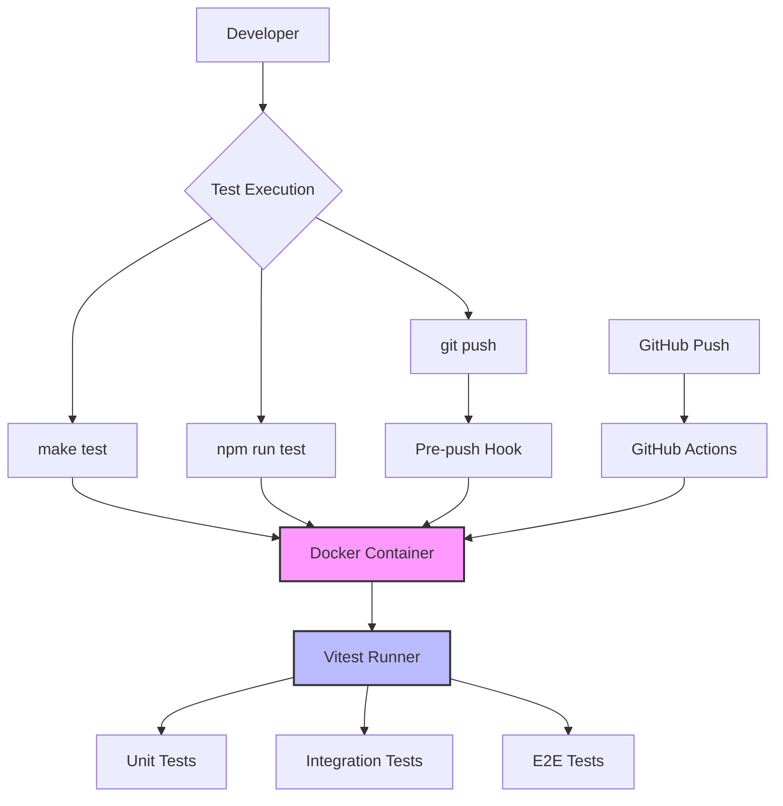
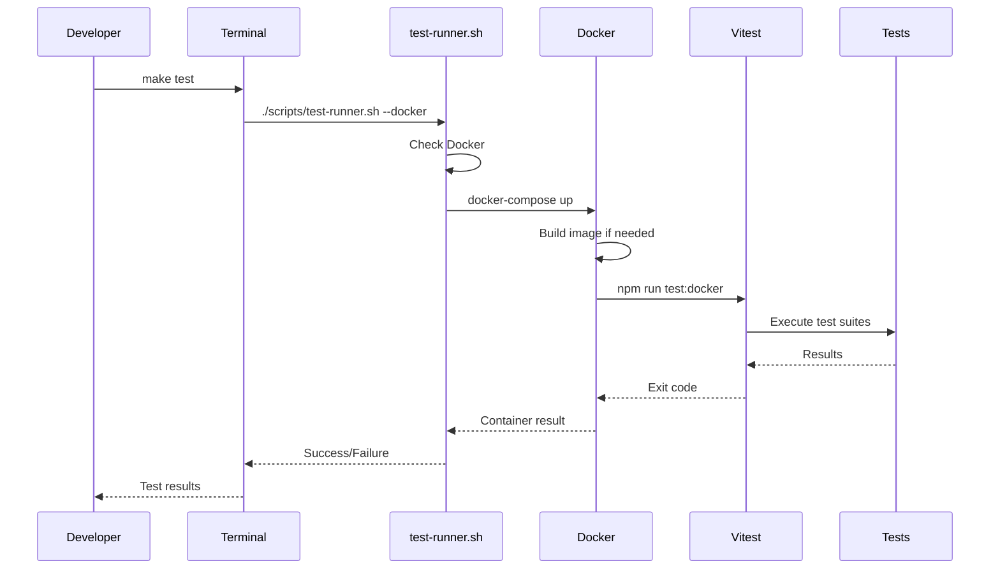

# Testing Infrastructure Setup

## Overview
We've established a comprehensive testing infrastructure for the FlyingRobots.dev project with the following features:

- **Dockerized Testing**: Consistent test execution across all environments
- **Single Test Command**: `make test` runs the same tests everywhere
- **Pre-push Hooks**: Automatic test validation before pushing
- **GitHub Actions**: CI/CD pipeline for automated testing
- **Vitest Framework**: Modern, fast test runner with excellent DX

## Architecture



## Test Execution Flow



## Test Execution Methods

All methods run **exactly the same tests** in **exactly the same environment**:

### 1. Local Development
```bash
# Recommended - runs in Docker
make test

# Alternative - runs in Docker
npm test

# For development with watch mode
make test-watch

# For coverage report
make test-coverage
```

### 2. Pre-push Hook
Automatically runs when you `git push`:
```bash
git push origin main
# Automatically executes: make test
```

### 3. GitHub Actions
Triggered on:
- Push to main/develop branches
- Pull requests to main

## File Structure
```
flyingrobots.dev/
├── tests/
│   ├── setup.js              # Global test setup
│   ├── utils/
│   │   └── test-helpers.js   # Shared test utilities
│   ├── unit/
│   │   └── features/        # Feature-specific unit tests
│   ├── integration/         # Integration tests
│   └── e2e/                # End-to-end tests
├── Dockerfile.test          # Test container definition
├── docker-compose.test.yml  # Docker composition
├── vitest.config.js        # Vitest configuration
├── Makefile                # Unified commands
├── scripts/
│   └── test-runner.sh      # Test execution script
└── .github/
    └── workflows/
        └── test.yml        # GitHub Actions workflow
```

## Test Coverage

### Current Test Files
1. **3D Scene Rendering** (`scene-rendering.test.js`)
   - Scene initialization
   - Lighting system
   - Window resize handling
   - Shape creation
   - Performance requirements

2. **Physics Simulation** (`physics-simulation.test.js`)
   - Physics world initialization
   - Body creation and removal
   - AABB calculations
   - Forces and motion
   - Collision detection
   - Boundary constraints
   - Gravitational attraction

3. **Interactive Terminal** (`interactive-terminal.test.js`)
   - Terminal initialization
   - Command execution
   - History navigation
   - Autocomplete
   - Scene integration
   - UI commands
   - Portfolio commands
   - Special effects

4. **Instanced Rendering** (`instanced-rendering.test.js`)
   - Initialization
   - Shape addition
   - Physics synchronization
   - Body removal
   - Performance characteristics

## Running Tests

### Quick Start
```bash
# Install dependencies and setup
make install

# Run all tests
make test
```

### Development Workflow
```bash
# Run tests in watch mode for TDD
make test-watch

# Run specific test file
npx vitest run tests/unit/features/physics-simulation.test.js

# Run with coverage
make test-coverage
```

### Docker Commands
```bash
# Build test container
docker-compose -f docker-compose.test.yml build

# Run tests in container
docker-compose -f docker-compose.test.yml run test

# Clean up
docker-compose -f docker-compose.test.yml down
```

## Configuration

### Vitest Configuration (`vitest.config.js`)
- Environment: `happy-dom` (lightweight DOM)
- Coverage: 80% threshold for all metrics
- Reporters: JSON and JUnit for CI
- Global setup with WebGL mocks

### Docker Configuration
- Base image: `node:20-alpine`
- Includes Chromium for browser testing
- Volumes for live code updates
- Isolated test environment

### GitHub Actions
- Matrix testing: Node 18.x and 20.x
- Coverage upload to Codecov
- PR comments with test results
- Artifact storage for test results

## Best Practices

### Writing Tests
1. **Use Test Helpers**: Import from `tests/utils/test-helpers.js`
2. **Mock External Dependencies**: WebGL, DOM, etc.
3. **Test Behavior, Not Implementation**: Focus on what, not how
4. **Keep Tests Fast**: Avoid real timeouts, use fake timers
5. **Clean Up**: Always clean up DOM and mocks after tests

### Test Organization
```javascript
describe('Feature Name', () => {
  describe('Sub-feature', () => {
    it('should do something specific', () => {
      // Arrange
      const input = setupTestData();
      
      // Act
      const result = performAction(input);
      
      // Assert
      expect(result).toBe(expected);
    });
  });
});
```

### Continuous Integration
- All tests must pass before merge
- Coverage must meet 80% threshold
- Tests run on multiple Node versions
- Results posted to PR comments

## Troubleshooting

### Common Issues

1. **Tests fail locally but pass in CI**
   - Ensure you're using `make test` (Docker)
   - Check Node version compatibility
   - Clear node_modules and reinstall

2. **WebGL-related errors**
   - Mocks are in `tests/setup.js`
   - Check if new WebGL methods need mocking

3. **Import errors**
   - Verify module resolution in `vitest.config.js`
   - Check relative import paths

4. **Coverage not meeting threshold**
   - Run `make test-coverage` to see report
   - Focus on testing critical paths
   - Add tests for error cases

## Next Steps

### Immediate Priorities
- [ ] Complete Camera System tests
- [ ] Add Post-Processing Effects tests
- [ ] Create integration tests for feature interactions
- [ ] Add E2E tests for user workflows

### Future Enhancements
- [ ] Visual regression testing
- [ ] Performance benchmarking
- [ ] Mutation testing
- [ ] Test data factories
- [ ] Snapshot testing for UI components

## Commands Reference

| Command | Description | Environment |
|---------|-------------|-------------|
| `make test` | Run all tests | Docker |
| `make test-local` | Run tests locally | Host |
| `make test-watch` | Watch mode | Host |
| `make test-coverage` | Coverage report | Docker |
| `make clean` | Clean artifacts | Host |
| `make install` | Setup everything | Host |

## Conclusion

The testing infrastructure is now fully operational with:
- ✅ Consistent execution across all environments
- ✅ Automated testing on git push
- ✅ CI/CD pipeline with GitHub Actions
- ✅ Comprehensive test coverage started
- ✅ Docker isolation for reproducibility

To run tests: **`make test`** - it's that simple!