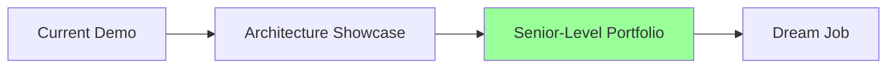
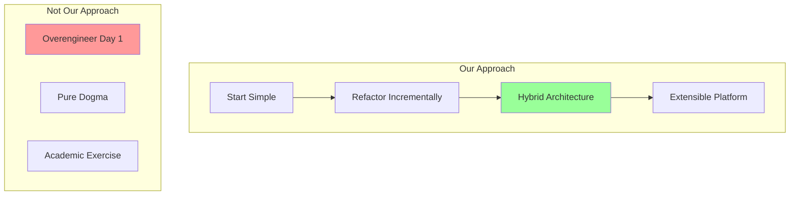
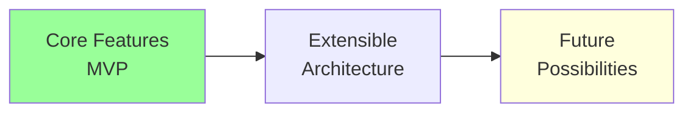
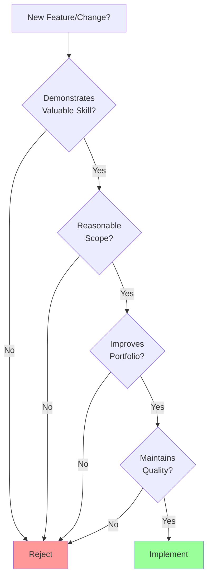
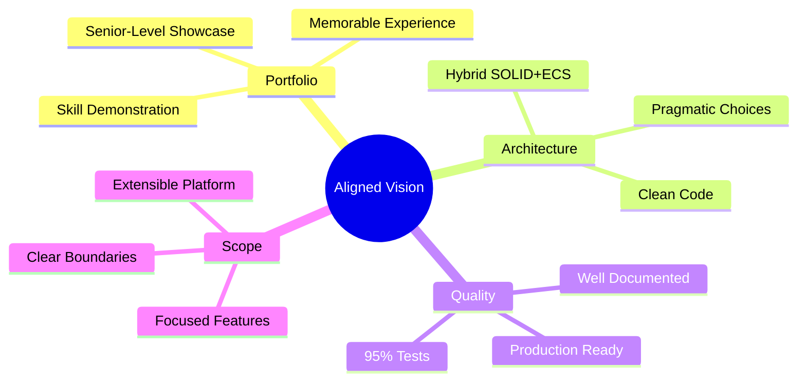

# Vision Alignment: FlyingRobots.dev

## Purpose of This Document

This document clarifies the shared vision for FlyingRobots.dev to ensure we're aligned on goals, scope, and approach. It addresses potential areas of misalignment and establishes clear boundaries for the project.

## Shared Vision Points ✅

### 1. **Portfolio Excellence**

**We Agree**: This is primarily a portfolio piece that demonstrates senior engineering skills, not a game or product.

### 2. **Quality Over Quantity**
- Production-ready code quality
- 95%+ test coverage
- Professional documentation
- Clean architecture

**We Agree**: Every feature should be polished and demonstrate best practices.

### 3. **Pragmatic Architecture**

**We Agree**: Use the right tool for the job - SOLID where it makes sense, ECS patterns where they add value.

## Potential Misalignment Areas 🤔

### 1. **Scope Creep**

**Concern**: "Should we add multiplayer/AI/procedural generation/etc?"

**Alignment**: 
- These are **future possibilities**, not current goals
- Core features first, then extensibility
- Plugin architecture enables future features without bloating core

### 2. **Complexity Level**

**Concern**: "Is the hybrid architecture too complex?"

**Alignment**:
- Complexity should serve the portfolio goal
- Must remain understandable to other engineers
- Documentation explains the "why" behind decisions

### 3. **Timeline Expectations**

**Concern**: "320-420 hours seems like a lot"

**Alignment**:
- Quality takes time
- Phased approach delivers value incrementally
- Can stop at any phase with portfolio-worthy result

## What This Project IS ✅

1. **A Living Resume**
   - Interactive demonstration of skills
   - Not just code, but architectural thinking
   - Shows progression and learning

2. **An Architecture Playground**
   - Demonstrates SOLID principles
   - Shows ECS understanding
   - Proves pragmatic decision-making

3. **A Teaching Tool**
   - Well-documented decisions
   - Clear code with explanations
   - Example of professional development

4. **A Technical Showcase**
   - Three.js mastery
   - Performance optimization
   - Testing excellence
   - CI/CD implementation

## What This Project IS NOT ❌

1. **Not a Game Engine**
   - No level editor needed
   - No complex gameplay systems
   - No save/load unless demonstrating patterns

2. **Not a Research Project**
   - Use proven technologies
   - Avoid experimental approaches
   - Focus on employable skills

3. **Not a Product**
   - No monetization needed
   - No user accounts
   - No backend unless demonstrating skills

4. **Not an Art Project**
   - Visuals serve the interaction
   - Focus on code quality over graphics
   - Clean aesthetics, not bleeding edge

## Decision Framework

## Success Metrics

### Technical Success
- [ ] 95%+ test coverage
- [ ] Sub-16ms frame time (60 FPS)
- [ ] Clean architecture (no file > 200 lines)
- [ ] Zero security vulnerabilities
- [ ] < 2 second load time

### Portfolio Success
- [ ] Memorable first impression
- [ ] Clear skill demonstration
- [ ] Professional documentation
- [ ] Generates interviews
- [ ] Differentiates from competition

### Personal Success
- [ ] Proud to show for years
- [ ] Learned new patterns
- [ ] Improved architecture skills
- [ ] Built something unique
- [ ] Had fun building it

## Communication Protocol

1. **Major Decisions**: Discuss before implementing
2. **Architecture Changes**: Document in ADRs
3. **Scope Changes**: Re-evaluate timeline
4. **Quality Concerns**: Quality always wins
5. **Confusion Points**: Ask for clarification

## Our Commitment

**I (AI Assistant) commit to:**
- Keeping the project focused on portfolio value
- Suggesting pragmatic solutions over academic ones
- Maintaining high code quality standards
- Documenting decisions clearly
- Respecting the timeline and scope

**You (Developer) guide by:**
- Setting the vision and priorities
- Making final architecture decisions
- Determining feature scope
- Defining quality standards
- Choosing technologies

## Conflict Resolution

If we disagree on approach:

1. **State the concern clearly**
2. **Evaluate against portfolio goal**
3. **Consider timeline impact**
4. **Document the decision**
5. **Move forward aligned**

## Summary

We are aligned on creating a **portfolio masterpiece** that demonstrates **senior engineering skills** through **pragmatic architecture decisions** while maintaining **exceptional quality** and **clear scope boundaries**.

The hybrid SOLID+ECS approach showcases sophisticated thinking without overengineering. Every decision serves the goal: **making you more hireable by demonstrating valuable skills**.

---

*Vision aligned: 6/8/2025*  
*This document ensures we build the right thing, the right way, for the right reasons.*