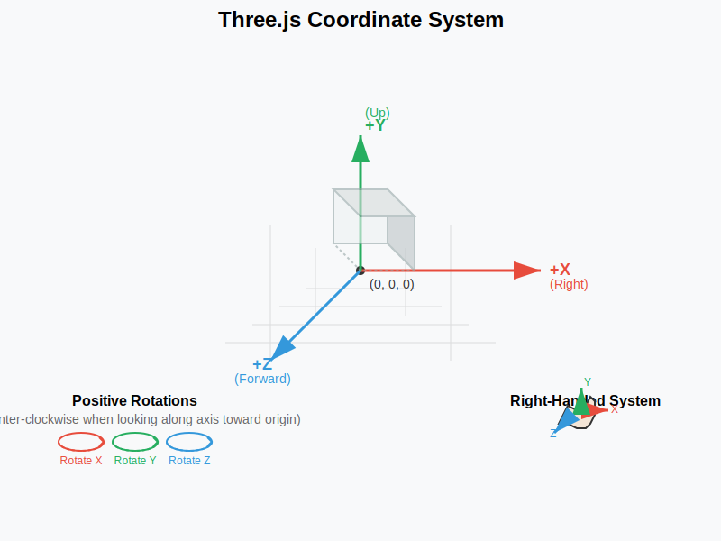
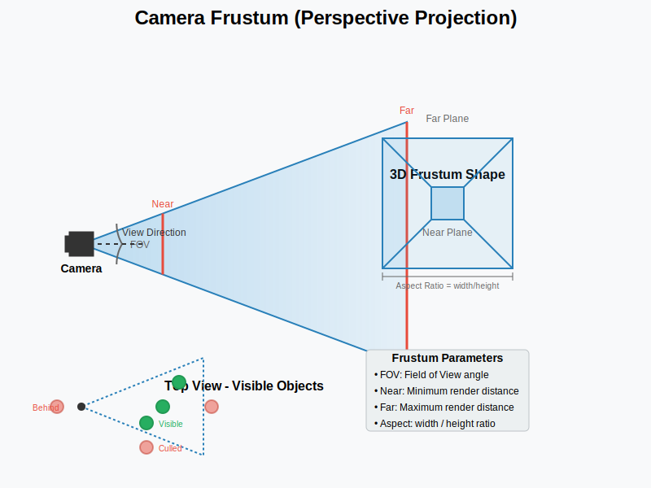
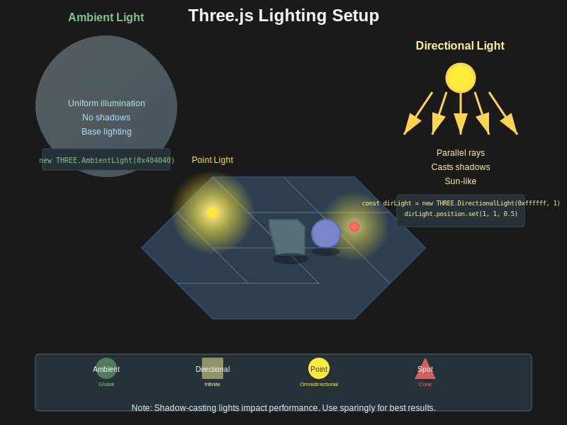
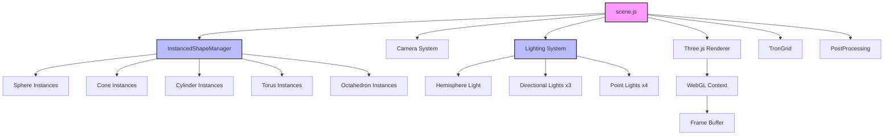
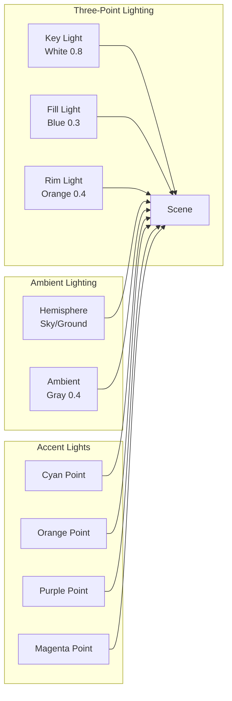

# Feature: 3D Scene Rendering

## Overview
The 3D scene rendering system provides a cyberpunk-themed WebGL environment using Three.js, featuring dynamic shapes, sophisticated lighting, and visual effects. It serves as the backdrop for the portfolio website with interactive elements.

## User Story
As a portfolio visitor, I want to see an impressive 3D animated background that showcases technical skills while maintaining good performance, so that I'm engaged and impressed by the developer's capabilities.

## Acceptance Criteria
- [x] Given the page loads, when rendering starts, then a 3D scene appears with animated shapes
- [x] Given shapes are spawned, when they move, then they animate smoothly at 60 FPS
- [x] Given the window resizes, when the scene updates, then it maintains proper aspect ratio
- [x] Given 1000+ shapes exist, when rendering, then performance remains smooth
- [ ] Given post-processing is enabled, when rendering, then bloom and blur effects apply
- [ ] Given quality settings change, when rendering updates, then performance adapts

## Technical Requirements

### Components Involved
- **scene.js**: Main scene setup and render loop
- **InstancedShapes.js**: Manages instanced mesh rendering for all shapes
- **TronGrid.js**: Creates the animated grid floor effect
- **PostProcessing.js**: Applies visual effects (currently disabled)
- **CyberStructures.js**: Utility for creating cyberpunk-styled shapes

### Visual Concepts

#### Three.js Coordinate System

#### Camera Frustum and Perspective

#### Lighting Setup

### Dependencies
- Three.js r150+
- Three.js examples (EffectComposer, RenderPass, UnrealBloomPass)
- WebGL 2.0 support in browser

### Performance Constraints
- Target: 60 FPS with 1000+ shapes
- Maximum draw calls: < 10 per frame
- Memory usage: < 200MB for geometry/textures
- Load time: < 2 seconds

## Architecture

## Lighting System Details

## Test Cases

### Unit Tests
1. **Scene Initialization Test**
   - Input: Initialize scene with default parameters
   - Expected Output: Scene, camera, renderer created successfully
   - Edge Cases: WebGL not supported, window size 0x0

2. **Shape Creation Test**
   - Input: Create each shape type
   - Expected Output: Correct geometry, material, and instance created
   - Edge Cases: Invalid shape type, exceeding instance limit

3. **Lighting Setup Test**
   - Input: Initialize lighting system
   - Expected Output: All lights created with correct parameters
   - Edge Cases: Shadow map allocation failure

### Integration Tests
1. **Physics-Graphics Sync Test**
   - Setup: Create shapes with physics bodies
   - Actions: Update physics simulation
   - Expected Result: Visual instances match physics positions

2. **Resize Handling Test**
   - Setup: Initialize scene at 1920x1080
   - Actions: Resize window to various sizes
   - Expected Result: Proper aspect ratio maintained, no distortion

### E2E Tests
1. **Performance Test**
   - User Flow: Spawn 1000 shapes gradually
   - Expected Behavior: FPS remains above 30 throughout

## Implementation Notes

### Current Implementation Strengths
- Efficient instanced rendering reduces draw calls
- Sophisticated lighting creates depth and atmosphere
- Modular component structure for maintainability
- Spring-based camera for smooth movement

### Known Issues
1. **Post-processing disabled**: Effects commented out in render loop
2. **Memory management**: Instance slots not fully reclaimed on removal
3. **Shadow limitations**: Only main directional light casts shadows
4. **Mobile performance**: Not optimized for low-end devices

### Optimization Opportunities
1. Implement LOD system for distant objects
2. Add dynamic quality adjustment based on FPS
3. Use texture atlasing for materials
4. Implement frustum culling for off-screen objects
5. Add WebWorker for physics calculations

## Visual/UX Specifications

### Color Palette
- Background: #000428 (dark blue gradient)
- Shapes: Cyan (#00ffff), Orange (#ff6600), Purple (#9945ff), Magenta (#ff00ff), Green (#00ff00)
- Grid: Cyan primary, Orange accent
- Fog: #000428, density 0.02

### Animation Timing
- Shape rotation: 0.01-0.03 rad/frame
- Grid rotation: 0.0005 rad/frame
- Tracer movement: 0.5-1.0 units/frame
- Camera spring: Critically damped (ζ = 1.0)

## Accessibility Requirements
- [ ] Provide option to disable motion
- [ ] Add high contrast mode
- [ ] Ensure scene doesn't interfere with screen readers
- [ ] Respect prefers-reduced-motion

## Security Considerations
- WebGL context validation
- Shader compilation error handling
- Memory limit enforcement
- No external asset loading without validation

## Metrics for Success
- Average FPS: > 55
- Draw calls: < 10
- First paint: < 1000ms
- Memory usage: < 200MB
- Shape capacity: 1000+

## Related Features
- [Physics Simulation](./02-physics-simulation.md)
- [Instanced Rendering](./04-instanced-rendering.md)
- [Post-Processing Effects](./05-post-processing-effects.md)
- [Camera System](./06-camera-system.md)

## Status
- [x] Documented
- [ ] Tests Written (Not started)
- [x] Implementation Started
- [x] Implementation Complete (85%)
- [ ] Tests Passing
- [ ] Code Review Complete
- [x] Deployed

## Test Status
- **Tests Written**: No
- **Test Coverage**: 0%
- **Status**: Tests need to be written for scene initialization, shape creation, lighting setup, and resize handling

## Notes
- Consider adding particle effects for enhanced cyberpunk aesthetic
- Explore adding audio visualization integration
- Post-processing needs to be re-enabled and optimized
- Mobile performance optimization is critical for wider accessibility
- Consider implementing progressive enhancement for older browsers