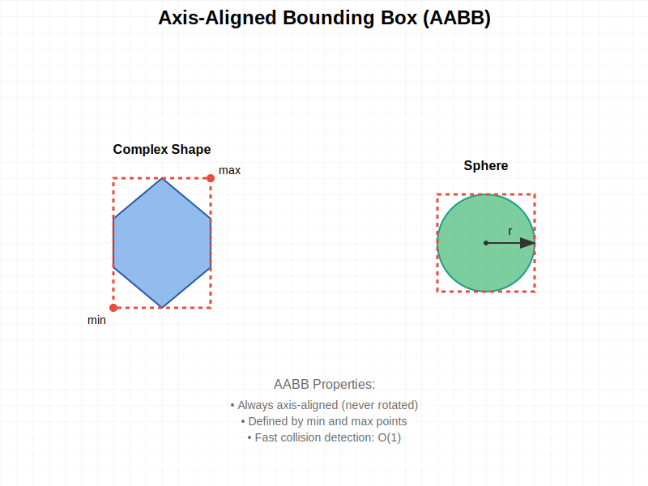
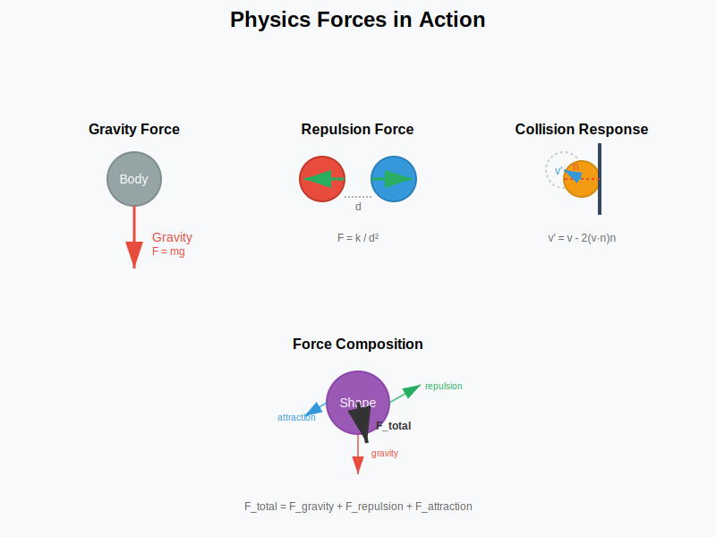
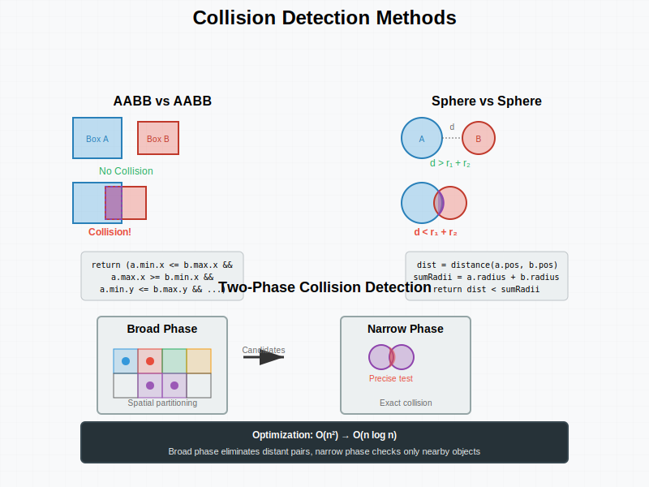
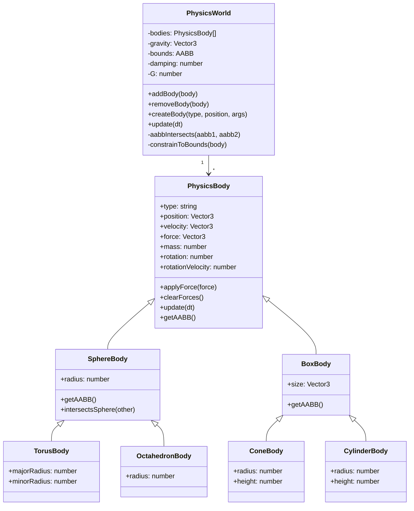
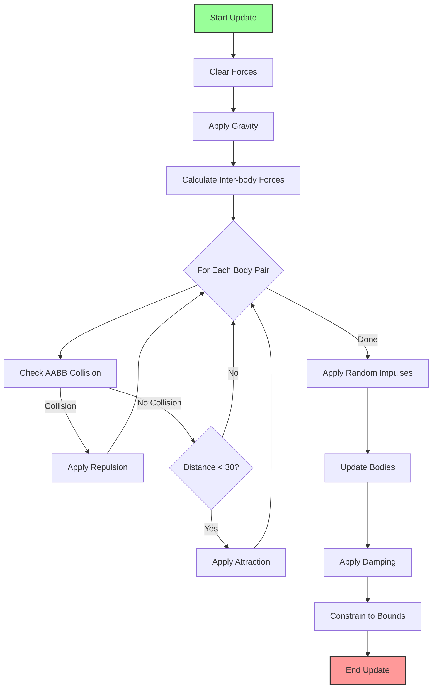
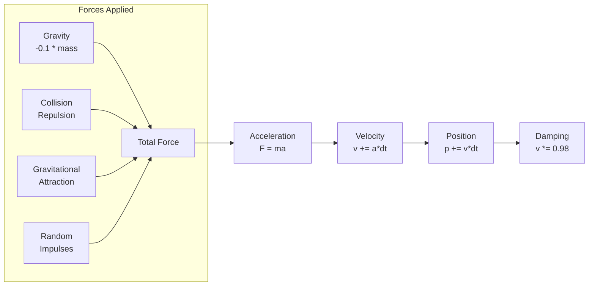
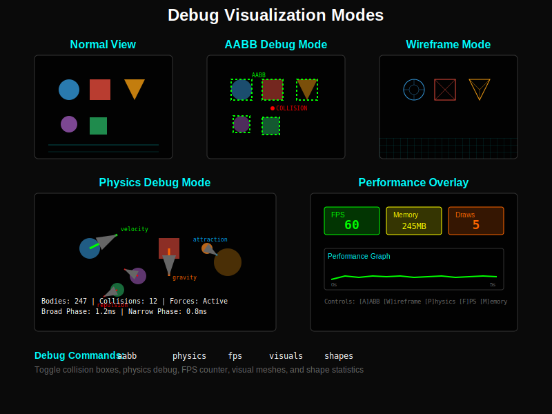

# Feature: Physics Simulation

## Overview
A custom-built physics engine that provides realistic motion simulation for 3D objects in the scene. The system is completely decoupled from the rendering engine, using mathematical representations for collision detection and force calculations.

## User Story
As a portfolio visitor, I want to see objects move naturally with physics-based motion including gravity, collisions, and attraction, so that the scene feels dynamic and engaging.

## Acceptance Criteria
- [x] Given objects spawn, when they fall, then gravity affects their motion
- [x] Given objects collide, when they touch, then they bounce apart realistically
- [x] Given objects are near each other, when within range, then gravitational attraction applies
- [x] Given objects hit boundaries, when at world edge, then they bounce back with damping
- [ ] Given high object density, when many collisions occur, then performance remains stable
- [ ] Given physics runs, when frame rate varies, then simulation remains deterministic

## Technical Requirements

### Components Involved
- **PhysicsWorld.js**: Main physics simulation engine
- **PhysicsBody**: Base class for all physics objects
- **Shape Bodies**: Sphere, Box, Cone, Cylinder, Torus, Octahedron implementations
- **Collision Detection**: AABB-based collision system
- **Force System**: Gravity, attraction, repulsion, and impulse forces

### Visual Concepts

#### AABB Collision Detection

#### Physics Forces

#### Collision Detection Methods

### Dependencies
- Three.js (for Vector3 math only)
- No external physics libraries (custom implementation)

### Performance Constraints
- Update cycle: 60 Hz (16ms per frame)
- Maximum bodies: 1000+
- Collision checks: O(n²) currently (needs optimization)
- Memory per body: ~200 bytes

## Architecture

## Physics Pipeline

## Force System

## Test Cases

### Unit Tests
1. **Gravity Application Test**
   - Input: Body with mass 10 at rest
   - Expected Output: Downward velocity after update
   - Edge Cases: Zero mass, negative mass

2. **AABB Collision Test**
   - Input: Two overlapping AABBs
   - Expected Output: True for intersection
   - Edge Cases: Touching edges, contained boxes

3. **Boundary Constraint Test**
   - Input: Body outside world bounds
   - Expected Output: Position corrected, velocity reversed
   - Edge Cases: Corner collisions, high velocity

4. **Force Integration Test**
   - Input: Constant force for 1 second
   - Expected Output: Correct final velocity and position
   - Edge Cases: Zero dt, very large dt

### Integration Tests
1. **Multi-body Collision Test**
   - Setup: 10 bodies in close proximity
   - Actions: Run simulation for 100 frames
   - Expected Result: No interpenetration, stable motion

2. **Performance Scaling Test**
   - Setup: Gradually add bodies from 100 to 1000
   - Actions: Measure update time per frame
   - Expected Result: Linear scaling, < 16ms at 1000 bodies

### E2E Tests
1. **Physics Stability Test**
   - User Flow: Spawn 500 shapes, let simulate for 60 seconds
   - Expected Behavior: No explosions, bodies settle naturally

## Implementation Notes

### Current Implementation
- **AABB Simplification**: All shapes use axis-aligned bounding boxes for collision
- **O(n²) Complexity**: All pairs checked each frame (needs spatial partitioning)
- **Fixed Time Step**: Assumes 60 FPS, not frame-independent
- **Simple Integration**: Euler integration (could use Verlet for stability)

### Missing Features
1. **Continuous Collision Detection**: Fast objects can tunnel through
2. **Spatial Partitioning**: No octree/quadtree for efficient collision detection
3. **Rotation Physics**: Only simple rotation, no angular momentum
4. **Constraints/Joints**: No way to connect bodies
5. **Friction**: No surface friction implemented
6. **Restitution Control**: Fixed bounce factor of 0.7

### Optimization Opportunities
1. **Implement Octree**: Reduce collision checks from O(n²) to O(n log n)
2. **Use Verlet Integration**: More stable at varying time steps
3. **SIMD Operations**: Vectorize force calculations
4. **Broad/Narrow Phase**: Two-stage collision detection
5. **Sleep States**: Don't update stationary bodies

## Physics Constants

| Constant | Value | Description |
|----------|-------|-------------|
| Gravity | -0.1 | Downward acceleration |
| Damping | 0.98 | Velocity reduction per frame |
| G | 2.0 | Gravitational constant |
| Restitution | 0.7 | Bounce factor at boundaries |
| Attraction Range | 30 | Maximum distance for gravity |
| Impulse Timer | 200-600 | Frames between random impulses |

## Visual/UX Specifications
- Smooth, natural motion at 60 FPS
- Objects cluster but don't overlap
- Gentle floating motion from impulses
- Boundary bounces feel elastic
- No sudden jumps or explosions

## Debug Visualization

### Debug Modes

## Accessibility Requirements
- [ ] Option to reduce motion intensity
- [ ] Pause physics simulation
- [ ] Adjustable simulation speed
- [ ] Visual indicators for forces (debug mode)

## Security Considerations
- Validate all numeric inputs to prevent overflow
- Limit maximum velocities to prevent instability
- Cap number of bodies to prevent memory exhaustion
- Sanitize any user-provided physics parameters

## Metrics for Success
- Update time: < 5ms for 500 bodies
- Collision accuracy: 99.9% (no tunneling)
- Memory usage: < 1MB for 1000 bodies
- Stability: No explosions over 1 hour runtime
- Frame independence: Consistent behavior 30-144 FPS

## Related Features
- [3D Scene Rendering](./01-3d-scene-rendering.md)
- [Instanced Rendering](./04-instanced-rendering.md)
- [Interactive Terminal](./03-interactive-terminal.md) (spawn commands)

## Status
- [x] Documented
- [x] Tests Written (12 tests)
- [x] Implementation Started
- [x] Implementation Complete (75%)
- [ ] Tests Passing (Some failing)
- [ ] Code Review Complete
- [x] Deployed

## Test Status
- **Tests Written**: Yes (12 tests)
- **Test Coverage**: ~60%
- **Status**: Tests written but some are failing. Includes unit tests for gravity application, AABB collision detection, boundary constraints, and force integration. Integration tests for multi-body collisions and performance scaling also implemented.

## Notes
- Consider using a proven physics library (Cannon-ES, Rapier) for production
- Current implementation good for learning but lacks advanced features
- Spatial partitioning is critical for scaling beyond 1000 bodies
- Frame-independent timing needed for consistent behavior across devices
- Add physics debugging visualization for development