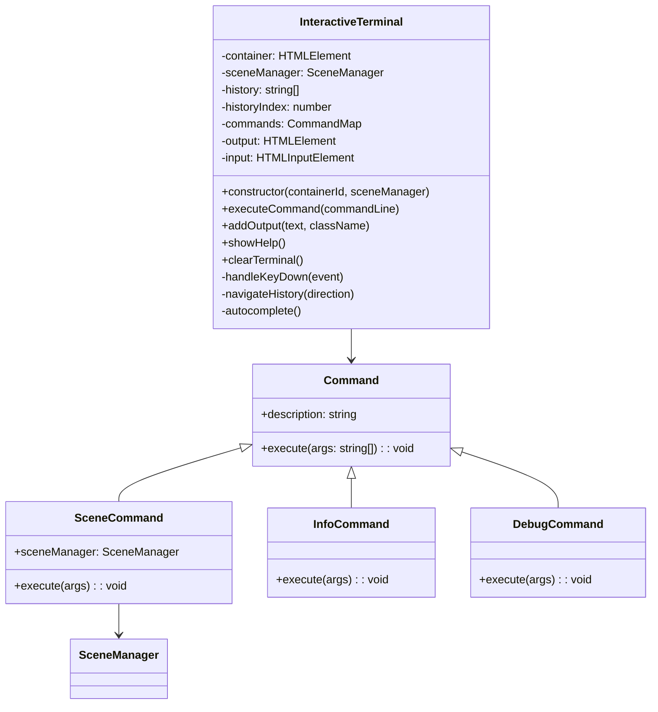
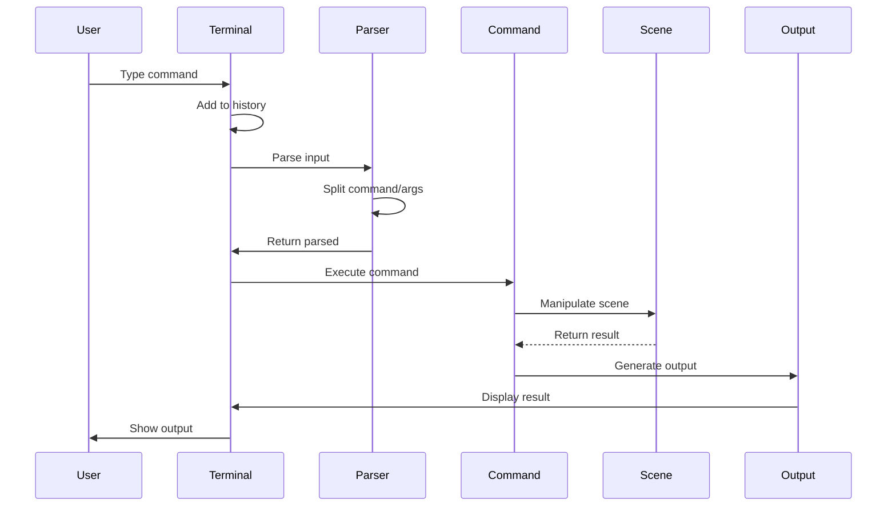
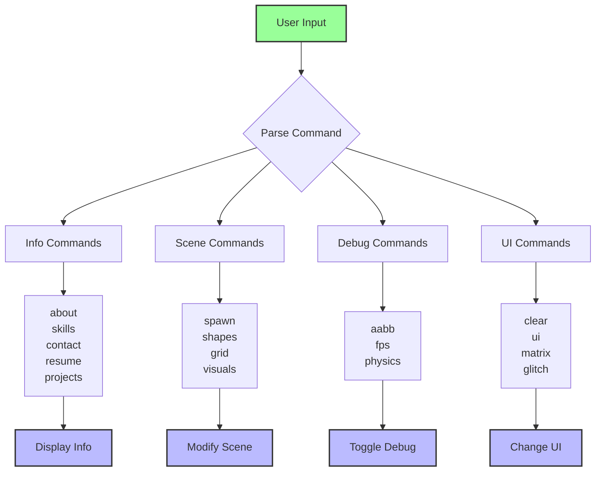
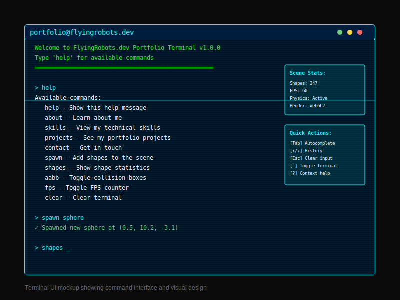

# Feature: Interactive Terminal

## Overview
A fully-featured command-line interface embedded in the web application that allows users to interact with the 3D scene, explore portfolio information, and control various aspects of the application through text commands.

## User Story
As a portfolio visitor, I want to interact with the application through a familiar terminal interface, so that I can explore the developer's skills and control the scene in an engaging, hacker-themed way.

## Acceptance Criteria
- [x] Given the terminal is open, when I type a command, then it executes and shows results
- [x] Given I press arrow keys, when navigating, then command history is accessible
- [x] Given I press Tab, when typing partial command, then autocomplete suggests matches
- [x] Given I type 'help', when executed, then all available commands are listed
- [x] Given I resize/drag terminal, when interacting, then position/size persists
- [ ] Given I type invalid syntax, when executed, then helpful error messages appear
- [ ] Given commands have parameters, when missing, then usage examples are shown

## Technical Requirements

### Components Involved
- **Terminal.js**: Main terminal implementation
- **terminal.css**: Terminal-specific styling
- **SceneManager**: Integration point for scene manipulation
- **Command System**: Extensible command architecture

### Dependencies
- No external terminal libraries (custom implementation)
- DOM manipulation for UI
- Integration with scene components

### Performance Constraints
- Input latency: < 50ms
- Command execution: < 100ms
- History size: 1000 commands
- Output buffer: 10000 lines

## Architecture

## Command Flow

## Command System

## Test Cases

### Unit Tests
1. **Command Parsing Test**
   - Input: "spawn sphere"
   - Expected Output: Command="spawn", Args=["sphere"]
   - Edge Cases: Extra spaces, mixed case, special characters

2. **History Navigation Test**
   - Input: Arrow up/down key presses
   - Expected Output: Previous commands appear in input
   - Edge Cases: Empty history, history boundaries

3. **Autocomplete Test**
   - Input: "sp" + Tab
   - Expected Output: "spawn" completed
   - Edge Cases: No matches, multiple matches, exact match

4. **Command Execution Test**
   - Input: Valid command
   - Expected Output: Command executes, output displayed
   - Edge Cases: Invalid command, missing scene manager

### Integration Tests
1. **Scene Manipulation Test**
   - Setup: Terminal connected to scene
   - Actions: Execute spawn, toggle commands
   - Expected Result: Scene updates accordingly

2. **UI Interaction Test**
   - Setup: Terminal with UI elements
   - Actions: Minimize, maximize, close, drag
   - Expected Result: Terminal state changes persist

### E2E Tests
1. **Full Command Flow Test**
   - User Flow: Open terminal → Type help → Execute commands → Use history
   - Expected Behavior: All commands work, history accessible, output correct

## Implementation Notes

### Current Features
- **Command Architecture**: Extensible command system with descriptions
- **History Management**: Full command history with arrow navigation
- **Autocomplete**: Tab completion for commands
- **Rich Output**: Styled output with ASCII art and colors
- **Window Controls**: Minimize, maximize, close functionality
- **Integration**: Deep integration with scene manager
- **Special Effects**: Matrix mode, glitch effects

### Missing Features
1. **Command Aliases**: No way to create shortcuts
2. **Piping**: Can't chain commands together
3. **Variables**: No variable storage/retrieval
4. **Scripts**: Can't run command sequences
5. **Help Details**: No detailed help per command
6. **Parameter Validation**: Limited argument checking
7. **Persistent History**: History lost on reload

### Enhancement Opportunities
1. **Add command aliases** (e.g., 'ls' → 'shapes')
2. **Implement piping** for command chaining
3. **Add variables** for storing values
4. **Create scripting** support
5. **Enhance help** with usage examples
6. **Add parameter validation** with helpful errors
7. **Persist history** to localStorage

## Command Reference

| Command | Description | Parameters | Example |
|---------|-------------|------------|---------|
| help | Show available commands | None | `help` |
| clear | Clear terminal output | None | `clear` |
| about | About James Ross | None | `about` |
| skills | List technical skills | None | `skills` |
| contact | Show contact info | None | `contact` |
| resume | Download resume | None | `resume` |
| projects | Show notable projects | None | `projects` |
| matrix | Enter the matrix | None | `matrix` |
| glitch | Activate glitch mode | None | `glitch` |
| shapes | Display shape count | None | `shapes` |
| spawn | Spawn a new shape | [type] | `spawn sphere` |
| aabb | Toggle AABB visibility | None | `aabb` |
| fps | Toggle FPS counter | None | `fps` |
| visuals | Toggle visual meshes | None | `visuals` |
| physics | Toggle physics wireframes | None | `physics` |
| grid | Toggle grid visibility | None | `grid` |
| ui | Toggle all UI elements | None | `ui` |

## Visual/UX Specifications

### Terminal UI Design

### Terminal Styling
- Font: 'Orbitron' monospace
- Background: rgba(0, 0, 0, 0.9)
- Border: 2px solid #00ffff
- Text Color: #00ffff (cyan)
- Error Color: #ff0066 (red)
- Success Color: #00ff00 (green)
- Box Shadow: Cyan glow effect

### Animations
- Cursor blink: 1s interval
- Glitch effect: 3s duration
- Matrix rain: 50ms per line
- Command fade-in: 0.2s

### Layout
- Default: Bottom-right corner
- Minimized: Title bar only
- Maximized: 80% viewport
- Draggable and resizable

## Accessibility Requirements
- [x] Keyboard-only navigation
- [ ] Screen reader announcements
- [ ] High contrast mode support
- [ ] Configurable font size
- [ ] Motion reduction options

## Security Considerations
- Input sanitization for XSS prevention
- Command injection protection
- No eval() or Function() usage
- Safe HTML rendering for output
- Rate limiting for command execution

## Metrics for Success
- Command response time: < 100ms
- Autocomplete accuracy: > 95%
- History retrieval: < 10ms
- Zero crashes from invalid input
- FPS impact: < 2 FPS drop

## Related Features
- [3D Scene Rendering](./01-3d-scene-rendering.md) (scene commands)
- [Physics Simulation](./02-physics-simulation.md) (debug visualization)
- [UI/Portfolio Layout](./07-ui-portfolio-layout.md) (UI toggle command)

## Status
- [x] Documented
- [x] Tests Written (8 tests)
- [x] Implementation Started
- [x] Implementation Complete (80%)
- [ ] Tests Passing (Some failing)
- [ ] Code Review Complete
- [x] Deployed

## Test Status
- **Tests Written**: Yes (8 tests)
- **Test Coverage**: ~50%
- **Status**: Tests written but some are failing. Includes unit tests for command parsing, history navigation, autocomplete, and command execution. Integration tests for scene manipulation and UI interaction also implemented.

## Notes
- Consider adding more developer-focused commands
- Explore WebSocket integration for remote control
- Add command macros for common sequences
- Implement undo/redo functionality
- Consider adding a command palette UI alternative