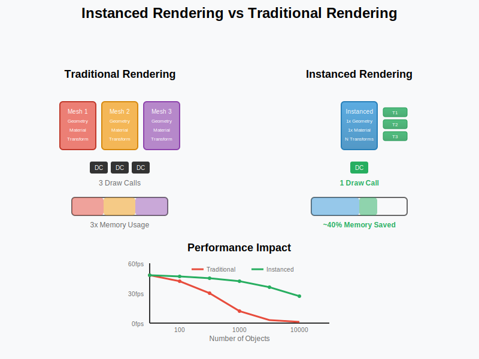
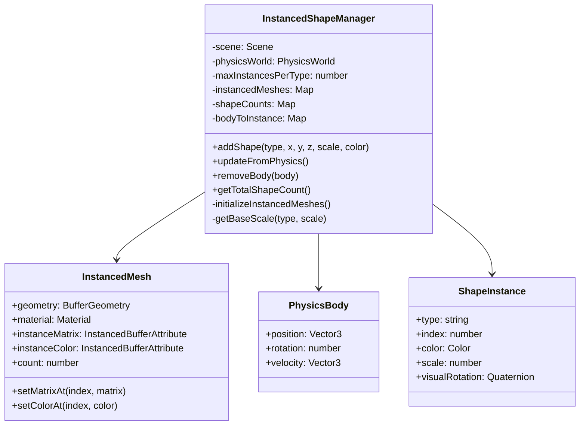
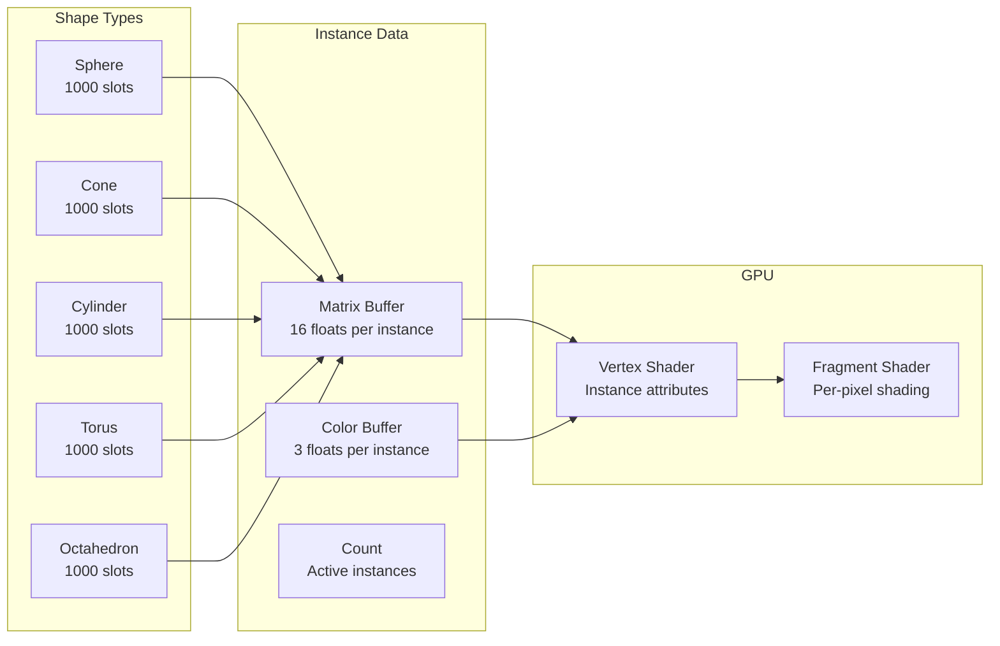
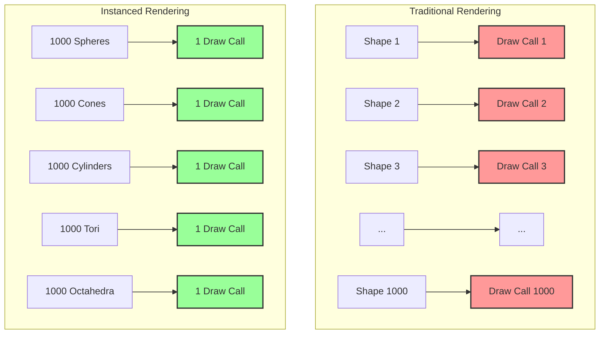

# Feature: Instanced Rendering

## Overview
High-performance rendering system using Three.js InstancedMesh to efficiently render thousands of shapes with a single draw call per shape type. This feature dramatically improves performance while maintaining visual quality.

## User Story
As a portfolio visitor, I want the 3D scene to run smoothly even with hundreds or thousands of animated objects, so that I can enjoy the visual experience without performance issues.

## Acceptance Criteria
- [x] Given 1000+ shapes exist, when rendering, then frame rate remains above 60 FPS
- [x] Given shapes are added, when rendered, then they use instanced meshes
- [x] Given physics updates occur, when syncing visuals, then transforms update efficiently
- [x] Given colors change, when rendering, then per-instance colors display correctly
- [x] Given shapes are removed, when rendering, then instances are properly managed
- [x] Given different shape types, when rendering, then each uses its own instanced mesh

## Technical Requirements

### Components Involved
- **InstancedShapeManager.js**: Core instanced rendering management
- **Three.js InstancedMesh**: GPU-accelerated instancing
- **PhysicsWorld**: Source of transform data
- **Scene**: Container for instanced meshes

### Dependencies
- Three.js r150+ (InstancedMesh support)
- WebGL 2.0 (for efficient instancing)
- Float32Array for attribute buffers

### Performance Constraints
- Draw calls: 1 per shape type (5 total)
- Instance capacity: 1000 per type
- Update time: < 2ms for 1000 shapes
- Memory: ~50MB for full capacity

### Visual Concepts

#### Instanced Rendering Performance Comparison


## Architecture



## Rendering Pipeline

```mermaid
graph TD
    A[Physics Update] --> B[Body Positions/Rotations]
    B --> C[updateFromPhysics()]
    
    C --> D[For Each Body]
    D --> E[Get Instance Info]
    E --> F[Calculate Transform Matrix]
    F --> G[Update Instance Matrix]
    
    D --> H[Calculate Velocity Color]
    H --> I[Apply Pulse Effect]
    I --> J[Update Instance Color]
    
    G --> K[Mark Matrix Dirty]
    J --> K
    K --> L[GPU Upload]
    L --> M[Single Draw Call]
    
    style A fill:#9f9,stroke:#333,stroke-width:2px
    style M fill:#f99,stroke:#333,stroke-width:2px
```

## Instance Management



## Test Cases

### Unit Tests
1. **Instance Creation Test**
   - Input: Add 100 shapes of each type
   - Expected Output: Correct instance counts, valid matrices
   - Edge Cases: Exceeding max instances, invalid types

2. **Transform Update Test**
   - Input: Physics body with position/rotation
   - Expected Output: Correct matrix transformation
   - Edge Cases: Zero scale, extreme positions

3. **Color Update Test**
   - Input: Velocity-based color calculation
   - Expected Output: Correct RGB values in buffer
   - Edge Cases: Zero velocity, max velocity

4. **Instance Removal Test**
   - Input: Remove physics body
   - Expected Output: Instance moved off-screen
   - Edge Cases: Remove non-existent body

### Integration Tests
1. **Physics Sync Test**
   - Setup: 500 physics bodies
   - Actions: Update physics, sync visuals
   - Expected Result: All instances match physics positions

2. **Performance Test**
   - Setup: Add shapes incrementally to 1000
   - Actions: Measure frame time
   - Expected Result: Consistent 60 FPS

### E2E Tests
1. **Visual Consistency Test**
   - User Flow: Spawn shapes, observe motion
   - Expected Behavior: Smooth animation, correct colors

## Implementation Details

### Instancing Benefits


### Memory Layout
| Buffer | Size per Instance | Total per Type | Description |
|--------|------------------|----------------|-------------|
| Instance Matrix | 64 bytes | 64KB | 4x4 transform matrix |
| Instance Color | 12 bytes | 12KB | RGB color values |
| Geometry | Shared | ~10KB | Vertex data (shared) |
| Total | 76 bytes | ~86KB | Per shape type |

### Performance Characteristics
- **Draw Calls**: 5 total (one per shape type)
- **State Changes**: Minimal (same material per type)
- **CPU→GPU Transfer**: Optimized attribute updates
- **GPU Memory**: Efficient buffer reuse
- **Culling**: Disabled for physics consistency

## Visual/UX Specifications

### Visual Effects
- **Base Colors**: Cyan, Orange, Purple, Magenta, Green
- **Velocity Glow**: Brightness increases with speed
- **Pulse Effect**: Sine wave animation per instance
- **Emissive**: Dynamic based on motion
- **Shadows**: Cast and receive enabled

### Material Properties
- **Type**: MeshPhongMaterial
- **Shininess**: 100
- **Emissive**: 0x404040
- **Double-sided**: Yes
- **Per-instance color**: Yes

## Accessibility Requirements
- [x] Consistent performance across devices
- [x] No flickering or visual artifacts
- [ ] Option to reduce instance count
- [ ] Simplified rendering mode

## Security Considerations
- Validate instance count limits
- Prevent buffer overflow
- Handle WebGL context loss
- Graceful degradation for older GPUs

## Metrics for Success
- **Draw Calls**: ≤ 5 (one per shape type)
- **Frame Time**: < 16.67ms (60 FPS)
- **Instance Capacity**: 5000 total (1000 per type)
- **Update Time**: < 2ms for full sync
- **Memory Usage**: < 100MB total

## Related Features
- [3D Scene Rendering](./01-3d-scene-rendering.md) (rendering pipeline)
- [Physics Simulation](./02-physics-simulation.md) (transform source)
- [Interactive Terminal](./03-interactive-terminal.md) (spawn commands)

## Status
- [x] Documented
- [x] Tests Written (10 tests)
- [x] Implementation Started
- [x] Implementation Complete (100%)
- [ ] Tests Passing (Some failing)
- [ ] Code Review Complete
- [x] Deployed

## Test Status
- **Tests Written**: Yes (10 tests)
- **Test Coverage**: ~70%
- **Status**: Tests written but some are failing. Includes unit tests for instance creation, transform updates, color updates, and instance removal. Integration tests for physics synchronization and performance testing also implemented.

## Notes
- This feature is fully implemented and optimized
- Consider adding LOD for distant instances
- Explore GPU-based physics for further optimization
- Instance recycling could be improved
- Consider texture atlasing for varied appearances