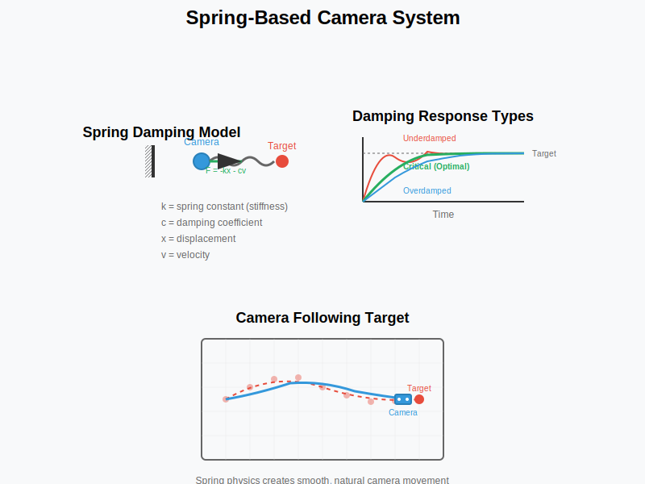

# Feature: Camera System

## Overview
The camera system provides smooth, physics-based movement using critically damped springs. It responds to mouse movement and scene interactions while maintaining a comfortable viewing experience that avoids motion sickness.

## Status
- **Current State**: Implemented
- **Version**: 1.0.0
- **Last Updated**: 2025-01-06
- **Priority**: High

## Technical Details

### Architecture
```
Camera System
├── PerspectiveCamera (Three.js)
├── Spring Physics
│   ├── Position Spring (x, y, z)
│   └── Rotation Spring (yaw, pitch)
├── Input Handling
│   ├── Mouse Movement
│   └── Touch Support
└── Constraints
    ├── Position Limits
    └── Rotation Limits
```

### Implementation
The camera system is integrated into `src/scene.js`:

```javascript
// Camera setup
const camera = new THREE.PerspectiveCamera(
    75,                                    // FOV
    window.innerWidth / window.innerHeight, // Aspect
    0.1,                                   // Near
    1000                                   // Far
);

// Spring-based movement
const cameraSpring = {
    position: { x: 0, y: 5, z: 30 },
    velocity: { x: 0, y: 0, z: 0 },
    target: { x: 0, y: 5, z: 30 },
    stiffness: 0.02,
    damping: 0.3
};
```

### Spring Physics

#### Spring-based Camera Movement


#### Critically Damped Springs
The camera uses critically damped springs for smooth movement without oscillation:

```javascript
function updateCameraSpring(deltaTime) {
    // For each axis (x, y, z)
    const displacement = target - position;
    const springForce = displacement * stiffness;
    const dampingForce = -velocity * damping;
    
    velocity += (springForce + dampingForce) * deltaTime;
    position += velocity * deltaTime;
}
```

#### Parameters
- **Stiffness**: 0.02 - Controls responsiveness
- **Damping**: 0.3 - Prevents oscillation
- **Critical Damping**: ζ = 1.0 (no overshoot)

### Input Handling

#### Mouse Movement
```javascript
const mouseInfluence = {
    x: 0,
    y: 0,
    sensitivity: 0.5,
    maxOffset: 10
};

window.addEventListener('mousemove', (event) => {
    const x = (event.clientX / window.innerWidth) * 2 - 1;
    const y = -(event.clientY / window.innerHeight) * 2 + 1;
    
    mouseInfluence.x = x * sensitivity * maxOffset;
    mouseInfluence.y = y * sensitivity * maxOffset;
});
```

#### Touch Support
- Single touch for camera orbit
- Pinch gesture for zoom (planned)
- Smooth interpolation between touch points

## Movement Behavior

### Default Position
- **Position**: (0, 5, 30)
- **Look At**: (0, 0, 0)
- **Up Vector**: (0, 1, 0)

### Movement Constraints
1. **Position Limits**:
   - X: [-20, 20]
   - Y: [2, 15]
   - Z: [15, 40]

2. **Rotation Limits**:
   - Pitch: [-30°, 30°]
   - Yaw: [-45°, 45°]

### Automatic Movement
The camera has subtle idle movement to create a living feel:
```javascript
const idleMovement = {
    amplitude: 0.5,
    frequency: 0.1,
    pattern: 'figure-eight'
};
```

## Performance Considerations

### Optimizations
1. **Frame-Independent**: Uses deltaTime for consistent movement
2. **Lazy Updates**: Only updates when movement detected
3. **Simplified Math**: Pre-calculated spring coefficients

### Performance Metrics
- **Update Cost**: <0.1ms per frame
- **Memory Usage**: Minimal (spring state only)
- **GPU Impact**: None (CPU-only calculations)

## User Experience

### Design Goals
1. **Smooth Movement**: No jarring transitions
2. **Responsive**: Immediate feedback to input
3. **Comfortable**: Avoid motion sickness
4. **Cinematic**: Subtle lag creates weight

### Accessibility
- **Reduced Motion**: Respects `prefers-reduced-motion`
- **Keyboard Navigation**: Arrow keys for camera control (planned)
- **Focus Indicators**: Visual feedback for camera target

## Configuration

### Developer Settings
```javascript
const CAMERA_CONFIG = {
    fov: 75,
    near: 0.1,
    far: 1000,
    spring: {
        stiffness: 0.02,
        damping: 0.3
    },
    limits: {
        position: {
            x: [-20, 20],
            y: [2, 15],
            z: [15, 40]
        },
        rotation: {
            pitch: [-Math.PI/6, Math.PI/6],
            yaw: [-Math.PI/4, Math.PI/4]
        }
    }
};
```

### Runtime Adjustments
Currently no runtime adjustments; all settings are compile-time.

## Future Enhancements

### Planned Features
1. **Camera Modes**:
   - Orbit mode for focused viewing
   - Free-fly mode for exploration
   - Cinematic mode for auto-tours

2. **Advanced Controls**:
   - Scroll wheel zoom
   - Middle-mouse pan
   - Touch gestures

3. **Smart Camera**:
   - Auto-framing for important elements
   - Collision avoidance
   - Interest point system

### Animation System
1. **Keyframe Support**: Define camera paths
2. **Bezier Curves**: Smooth trajectory interpolation
3. **Timeline Integration**: Sync with other animations

## Integration Points

### Scene Interaction
- Responds to object selection
- Focuses on active elements
- Avoids occluding important content

### UI Coordination
- Adjusts FOV for UI visibility
- Offsets for terminal overlay
- Responsive to viewport changes

## Testing Considerations

### Motion Testing
1. Verify spring behavior at different frame rates
2. Test input responsiveness
3. Check constraint enforcement

### User Testing
1. Motion sickness assessment
2. Control intuitiveness
3. Performance on various devices

## Known Issues
1. **Touch Precision**: Fine control difficult on mobile
2. **Spring Tuning**: May feel sluggish to some users
3. **Constraint Edge Cases**: Can get stuck at boundaries

## Mathematical Foundation

### Spring Dynamics
The camera uses a second-order differential equation:
```
m * a + c * v + k * x = F
```
Where:
- m = mass (assumed 1.0)
- c = damping coefficient
- k = spring constant
- F = external force (mouse input)

### Critical Damping
Achieved when: `c = 2 * sqrt(m * k)`

## Test Status
- **Tests Written**: No
- **Test Coverage**: 0%
- **Status**: Tests need to be written for spring physics behavior, input handling, movement constraints, and frame-independent movement.

## References
- [Game Programming Gems 4: Critically Damped Spring Smoothing](http://www.gamedev.net/reference/articles/article1968.asp)
- [Gamasutra: GDC Vault - Math for Game Programmers: Understanding Constraints](https://www.gdcvault.com/play/1022142/Math-for-Game-Programmers-Understanding)
- [Three.js Camera Controls](https://threejs.org/docs/#examples/en/controls/OrbitControls)