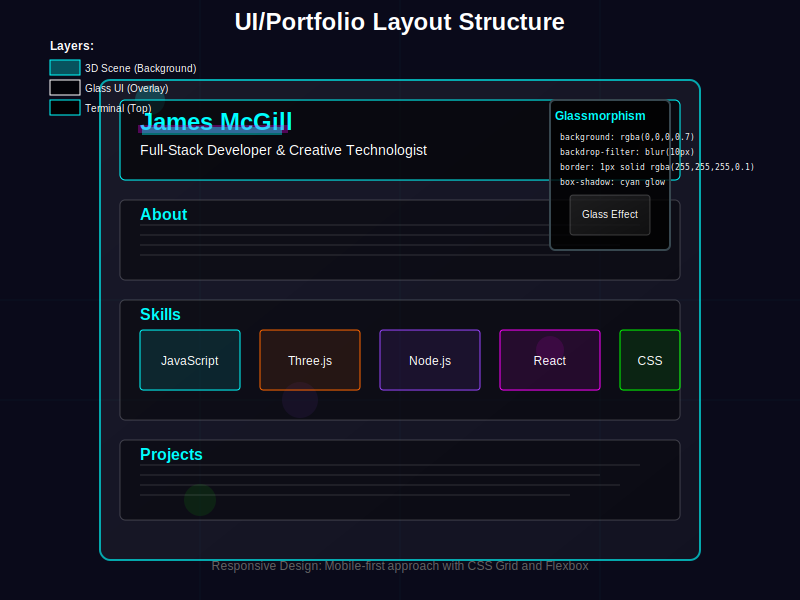

# Feature: UI/Portfolio Layout

## Overview
The portfolio interface overlays professional information on top of the 3D scene using modern CSS techniques including glassmorphism, animations, and responsive design. The layout creates a seamless blend between the interactive 3D background and the static portfolio content.

## Status
- **Current State**: Implemented
- **Version**: 1.0.0
- **Last Updated**: 2025-01-06
- **Priority**: High

## Technical Details

### Architecture
```
UI Layout
├── HTML Structure
│   ├── Portfolio Container
│   ├── Header Section
│   ├── Content Sections
│   └── Interactive Elements
├── CSS Styling
│   ├── Glassmorphism Effects
│   ├── Animations
│   ├── Responsive Grid
│   └── Typography
└── JavaScript Integration
    ├── Scroll Handling
    ├── Animation Triggers
    └── Terminal Toggle
```

### HTML Structure
From `index.html`:

```html
<div class="portfolio-container">
    <header class="portfolio-header">
        <h1 class="glitch" data-text="James McGill">James McGill</h1>
        <p class="subtitle">Full-Stack Developer & Creative Technologist</p>
    </header>
    
    <section class="portfolio-section">
        <h2>About</h2>
        <p>Experienced developer specializing in web technologies...</p>
    </section>
    
    <section class="portfolio-section">
        <h2>Skills</h2>
        <div class="skills-grid">
            <!-- Skill items -->
        </div>
    </section>
</div>
```

### Glassmorphism Implementation

#### Base Glass Effect
```css
.glass {
    background: rgba(0, 0, 0, 0.7);
    backdrop-filter: blur(10px);
    -webkit-backdrop-filter: blur(10px);
    border: 1px solid rgba(255, 255, 255, 0.1);
    box-shadow: 
        0 8px 32px 0 rgba(31, 38, 135, 0.37),
        inset 0 0 20px rgba(255, 255, 255, 0.05);
}
```

#### Layered Transparency
- **Background**: Semi-transparent black (70% opacity)
- **Blur Effect**: 10px backdrop blur
- **Border**: Subtle white border (10% opacity)
- **Shadow**: Multi-layer for depth

### Animation System

#### Glitch Effect
```css
.glitch {
    position: relative;
    color: #fff;
    animation: glitch-skew 1s infinite linear alternate-reverse;
}

.glitch::before,
.glitch::after {
    content: attr(data-text);
    position: absolute;
    top: 0;
    left: 0;
    opacity: 0.8;
}

.glitch::before {
    animation: glitch-1 0.5s infinite;
    color: #00ffff;
    z-index: -1;
}

.glitch::after {
    animation: glitch-2 0.5s infinite;
    color: #ff00ff;
    z-index: -2;
}
```

#### Fade-In Animations
```css
.fade-in {
    opacity: 0;
    transform: translateY(20px);
    animation: fadeIn 0.6s ease-out forwards;
}

@keyframes fadeIn {
    to {
        opacity: 1;
        transform: translateY(0);
    }
}
```

### Responsive Design

#### Breakpoints
```css
/* Mobile First Approach */
/* Base: 0-767px */
/* Tablet: 768px-1023px */
/* Desktop: 1024px+ */
/* Large: 1440px+ */
```

#### Grid System
```css
.portfolio-container {
    display: grid;
    grid-template-columns: 1fr;
    gap: 2rem;
    max-width: 800px;
    margin: 0 auto;
    padding: 2rem;
}

@media (min-width: 768px) {
    .skills-grid {
        display: grid;
        grid-template-columns: repeat(auto-fit, minmax(200px, 1fr));
        gap: 1rem;
    }
}
```

## Visual Design

### UI Layout Structure


### Color Palette
```css
:root {
    --primary-color: #00ffff;      /* Cyan */
    --secondary-color: #ff00ff;    /* Magenta */
    --accent-color: #ffff00;       /* Yellow */
    --text-primary: #ffffff;       /* White */
    --text-secondary: #b0b0b0;     /* Light gray */
    --background: rgba(0, 0, 0, 0.7);
}
```

### Typography
```css
/* Headers */
h1 { 
    font-family: 'Orbitron', monospace;
    font-size: clamp(2rem, 5vw, 3.5rem);
    font-weight: 900;
}

/* Body Text */
body {
    font-family: 'Inter', sans-serif;
    font-size: 16px;
    line-height: 1.6;
}

/* Code/Terminal */
code, .terminal {
    font-family: 'JetBrains Mono', monospace;
}
```

### Visual Effects

#### Neon Glow
```css
.neon-text {
    text-shadow: 
        0 0 10px currentColor,
        0 0 20px currentColor,
        0 0 30px currentColor,
        0 0 40px currentColor;
}
```

#### Hover States
```css
.interactive-element {
    transition: all 0.3s ease;
    cursor: pointer;
}

.interactive-element:hover {
    transform: translateY(-2px);
    box-shadow: 0 10px 40px rgba(0, 255, 255, 0.3);
}
```

## Layout Components

### Header Section
- **Fixed Height**: Maintains consistent space
- **Sticky Positioning**: Follows scroll (optional)
- **Glitch Animation**: Cyberpunk aesthetic

### Content Sections
- **Consistent Spacing**: 2rem between sections
- **Glass Panels**: Each section in glass container
- **Fade Animations**: Staggered entrance

### Skills Grid
- **Auto-Layout**: Responsive grid
- **Icon Integration**: SVG or font icons
- **Hover Effects**: Scale and glow

## Performance Considerations

### CSS Optimizations
1. **Hardware Acceleration**: Transform and opacity animations
2. **Will-Change**: Pre-optimize animated properties
3. **Containment**: CSS containment for layout performance

### Loading Strategy
1. **Critical CSS**: Inline above-fold styles
2. **Font Loading**: Async with fallbacks
3. **Animation Delay**: Stagger for perceived performance

## Accessibility

### WCAG Compliance
1. **Color Contrast**: 4.5:1 minimum ratio
2. **Focus Indicators**: Visible keyboard navigation
3. **Screen Reader**: Semantic HTML structure

### Motion Preferences
```css
@media (prefers-reduced-motion: reduce) {
    * {
        animation-duration: 0.01ms !important;
        animation-iteration-count: 1 !important;
        transition-duration: 0.01ms !important;
    }
}
```

## Future Enhancements

### Planned Features
1. **Theme System**:
   - Light/dark mode toggle
   - Custom color themes
   - Preset configurations

2. **Advanced Animations**:
   - Scroll-triggered reveals
   - Parallax effects
   - SVG animations

3. **Interactive Elements**:
   - Expandable sections
   - Filter/sort capabilities
   - Live content updates

### Component Library
1. **Reusable Components**: Button, card, modal patterns
2. **CSS Variables**: Dynamic theming
3. **Animation Library**: Preset animation classes

## Integration

### 3D Scene Interaction
- **Transparency Levels**: Adjust based on scene activity
- **Blur Intensity**: Dynamic backdrop filter
- **Color Sync**: Match scene lighting

### Terminal Overlay
- **Z-Index Management**: Proper layering
- **Focus Handling**: Input management
- **State Coordination**: Show/hide logic

## Testing Considerations

### Visual Testing
1. Cross-browser rendering
2. Responsive breakpoints
3. Animation performance

### Accessibility Testing
1. Screen reader compatibility
2. Keyboard navigation
3. Color contrast validation

## Known Issues
1. **Safari Backdrop Filter**: Requires -webkit prefix
2. **Mobile Performance**: Backdrop blur can be expensive
3. **Firefox Glitch**: Animation timing differences

## Browser Support
- **Chrome**: Full support
- **Firefox**: Full support (no backdrop blur)
- **Safari**: Full support with prefixes
- **Edge**: Full support
- **Mobile**: Varies by device capability

## Test Status
- **Tests Written**: No
- **Test Coverage**: 0%
- **Status**: Tests need to be written for responsive layout behavior, glassmorphism rendering, animation performance, and accessibility compliance.

## References
- [Glassmorphism CSS Generator](https://glassmorphism.com/)
- [Web Animations API](https://developer.mozilla.org/en-US/docs/Web/API/Web_Animations_API)
- [CSS Grid Layout](https://css-tricks.com/snippets/css/complete-guide-grid/)
- [A11y Style Guide](https://a11y-style-guide.com/style-guide/)