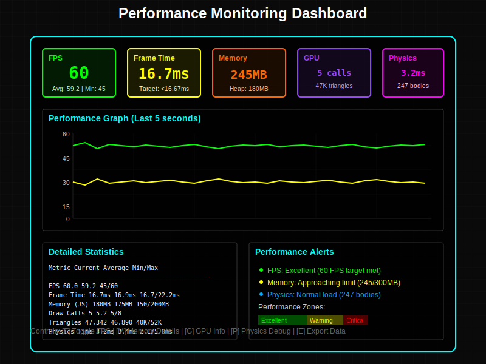

# Feature: Performance Monitoring

## Overview
A comprehensive performance monitoring system to track and analyze application performance metrics including FPS, render times, physics calculations, and memory usage. This system will help identify bottlenecks and ensure smooth user experience across different devices.

## Status
- **Current State**: Planned
- **Version**: 0.1.0 (Design Phase)
- **Last Updated**: 2025-01-06
- **Priority**: Medium

## Design Goals

### Primary Objectives
1. **Real-time Monitoring**: Track performance metrics in real-time
2. **Minimal Overhead**: Monitoring itself should not impact performance
3. **Actionable Insights**: Provide data that leads to optimization
4. **Cross-Device**: Work consistently across all platforms

### Key Metrics
1. **Frame Rate**: Current, average, and minimum FPS
2. **Frame Time**: Time per frame breakdown
3. **Memory Usage**: Heap size and allocation rate
4. **GPU Metrics**: Draw calls, triangles, texture memory
5. **Physics Performance**: Collision checks, update time

## Technical Architecture

### Component Structure
```
PerformanceMonitor
├── MetricsCollector
│   ├── FPSCounter
│   ├── FrameTimer
│   ├── MemoryMonitor
│   └── GPUProfiler
├── DataAggregator
│   ├── MovingAverages
│   ├── Percentiles
│   └── Trends
├── AlertSystem
│   ├── ThresholdMonitor
│   └── AnomalyDetection
└── Visualization
    ├── OverlayDisplay
    ├── GraphRenderer
    └── DebugPanel
```

### Implementation Plan

#### Core Monitor Class
```javascript
class PerformanceMonitor {
    constructor(options = {}) {
        this.metrics = {
            fps: new FPSMetric(),
            frameTime: new FrameTimeMetric(),
            memory: new MemoryMetric(),
            gpu: new GPUMetric(),
            physics: new PhysicsMetric()
        };
        
        this.config = {
            sampleRate: 60,        // Samples per second
            historySize: 300,      // 5 seconds at 60fps
            alertThresholds: {
                fps: { min: 30, target: 60 },
                frameTime: { max: 33 }, // 30fps threshold
                memory: { max: 500 }    // MB
            }
        };
    }
    
    update(deltaTime) {
        // Collect metrics
        Object.values(this.metrics).forEach(metric => 
            metric.update(deltaTime)
        );
        
        // Check alerts
        this.checkPerformanceAlerts();
        
        // Update visualization
        if (this.displayEnabled) {
            this.updateDisplay();
        }
    }
}
```

#### FPS Tracking
```javascript
class FPSMetric {
    constructor() {
        this.frames = 0;
        this.elapsed = 0;
        this.current = 0;
        this.average = 0;
        this.min = Infinity;
        this.max = 0;
        this.history = new RingBuffer(300);
    }
    
    update(deltaTime) {
        this.frames++;
        this.elapsed += deltaTime;
        
        if (this.elapsed >= 1000) {
            this.current = this.frames;
            this.frames = 0;
            this.elapsed = 0;
            
            this.history.push(this.current);
            this.updateStats();
        }
    }
}
```

### Data Collection

#### Metrics Categories
1. **Rendering Metrics**
   - Draw calls per frame
   - Triangles rendered
   - Shader switches
   - Texture uploads

2. **Physics Metrics**
   - Bodies active
   - Collision checks
   - Broad phase time
   - Narrow phase time

3. **Memory Metrics**
   - JS heap size
   - GPU memory estimate
   - Geometry buffers
   - Texture memory

4. **System Metrics**
   - CPU usage estimate
   - Main thread blocking
   - Event loop lag

### Visualization

#### Performance Dashboard Design


#### Overlay Display
```javascript
class PerformanceOverlay {
    constructor() {
        this.canvas = document.createElement('canvas');
        this.canvas.className = 'perf-overlay';
        this.ctx = this.canvas.getContext('2d');
        
        this.layout = {
            fps: { x: 10, y: 10, width: 100, height: 50 },
            graph: { x: 10, y: 70, width: 200, height: 100 },
            stats: { x: 10, y: 180, width: 200, height: 150 }
        };
    }
    
    render(metrics) {
        // Clear canvas
        this.ctx.clearRect(0, 0, this.canvas.width, this.canvas.height);
        
        // Draw FPS
        this.drawFPS(metrics.fps);
        
        // Draw performance graph
        this.drawGraph(metrics.fps.history);
        
        // Draw detailed stats
        this.drawStats(metrics);
    }
}
```

#### Graph Rendering
- Real-time line graph
- Color-coded performance zones
- Min/max indicators
- Rolling average line

## Performance Optimization

### Sampling Strategy
1. **Adaptive Sampling**: Reduce frequency when stable
2. **Batch Updates**: Collect data, update UI separately
3. **Worker Thread**: Offload calculations when possible
4. **Conditional Monitoring**: Only active metrics

### Memory Management
```javascript
class RingBuffer {
    constructor(size) {
        this.size = size;
        this.buffer = new Float32Array(size);
        this.index = 0;
        this.filled = false;
    }
    
    push(value) {
        this.buffer[this.index] = value;
        this.index = (this.index + 1) % this.size;
        if (this.index === 0) this.filled = true;
    }
    
    getStats() {
        const len = this.filled ? this.size : this.index;
        let sum = 0, min = Infinity, max = -Infinity;
        
        for (let i = 0; i < len; i++) {
            const val = this.buffer[i];
            sum += val;
            min = Math.min(min, val);
            max = Math.max(max, val);
        }
        
        return { avg: sum / len, min, max };
    }
}
```

## Alert System

### Performance Thresholds
```javascript
const PERFORMANCE_THRESHOLDS = {
    critical: {
        fps: 20,
        frameTime: 50,
        memory: 800
    },
    warning: {
        fps: 30,
        frameTime: 33,
        memory: 500
    },
    target: {
        fps: 60,
        frameTime: 16.67,
        memory: 300
    }
};
```

### Alert Actions
1. **Visual Indicators**: Color-coded overlay
2. **Console Warnings**: Detailed performance logs
3. **Automatic Adjustments**: Reduce quality settings
4. **User Notifications**: Optional performance warnings

## Integration Points

### Three.js Integration
```javascript
// Hook into renderer stats
renderer.info.autoReset = false;
performanceMonitor.setGPUMetrics({
    drawCalls: renderer.info.render.calls,
    triangles: renderer.info.render.triangles,
    points: renderer.info.render.points,
    lines: renderer.info.render.lines
});
renderer.info.reset();
```

### Physics Integration
```javascript
// Hook into physics world
physicsWorld.onAfterStep = (timings) => {
    performanceMonitor.setPhysicsMetrics({
        bodies: physicsWorld.bodies.length,
        broadPhaseTime: timings.broadPhase,
        narrowPhaseTime: timings.narrowPhase,
        totalTime: timings.total
    });
};
```

## User Interface

### Terminal Commands
```bash
fps         # Toggle FPS display
fps detail  # Show detailed metrics
fps graph   # Toggle performance graph
fps export  # Export performance data
fps reset   # Reset statistics
```

### Configuration Options
```javascript
const MONITOR_CONFIG = {
    display: {
        position: 'top-right',
        opacity: 0.8,
        fontSize: 12,
        graphs: true,
        detailed: false
    },
    alerts: {
        enabled: true,
        console: true,
        overlay: true,
        threshold: 'warning'
    },
    export: {
        format: 'json',
        interval: 60000, // 1 minute
        autoSave: false
    }
};
```

## Data Export

### Export Formats
1. **JSON**: Complete metrics history
2. **CSV**: Tabular data for analysis
3. **Performance Profile**: Chrome DevTools format

### Analytics Integration
```javascript
class PerformanceAnalytics {
    constructor() {
        this.sessions = [];
        this.aggregated = {};
    }
    
    recordSession(metrics) {
        const session = {
            timestamp: Date.now(),
            duration: metrics.duration,
            device: this.getDeviceInfo(),
            averages: metrics.getAverages(),
            percentiles: metrics.getPercentiles([50, 90, 99])
        };
        
        this.sessions.push(session);
        this.updateAggregates();
    }
}
```

## Testing Strategy

### Unit Tests
1. Metric calculation accuracy
2. Alert threshold detection
3. Data aggregation correctness
4. Memory leak prevention

### Performance Tests
1. Monitor overhead measurement
2. Stress test with many metrics
3. Long-running stability test
4. Cross-device performance

## Future Enhancements

### Advanced Features
1. **Machine Learning**: Anomaly detection
2. **Predictive Alerts**: Forecast performance issues
3. **A/B Testing**: Compare performance variants
4. **Cloud Analytics**: Aggregate user metrics

### Integrations
1. **Sentry**: Error and performance tracking
2. **Google Analytics**: Custom performance events
3. **Grafana**: Real-time dashboards
4. **WebVitals**: Core Web Vitals tracking

## Implementation Phases

### Phase 1: Core Metrics (Week 1-2)
- Basic FPS counter
- Frame time tracking
- Simple overlay display

### Phase 2: Advanced Metrics (Week 3-4)
- Memory monitoring
- GPU statistics
- Physics metrics

### Phase 3: Visualization (Week 5-6)
- Performance graphs
- Detailed stats panel
- Export functionality

### Phase 4: Optimization (Week 7-8)
- Alert system
- Automatic adjustments
- Analytics integration

## Test Status
- **Tests Written**: No
- **Test Coverage**: 0%
- **Status**: Tests need to be written. This feature is still in the design phase and has not been implemented yet.

## References
- [Chrome DevTools Performance API](https://developer.chrome.com/docs/devtools/performance/)
- [MDN Performance API](https://developer.mozilla.org/en-US/docs/Web/API/Performance_API)
- [Three.js Performance Tips](https://threejs.org/manual/#en/optimize-lots-of-objects)
- [Stats.js](https://github.com/mrdoob/stats.js/)