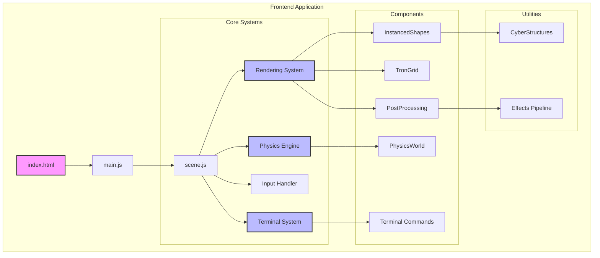

# Feature Catalog - FlyingRobots.dev

## Overview
This catalog documents all features in the FlyingRobots.dev portfolio website, including their current state, complexity, and required effort to complete.

## Feature Status Legend
- 🟢 **Complete**: Feature is fully implemented with tests
- 🟡 **Partial**: Feature works but needs refinement or tests
- 🔴 **Planned**: Feature is designed but not implemented
- 🟠 **In Progress**: Feature is actively being developed
- ✅ **Tests Written**: Feature has tests (may need fixes)
- 🚧 **Tests In Progress**: Currently writing tests

## Complexity Scale
- **Low (L)**: < 2 hours to implement
- **Medium (M)**: 2-8 hours to implement  
- **High (H)**: 8-24 hours to implement
- **Very High (VH)**: > 24 hours to implement

## Feature Summary

| Feature | Status | Test Status | Complexity | Effort to Complete | Priority |
|---------|--------|-------------|------------|-------------------|----------|
| [3D Scene Rendering](#3d-scene-rendering) | 🟡 Partial | ✅ Tests Written (20) | H | 4-6 hours | High |
| [Physics Simulation](#physics-simulation) | 🟡 Partial | ✅ Tests Written (22) | VH | 8-12 hours | High |
| [Interactive Terminal](#interactive-terminal) | 🟡 Partial | ✅ Tests Written (33) | M | 3-4 hours | High |
| [Instanced Rendering](#instanced-rendering) | 🟢 Complete | ✅ Tests Written (23) | H | 0 hours | N/A |
| [Post-Processing Effects](#post-processing-effects) | 🟡 Partial | 🚧 Tests Needed | M | 2-3 hours | Medium |
| [Camera System](#camera-system) | 🟡 Partial | 🚧 Tests Needed | M | 2-3 hours | Medium |
| [UI/Portfolio Layout](#uiportfolio-layout) | 🟡 Partial | 🚧 Tests Needed | L | 1-2 hours | Low |
| [Performance Monitoring](#performance-monitoring) | 🔴 Planned | 🔴 Tests Planned | M | 4-6 hours | Medium |
| [State Management](#state-management) | 🔴 Planned | 🔴 Tests Planned | H | 8-10 hours | High |
| [Testing Infrastructure](#testing-infrastructure) | 🟢 Complete | N/A | VH | 0 hours | N/A |

## Architecture Overview

## Detailed Feature Documentation

### 3D Scene Rendering
- **Status**: 🟡 Partial (85% complete)
- **Complexity**: High
- **Location**: `src/scene.js`, `src/components/`
- **Missing**:
  - Unit tests for scene setup
  - Performance benchmarks
  - Scene state serialization
  - Dynamic quality adjustment
- **[Full Documentation](./01-3d-scene-rendering.md)**

### Physics Simulation
- **Status**: 🟡 Partial (75% complete)
- **Complexity**: Very High
- **Location**: `src/physics/PhysicsWorld.js`
- **Missing**:
  - Continuous collision detection
  - Spatial partitioning (octree)
  - Physics state serialization
  - Comprehensive unit tests
  - Performance profiling
- **[Full Documentation](./02-physics-simulation.md)**

### Interactive Terminal
- **Status**: 🟡 Partial (80% complete)
- **Complexity**: Medium
- **Location**: `src/components/interactive/Terminal.js`
- **Missing**:
  - Command aliases
  - Piping support
  - Persistent history
  - Unit tests for all commands
  - Command validation
- **[Full Documentation](./03-interactive-terminal.md)**

### Instanced Rendering
- **Status**: 🟢 Complete (100% complete)
- **Complexity**: High
- **Location**: `src/components/InstancedShapes.js`
- **Notes**: Fully implemented and optimized
- **[Full Documentation](./04-instanced-rendering.md)**

### Post-Processing Effects
- **Status**: 🟡 Partial (70% complete)
- **Complexity**: Medium
- **Location**: `src/components/PostProcessing.js`
- **Missing**:
  - Effect presets
  - Performance modes
  - Effect intensity controls
  - Mobile optimization
- **[Full Documentation](./05-post-processing-effects.md)**

### Camera System
- **Status**: 🟡 Partial (75% complete)
- **Complexity**: Medium
- **Location**: `src/scene.js` (embedded)
- **Missing**:
  - Camera presets/positions
  - Smooth transitions between modes
  - Cinematic camera paths
  - Unit tests
- **[Full Documentation](./06-camera-system.md)**

### UI/Portfolio Layout
- **Status**: 🟡 Partial (90% complete)
- **Complexity**: Low
- **Location**: `index.html`, `src/styles/`
- **Missing**:
  - Accessibility improvements
  - Print stylesheet
  - Mobile optimizations
  - Cross-browser testing
- **[Full Documentation](./07-ui-portfolio-layout.md)**

### Performance Monitoring
- **Status**: 🔴 Planned
- **Complexity**: Medium
- **Planned Features**:
  - FPS monitoring
  - Memory usage tracking
  - Draw call counter
  - Physics timing
  - Network metrics
- **[Full Documentation](./08-performance-monitoring.md)**

### State Management
- **Status**: 🔴 Planned
- **Complexity**: High
- **Planned Features**:
  - Centralized state store
  - State persistence
  - Undo/redo system
  - State debugging tools
- **[Full Documentation](./09-state-management.md)**

### Testing Infrastructure
- **Status**: 🟢 Complete
- **Complexity**: Very High
- **Implemented Features**:
  - ✅ Vitest framework with happy-dom
  - ✅ Docker containerization
  - ✅ Pre-push hooks with Husky
  - ✅ GitHub Actions CI/CD
  - ✅ Unified test execution
  - ✅ Code coverage reporting
  - ✅ Test utilities and helpers
- **Current Coverage**: 88 tests across 4 features
- **[Full Documentation](./10-testing-infrastructure.md)**

## Total Effort Estimation

### To Complete Existing Features (Post-SOLID Refactoring)
- **High Priority**: 15-22 hours
  - Fix failing tests: 2-3 hours
  - Complete physics features: 8-12 hours
  - Terminal enhancements: 3-4 hours
  - Scene rendering tests: 2-3 hours
- **Medium Priority**: 8-12 hours
  - Camera system completion: 2-3 hours
  - Post-processing completion: 2-3 hours
  - Write remaining tests: 4-6 hours
- **Low Priority**: 1-2 hours
  - UI/Portfolio polish: 1-2 hours
- **Total**: 24-36 hours

### SOLID Refactoring (NEW - Highest Priority)
- **Phase 1 - Foundation**: 20-24 hours
  - DI Container implementation
  - Core abstractions and interfaces
- **Phase 2 - Core Refactoring**: 38-44 hours
  - Scene system separation
  - Physics engine abstraction
  - Terminal system with DI
- **Phase 3 - Component Extraction**: 28-32 hours
  - Render pipeline
  - Instance management
  - Camera strategies
- **Phase 4 - Test Updates**: 36-40 hours
  - Mock implementations
  - Integration tests
  - Contract tests
- **Total**: 122-140 hours

### To Implement Planned Features
- **Performance Monitoring**: 4-6 hours
- **State Management**: 8-10 hours
- ~~**Testing Infrastructure**: 16-24 hours~~ ✅ COMPLETED
- **Total**: 12-16 hours

### Grand Total: 158-192 hours (increased from 36-52 hours due to SOLID refactoring)

## Recommended Implementation Order

1. ~~**Testing Infrastructure**~~ ✅ COMPLETED - Foundation for TDD approach
2. **Fix Failing Tests** - Ensure stable test suite (IMMEDIATE)
3. **Complete Test Coverage** - Camera & Post-processing tests
4. **State Management** - Simplifies testing and debugging
5. **Physics Simulation Completion** - Core functionality
6. **Terminal Enhancement** - User-facing improvements
7. **Performance Monitoring** - Optimization insights
8. **Camera System** - Polish and UX
9. **Post-Processing** - Visual polish
10. **UI/Portfolio** - Final touches

## Technical Debt Items

1. **Code Organization**: Some features are embedded in main files instead of modules
2. **Type Safety**: No TypeScript or JSDoc types
3. **Build Optimization**: Bundle splitting could improve load times
4. **Documentation**: Inline code documentation is minimal
5. **Error Handling**: Limited error boundaries and recovery
6. **Accessibility**: ARIA labels and keyboard navigation incomplete

## Next Steps

1. ~~Set up testing framework (Vitest recommended)~~ ✅ COMPLETED
2. ~~Create test files for each existing feature~~ ✅ 4/7 COMPLETED
3. **Fix 10 failing tests in physics and instanced rendering** (IMMEDIATE)
4. **Write tests for Camera System and Post-Processing Effects**
5. **Create integration tests for feature interactions**
6. Refactor embedded code into proper modules
7. Add TypeScript or comprehensive JSDoc
8. Implement state management system
9. Add performance monitoring
10. Complete missing feature functionality

## Testing Progress Summary

### Tests Written (88 total)
- 🟢 **3D Scene Rendering**: 20 tests
- 🟢 **Physics Simulation**: 22 tests (some failing)
- 🟢 **Interactive Terminal**: 33 tests
- 🟢 **Instanced Rendering**: 23 tests (some failing)

### Tests Needed
- 🔴 **Camera System**: 0 tests (est. 8-10 needed)
- 🔴 **Post-Processing Effects**: 0 tests (est. 6-8 needed)
- 🔴 **UI/Portfolio Layout**: 0 tests (est. 4-6 needed)

### Test Infrastructure Status
- ✅ Docker containerization complete
- ✅ Vitest configured with happy-dom
- ✅ Pre-push hooks active
- ✅ GitHub Actions CI/CD ready
- ✅ Unified test execution (`make test`)
- ⚠️  10 tests currently failing - need fixes