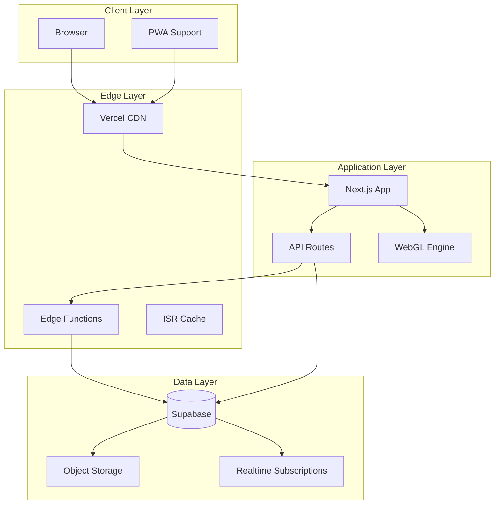
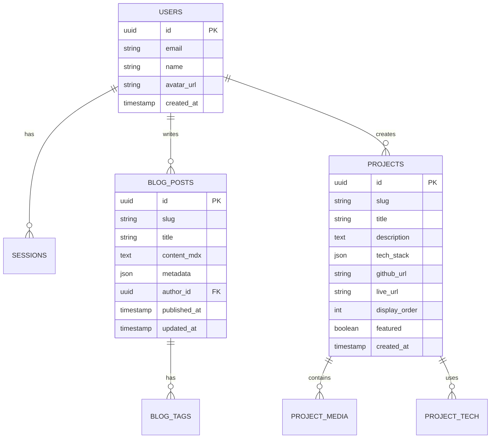

# FlyingRobots.dev 2.0 - Architecture Overview

## The Vision

A cutting-edge portfolio site that combines the nostalgia of retro computing with modern web technology. Every interaction should feel like you're accessing a terminal from the future while browsing content from an alternate cyberpunk timeline.

## Tech Stack

### Frontend
- **Next.js 14** with App Router
- **Three.js + React Three Fiber** for WebGL
- **Framer Motion** for UI animations
- **Tailwind CSS** for styling
- **MDX** for blog content
- **Zustand** for state management

### Backend & Data
- **Supabase** for:
  - PostgreSQL database
  - Real-time subscriptions
  - Authentication (admin access)
  - Storage (project assets, blog images)
  - Edge Functions (content processing)
- **Vercel** for hosting & edge runtime

### Content Management
- **Custom Admin Dashboard** built with:
  - Tremor for data visualization
  - TipTap for rich text editing
  - React Hook Form for content forms
  - Uploadthing for media management

## Architecture Diagram

## Key Features

### 1. Progressive Enhancement
- Server-side rendered content for SEO
- WebGL effects load progressively
- Works without JavaScript (basic version)
- PWA support for offline access

### 2. Content Types
- **Pages**: Home, About, Contact
- **Blog Posts**: MDX with custom components
- **Projects**: Rich media showcases
- **Experiments**: Interactive WebGL demos
- **Terminal Commands**: Dynamic content

### 3. Performance Strategy
- ISR for blog posts and projects
- Edge caching for API responses
- WebGL assets lazy-loaded
- Image optimization with Next/Image
- Font subsetting for terminal text

### 4. Developer Experience
- TypeScript everywhere
- Automated testing with Playwright
- Storybook for component development
- GitHub Actions for CI/CD
- Conventional commits

## Database Schema

## Security Considerations

1. **Authentication**: Supabase Auth with JWT
2. **Authorization**: Row-level security in PostgreSQL
3. **API Security**: Rate limiting, CORS policies
4. **Content Security**: CSP headers, sanitization
5. **Admin Access**: 2FA required, audit logs

## Migration Path

1. **Phase 1**: Set up Next.js + Supabase infrastructure
2. **Phase 2**: Migrate existing content to database
3. **Phase 3**: Implement WebGL effects system
4. **Phase 4**: Build admin dashboard
5. **Phase 5**: Add blog functionality
6. **Phase 6**: Deploy and monitor