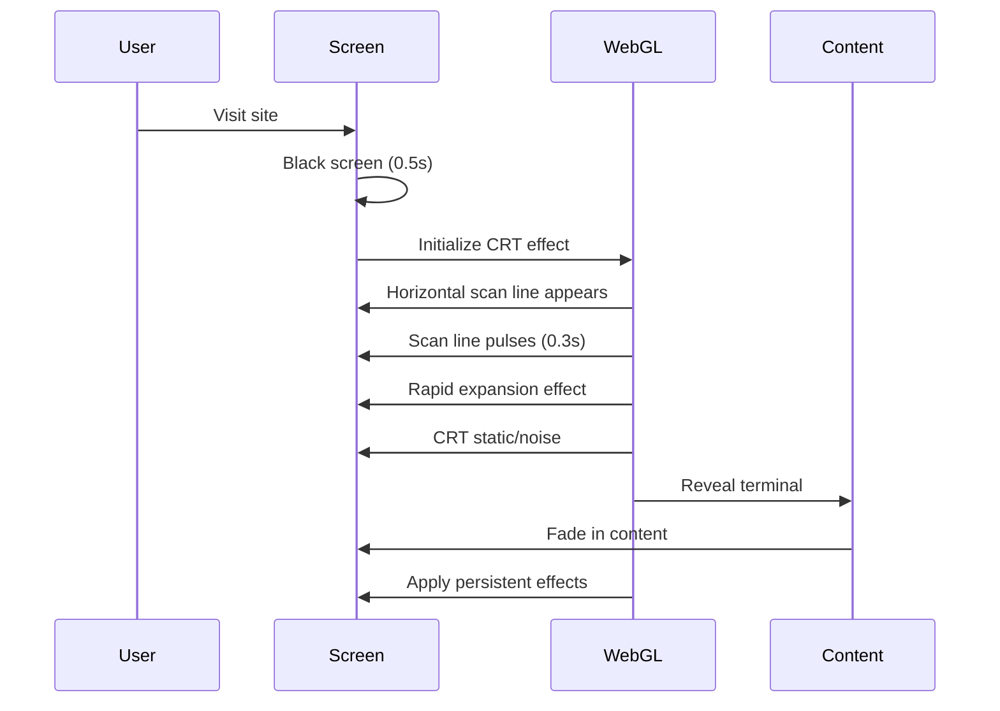
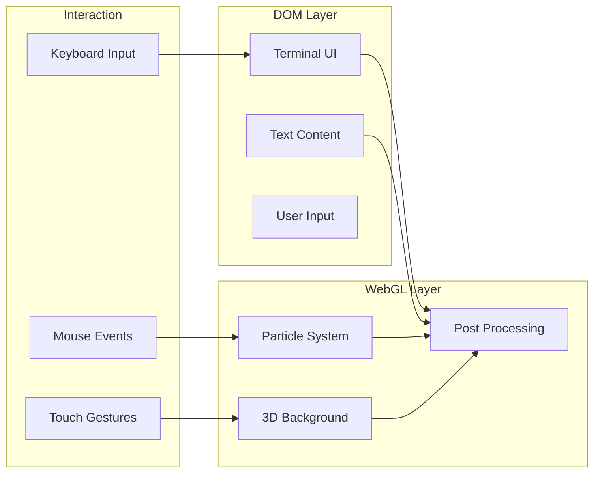

# WebGL Visual Effects System

## Core Concept: "Digital Archaeology"

The site should feel like you're accessing a terminal from an advanced civilization, but through old CRT technology. A fusion of retro-futurism and cyberpunk aesthetics.

## Entry Sequence



## Visual Effects Library

### 1. CRT Monitor Simulation
- **Scanlines**: Subtle horizontal lines
- **Barrel Distortion**: Slight screen curvature
- **Chromatic Aberration**: RGB color separation at edges
- **Phosphor Glow**: Green/amber tint option
- **Static Noise**: Random pixel noise
- **Screen Flicker**: Occasional brightness variation
- **Vignette**: Darkened corners

### 2. Terminal Effects
- **Text Reveal**: Matrix-style character rain
- **Cursor Blink**: Authentic terminal cursor
- **Screen Burn-In**: Faint ghost images
- **Line Refresh**: Top-to-bottom scan effect
- **Glitch Effects**: Data corruption aesthetics

### 3. Interactive Elements
- **Hover Distortion**: Elements warp slightly
- **Click Ripples**: EMP-style interference
- **Scroll Artifacts**: Interlacing effects
- **Focus Glow**: Neon outline on active elements

## Technical Implementation

### Shader Pipeline

```glsl
// Vertex Shader
attribute vec2 position;
varying vec2 vUv;

void main() {
    vUv = position * 0.5 + 0.5;
    gl_Position = vec4(position, 0.0, 1.0);
}

// Fragment Shader (CRT Effect)
uniform sampler2D tDiffuse;
uniform float time;
uniform float distortion;
uniform float scanlineIntensity;
varying vec2 vUv;

vec2 barrelDistortion(vec2 coord, float amt) {
    vec2 cc = coord - 0.5;
    float dist = dot(cc, cc);
    return coord + cc * dist * amt;
}

void main() {
    // Barrel distortion
    vec2 uv = barrelDistortion(vUv, distortion);
    
    // Chromatic aberration
    float r = texture2D(tDiffuse, uv + vec2(0.001, 0.0)).r;
    float g = texture2D(tDiffuse, uv).g;
    float b = texture2D(tDiffuse, uv - vec2(0.001, 0.0)).b;
    
    // Scanlines
    float scanline = sin(uv.y * 800.0) * scanlineIntensity;
    
    // Combine effects
    vec3 color = vec3(r, g, b) + scanline;
    
    // Vignette
    float vignette = 1.0 - length(vUv - 0.5) * 0.5;
    
    gl_FragColor = vec4(color * vignette, 1.0);
}
```

### Performance Optimization

1. **Level of Detail (LOD)**
   - High: All effects enabled
   - Medium: Reduced scanlines, no chromatic aberration
   - Low: Basic vignette only

2. **Adaptive Quality**
   - Monitor FPS and adjust effects
   - Disable effects on mobile
   - Progressive enhancement

3. **GPU Detection**
   - Query WebGL capabilities
   - Fallback to CSS filters
   - Canvas 2D alternative

## Content Integration Strategies

### Option 1: DOM + WebGL Overlay
- HTML content renders normally
- WebGL post-processing layer on top
- Better for SEO and accessibility

### Option 2: Full WebGL Scene
- All content rendered as WebGL quads
- Maximum visual control
- Requires custom text rendering

### Option 3: Hybrid Approach (Recommended)
- Critical content in DOM
- Decorative elements in WebGL
- Post-processing for entire viewport

## Effect Presets

### "Vintage Terminal" (Default)
```javascript
{
    scanlines: 0.05,
    distortion: 0.08,
    chromaticAberration: 0.003,
    glow: { color: '#00ff00', intensity: 0.2 },
    noise: 0.02,
    flicker: { frequency: 0.01, intensity: 0.05 }
}
```

### "Clean Future"
```javascript
{
    scanlines: 0.01,
    distortion: 0.02,
    chromaticAberration: 0.001,
    glow: { color: '#00ffff', intensity: 0.1 },
    noise: 0.005,
    flicker: { frequency: 0, intensity: 0 }
}
```

### "Glitch Mode"
```javascript
{
    scanlines: 0.1,
    distortion: 0.15,
    chromaticAberration: 0.01,
    glow: { color: '#ff00ff', intensity: 0.3 },
    noise: 0.08,
    flicker: { frequency: 0.1, intensity: 0.2 },
    glitch: { probability: 0.05, intensity: 0.5 }
}
```

## Interactive Terminal WebGL Integration



## Easter Eggs & Hidden Features

1. **Konami Code**: Activates "Matrix Mode"
2. **Type "ENHANCE"**: Increases resolution/effects
3. **Long Idle**: Screen saver with floating geometry
4. **Rapid Clicking**: Temporary glitch storm
5. **Mobile Shake**: CRT degauss effect

## Accessibility Considerations

1. **Reduced Motion Mode**
   - Disable all animations
   - Static terminal appearance
   - Instant text rendering

2. **High Contrast Mode**
   - Remove post-processing
   - Increase text contrast
   - Solid backgrounds

3. **Screen Reader Support**
   - ARIA live regions
   - Semantic HTML underneath
   - Keyboard navigation

## Performance Metrics

Target: 60 FPS on mid-range hardware (2018+ GPUs)

- Initial load: < 2 seconds
- Effect initialization: < 500ms
- Memory usage: < 100MB
- GPU usage: < 30% average