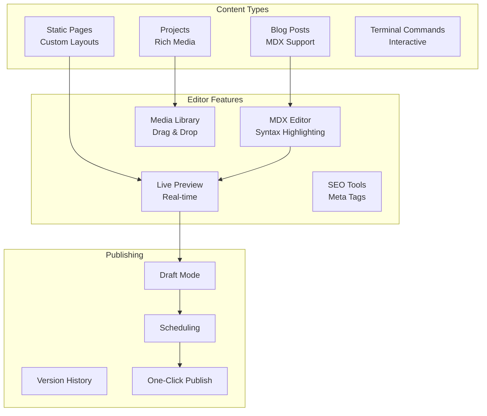
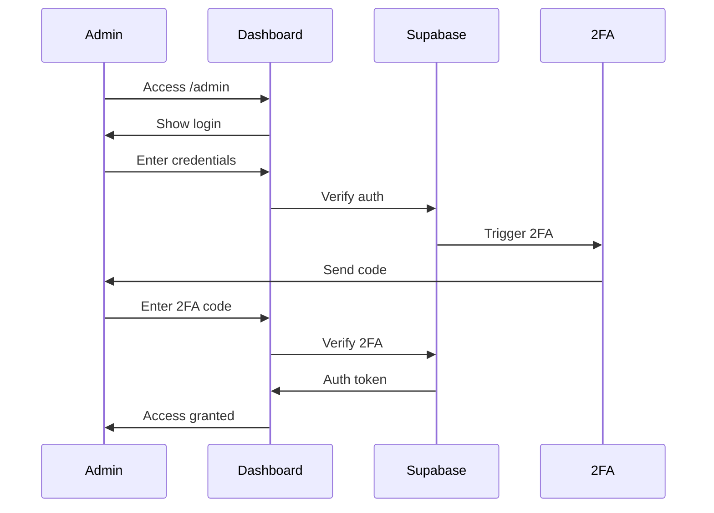

# Admin Dashboard Design

## Overview

A powerful, intuitive admin interface that feels like piloting a spaceship's control panel. Dark theme by default with neon accents.

## Dashboard Layout

<svg width="800" height="600" xmlns="http://www.w3.org/2000/svg">
  <!-- Background -->
  <rect width="800" height="600" fill="#0a0a0a"/>
  
  <!-- Header -->
  <rect width="800" height="60" fill="#1a1a1a"/>
  <text x="20" y="40" fill="#00ff88" font-family="monospace" font-size="20">FLYINGROBOTS ADMIN</text>
  <rect x="600" y="15" width="180" height="30" fill="#00ff88" rx="15"/>
  <text x="690" y="35" fill="#0a0a0a" font-family="monospace" font-size="14" text-anchor="middle">LOGOUT</text>
  
  <!-- Sidebar -->
  <rect x="0" y="60" width="200" height="540" fill="#111111"/>
  <text x="20" y="90" fill="#00ff88" font-family="monospace" font-size="14">DASHBOARD</text>
  <text x="20" y="120" fill="#888" font-family="monospace" font-size="14">CONTENT</text>
  <text x="40" y="150" fill="#00ffff" font-family="monospace" font-size="12">• Blog Posts</text>
  <text x="40" y="180" fill="#00ffff" font-family="monospace" font-size="12">• Projects</text>
  <text x="40" y="210" fill="#00ffff" font-family="monospace" font-size="12">• Pages</text>
  <text x="20" y="250" fill="#888" font-family="monospace" font-size="14">MEDIA</text>
  <text x="40" y="280" fill="#00ffff" font-family="monospace" font-size="12">• Images</text>
  <text x="40" y="310" fill="#00ffff" font-family="monospace" font-size="12">• Videos</text>
  <text x="20" y="350" fill="#888" font-family="monospace" font-size="14">ANALYTICS</text>
  <text x="20" y="390" fill="#888" font-family="monospace" font-size="14">SETTINGS</text>
  
  <!-- Main Content Area -->
  <rect x="220" y="80" width="560" height="500" fill="#0f0f0f" stroke="#333" stroke-width="1"/>
  
  <!-- Stats Cards -->
  <rect x="240" y="100" width="160" height="80" fill="#1a1a1a" rx="5"/>
  <text x="320" y="130" fill="#00ff88" font-family="monospace" font-size="24" text-anchor="middle">1,337</text>
  <text x="320" y="160" fill="#666" font-family="monospace" font-size="12" text-anchor="middle">Total Views</text>
  
  <rect x="420" y="100" width="160" height="80" fill="#1a1a1a" rx="5"/>
  <text x="500" y="130" fill="#00ffff" font-family="monospace" font-size="24" text-anchor="middle">42</text>
  <text x="500" y="160" fill="#666" font-family="monospace" font-size="12" text-anchor="middle">Blog Posts</text>
  
  <rect x="600" y="100" width="160" height="80" fill="#1a1a1a" rx="5"/>
  <text x="680" y="130" fill="#ff00ff" font-family="monospace" font-size="24" text-anchor="middle">15</text>
  <text x="680" y="160" fill="#666" font-family="monospace" font-size="12" text-anchor="middle">Projects</text>
  
  <!-- Content Table -->
  <rect x="240" y="200" width="520" height="360" fill="#111" rx="5"/>
  <text x="260" y="230" fill="#00ff88" font-family="monospace" font-size="16">Recent Content</text>
  
  <!-- Table Header -->
  <line x1="240" y1="250" x2="760" y2="250" stroke="#333"/>
  <text x="260" y="270" fill="#666" font-family="monospace" font-size="12">TITLE</text>
  <text x="460" y="270" fill="#666" font-family="monospace" font-size="12">TYPE</text>
  <text x="560" y="270" fill="#666" font-family="monospace" font-size="12">STATUS</text>
  <text x="660" y="270" fill="#666" font-family="monospace" font-size="12">ACTIONS</text>
  
  <!-- Table Rows -->
  <rect x="240" y="280" width="520" height="40" fill="#0a0a0a"/>
  <text x="260" y="305" fill="#fff" font-family="monospace" font-size="12">Building Git Mind</text>
  <text x="460" y="305" fill="#00ff88" font-family="monospace" font-size="12">Blog</text>
  <text x="560" y="305" fill="#00ff88" font-family="monospace" font-size="12">Published</text>
  <text x="660" y="305" fill="#00ffff" font-family="monospace" font-size="12">Edit | Delete</text>
</svg>

## Content Editor Interface

<svg width="800" height="700" xmlns="http://www.w3.org/2000/svg">
  <!-- Background -->
  <rect width="800" height="700" fill="#0a0a0a"/>
  
  <!-- Header -->
  <rect width="800" height="60" fill="#1a1a1a"/>
  <text x="20" y="40" fill="#00ff88" font-family="monospace" font-size="20">EDIT BLOG POST</text>
  <rect x="600" y="15" width="80" height="30" fill="#00ff88" rx="5"/>
  <text x="640" y="35" fill="#0a0a0a" font-family="monospace" font-size="14" text-anchor="middle">SAVE</text>
  <rect x="690" y="15" width="90" height="30" fill="#333" rx="5"/>
  <text x="735" y="35" fill="#888" font-family="monospace" font-size="14" text-anchor="middle">CANCEL</text>
  
  <!-- Two Column Layout -->
  <!-- Editor Column -->
  <rect x="20" y="80" width="460" height="600" fill="#111" rx="5"/>
  <text x="40" y="110" fill="#00ff88" font-family="monospace" font-size="16">Content Editor</text>
  
  <!-- Title Field -->
  <rect x="40" y="130" width="420" height="40" fill="#0a0a0a" stroke="#333" rx="3"/>
  <text x="50" y="155" fill="#fff" font-family="monospace" font-size="14">Building the Future with Git Mind</text>
  
  <!-- MDX Editor -->
  <rect x="40" y="190" width="420" height="400" fill="#0a0a0a" stroke="#333" rx="3"/>
  <text x="50" y="210" fill="#00ff88" font-family="monospace" font-size="12"># Introduction</text>
  <text x="50" y="230" fill="#fff" font-family="monospace" font-size="12">Git Mind represents a paradigm shift in how we</text>
  <text x="50" y="250" fill="#fff" font-family="monospace" font-size="12">think about version control and AI development.</text>
  <text x="50" y="280" fill="#00ff88" font-family="monospace" font-size="12">## Key Features</text>
  <text x="50" y="300" fill="#fff" font-family="monospace" font-size="12">- Neural substrate using Git</text>
  <text x="50" y="320" fill="#fff" font-family="monospace" font-size="12">- Distributed intelligence</text>
  
  <!-- Preview Column -->
  <rect x="500" y="80" width="280" height="600" fill="#111" rx="5"/>
  <text x="520" y="110" fill="#00ff88" font-family="monospace" font-size="16">Live Preview</text>
  
  <!-- Preview Content -->
  <rect x="520" y="130" width="240" height="400" fill="#0a0a0a" rx="3"/>
  <text x="540" y="160" fill="#00ff88" font-family="monospace" font-size="18">Introduction</text>
  <text x="540" y="185" fill="#ccc" font-family="Arial" font-size="12">Git Mind represents a paradigm</text>
  <text x="540" y="200" fill="#ccc" font-family="Arial" font-size="12">shift in how we think about</text>
  <text x="540" y="215" fill="#ccc" font-family="Arial" font-size="12">version control and AI</text>
  <text x="540" y="230" fill="#ccc" font-family="Arial" font-size="12">development.</text>
  
  <!-- Metadata Panel -->
  <text x="520" y="560" fill="#00ff88" font-family="monospace" font-size="14">Metadata</text>
  <rect x="520" y="570" width="240" height="30" fill="#0a0a0a" stroke="#333" rx="3"/>
  <text x="530" y="590" fill="#888" font-family="monospace" font-size="12">Tags: AI, Git, Innovation</text>
  
  <rect x="520" y="610" width="115" height="30" fill="#0a0a0a" stroke="#333" rx="3"/>
  <text x="530" y="630" fill="#888" font-family="monospace" font-size="12">Published</text>
  
  <rect x="645" y="610" width="115" height="30" fill="#0a0a0a" stroke="#333" rx="3"/>
  <text x="655" y="630" fill="#888" font-family="monospace" font-size="12">2024-01-15</text>
</svg>

## Features & Functionality

### 1. Content Management


### 2. Rich Text Editor Features
- **MDX Support**: Write React components in markdown
- **Code Highlighting**: Automatic syntax highlighting
- **Media Embeds**: Drag-and-drop images/videos
- **Custom Components**: Insert terminal, code blocks, etc.
- **AI Assistant**: Content suggestions and improvements
- **Version Control**: Git-based content versioning

### 3. Project Showcase Builder
- **Gallery Templates**: Grid, carousel, masonry layouts
- **Tech Stack Tags**: Searchable technology tags
- **Live Demo Links**: Embed or external links
- **GitHub Integration**: Auto-pull stats and commits
- **Case Study Mode**: Long-form project breakdowns

### 4. Analytics Dashboard
```javascript
{
  pageViews: {
    today: 337,
    week: 2401,
    month: 10337,
    chart: "realtime-line-graph"
  },
  topContent: [
    { title: "Building Git Mind", views: 1337 },
    { title: "Universal Charter", views: 842 },
    { title: "MIND-UCAL License", views: 666 }
  ],
  engagement: {
    avgTimeOnSite: "4:20",
    bounceRate: "13.37%",
    terminalCommands: 420
  }
}
```

### 5. Terminal Command Editor
<svg width="600" height="400" xmlns="http://www.w3.org/2000/svg">
  <!-- Terminal Editor -->
  <rect width="600" height="400" fill="#0a0a0a" stroke="#00ff88" stroke-width="2"/>
  <rect width="600" height="30" fill="#00ff88"/>
  <text x="10" y="20" fill="#0a0a0a" font-family="monospace" font-size="14">Terminal Command Editor</text>
  
  <!-- Command Input -->
  <text x="20" y="60" fill="#00ff88" font-family="monospace" font-size="12">Command:</text>
  <rect x="20" y="70" width="200" height="30" fill="#111" stroke="#333"/>
  <text x="30" y="90" fill="#fff" font-family="monospace" font-size="12">skills --verbose</text>
  
  <!-- Response Editor -->
  <text x="20" y="130" fill="#00ff88" font-family="monospace" font-size="12">Response (MDX):</text>
  <rect x="20" y="140" width="560" height="200" fill="#111" stroke="#333"/>
  <text x="30" y="160" fill="#00ff88" font-family="monospace" font-size="10">## Technical Skills</text>
  <text x="30" y="180" fill="#fff" font-family="monospace" font-size="10">```javascript</text>
  <text x="30" y="200" fill="#00ffff" font-family="monospace" font-size="10">const skills = {</text>
  <text x="30" y="220" fill="#00ffff" font-family="monospace" font-size="10">  languages: ['TypeScript', 'Rust', 'Go'],</text>
  <text x="30" y="240" fill="#00ffff" font-family="monospace" font-size="10">  frameworks: ['Next.js', 'Three.js', 'React']</text>
  <text x="30" y="260" fill="#00ffff" font-family="monospace" font-size="10">}</text>
  <text x="30" y="280" fill="#fff" font-family="monospace" font-size="10">```</text>
  
  <!-- Action Type -->
  <text x="250" y="60" fill="#00ff88" font-family="monospace" font-size="12">Action Type:</text>
  <rect x="250" y="70" width="150" height="30" fill="#111" stroke="#333"/>
  <text x="260" y="90" fill="#fff" font-family="monospace" font-size="12">Display Content</text>
  
  <!-- Save Button -->
  <rect x="480" y="350" width="100" height="30" fill="#00ff88" rx="5"/>
  <text x="530" y="370" fill="#0a0a0a" font-family="monospace" font-size="12" text-anchor="middle">SAVE</text>
</svg>

## Authentication Flow



## Mobile Responsive Design

The admin dashboard is fully responsive with:
- Collapsible sidebar on mobile
- Touch-optimized controls
- Swipe gestures for navigation
- Mobile-first editor layout
- Progressive Web App support

## Keyboard Shortcuts

- `Cmd/Ctrl + S`: Save current content
- `Cmd/Ctrl + P`: Preview mode toggle
- `Cmd/Ctrl + /`: Toggle markdown preview
- `Cmd/Ctrl + K`: Command palette
- `Esc`: Exit current modal/editor

## Performance Optimizations

1. **Lazy Loading**: Load editor components on demand
2. **Debounced Saves**: Auto-save with debouncing
3. **Optimistic UI**: Instant feedback, background sync
4. **CDN Assets**: Images served from Supabase CDN
5. **Service Worker**: Offline editing capability