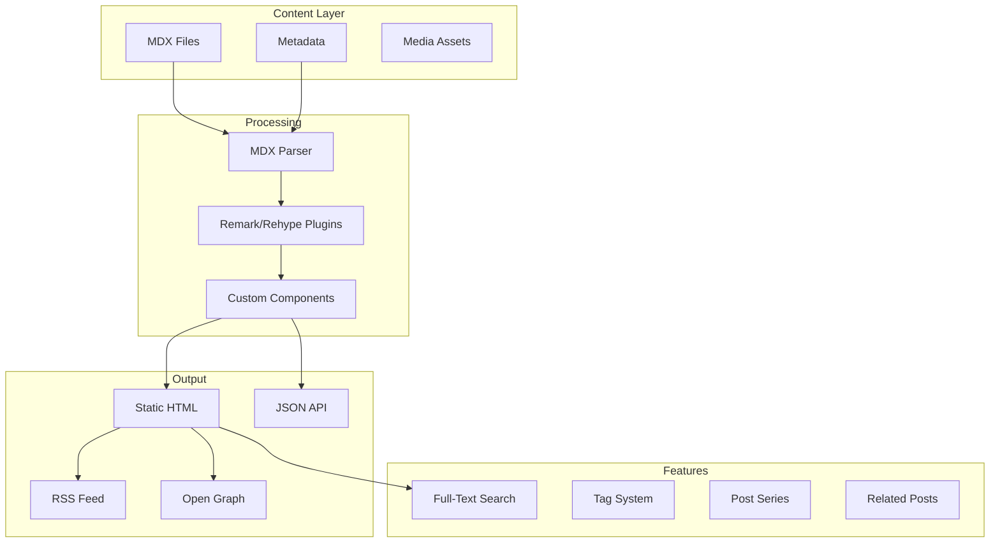
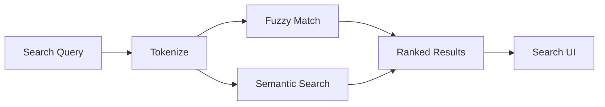
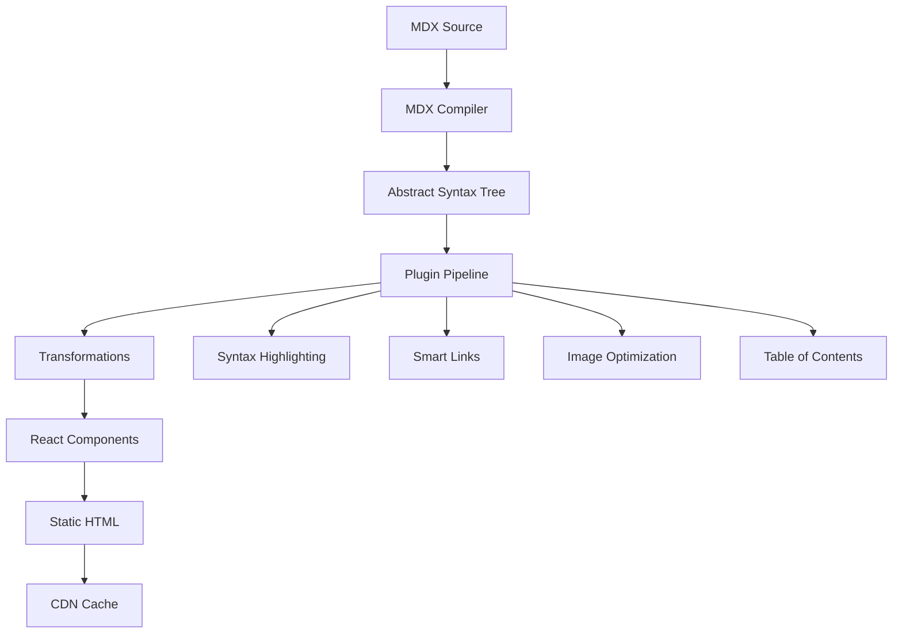

# Blog System Design - "Digital Chronicles"

## Concept: Technical Blog Meets Cyberpunk Journal

A blog that feels like accessing classified technical documents from a future corporation. Each post is a "data packet" with rich interactive elements.

## Blog Architecture



## Blog Post Layout Design

<svg width="800" height="900" xmlns="http://www.w3.org/2000/svg">
  <!-- Background -->
  <rect width="800" height="900" fill="#0a0a0a"/>
  
  <!-- Header -->
  <rect width="800" height="300" fill="url(#grad1)"/>
  <defs>
    <linearGradient id="grad1" x1="0%" y1="0%" x2="100%" y2="100%">
      <stop offset="0%" style="stop-color:#001122;stop-opacity:1" />
      <stop offset="100%" style="stop-color:#003366;stop-opacity:1" />
    </linearGradient>
  </defs>
  
  <!-- Terminal Window Header -->
  <rect x="50" y="50" width="700" height="200" fill="#0a0a0a" stroke="#00ff88" stroke-width="2" rx="5"/>
  <circle cx="70" cy="70" r="6" fill="#ff5555"/>
  <circle cx="90" cy="70" r="6" fill="#ffff55"/>
  <circle cx="110" cy="70" r="6" fill="#55ff55"/>
  <text x="140" y="75" fill="#888" font-family="monospace" font-size="12">~/blog/git-mind-revolution.mdx</text>
  
  <!-- Post Title -->
  <text x="70" y="120" fill="#00ff88" font-family="monospace" font-size="28">Building Git Mind: A Neural Revolution</text>
  
  <!-- Post Meta -->
  <text x="70" y="150" fill="#00ffff" font-family="monospace" font-size="14">2024.01.15 | 15 min read | James Ross</text>
  
  <!-- Tags -->
  <rect x="70" y="170" width="60" height="25" fill="#00ff88" fill-opacity="0.2" stroke="#00ff88" rx="12"/>
  <text x="100" y="187" fill="#00ff88" font-family="monospace" font-size="11" text-anchor="middle">AI</text>
  
  <rect x="140" y="170" width="80" height="25" fill="#00ffff" fill-opacity="0.2" stroke="#00ffff" rx="12"/>
  <text x="180" y="187" fill="#00ffff" font-family="monospace" font-size="11" text-anchor="middle">Git</text>
  
  <rect x="230" y="170" width="100" height="25" fill="#ff00ff" fill-opacity="0.2" stroke="#ff00ff" rx="12"/>
  <text x="280" y="187" fill="#ff00ff" font-family="monospace" font-size="11" text-anchor="middle">Research</text>
  
  <!-- Progress Bar -->
  <rect x="0" y="295" width="800" height="5" fill="#111"/>
  <rect x="0" y="295" width="200" height="5" fill="#00ff88"/>
  
  <!-- Content Area -->
  <rect x="50" y="320" width="700" height="500" fill="#0f0f0f" stroke="#222" stroke-width="1" rx="5"/>
  
  <!-- Table of Contents (Floating) -->
  <rect x="600" y="340" width="180" height="150" fill="#111" stroke="#333" stroke-width="1" rx="5"/>
  <text x="690" y="365" fill="#00ff88" font-family="monospace" font-size="12" text-anchor="middle">TABLE OF CONTENTS</text>
  <text x="610" y="390" fill="#00ffff" font-family="monospace" font-size="10">1. Introduction</text>
  <text x="610" y="410" fill="#888" font-family="monospace" font-size="10">2. Core Concepts</text>
  <text x="610" y="430" fill="#888" font-family="monospace" font-size="10">3. Implementation</text>
  <text x="610" y="450" fill="#888" font-family="monospace" font-size="10">4. Future Work</text>
  
  <!-- Article Content -->
  <text x="70" y="360" fill="#ccc" font-family="Arial" font-size="14">In the ever-evolving landscape of artificial intelligence,</text>
  <text x="70" y="380" fill="#ccc" font-family="Arial" font-size="14">we stand at the precipice of a new paradigm...</text>
  
  <!-- Code Block -->
  <rect x="70" y="410" width="500" height="120" fill="#1a1a1a" stroke="#333" rx="3"/>
  <text x="80" y="430" fill="#888" font-family="monospace" font-size="10">javascript</text>
  <text x="80" y="450" fill="#00ff88" font-family="monospace" font-size="12">const gitMind = new NeuralSubstrate({</text>
  <text x="80" y="470" fill="#00ffff" font-family="monospace" font-size="12">  backend: 'git',</text>
  <text x="80" y="490" fill="#00ffff" font-family="monospace" font-size="12">  neurons: distributed.commits,</text>
  <text x="80" y="510" fill="#00ff88" font-family="monospace" font-size="12">});</text>
  
  <!-- Interactive Element -->
  <rect x="70" y="550" width="500" height="80" fill="#001122" stroke="#00ff88" stroke-width="1" rx="5"/>
  <text x="320" y="580" fill="#00ff88" font-family="monospace" font-size="14" text-anchor="middle">🧠 Try Git Mind Live Demo</text>
  <text x="320" y="605" fill="#888" font-family="monospace" font-size="11" text-anchor="middle">Click to launch interactive playground</text>
  
  <!-- Author Bio -->
  <rect x="50" y="840" width="700" height="50" fill="#111" stroke="#333" rx="5"/>
  <circle cx="80" cy="865" r="20" fill="#00ff88"/>
  <text x="110" y="860" fill="#fff" font-family="monospace" font-size="12">James Ross</text>
  <text x="110" y="875" fill="#888" font-family="monospace" font-size="10">Building the future of game infrastructure</text>
</svg>

## MDX Component Library

### 1. Terminal Component
```jsx
<Terminal>
  <Command>git mind init</Command>
  <Output>
    Initializing neural substrate...
    Creating synaptic branches...
    Neural network ready.
  </Output>
</Terminal>
```

### 2. Interactive Code Editor
```jsx
<CodePlayground
  language="javascript"
  theme="cyberpunk"
  runnable={true}
  initialCode={`
    // Try editing this code!
    const mind = createMind();
    mind.think('Hello, World!');
  `}
/>
```

### 3. Data Visualization
```jsx
<DataViz
  type="neural-network"
  data={brainData}
  interactive={true}
  particles={true}
/>
```

### 4. Comparison Tables
```jsx
<ComparisonTable
  title="Git Mind vs Traditional AI"
  data={[
    { feature: "Distribution", gitMind: "✅ Fully distributed", traditional: "❌ Centralized" },
    { feature: "Version Control", gitMind: "✅ Built-in", traditional: "❌ External" },
    { feature: "Collaboration", gitMind: "✅ Native", traditional: "⚠️ Limited" }
  ]}
/>
```

### 5. Timeline Component
```jsx
<Timeline
  events={[
    { date: "2024-01", title: "Project Inception", description: "The idea was born" },
    { date: "2024-03", title: "First Prototype", description: "Neural pathways established" },
    { date: "2024-06", title: "Public Release", description: "Open sourced to the world" }
  ]}
/>
```

## Blog Features

### 1. Smart Search


Features:
- Full-text search with highlighting
- Fuzzy matching for typos
- Semantic search using embeddings
- Search suggestions
- Filter by tags, date, author

### 2. Series & Collections
```javascript
{
  series: "Building Git Mind",
  posts: [
    { part: 1, title: "The Vision", slug: "git-mind-vision" },
    { part: 2, title: "Architecture", slug: "git-mind-architecture" },
    { part: 3, title: "Implementation", slug: "git-mind-implementation" }
  ],
  navigation: {
    showProgress: true,
    autoNext: true,
    bookmarkable: true
  }
}
```

### 3. Interactive Elements

#### Code Execution
- Run code snippets in sandboxed environment
- Support for multiple languages
- Share executable snippets
- Embed results

#### Live Demos
- WebGL demos embedded in posts
- Interactive diagrams
- Real-time data visualizations
- AR/VR experiences (WebXR)

### 4. Reading Experience

#### Customization Options
```javascript
{
  theme: ['dark', 'light', 'cyberpunk', 'terminal'],
  fontSize: ['small', 'medium', 'large', 'xlarge'],
  fontFamily: ['monospace', 'sans-serif', 'serif', 'dyslexic'],
  lineHeight: ['compact', 'normal', 'relaxed'],
  codeTheme: ['monokai', 'dracula', 'synthwave', 'matrix']
}
```

#### Reading Features
- Progress indicator
- Time to read estimation
- Bookmark positions
- Highlight & annotate
- Share selections
- Offline reading (PWA)

### 5. Engagement Features

#### Reactions
Instead of basic likes:
- 🧠 "Mind Blown"
- 🚀 "Ship It"
- 🔥 "Hot Take"
- 💎 "Hidden Gem"
- 🤖 "AI Approved"

#### Comments System
- Nested discussions
- Markdown support
- Code snippet sharing
- Author highlights
- Upvoting system

#### Social Sharing
- Custom OG images per post
- Twitter cards with code snippets
- LinkedIn article format
- Dev.to cross-posting
- RSS with full content

## Technical Implementation

### Content Pipeline


### Performance Optimizations

1. **Static Generation**
   - Pre-render all posts at build time
   - Incremental Static Regeneration for updates
   - Edge caching for global delivery

2. **Progressive Enhancement**
   - Core content loads instantly
   - Interactive elements load on demand
   - WebGL demos lazy-loaded

3. **SEO Optimization**
   - Structured data for articles
   - Automatic sitemap generation
   - Social media meta tags
   - Reading time estimates

### Analytics & Insights

Track engagement with:
- Reading completion rates
- Code snippet copies
- Demo interactions
- Scroll depth
- Time on page
- Return visitors

## Future Enhancements

1. **AI Writing Assistant**
   - Content suggestions
   - Grammar checking
   - Tone analysis
   - SEO recommendations

2. **Collaborative Features**
   - Guest posts
   - Community contributions
   - Peer review system
   - Co-authoring tools

3. **Advanced Interactivity**
   - Embedded terminals
   - Live coding sessions
   - Interactive tutorials
   - AR code visualization

4. **Monetization Options**
   - Premium content
   - Sponsored posts
   - Course integration
   - Newsletter subscriptions