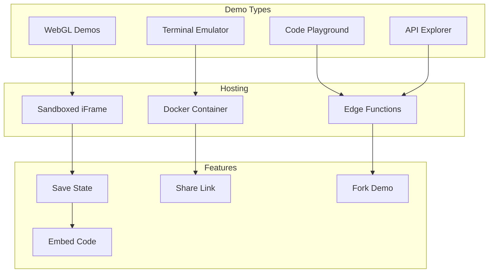

# Project Showcase Design - "Digital Museum"

## Concept: Interactive Tech Gallery

Transform project presentations into immersive experiences. Each project is a "digital artifact" with rich media, live demos, and technical deep-dives.

## Showcase Grid Layout

<svg width="800" height="600" xmlns="http://www.w3.org/2000/svg">
  <!-- Background -->
  <rect width="800" height="600" fill="#0a0a0a"/>
  
  <!-- Header -->
  <rect width="800" height="80" fill="#111"/>
  <text x="50" y="50" fill="#00ff88" font-family="monospace" font-size="32">PROJECT ARCHIVES</text>
  
  <!-- Filter Bar -->
  <rect x="50" y="100" width="700" height="50" fill="#0f0f0f" stroke="#333" rx="5"/>
  <text x="70" y="130" fill="#888" font-family="monospace" font-size="14">FILTER:</text>
  
  <rect x="150" y="110" width="80" height="30" fill="#00ff88" fill-opacity="0.2" stroke="#00ff88" rx="15"/>
  <text x="190" y="130" fill="#00ff88" font-family="monospace" font-size="12" text-anchor="middle">All</text>
  
  <rect x="240" y="110" width="80" height="30" fill="transparent" stroke="#333" rx="15"/>
  <text x="280" y="130" fill="#888" font-family="monospace" font-size="12" text-anchor="middle">Games</text>
  
  <rect x="330" y="110" width="80" height="30" fill="transparent" stroke="#333" rx="15"/>
  <text x="370" y="130" fill="#888" font-family="monospace" font-size="12" text-anchor="middle">Tools</text>
  
  <rect x="420" y="110" width="80" height="30" fill="transparent" stroke="#333" rx="15"/>
  <text x="460" y="130" fill="#888" font-family="monospace" font-size="12" text-anchor="middle">Research</text>
  
  <!-- Project Cards -->
  <!-- Card 1: Git Mind -->
  <rect x="50" y="180" width="220" height="180" fill="#111" stroke="#00ff88" stroke-width="2" rx="5"/>
  <rect x="50" y="180" width="220" height="100" fill="url(#gitMindGrad)"/>
  <defs>
    <linearGradient id="gitMindGrad" x1="0%" y1="0%" x2="100%" y2="100%">
      <stop offset="0%" style="stop-color:#001a00;stop-opacity:1" />
      <stop offset="100%" style="stop-color:#003300;stop-opacity:1" />
    </linearGradient>
  </defs>
  <text x="160" y="230" fill="#00ff88" font-family="monospace" font-size="48" text-anchor="middle">🧠</text>
  <text x="60" y="305" fill="#00ff88" font-family="monospace" font-size="16">Git Mind</text>
  <text x="60" y="325" fill="#888" font-family="monospace" font-size="11">Neural substrate using Git</text>
  <text x="60" y="345" fill="#666" font-family="monospace" font-size="10">TypeScript • Git • AI</text>
  
  <!-- Card 2: Universal Charter -->
  <rect x="290" y="180" width="220" height="180" fill="#111" stroke="#00ffff" stroke-width="2" rx="5"/>
  <rect x="290" y="180" width="220" height="100" fill="url(#charterGrad)"/>
  <defs>
    <linearGradient id="charterGrad" x1="0%" y1="0%" x2="100%" y2="100%">
      <stop offset="0%" style="stop-color:#001a1a;stop-opacity:1" />
      <stop offset="100%" style="stop-color:#003366;stop-opacity:1" />
    </linearGradient>
  </defs>
  <text x="400" y="230" fill="#00ffff" font-family="monospace" font-size="48" text-anchor="middle">📜</text>
  <text x="300" y="305" fill="#00ffff" font-family="monospace" font-size="16">Universal Charter</text>
  <text x="300" y="325" fill="#888" font-family="monospace" font-size="11">Ethical AI governance</text>
  <text x="300" y="345" fill="#666" font-family="monospace" font-size="10">Markdown • Ethics • Open</text>
  
  <!-- Card 3: Racing MMO -->
  <rect x="530" y="180" width="220" height="180" fill="#111" stroke="#ff00ff" stroke-width="2" rx="5"/>
  <rect x="530" y="180" width="220" height="100" fill="url(#racingGrad)"/>
  <defs>
    <linearGradient id="racingGrad" x1="0%" y1="0%" x2="100%" y2="100%">
      <stop offset="0%" style="stop-color:#1a001a;stop-opacity:1" />
      <stop offset="100%" style="stop-color:#330033;stop-opacity:1" />
    </linearGradient>
  </defs>
  <text x="640" y="230" fill="#ff00ff" font-family="monospace" font-size="48" text-anchor="middle">🏎️</text>
  <text x="540" y="305" fill="#ff00ff" font-family="monospace" font-size="16">Velocity Legends</text>
  <text x="540" y="325" fill="#888" font-family="monospace" font-size="11">Cross-platform racing MMO</text>
  <text x="540" y="345" fill="#666" font-family="monospace" font-size="10">Unity • C# • Multiplayer</text>
  
  <!-- Hover State Example -->
  <rect x="50" y="380" width="220" height="180" fill="#1a1a1a" stroke="#00ff88" stroke-width="3" rx="5"/>
  <rect x="50" y="380" width="220" height="100" fill="url(#hoverGrad)"/>
  <defs>
    <linearGradient id="hoverGrad" x1="0%" y1="0%" x2="100%" y2="100%">
      <stop offset="0%" style="stop-color:#002200;stop-opacity:1" />
      <stop offset="100%" style="stop-color:#004400;stop-opacity:1" />
    </linearGradient>
  </defs>
  <text x="60" y="410" fill="#00ff88" font-family="monospace" font-size="12">QUICK STATS</text>
  <text x="60" y="430" fill="#fff" font-family="monospace" font-size="10">⭐ 1,337 stars</text>
  <text x="60" y="445" fill="#fff" font-family="monospace" font-size="10">🍴 42 forks</text>
  <text x="60" y="460" fill="#fff" font-family="monospace" font-size="10">📅 Active development</text>
  <rect x="70" y="510" width="80" height="30" fill="#00ff88" rx="5"/>
  <text x="110" y="530" fill="#0a0a0a" font-family="monospace" font-size="12" text-anchor="middle">VIEW</text>
  <rect x="170" y="510" width="80" height="30" fill="transparent" stroke="#00ff88" rx="5"/>
  <text x="210" y="530" fill="#00ff88" font-family="monospace" font-size="12" text-anchor="middle">DEMO</text>
</svg>

## Individual Project Page

<svg width="800" height="1000" xmlns="http://www.w3.org/2000/svg">
  <!-- Background -->
  <rect width="800" height="1000" fill="#0a0a0a"/>
  
  <!-- Hero Section -->
  <rect width="800" height="400" fill="url(#projectHero)"/>
  <defs>
    <linearGradient id="projectHero" x1="0%" y1="0%" x2="0%" y2="100%">
      <stop offset="0%" style="stop-color:#001122;stop-opacity:1" />
      <stop offset="100%" style="stop-color:#0a0a0a;stop-opacity:1" />
    </linearGradient>
  </defs>
  
  <!-- 3D Preview Window -->
  <rect x="50" y="50" width="400" height="300" fill="#000" stroke="#00ff88" stroke-width="2" rx="5"/>
  <text x="250" y="200" fill="#00ff88" font-family="monospace" font-size="20" text-anchor="middle">[ WebGL Demo ]</text>
  <text x="250" y="220" fill="#888" font-family="monospace" font-size="12" text-anchor="middle">Interactive 3D Preview</text>
  
  <!-- Project Info -->
  <text x="500" y="100" fill="#00ff88" font-family="monospace" font-size="36">Git Mind</text>
  <text x="500" y="130" fill="#888" font-family="monospace" font-size="16">Neural Substrate for AI Development</text>
  
  <!-- Action Buttons -->
  <rect x="500" y="150" width="120" height="40" fill="#00ff88" rx="5"/>
  <text x="560" y="175" fill="#0a0a0a" font-family="monospace" font-size="14" text-anchor="middle">LIVE DEMO</text>
  
  <rect x="630" y="150" width="120" height="40" fill="transparent" stroke="#00ff88" rx="5"/>
  <text x="690" y="175" fill="#00ff88" font-family="monospace" font-size="14" text-anchor="middle">GitHub</text>
  
  <!-- Tech Stack -->
  <text x="500" y="220" fill="#888" font-family="monospace" font-size="12">BUILT WITH:</text>
  <rect x="500" y="230" width="70" height="25" fill="#00ff88" fill-opacity="0.2" stroke="#00ff88" rx="12"/>
  <text x="535" y="247" fill="#00ff88" font-family="monospace" font-size="10" text-anchor="middle">TypeScript</text>
  
  <rect x="580" y="230" width="50" height="25" fill="#00ffff" fill-opacity="0.2" stroke="#00ffff" rx="12"/>
  <text x="605" y="247" fill="#00ffff" font-family="monospace" font-size="10" text-anchor="middle">Git</text>
  
  <rect x="640" y="230" width="60" height="25" fill="#ff00ff" fill-opacity="0.2" stroke="#ff00ff" rx="12"/>
  <text x="670" y="247" fill="#ff00ff" font-family="monospace" font-size="10" text-anchor="middle">Node.js</text>
  
  <!-- Stats -->
  <rect x="500" y="280" width="250" height="60" fill="#111" stroke="#333" rx="5"/>
  <text x="520" y="300" fill="#00ff88" font-family="monospace" font-size="20">1,337</text>
  <text x="520" y="320" fill="#666" font-family="monospace" font-size="10">Stars</text>
  <text x="600" y="300" fill="#00ffff" font-family="monospace" font-size="20">42</text>
  <text x="600" y="320" fill="#666" font-family="monospace" font-size="10">Forks</text>
  <text x="670" y="300" fill="#ff00ff" font-family="monospace" font-size="20">156</text>
  <text x="670" y="320" fill="#666" font-family="monospace" font-size="10">Commits</text>
  
  <!-- Navigation Tabs -->
  <rect x="50" y="420" width="700" height="50" fill="#111"/>
  <rect x="50" y="420" width="175" height="50" fill="#1a1a1a"/>
  <text x="137" y="450" fill="#00ff88" font-family="monospace" font-size="14" text-anchor="middle">Overview</text>
  <text x="312" y="450" fill="#666" font-family="monospace" font-size="14" text-anchor="middle">Documentation</text>
  <text x="487" y="450" fill="#666" font-family="monospace" font-size="14" text-anchor="middle">Changelog</text>
  <text x="662" y="450" fill="#666" font-family="monospace" font-size="14" text-anchor="middle">Community</text>
  
  <!-- Content Section -->
  <rect x="50" y="490" width="700" height="480" fill="#0f0f0f" stroke="#222" rx="5"/>
  
  <!-- Feature Cards -->
  <rect x="70" y="510" width="320" height="140" fill="#111" stroke="#333" rx="5"/>
  <text x="90" y="540" fill="#00ff88" font-family="monospace" font-size="16">🧠 Neural Architecture</text>
  <text x="90" y="565" fill="#ccc" font-family="sans-serif" font-size="12">Git commits form synaptic connections,</text>
  <text x="90" y="580" fill="#ccc" font-family="sans-serif" font-size="12">creating a distributed neural network that</text>
  <text x="90" y="595" fill="#ccc" font-family="sans-serif" font-size="12">learns and evolves through collaboration.</text>
  
  <rect x="410" y="510" width="320" height="140" fill="#111" stroke="#333" rx="5"/>
  <text x="430" y="540" fill="#00ffff" font-family="monospace" font-size="16">🔄 Version Control</text>
  <text x="430" y="565" fill="#ccc" font-family="sans-serif" font-size="12">Every thought is versioned, every idea</text>
  <text x="430" y="580" fill="#ccc" font-family="sans-serif" font-size="12">tracked. Roll back consciousness, merge</text>
  <text x="430" y="595" fill="#ccc" font-family="sans-serif" font-size="12">minds, and fork realities.</text>
  
  <!-- Code Example -->
  <rect x="70" y="670" width="660" height="180" fill="#1a1a1a" stroke="#333" rx="5"/>
  <text x="80" y="690" fill="#666" font-family="monospace" font-size="10">TypeScript</text>
  <text x="80" y="710" fill="#00ff88" font-family="monospace" font-size="12">import { GitMind } from '@flyingrobots/git-mind';</text>
  <text x="80" y="730" fill="#fff" font-family="monospace" font-size="12"></text>
  <text x="80" y="750" fill="#00ff88" font-family="monospace" font-size="12">const mind = new GitMind({</text>
  <text x="80" y="770" fill="#00ffff" font-family="monospace" font-size="12">  repository: './consciousness',</text>
  <text x="80" y="790" fill="#00ffff" font-family="monospace" font-size="12">  branches: ['thoughts', 'dreams', 'memories']</text>
  <text x="80" y="810" fill="#00ff88" font-family="monospace" font-size="12">});</text>
  
  <!-- Media Gallery -->
  <rect x="70" y="870" width="200" height="80" fill="#111" stroke="#333"/>
  <text x="170" y="915" fill="#666" font-family="monospace" font-size="12" text-anchor="middle">Screenshot 1</text>
  
  <rect x="290" y="870" width="200" height="80" fill="#111" stroke="#333"/>
  <text x="390" y="915" fill="#666" font-family="monospace" font-size="12" text-anchor="middle">Demo Video</text>
  
  <rect x="510" y="870" width="200" height="80" fill="#111" stroke="#333"/>
  <text x="610" y="915" fill="#666" font-family="monospace" font-size="12" text-anchor="middle">Architecture</text>
</svg>

## Interactive Features

### 1. Live Demo Integration



### 2. Rich Media Gallery

Features:
- **Image Carousel**: Lightbox with zoom
- **Video Playback**: Native player with chapters
- **3D Model Viewer**: Rotate, zoom, inspect
- **Code Diffs**: Visual git history
- **Architecture Diagrams**: Interactive SVGs

### 3. Project Metrics Dashboard

<svg width="600" height="400" xmlns="http://www.w3.org/2000/svg">
  <!-- Background -->
  <rect width="600" height="400" fill="#0f0f0f" stroke="#333"/>
  
  <!-- Title -->
  <text x="20" y="30" fill="#00ff88" font-family="monospace" font-size="16">PROJECT METRICS</text>
  
  <!-- Activity Graph -->
  <rect x="20" y="50" width="260" height="150" fill="#111" stroke="#333"/>
  <text x="150" y="75" fill="#888" font-family="monospace" font-size="12" text-anchor="middle">Commit Activity</text>
  <!-- Graph bars -->
  <rect x="40" y="160" width="10" height="30" fill="#00ff88"/>
  <rect x="60" y="150" width="10" height="40" fill="#00ff88"/>
  <rect x="80" y="140" width="10" height="50" fill="#00ff88"/>
  <rect x="100" y="130" width="10" height="60" fill="#00ff88"/>
  <rect x="120" y="120" width="10" height="70" fill="#00ff88"/>
  <rect x="140" y="125" width="10" height="65" fill="#00ff88"/>
  <rect x="160" y="135" width="10" height="55" fill="#00ff88"/>
  
  <!-- Language Breakdown -->
  <rect x="300" y="50" width="280" height="150" fill="#111" stroke="#333"/>
  <text x="440" y="75" fill="#888" font-family="monospace" font-size="12" text-anchor="middle">Language Breakdown</text>
  <rect x="320" y="100" width="180" height="20" fill="#00ff88"/>
  <rect x="320" y="100" width="108" height="20" fill="#00ffff"/>
  <rect x="320" y="100" width="36" height="20" fill="#ff00ff"/>
  <text x="320" y="140" fill="#00ff88" font-family="monospace" font-size="10">■ TypeScript 60%</text>
  <text x="320" y="155" fill="#00ffff" font-family="monospace" font-size="10">■ CSS 30%</text>
  <text x="320" y="170" fill="#ff00ff" font-family="monospace" font-size="10">■ HTML 10%</text>
  
  <!-- Performance Metrics -->
  <rect x="20" y="220" width="560" height="160" fill="#111" stroke="#333"/>
  <text x="300" y="245" fill="#888" font-family="monospace" font-size="12" text-anchor="middle">Performance Metrics</text>
  
  <text x="40" y="280" fill="#00ff88" font-family="monospace" font-size="24">98</text>
  <text x="40" y="300" fill="#666" font-family="monospace" font-size="10">Lighthouse Score</text>
  
  <text x="160" y="280" fill="#00ffff" font-family="monospace" font-size="24">1.2s</text>
  <text x="160" y="300" fill="#666" font-family="monospace" font-size="10">Load Time</text>
  
  <text x="280" y="280" fill="#ff00ff" font-family="monospace" font-size="24">60fps</text>
  <text x="280" y="300" fill="#666" font-family="monospace" font-size="10">Animation</text>
  
  <text x="400" y="280" fill="#ffff00" font-family="monospace" font-size="24">A+</text>
  <text x="400" y="300" fill="#666" font-family="monospace" font-size="10">Security</text>
</svg>

### 4. Documentation Integration

```javascript
{
  documentation: {
    readme: {
      source: "GitHub",
      render: "MDX",
      toc: true
    },
    api: {
      generated: "TypeDoc",
      interactive: true,
      examples: "embedded"
    },
    guides: [
      { title: "Quick Start", type: "tutorial", interactive: true },
      { title: "Architecture", type: "diagram", tool: "mermaid" },
      { title: "Contributing", type: "markdown", editable: false }
    ]
  }
}
```

### 5. Community Features

#### Showcase User Projects
- User-submitted implementations
- Fork gallery
- Success stories
- Integration examples

#### Discussion Board
- Q&A section
- Feature requests
- Bug reports
- Show & tell

#### Contributors Wall
- GitHub contributors
- Sponsor recognition
- Community champions
- Translation credits

## Technical Implementation

### Data Structure

```typescript
interface Project {
  id: string;
  slug: string;
  title: string;
  description: string;
  longDescription: MDXContent;
  
  media: {
    hero: ImageAsset;
    screenshots: ImageAsset[];
    videos: VideoAsset[];
    models?: Model3D[];
  };
  
  technical: {
    stack: TechStack[];
    architecture: DiagramAsset;
    performance: Metrics;
    security: SecurityAudit;
  };
  
  links: {
    demo?: string;
    github?: string;
    npm?: string;
    documentation?: string;
  };
  
  stats: {
    stars: number;
    forks: number;
    downloads: number;
    lastUpdated: Date;
  };
  
  features: Feature[];
  changelog: ChangelogEntry[];
  testimonials: Testimonial[];
}
```

### Performance Strategies

1. **Progressive Loading**
   - Load hero content first
   - Lazy load media gallery
   - Defer non-critical metrics
   - Virtualize long lists

2. **Caching Strategy**
   - Static project data cached indefinitely
   - GitHub stats updated hourly
   - Demo content cached for 24h
   - User interactions cached locally

3. **Media Optimization**
   - Multiple image sizes
   - WebP with fallbacks
   - Video compression
   - 3D model LODs

## Future Enhancements

1. **AR/VR Showcases**
   - WebXR demos
   - 3D project walkthroughs
   - Virtual gallery mode

2. **AI Features**
   - Auto-generate project summaries
   - Smart project recommendations
   - Code complexity analysis

3. **Collaboration Tools**
   - Live code reviews
   - Pair programming demos
   - Community contributions

4. **Advanced Analytics**
   - User journey tracking
   - A/B testing features
   - Conversion optimization