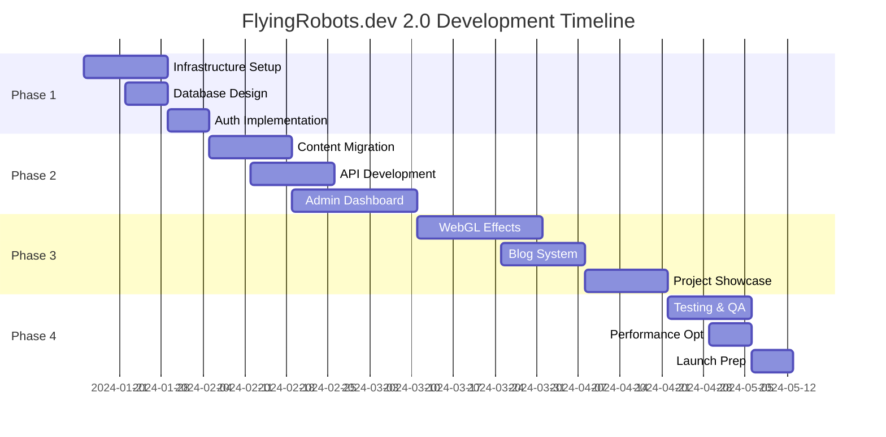

# Implementation Roadmap - FlyingRobots.dev 2.0

## Overview

A phased approach to building the next-generation portfolio site, prioritizing core functionality while maintaining the existing site during development.

## Timeline Overview



## Phase 1: Foundation (Weeks 1-3)

### Week 1: Infrastructure Setup

```bash
# Initialize Next.js project with TypeScript
npx create-next-app@latest flyingrobots-v2 --typescript --tailwind --app

# Core dependencies
npm install @supabase/supabase-js @supabase/auth-helpers-nextjs
npm install three @react-three/fiber @react-three/drei @react-three/postprocessing
npm install framer-motion zustand @tanstack/react-query
npm install mdx-bundler next-mdx-remote reading-time
```

### Supabase Schema

```sql
-- Users table (managed by Supabase Auth)

-- Content tables
CREATE TABLE pages (
    id UUID PRIMARY KEY DEFAULT uuid_generate_v4(),
    slug TEXT UNIQUE NOT NULL,
    title TEXT NOT NULL,
    content JSONB NOT NULL,
    meta JSONB,
    created_at TIMESTAMP WITH TIME ZONE DEFAULT NOW(),
    updated_at TIMESTAMP WITH TIME ZONE DEFAULT NOW()
);

CREATE TABLE blog_posts (
    id UUID PRIMARY KEY DEFAULT uuid_generate_v4(),
    slug TEXT UNIQUE NOT NULL,
    title TEXT NOT NULL,
    excerpt TEXT,
    content_mdx TEXT NOT NULL,
    featured_image TEXT,
    tags TEXT[],
    author_id UUID REFERENCES auth.users(id),
    published_at TIMESTAMP WITH TIME ZONE,
    created_at TIMESTAMP WITH TIME ZONE DEFAULT NOW(),
    updated_at TIMESTAMP WITH TIME ZONE DEFAULT NOW()
);

CREATE TABLE projects (
    id UUID PRIMARY KEY DEFAULT uuid_generate_v4(),
    slug TEXT UNIQUE NOT NULL,
    title TEXT NOT NULL,
    description TEXT,
    long_description_mdx TEXT,
    tech_stack TEXT[],
    featured BOOLEAN DEFAULT false,
    display_order INTEGER,
    github_url TEXT,
    demo_url TEXT,
    media JSONB,
    stats JSONB,
    created_at TIMESTAMP WITH TIME ZONE DEFAULT NOW(),
    updated_at TIMESTAMP WITH TIME ZONE DEFAULT NOW()
);

CREATE TABLE terminal_commands (
    id UUID PRIMARY KEY DEFAULT uuid_generate_v4(),
    command TEXT UNIQUE NOT NULL,
    response_mdx TEXT NOT NULL,
    action_type TEXT,
    metadata JSONB,
    created_at TIMESTAMP WITH TIME ZONE DEFAULT NOW()
);

-- Enable RLS
ALTER TABLE pages ENABLE ROW LEVEL SECURITY;
ALTER TABLE blog_posts ENABLE ROW LEVEL SECURITY;
ALTER TABLE projects ENABLE ROW LEVEL SECURITY;
ALTER TABLE terminal_commands ENABLE ROW LEVEL SECURITY;

-- Policies
CREATE POLICY "Public read access" ON pages FOR SELECT USING (true);
CREATE POLICY "Admin full access" ON pages FOR ALL USING (auth.jwt() ->> 'role' = 'admin');

-- Similar policies for other tables...
```

### Environment Setup

```env
# .env.local
NEXT_PUBLIC_SUPABASE_URL=your-project-url
NEXT_PUBLIC_SUPABASE_ANON_KEY=your-anon-key
SUPABASE_SERVICE_ROLE_KEY=your-service-key

# Admin credentials (for seeding)
ADMIN_EMAIL=james@flyingrobots.dev
ADMIN_PASSWORD=secure-password-here
```

## Phase 2: Core Functionality (Weeks 4-6)

### API Routes Structure

```typescript
// app/api/content/[type]/route.ts
export async function GET(
  request: Request,
  { params }: { params: { type: string } }
) {
  const supabase = createRouteHandlerClient({ cookies });
  
  switch (params.type) {
    case 'blog':
      return handleBlogRequest(supabase);
    case 'projects':
      return handleProjectsRequest(supabase);
    case 'pages':
      return handlePagesRequest(supabase);
    default:
      return NextResponse.json({ error: 'Invalid type' }, { status: 400 });
  }
}

// app/api/admin/content/route.ts
export async function POST(request: Request) {
  const session = await getSession();
  if (!session || session.user.role !== 'admin') {
    return NextResponse.json({ error: 'Unauthorized' }, { status: 401 });
  }
  
  // Handle content creation/updates
}
```

### Content Migration Script

```typescript
// scripts/migrate-content.ts
import { createClient } from '@supabase/supabase-js';
import { readFileSync } from 'fs';
import matter from 'gray-matter';

const supabase = createClient(
  process.env.SUPABASE_URL!,
  process.env.SUPABASE_SERVICE_ROLE_KEY!
);

async function migrateContent() {
  // 1. Read existing content.json
  const content = JSON.parse(readFileSync('./data/content.json', 'utf-8'));
  
  // 2. Migrate hero content to pages table
  const heroPage = {
    slug: 'home',
    title: 'Home',
    content: {
      hero: content.hero,
      stats: content.stats,
      metadata: content.metadata
    }
  };
  
  await supabase.from('pages').insert(heroPage);
  
  // 3. Migrate terminal commands
  const commands = Object.entries(content.terminal.commands).map(([key, cmd]) => ({
    command: cmd.name,
    response_mdx: `# ${cmd.description}`,
    action_type: 'display'
  }));
  
  await supabase.from('terminal_commands').insert(commands);
  
  // 4. Migrate projects
  // ... continue migration
}
```

### Admin Dashboard Routes

```typescript
// app/admin/layout.tsx
export default async function AdminLayout({
  children
}: {
  children: React.ReactNode
}) {
  const supabase = createServerComponentClient({ cookies });
  const { data: { session } } = await supabase.auth.getSession();
  
  if (!session || session.user.role !== 'admin') {
    redirect('/login');
  }
  
  return (
    <div className="admin-layout">
      <AdminSidebar />
      <main>{children}</main>
    </div>
  );
}

// app/admin/content/[type]/page.tsx
export default async function ContentManager({
  params
}: {
  params: { type: string }
}) {
  const content = await fetchContent(params.type);
  
  return (
    <ContentEditor
      type={params.type}
      initialContent={content}
    />
  );
}
```

## Phase 3: Visual Excellence (Weeks 7-10)

### WebGL Effects Implementation

```typescript
// components/webgl/CRTEffect.tsx
import { useEffect, useRef } from 'react';
import { EffectComposer, Scanline, ChromaticAberration, Noise, Vignette } from '@react-three/postprocessing';

export function CRTEffect({ intensity = 1 }) {
  return (
    <EffectComposer>
      <Scanline
        blendFunction={BlendFunction.OVERLAY}
        density={1.25 * intensity}
      />
      <ChromaticAberration
        offset={[0.002, 0.002] * intensity}
        radialModulation={false}
      />
      <Noise
        premultiply
        blendFunction={BlendFunction.ADD}
        opacity={0.02 * intensity}
      />
      <Vignette
        offset={0.1}
        darkness={0.5 * intensity}
      />
    </EffectComposer>
  );
}

// components/webgl/EntrySequence.tsx
export function EntrySequence() {
  const [phase, setPhase] = useState<'black' | 'scanline' | 'expand' | 'ready'>('black');
  
  useEffect(() => {
    const sequence = async () => {
      await delay(500);
      setPhase('scanline');
      await delay(300);
      setPhase('expand');
      await delay(800);
      setPhase('ready');
    };
    
    sequence();
  }, []);
  
  return (
    <Canvas>
      <CRTEffect intensity={phase === 'ready' ? 0.5 : 1} />
      {phase === 'scanline' && <ScanlineAnimation />}
      {phase === 'expand' && <ExpansionEffect />}
      {phase === 'ready' && <TerminalMesh />}
    </Canvas>
  );
}
```

### Blog System Setup

```typescript
// lib/mdx.ts
import { bundleMDX } from 'mdx-bundler';
import remarkGfm from 'remark-gfm';
import rehypeHighlight from 'rehype-highlight';
import rehypeSlug from 'rehype-slug';
import rehypeAutolinkHeadings from 'rehype-autolink-headings';

export async function processMDX(source: string) {
  const { code, frontmatter } = await bundleMDX({
    source,
    mdxOptions(options) {
      options.remarkPlugins = [
        ...(options.remarkPlugins ?? []),
        remarkGfm,
      ];
      options.rehypePlugins = [
        ...(options.rehypePlugins ?? []),
        rehypeHighlight,
        rehypeSlug,
        rehypeAutolinkHeadings,
      ];
      return options;
    },
  });
  
  return { code, frontmatter };
}

// Custom MDX components
export const MDXComponents = {
  Terminal,
  CodePlayground,
  DataViz,
  ComparisonTable,
  Timeline,
  // ... more custom components
};
```

### Project Showcase Components

```typescript
// components/projects/ProjectCard.tsx
export function ProjectCard({ project }: { project: Project }) {
  const [isHovered, setIsHovered] = useState(false);
  const { ref, inView } = useInView({ triggerOnce: true });
  
  return (
    <motion.div
      ref={ref}
      initial={{ opacity: 0, y: 20 }}
      animate={inView ? { opacity: 1, y: 0 } : {}}
      whileHover={{ scale: 1.02 }}
      onHoverStart={() => setIsHovered(true)}
      onHoverEnd={() => setIsHovered(false)}
      className="project-card"
    >
      <Canvas>
        <ProjectPreview3D project={project} animated={isHovered} />
      </Canvas>
      
      <div className="project-info">
        <h3>{project.title}</h3>
        <p>{project.description}</p>
        <TechStack stack={project.techStack} />
        
        {isHovered && (
          <motion.div
            initial={{ opacity: 0 }}
            animate={{ opacity: 1 }}
            className="project-actions"
          >
            <Link href={`/projects/${project.slug}`}>View Details</Link>
            {project.demoUrl && <a href={project.demoUrl}>Live Demo</a>}
          </motion.div>
        )}
      </div>
    </motion.div>
  );
}
```

## Phase 4: Polish & Launch (Weeks 11-13)

### Testing Strategy

```typescript
// tests/e2e/admin.spec.ts
import { test, expect } from '@playwright/test';

test.describe('Admin Dashboard', () => {
  test.beforeEach(async ({ page }) => {
    await page.goto('/admin');
    await page.fill('[name="email"]', process.env.TEST_ADMIN_EMAIL);
    await page.fill('[name="password"]', process.env.TEST_ADMIN_PASSWORD);
    await page.click('[type="submit"]');
  });
  
  test('can create blog post', async ({ page }) => {
    await page.click('text=Blog Posts');
    await page.click('text=New Post');
    
    await page.fill('[name="title"]', 'Test Post');
    await page.fill('[name="content"]', '# Test Content');
    
    await page.click('text=Save');
    await expect(page.locator('text=Post saved')).toBeVisible();
  });
});

// tests/performance/lighthouse.ts
import lighthouse from 'lighthouse';
import * as chromeLauncher from 'chrome-launcher';

async function runLighthouse(url: string) {
  const chrome = await chromeLauncher.launch({ chromeFlags: ['--headless'] });
  const options = {
    logLevel: 'info',
    output: 'json',
    onlyCategories: ['performance', 'accessibility', 'seo'],
    port: chrome.port
  };
  
  const runnerResult = await lighthouse(url, options);
  await chrome.kill();
  
  return runnerResult;
}
```

### Performance Optimization

```typescript
// next.config.js
const nextConfig = {
  images: {
    domains: ['your-supabase-url.supabase.co'],
    formats: ['image/avif', 'image/webp'],
  },
  experimental: {
    optimizeCss: true,
  },
  compiler: {
    removeConsole: process.env.NODE_ENV === 'production',
  },
};

// Middleware for edge caching
export const config = {
  matcher: ['/api/content/:path*', '/blog/:path*', '/projects/:path*'],
};

export function middleware(request: NextRequest) {
  const response = NextResponse.next();
  
  // Cache static content
  if (request.nextUrl.pathname.startsWith('/api/content')) {
    response.headers.set('Cache-Control', 's-maxage=3600, stale-while-revalidate');
  }
  
  return response;
}
```

### Launch Checklist

- [ ] **Performance**
  - [ ] Lighthouse score > 95 on all pages
  - [ ] Core Web Vitals passing
  - [ ] Bundle size < 200KB initial
  
- [ ] **SEO**
  - [ ] Meta tags on all pages
  - [ ] Sitemap generated
  - [ ] robots.txt configured
  - [ ] Schema.org markup
  
- [ ] **Security**
  - [ ] CSP headers configured
  - [ ] Rate limiting on APIs
  - [ ] Input sanitization
  - [ ] 2FA for admin
  
- [ ] **Monitoring**
  - [ ] Error tracking (Sentry)
  - [ ] Analytics (Vercel Analytics)
  - [ ] Uptime monitoring
  - [ ] Performance monitoring
  
- [ ] **Content**
  - [ ] All content migrated
  - [ ] Images optimized
  - [ ] 404 page designed
  - [ ] Loading states polished

## Post-Launch Roadmap

### Month 1-2
- User feedback integration
- Performance fine-tuning
- Bug fixes and patches
- Content updates

### Month 3-4
- Advanced WebGL effects
- AR/VR experiments
- Newsletter integration
- Community features

### Month 5-6
- AI writing assistant
- Advanced analytics
- A/B testing framework
- International support

## Tech Debt & Maintenance

1. **Regular Updates**
   - Dependencies monthly
   - Security patches immediately
   - Framework updates quarterly

2. **Performance Monitoring**
   - Weekly Lighthouse audits
   - Real user monitoring
   - Bundle size tracking

3. **Content Management**
   - Backup strategy
   - Version control for content
   - Media optimization pipeline

4. **Documentation**
   - API documentation
   - Component storybook
   - Deployment guides
   - Contribution guidelines